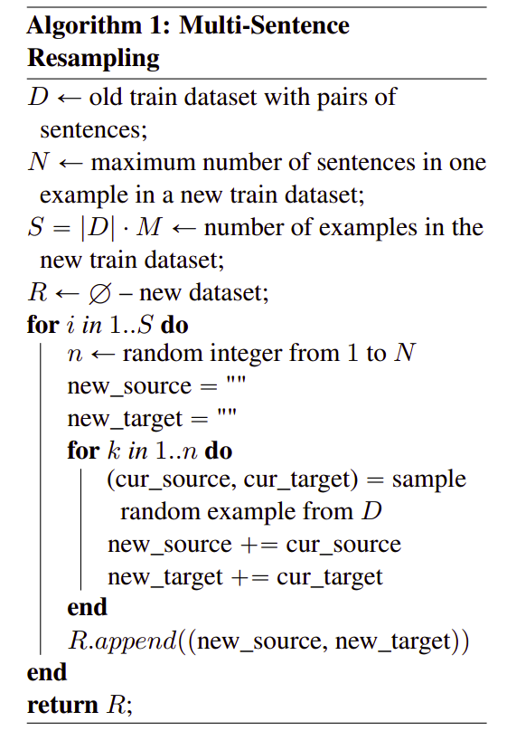
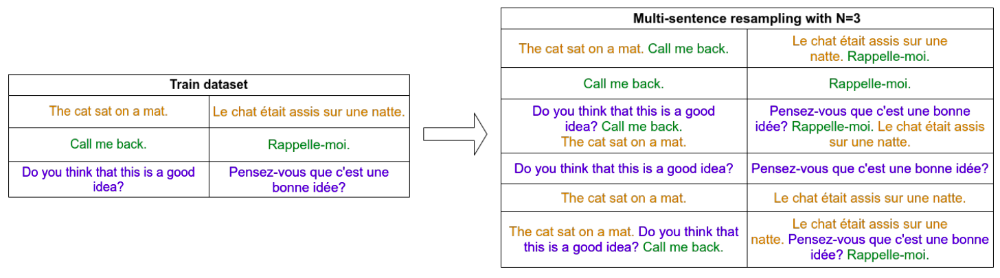
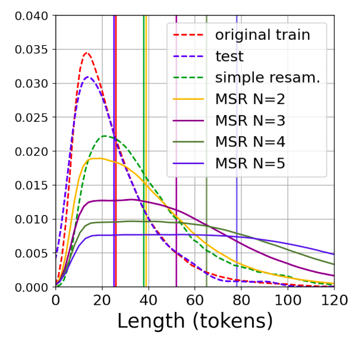

Neural Machine Translation (NMT) is known to suffer from a beam-search
problem: after a certain point, increasing beam size causes an overall
drop in translation quality. This effect is especially in long
sentences. A factor that strongly contributes to the quality degradation
with large beams is <u><strong>dataset-length bias</strong></u> which means that NMT
datasets are strongly biased towards short sentences.

To mitigate this issue, some researchers from Yandex in 2021 proposed a
new data augmentation technique called "Multi-Sentence Resampling" or
MSR for short in their paper: [Multi-Sentence Resampling: A Simple
Approach to Alleviate Dataset Length Bias and Beam-Search
Degradation](https://arxiv.org/pdf/2109.06253.pdf). This technique
extends the training examples by concatenating several sentences from
the original dataset to make a long training example. The official
implementation of this technique can be found on the Yandex official
GitHub Repository: [msr](https://github.com/yandex-research/msr).

MSR
---

MSR stands for "Multi-Sentence Resampling" which augments a dataset such
that each training example consists of 1 to N sentences randomly chosen
from a dataset and concatenated one after another preserving the order
of sentence. The following is the full algorithm:

    

As shown in the following example, we have a dataset of just three short
sentences (on the left). Using MSR with N=3 will create a new dataset
where each sentence is either 1 or 2 or 3 sentences long. MSR
concatenates sentences together as shown on the right table which
increases the average length of the dataset.

    

> **Note:**
>
> - MSR performed the augmentation process on both the source-side and
    the target-side of the data.
>
> - Knowing the average length of examples in a dataset $L$, the average
    length of examples in the new dataset can be approximately
    calculated as:
> 
> $$avg\_ new\_ length \cong \sum_{n = 1}^{N}\frac{\text{L.n}}{N} = L.\frac{N + 1}{2}$$

The following figure illustrates how the train examples length
distribution changes in IWSLT17 Fr-En dataset for N from 2 to 5. With
growing N distributions become more flatten for lengths presented in the
test set.

    

