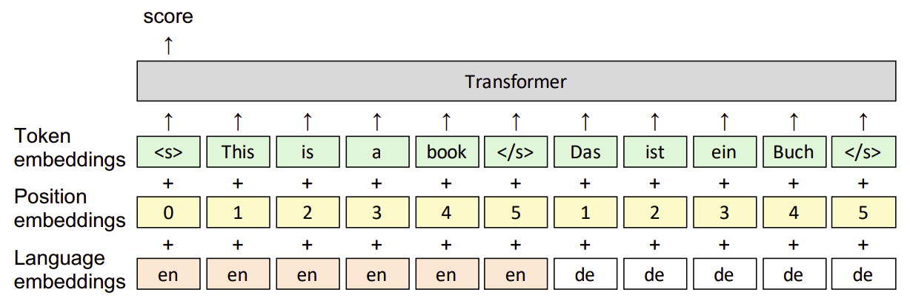
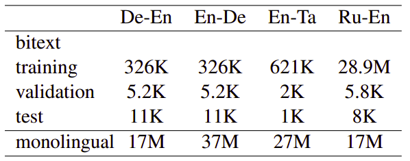
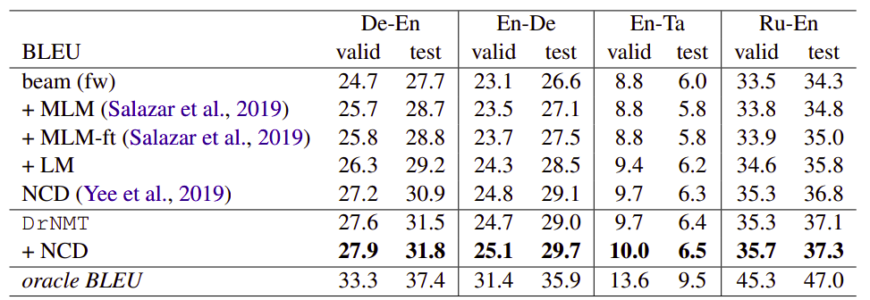
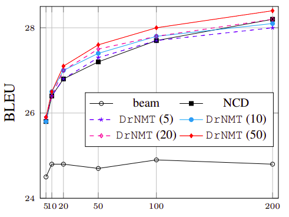

DrNMT stands for "**D**iscriminative **R**eranking for **N**eural
**M**achine **T**ranslation" which is a re-ranking framework created by
Facebook AI in 2021 and published in this paper: [Discriminative
Reranking for Neural Machine
Translation](https://aclanthology.org/2021.acl-long.563.pdf). The
official implementation for this paper can be found in this GitHub
repository:
[DrNMT](https://github.com/pytorch/fairseq/tree/master/examples/discriminative_reranking_nmt).

A re-ranking model is a model that is able to take a list of hypotheses
generated by a baseline model and rank them based on a desired metric.
In this paper, DrNMT takes as input both the source sentence as well as
a list of hypotheses to output a ranked list of a desired metric, e.g.
BLEU, over the n-best list.

Architecture
------------

DrNMT is a transformer architecture which takes as input the
concatenation of the source sentence $x$ and one of the hypothesis
sentences generated by a NMT model $u \in \mathcal{U}(x)$. It outputs
higher scores for hypotheses of better quality based on a metric
$\mu(u,r)$ such as BLEU, where quality is measured with respect to a
reference sentence $r$.

The architecture includes also position embeddings and language
embeddings, to help the model represent tokens that are shared between
the two languages. The final hidden state corresponding to the start of
sentence token $\left\langle s \right\rangle$ is a one hidden
feed-forward network with $d$ hidden units with
$\text{tanh}$ activation. It serves as the joint representation for
$(x, u)$:

    

Given a source sentence $x$, $n$ of hypotheses generated from Trans, a
reference sentence $r$, and an evaluation metric $\mu$, DrNMT parameters
$\theta$ are learned by minimizing the KL-divergence over the training
dataset according to the following formula:

$$\mathcal{L}\left( \theta \right) = - \sum_{j = 1}^{n}{p_{T}\left( u_{j} \right)\text{.log}\left( p_{M}\left( u_{j} \middle| x;\theta \right) \right)}$$

$$p_{M}\left( u_{i} \middle| x;\theta \right) = \text{softmax}\left( o_{i}\left( u_{i} \middle| x;\theta \right) \right) = \frac{\exp\left( o_{i}\left( u_{i} \middle| x;\theta \right) \right)}{\sum_{j = 1}^{n}{\exp\left( o_{j}\left( u_{j} \middle| x;\theta \right) \right)}}$$

$$p_{T}\left( u_{i} \right) = \text{softmax}\left( \frac{\mu\left( u_{i},\ r \right)}{T} \right) = \frac{\exp\left( \frac{\mu\left( u_{i},\ r \right)}{T} \right)}{\sum_{j = 1}^{n}{\exp\left( \frac{\mu\left( u_{j},\ r \right)}{T} \right)}}$$

Where $T$ is the temperature to control the smoothness of the
distribution. In practice, we apply a min-max normalization on $\mu$
instead of using $T$ so that the best hypothesis scores 1 and the worst
0.

Results
-------

In the paper, they experimented on four different language pairs:
GermanEnglish (De-En), English-German (En-De), English-Tamil (En-Ta) and
Russian-English (Ru-En). The following table shows the number of
sentences in each dataset used in the experiments after pre-processing:

    

They trained vanilla Transformer models using the bitext data to
generate the n-best hypothesis list. To alleviate overfitting,
Back-Translation data was generated from beam decoding with beam size
equal to 5. They also used pre-trained XLM-R as the transformer-part of
the DrNMT. Experiments on the four WMT directions show that DrNMT yields
improvements of up to 4 BLEU over the beam search output:

    

The following are the models used in the previous table:

-   **beam (fw):** Feed-forward transformer with beam decoding.

-   **beam (fw) + MLM:** This is the same as **beam (fw)** with
    pre-trained masked language model (MLM) added. This technique was
    proposed by this paper: [Masked Language Model
    Scoring](https://arxiv.org/pdf/1910.14659). This takes a pre-trained
    masked language model (MLM) on the target side, and iteratively
    masks one word of the hypothesis at the time and aggregates the
    corresponding scores to yield a score for the whole hypothesis.
    Then, this score is combined with the score of the forward model to
    rerank the n-best list.

-   **beam (fw) + MLM:** This is the same as **beam (fw) + MLM** where
    MLM is tuned on our target side monolingual dataset.

-   **DrNMT**: is the model described before.

-   **DrNMT + NCD:** This is the same as DrNMT with noisy channel
    decoding (NCD), a technique proposed in this paper: [Simple and
    Effective Noisy Channel Modeling for Neural Machine
    Translation](https://aclanthology.org/D19-1571.pdf).

-   **Oracle:** The oracle is computed by selecting the best hypotheses
    based on BLEU with respect to the human reference. Of course, the
    oracle may be not achievable because of uncertainty in the
    translation task.

In the paper, they also examined the effect of training the reranker
with different sizes of the n-best list. And they found out that;
<u><strong>as the size of the n-best list during test time increases, the
performance of all rerankers and NCD improve</strong></u>. The following
figure shows the performance of DrNMT on De-En validation sets from
four re-rankers trained with 5, 10, 20 and 50 hypotheses,
respectively:

    

