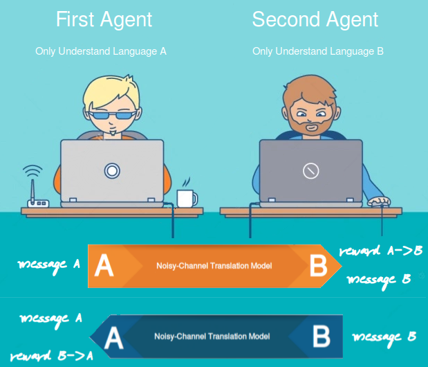
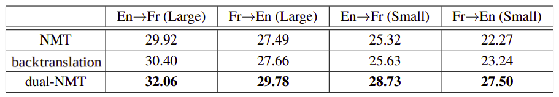

Dual learning is a RL mechanism used mainly for machine translation,
proposed in 2016 by the University of Technology in China in
collaboration with Microsoft and published in this paper: "[Dual
Learning for Machine
Translation](https://arxiv.org/pdf/1611.00179.pdf)". One of the
limitation of machine translation systems is the limited parallel data
due to the the lack of human labeling. The dual-learning mechanism can
enable an NMT system to automatically learn from monolingual data (in
both the source and target languages) through a dual-learning game.

In the dual-learning mechanism, we use one agent to represent the model
for the primal task (translating from English to French for example) and
the other agent to represent the model for the dual task (Translating
from French to English), then ask them to teach each other through a
reinforcement learning process.

Specifically, the dual-learning mechanism for MT can be described as the
following two-agent communication game shown in the following graph:

    

As you can see from the graph, we have monolingual messages sampled from
corpora $D_{A}$ and $D_{B}$ in language A and B, two noisy-channel
translation models $\theta_{\text{AB}}$ and $\theta_{\text{BA}}$ , and
two language model agents $\text{LM}_{A}$ and $\text{LM}_{B}$:

1.  The first agent (only understands language A), samples a message
    $s_{A}$ from corpora $D_{A}$ and sends it to the second agent
    through the noisy channel.

2.  The noisy channel translation model $\theta_{\text{AB}}$ generates K
    translations
    ${\widehat{s}}_{1},\ {\widehat{s}}_{2},\ ...\ {\widehat{s}}_{K}$
    using beam search of K beam size for the received message in
    language B and sends them to the second agent.

    $$P\left( {\widehat{s}}_{k} \middle| s_{A};\theta_{\text{AB}} \right)\forall k \in \lbrack 1,K\rbrack$$

3.  The second agent (only understands language B) receives the K
    translations and compute the reward of each translated sentence
    ${\widehat{s}}_{k}$ using the language model $\text{LM}_{B}$ 
    and the translation model $\theta_{\text{BA}}$:

    $$r_{1,k} = \text{LM}_{B}\left( {\widehat{s}}_{k} \right)\forall k \in \lbrack 1,K\rbrack$$

    $$r_{2,k} = \log\left( P\left( s \middle| {\widehat{s}}_{k};\theta_{\text{BA}} \right) \right)\forall k \in \lbrack 1,K\rbrack$$

4.  Combine the two rewards using a linear combination where where
    $\alpha$ is a hyper-parameter:

    $$r_{k} = \alpha r_{1,k} + \left( 1 - \alpha \right)r_{2,k}$$

5.  Compute the SGD and update the weights of the first noisy-channel
    translation model $\theta_{\text{AB}}$ using learning rate $\gamma_{1}$:

    $$\nabla_{\theta_{\text{AB}}}\widehat{E}\left\lbrack r \right\rbrack = \frac{1}{K}\sum_{k = 1}^{K}\left( r_{k}.\nabla_{\theta_{\text{AB}}}\ \log\left(  P\left( {\widehat{s}}_{k} \middle| s;\theta_{\text{AB}} \right) \right) \right)$$

    $$\theta_{\text{AB}} \leftarrow \theta_{\text{AB}} + \gamma_{1}\nabla_{\theta_{\text{AB}}}\widehat{E}\left\lbrack r \right\rbrack$$

6.  Compute the SGD and update the weights of the second noisy-channel
    translation model $\theta_{\text{BA}}$ using learning rate $\gamma_{2}$:

    $$\nabla_{\theta_{\text{BA}}}\widehat{E}\left\lbrack r \right\rbrack = \frac{1}{K}\sum_{k = 1}^{K}\left( \left( 1 - \alpha \right)r_{k}.\nabla_{\theta_{\text{BA}}}\ \log\left( P\left( s \middle| {\widehat{s}}_{k};\theta_{\text{BA}} \right) \right) \right)$$

    $$\theta_{\text{BA}} \leftarrow \theta_{\text{BA}} + \gamma_{2}\nabla_{\theta_{\text{BA}}}\widehat{E}\left\lbrack r \right\rbrack$$

7.  Assign the translated message ${\widehat{s}}_{k}$ with the
    highest probability as message B $s_{B}$ and send it back to
    the first agent.

8.  Do the same but now using message B. And keep doing that till convergence.

**Notes:**

-   The game can also be started from the second agent with an original
    message in language B, and then the two agents will go through a
    symmetric process and improve the two channels (translation models)
    according to the feedback.

-   Language models can be trained either using other resources, or just
    using the monolingual data $D_{A}$ and $D_{B}$.

Results
-------

In the paper, they trained their dual-NMT model using WMT'14 corpus
which contains 12M sentence pairs and they concatenated newstest2012 and
newstest2013 and used it as the validation set and used newstest2014 as
the testing set. Also, they used "News Crawl: articles from 2012"
provided by WMT'14 as monolingual data.

They constructed the vocabulary with the most common 30K words in the
parallel corpora, and out-of-vocabulary words were replaced with a
special token \<UNK\>. For monolingual corpora, they removed the
sentences containing at least one out-of-vocabulary words.

They compared their dual-NMT approach with two baselines: the standard
neural machine translation (NMT for short), and a NMT-model using
back-translation in two settings:

-   **Small:** They used only 10% of the parallel data for warm start.

-   **Large:** They used all parallel data.

    In the following results, we can see that the Dual-NMT algorithm
    outperforms the baseline algorithms in all the settings despite the
    fact that the two baselines for English→French and French→English
    are trained separately while the dual-NMT conducts joint training.

    

