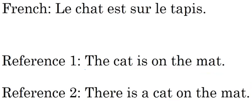
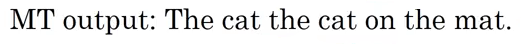
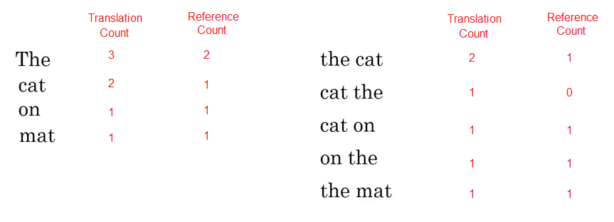
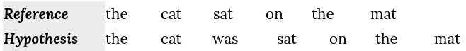
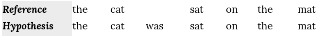
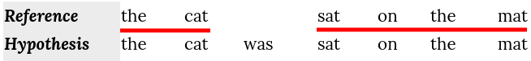
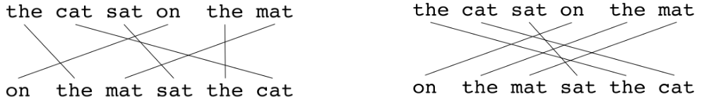
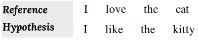
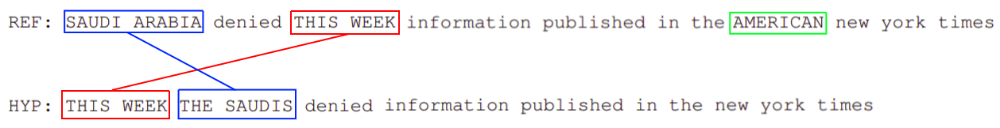
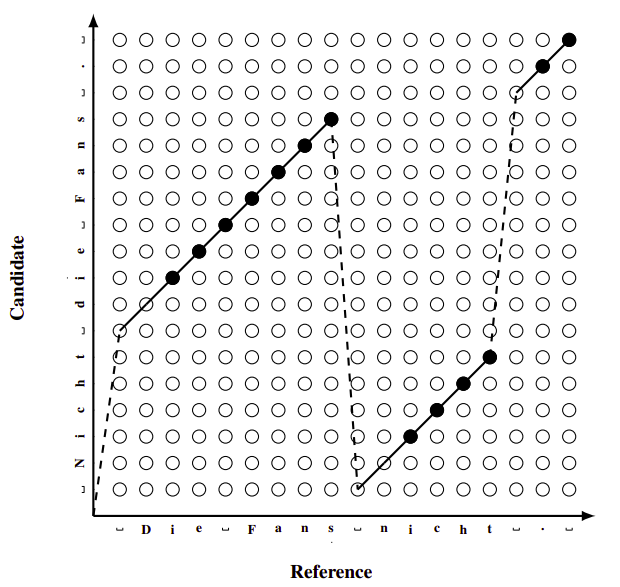

Machine Translation models translate a given sentence by searching for
the sentence that best suits a given criterion. However, all approaches
have to be evaluated to quantify the quality and accuracy of the
produced translations. Naturally, the best method would be to have human
experts rate each produced translation (Candidate) in order to evaluate
the whole MT system based on the reference translations.

This is a quite costly process and is not viable for development of MT systems.
For this reason a number of metrics exist that automate the process and use
different scoring methods to automatically evaluate the produced translation
based on a reference sentence. The evaluation metrics objective is to be as
close as possible to the human translation and currently the most common
techniques for calculating the correlation between human and automatic
evaluations are the **Spearman's rank correlation coefficient** and the
**Pearson product-moment correlation coefficient**. These evaluation metrics
can be divided into three categories:

-   Count-based Metrics.

-   Edit-distance-based Metrics.

-   Pre-trained Metrics.

Count-based Metrics
-------------------

Count-based metrics compute the n-grams of both reference and candidate
and then compare them with each other using a scoring function.

### BLEU

BLEU, stands for "**B**ilingual **E**valuation **U**nderstudy", is an
evaluation metric for machine translation proposed by Aachen University
in 2002 and published in this paper: "[Discriminative Training and
Maximum Entropy Models for Statistical Machine
Translation](https://aclanthology.org/P02-1038.pdf)". BELU is considered
the most commonly used evaluation metric for machine translation so far.
In the following part, we will get a sense of how it works:

    

Taking the former example where the French sentence has been translated
by two different linguists. Let's say that our Machine Translation Model
has produced a bad translation for the French sentence; which is:

    

Let's see how we can calculate the BLEU score for this translation.
First, we will split the sentence into words and see if each word
appears in the provided references like so. But, BLEU score doesn't care
about only the words. It's cares about word-pairs as well. So, let's see
the bigram word-pairs of the previous translation too:

    

So, the unigram score will be
$\frac{2 + 1 + 1 + 1}{3 + 2 + 1 + 1} = \frac{5}{7}$ and the bigram score
will be
$\frac{1 + 0 + 1 + 1 + 1}{2 + 1 + 1 + 1 + 1} = \frac{4}{6} = \frac{2}{3}$.
In other words, the BLEU score of a n-gram model will be:

$$P_{n} = \left( \sum_{ngram \in \hat{y}}^{}{\text{Coun}t_{\text{maxref}}\left( \text{ngram} \right)} \right) \ast \left( \sum_{ngram \in \hat{y}}^{}{\text{Coun}t_{\text{output}}\left( \text{ngram} \right)} \right)^{- 1}$$

It's common to get the values of $P_{1}$ till $P_{4}$ then combine these
scores in the following formula:

$$\text{BLEU} = \text{BP} \ast \exp\left( \frac{1}{4} \ast \sum_{n = 1}^{4}P_{n} \right)$$

$\text{BP}$ factor stands for "Brevity Penalty". It turns out that if we
output very short translations, it\'s easier to get high BLEU score
because most of the words will appear in the references. But we don\'t
want translations that are very short. So, the $\text{BP}$, or the
brevity penalty, is an adjustment factor that penalizes translation
systems that output translations that are too short. So, the formula for
the brevity penalty is the following. It\'s equal to $1$ if our machine
translation system actually outputs things that are longer than the
human generated reference outputs. And otherwise is some formula like
that that overall penalizes shorter translations:

$$\text{BP} = \left\{ \begin{matrix}
\ \ \ \ \ \ \ \ \ \ 1\ \ \ \ \ \ \ \ \ \ \ \ \ \ \ \ \ \ \ \ \ L_{\text{out}} > L_{\text{ref}} \\
\exp\left( 1 - \frac{L_{\text{ou}t}}{L_{\text{ref}}} \right)\ \ \ \ \ \ \ \ \ \ \ \text{otherwise} \\
\end{matrix} \right.$$

Such that $L_{\text{out}}$ is the length of the generated sentence by
our Machine Translation Model, $L_{\text{ref}}$ is the length of the
reference sentence.

### METEOR

Meteor, stands for "**M**etric for **E**valuation of **T**ranslation
with **E**xplicit **Or**dering", is an evaluation metric for machine
translation proposed by Carnegie Mellon University in 2005 and published
in this paper: "[METEOR: An Automatic Metric for MT Evaluation with
Improved Correlation with Human
Judgments](https://aclanthology.org/W05-0909.pdf)".

This metric was designed to fix some of the problems found in the BLEU
metric, and also produce good correlation with human judgement.
According to the paper, METEOR shows correlation of up to 0.964 with
human judgement at the corpus level, compared to BLEU\'s achievement of
0.817 on the same data set.

To see how this metric works, let's take an example and evaluate the
following hypothesis translation using the reference one:

    

We can calculate the METEOR metric using the following steps:

-   The first step is to create an alignment between two sentences
    (hypothesis, reference) resulting something like this:

    

-   Then, calculate the precision $P$ and the recall $R$:

$$P = \frac{\#\ unigrams\ in\ hypothesis\ found\ in\ reference}{\#\ unigrams\ in\ hypothesis} = \frac{6}{7}$$

$$R = \frac{\#\ unigrams\ in\ hypothesis\ found\ in\ reference}{\#\ unigrams\ in\ reference} = \frac{6}{6} = 1$$

-   Then, Precision and recall are combined using the harmonic mean with
    recall weighted 9 times more than precision:

$$F_{\text{mean}} = \frac{10P.R}{R + 9P} = \frac{10.\frac{6}{7}.1}{1 + 9.\frac{6}{7}} = 0.9836$$

-   Calculate the hypothesis chunks; a chunk is defined as a set of
    unigrams that are adjacent in the hypothesis and in the reference.
    So, in this example, we have 2 chunks that consists of 6 unigrams:

$$c = 2,\ \ u_{m} = 6$$

    

-   Now, we can calculate the penalty; The penalty has the effect of
    reducing the F~mean~ by up to 50% if there are no bigram or longer matches:

$$penalty = 0.5\left( \frac{c}{u_{m}} \right)^{3} = 0.5\left( \frac{2}{6} \right)^{3} = 0.0185$$

-   Finally, the METEOR value is:

$$M = F_{\text{mean}}\left( 1 - penalty \right) = 0.9836\left( 1 - 0.0185 \right) = 0.9654$$

> **Notes:**
>
> - If there are two alignments with the same number of mappings, the
    alignment is chosen with the fewest crosses/intersections. From
    the two alignments shown below, the alignment on the left would be
    selected at this point:
>
> 

>     
> 

>
> - The highest value for METEOR metric is 1 unlike BLEU.
>
> - To calculate a score over a whole corpus, the aggregate values for
    **P**, **R** and **penalty** are taken and then combined using the
    same formula.
>
> - METEOR also works for comparing a candidate translation against more
    than one reference translations. In this case the algorithm
    compares the candidate against each of the references and selects
    the highest score.

### BEER

BEER, stands for "**BE**tter **E**valuation as **R**anking", is an
evaluation metric for machine translation proposed by the university of
Amesterday in 2014 and published in this paper: "[BEER: BEtter
Evaluation as Ranking](https://aclanthology.org/W14-3354.pdf)" and the
official GitHub repository can be found here: 
[beer](https://github.com/stanojevic/beer).

TO BE CONTINUED...

### ChrF

ChrF, stands for "character F-score" is another count-based metric for
evaluating machine translation models. ChrF was proposed by Maja
Popovic´at the Humboldt University of Berlin in 2015 and published in
this paper: "[CHRF: character n-gram F-score for automatic MT
evaluation](https://aclanthology.org/W15-3049.pdf)".

> **Note:**\
You can use `nltk.chrf_score()` function for this metric.

This metric depends on the character-level n-gram since it correlates very well
with human judgments. The general formula for the CHRF score is:

$$\text{chr}F_{\beta} = \left( 1 + \beta^{2} \right).\frac{chrP + chrR}{\beta^{2}.chrP + chrR}$$

Where $\text{chrP}$ and $\text{chrR}$ are the n-gram precision and
recall respectively averaged over all character n-grams. And and $\beta$
is a parameter which assigns $\beta$ times more importance to recall
than to precision. If $\beta = 1$, they have the same importance.

To understand this metric better, let's take an example and evaluate the
following hypothesis translation using the reference one:

    

We can calculate the chrF metric using the following steps:

-   Calculate the unigram character for both reference and hypothesis:

<table>
    <thead>
        <tr>
            <th></th>
            <th>a</th>
            <th>c</th>
            <th>e</th>
            <th>h</th>
            <th>i</th>
            <th>k</th>
            <th>l</th>
            <th>o</th>
            <th>s</th>
            <th>t</th>
            <th>v</th>
            <th>y</th>
        </tr>
    </thead>
    <tr>
        <td><strong>Reference</strong></td>
        <td>1</td>
        <td>1</td>
        <td>2</td>
        <td>1</td>
        <td>1</td>
        <td>0</td>
        <td>1</td>
        <td>1</td>
        <td>0</td>
        <td>2</td>
        <td>1</td>
        <td>0</td>
    </tr>
    <tr>
    <td><strong>Hypothesis</strong></td>
        <td>0</td>
        <td>0</td>
        <td>2</td>
        <td>1</td>
        <td>3</td>
        <td>2</td>
        <td>1</td>
        <td>0</td>
        <td>0</td>
        <td>3</td>
        <td>0</td>
        <td>1</td>
    </tr>
</table>

-   Calculate the following metrics:

    -   $tp$ (True Positive): count of characters found in both
        hypothesis and reference. So, in this example, we have (e,2),
        (h,1), (i,1), (l,1), (t,2):

$$tp = 7$$

-   $\text{tpfp}$ (True Positive + False Positive): count of characters
    found in hypothesis.

$$tpfp = 11$$

-   $\text{tpfn}$ (True Positive + False Negative): count of characters
    found in reference.

$$tpfn = 13$$

-   Then, we can calculate the precision $\text{chr}P$ and the recall
    $\text{chrR}$:

$$\text{chr}P = \frac{\text{tp}}{\text{tpfp}} = \frac{7}{11},\ \ \ \ \ chrR = \frac{\text{tp}}{\text{tpfn}} = \frac{7}{13}$$

-   Now, we can calculate the character f-score:

$$\text{chr}F_{\beta} = \left( 1 + \beta^{2} \right).\frac{chrP + chrR}{\beta^{2}.chrP + chrR}$$

-   All of that for unigram character model. In the paper, they did that
    when n=1 till n=6. So, we will do the same when n=2,3,4,5,6 and
    then average the f-score.

Edit-Distance-Based Metrics
---------------------------

Edit distance based metrics utilize the edit distance to express the
difference between the candidate and the reference. Edit distance is a
way to quantify how two words are far apart. More formally, the minimum
edit distance between two strings is defined as the minimum number of
editing operations (operations like insertion, deletion, substitution,
and shifts of adjacent letters) needed to transform one string into
another. The most common edit distance is the **Levenshtein distance**.

### MMS

MMS, stands for "**M**aximum **M**atching **S**tring", is an evaluation
metric for machine translation proposed by New York University in 2003
and published in this paper: "[Evaluation of Machine Translation and its
Evaluation](https://aclanthology.org/2003.mtsummit-papers.51.pdf)".

TO BE CONTINUED...

### TER

TER, stands for "**T**ranslation **E**dit **R**ate", is an evaluation
metric for machine translation proposed by the university of Maryland in
2006 and published in this paper: "[A Study of Translation Edit Rate
with Targeted Human
Annotation](http://www.cs.umd.edu/~snover/pub/amta06/ter_amta.pdf)" and
an unofficial repository implementing TER can be found in the
[sacreBLEU](https://github.com/mjpost/sacrebleu) python package.

TER measures the amount of editing that a human would have to perform to
change a candidate translation so it exactly matches a reference
translation normalized by the average length of the references.

$$TER = \frac{\#\ of\ edits}{average\ \#\ of\ reference\ words}$$

Let's take an example to see how TER works; consider the following
translation:

    

Here, the hypothesis (HYP) is fluent and means the same thing (except
for missing "American") as the reference (REF). However, TER does not
consider this an exact match as:

-   The phrase "this week" is "shifted" (this counts as <u><strong>one
    </strong></u> shift). Shifts have a cost of one no matter how far this
    phrase moves.

-   The phrase "Saudi Arabia" in the reference appears as "the Saudis"
    in the hypothesis (this counts as <u><strong>two</strong></u> separate
    substitutions).

-   The word "American" appears only in the reference (this counts as
    <u><strong>one</strong></u> insertion).

    Then, the TER score is:

$$TER = \frac{4}{13} = 30.77\%$$

> **Important Notes:**
> 
> - Since we are concerned with the minimum number of edits needed to
    modify the hypothesis, we only measure the number of edits to the
    closest reference.
>
> - TER assumes that all edits (insertion, deletion, \...etc.) have the
    same cost.
>
> - Punctuations are treated as normal words.
>
> - Mis-capitalization is counted as an edit.
>
> - In the paper, T(1) denoted that TER was used on just one reference
    sentence while T(4) was used on four different reference sentences.

### CharacTER

CharacTER is a Translation Edit Rate (TER) on Character evaluation
metric for machine translation proposed by Aachen University in 2016 and
published in this paper: "[CharacTER: Translation Edit Rate on Character
Level](https://aclanthology.org/W16-2342.pdf)" and the official code for
this metric can be found on this GitHub repository:
[CharacTER](https://github.com/rwth-i6/CharacTER).

CharacTer is defined as the minimum number of character edits required
to adjust a hypothesis until it completely matches the reference,
normalized by the length of the hypothesis sentence:

$$CharacTER = \frac{shift\ cost\  + \ edit\ distance}{\#\ characters\ in\ the\ hypothesis\ sentence}$$

CharacTer calculates shift edit on word level; two words are considered
to be matched if <u>they are exactly the same</u>, or if <u>the edit
distance between them is below a threshold value</u>.

### EED

EED, stands for "**E**xtended **E**dit **D**istance", is an evaluation
metric for machine translation proposed by Aachen University in 2019 and
published in this paper: "[EED: Extended Edit Distance Measure for
Machine Translation](https://aclanthology.org/W19-5359.pdf)". The
official code for this metric can be found in the following GitHub
repository: [ExtendedEditDistance](https://github.com/rwth-i6/ExtendedEditDistance).

This paper proposes an extension of the Levenshtein edit distance, which
achieves better human correlation whilst remaining fast, flexible and
easy to understand. This extension is can be described as a "jump", a
jumps provides the opportunity to continue the edit distance computation
from a different point. In the following figure, a jump is represented
as a dashed line:

    

EED utilizes the idea of jumps as an extension of the edit distance. EED
operates at character level and is defined as follows:

$$EED = min\left( \frac{\left( e + \alpha \text{.j} \right) + \rho \text{.v}}{\left| r \right| + \rho \text{.v}},\ 1 \right),\ \ \ \text{EED} \in \left\lbrack 0,\ 1 \right\rbrack$$

Where:

-   $e$ is the sum of the edit operation with uniform cost of 1 for
    insertions and substitutions and 0.2 for deletions.

-   $j$ denotes the number of jumps performed with the corresponding
    control parameter $\alpha = 2.0$.

-   $v$ defines the number of characters that have been visited multiple
    times or not at all and scales over $\rho = 0.3$.

-   $\left| r \right|$ is the length of the reference sentence.

Pre-trained Metrics
-------------------

These kind of metrics use pre-trained neural models to evaluate the
quality of MT output texts given the source sentence, the human
reference, or both. One thing good about these metrics is that they are
not strictly dependent on the human translation, so they can better
evaluate synonyms or paraphrases.

On the other hand, their performance is influenced by the data on which
they have been trained. Also, the pre-trained models introduce a
black-box problem where it is difficult to diagnose potential unexpected
behavior of the metric, such as various biases learned from training
data.

### YiSi

Check the paper: [YiSi - A unified semantic MT quality evaluation and
estimation metric for languages with different levels of available
resources](https://aclanthology.org/W19-5358.pdf). The official code for
this paper can be found on this GitHub repository:
[yisi](https://github.com/chikiulo/yisi).

TO BE CONTINUED...

### BERTScore

BERTScore is an automatic evaluation metric for text generation proposed
by Cornell University in 2020 and published in their paper: [Bertscore:
Evaluating Text Generation With
Bert](https://arxiv.org/pdf/1904.09675.pdf). The official repository for
this paper can be found here
[bert_score](https://github.com/Tiiiger/bert_score).

BERTScore computes a similarity score for each token in the candidate
sentence with each token in the reference sentence. However, instead of
exact matches, we compute token similarity using contextual embeddings.
Which makes it the perfect candidate for evaluating machine translation
models. The scoring algorithm is relatively straightforward as shown in
the following figure:

    

Given a reference sentence and a candidate sentence $x$ and a candidate
sentence $\widehat{x}$, the scoring algorithm goes like so:

-   Tokenize the sentences using the tokenizer provided by each model;
    so the reference sentence becomes
    $x = \langle x_{1},\ ...x_{k} \rangle$ and the candidate sentence becomes
    $\widehat{x} = \langle \widehat{x}_1,\text{ ...}\widehat{x}_l \rangle$

-   Given these tokenized sentences, BERT generates representation the
    same size as the tokenized sentences; the translation hypothesis
    embedding
    $\mathbf{x}=\langle \mathbf{x}\_{\mathbf{1}}\mathbf{,\ ...}\mathbf{x}\_{\mathbf{k}} \rangle$
    and the reference sentence embedding
    $\widehat{\mathbf{x}}=\langle \widehat{\mathbf{x}}\_{\mathbf{1}},\text{ ...}\widehat{\mathbf{x}}\_{\mathbf{l}} \rangle$.

-   Compute a matrix of pair-wise cosine similarities of all words from
    the hypothesis and from the reference sentence. The cosine
    similarity of a reference token $x_{i}$ and a candidate token
    ${\widehat{x}}_{j}$ is:

$$cosine = \frac{\mathbf{x}_{\mathbf{i}}^{\mathbf{T}}.{\widehat{\mathbf{x}}}_{\mathbf{j}}}{\left\| \mathbf{x}_{\mathbf{i}} \right\|.\left\| {\widehat{\mathbf{x}}}_{\mathbf{j}} \right\|}$$

-   Use greedy approach, we get the maximum similarity where each token
    in the reference sentence is matched to the most similar token in
    the candidate sentence to use them to compute the precision &
    recall.

$$R_{\text{BERT}} = \frac{1}{\left| x \right|}\sum_{x_{i} \in x}^{}{\max_{\widehat{x}_j \in \widehat{x}}{\mathbf{x}_{\mathbf{i}}^{\mathbf{T}}.{\widehat{\mathbf{x}}}_{\mathbf{j}}}}$$

$$P_{\text{BERT}} = \frac{1}{\left| \widehat{x} \right|}\sum_{\widehat{x}_j \in \widehat{x}}^{}{\max_{x_{i} \in x}{\mathbf{x}_{\mathbf{i}}^{\mathbf{T}}.{\widehat{\mathbf{x}}}_{\mathbf{j}}}}$$

-   We combine precision and recall to compute the F1 measure: the
    harmonic average of precision and recall.

$$F_{\text{BERT}} = \frac{2P_{\text{BERT}}.R_{\text{BERT}}}{P_{\text{BERT}} + R_{\text{BERT}}}$$

-   Since previous work demonstrated that rare words can be more
    indicative for sentence similarity than common words, we incorporate
    inverse document frequency (idf) weighting. Given $M$ reference
    sentences $\left[ x^{\left( i \right)} \right]_{i = 1}^{M}$, the
    idf score of a word-piece token $w$ is:

$$\text{idf}\left( w \right) = - \log\left( \frac{1}{M}\sum_{i = 1}^{M}{\mathbb{I}\left\lbrack w \in x^{\left( i \right)} \right\rbrack} \right)$$

&emsp;&emsp;&emsp;Where $\mathbb{I}\left\lbrack . \right\rbrack$ is an indicator function.

-   Now, the precision & recall becomes:

$$R_{\text{BERT}} = \frac{1}{\sum_{x_{i} \in x}^{}{\text{idf}\left( x_{i} \right)}}\sum_{x_{i} \in x}^{}{\text{idf}\left( x_{i} \right)\max_{\widehat{x}_j \in \widehat{x}}{\mathbf{x}_{\mathbf{i}}^{\mathbf{T}}.{\widehat{\mathbf{x}}}_{\mathbf{j}}}}$$

$$P_{\text{BERT}} = \frac{1}{\sum_{x_{i} \in x}^{}{\text{idf}\left( x_{i} \right)}}\sum_{\widehat{x}_j \in \widehat{x}}^{}{\max_{x_{i} \in x}{\text{idf}\left( x_{i} \right).\mathbf{x}_{\mathbf{i}}^{\mathbf{T}}.{\widehat{\mathbf{x}}}_{\mathbf{j}}}}$$

-   Finally, BERTScore have the same numerical range of cosine
    similarity $\left\lbrack - 1,1 \right\rbrack$. However, in practice
    scores are in a more limited range $\left\lbrack 0,1 \right\rbrack$.
    So, we rescale BERTScore with respect to its empirical lower bound b
    as a baseline like so:

$${\widehat{R}}_{\text{BERT}} = \frac{R_{\text{BERT}} - b}{1 - b}$$

$${\widehat{P}}_{\text{BERT}} = \frac{P_{\text{BERT}} - b}{1 - b}$$

$${\widehat{F}}_{\text{BERT}} = \frac{F_{\text{BERT}} - b}{1 - b}$$

-   We compute b using Common Crawl monolingual datasets. For each
    language and contextual embedding model, we create 1M
    candidate-reference pairs by grouping two random sentences. Because
    of the random pairing and the corpus diversity, each pair has very
    low lexical and semantic overlapping. We compute $b$ by averaging
    BERTScore computed on these sentence pairs.

### BLEURT

BLEURT is an automatic evaluation metric for text generation proposed by
Google Research in 2020 and published in their paper: [BLEURT: Learning
Robust Metrics for Text
Generation](https://arxiv.org/pdf/2004.04696.pdf). The official
code for this paper can be found on Google Research's official GitHub
repository: [bleur](https://github.com/google-research/bleurt).

TO BE CONTINUED...

### COMET

BLEURT is an automatic evaluation metric for machine translation
proposed by Unbabel AI in 2020 and published in their paper: [COMET: A
Neural Framework for MT
Evaluation](https://arxiv.org/pdf/2009.09025.pdf). The official
repository for this paper can be found on this GitHub repository: 
[COMET](https://github.com/Unbabel/COMET).

TO BE CONTINUED...

### Prism

Prism is an automatic evaluation metric for machine translation proposed
by John Hopkins Unversity in 2020 and published in their paper:
[Automatic Machine Translation Evaluation in Many Languages via
Zero-Shot Paraphrasing](https://arxiv.org/pdf/2004.14564.pdf). The
official code for this paper can be found on this GitHub repository:
[prism](https://github.com/thompsonb/prism).

TO BE CONTINUED...