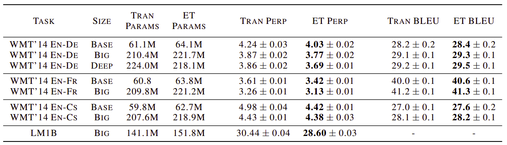

The Evolved Transformer (ET) ia an evolved version of the Transformer
architecture created by applying Neural Architecture Search (NAS)
algorithm over the standard architecture.The Evolved Transformer was
proposed by Google Brain in 2019 and published in their paper with the
same name: [The Evolved Transformer](https://arxiv.org/pdf/1901.11117.pdf).
The official implementation of the Evolved Transformer can be found on the
Tensor2Tensor official GitHub repository:
[tensor2tensor/universal_transformer.py](https://github.com/tensorflow/tensor2tensor/tree/master/tensor2tensor/models/research).

We first construct a large search space inspired by the recent advances
in feed-forward sequence models and then run evolutionary architecture
search with warm starting by seeding our initial population with the
Transformer. To directly search on the computationally expensive WMT
2014 EnglishGerman translation task, we develop the Progressive Dynamic
Hurdles method, which allows us to dynamically allocate more resources
to more promising candidate models.

The goal of this work is to examine the use of neural architecture
search methods to design better feed-forward architectures for seq2seq
tasks. Specifically, we apply tournament selection architecture search
and warm start it with the Transformer, considered to be the
state-of-art and widely-used, to evolve a better and more efficient
architecture. To achieve this, we construct a search space that reflects
the recent advances in feed-forward seq2seq models and develop a method
called Progressive Dynamic Hurdles (PDH) that allows us to perform our
search directly on the computationally demanding WMT 2014 EnglishGerman
(En-De) translation task.

ET out-performed the human-designed transformer on four well-established
language tasks: WMT 2014 English-German, WMT 2014 English-French, WMT
2014 English-Czech and LM1B:

    

NAS
---

NAS stands for "Network Architecture Search" which is an evolution-based
architecture search

TO BE CONTINUED!