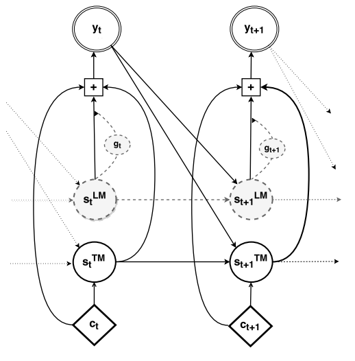

The fusion technique is proposed by the University of Montreal in 2015
and published in this paper: "[On Using Monolingual Corpora in Neural
Machine Translation](https://arxiv.org/pdf/1503.03535.pdf)". The idea
about fusion is to integrate a language model (LM) trained only on
monolingual data (target language) into an NMT system. Since this paper
was published in 2015, it uses the encoder-decoder architecture. So, the
integrating part will be done on the decoder's side.

In the paper, they proposed two method for integrating a language model
into an NMT translation system; and they are <u><strong>shallow fusion</strong></u>
and <u><strong>deep fusion</strong></u> where the language model is a recurrent
neural network language model (RNN-LM) same as the decoder but trained
separately using monolingual data.

Shallow Fusion
--------------

The name "Shallow fusion" was introduced in this paper where Koehn tried
to combine a language model with a statistical machine translation
system. So, at each time step, the translation model proposes a set of
candidate words, these candidates are then scored according to the
weighted sum of the scores given by the translation model and the
language model according to the following formula:

$$\text{log} p\left( y_{t} = k \right) = \log\ p_{\text{NMT}}\left( y_{t} = k \right) + \beta\ \log\ p_{\text{LM}}\left( y_{t} = k \right)$$

Where:

-   $y_{t}$ is the suggested output word.

-   $p_{\text{NMT}}$ is the probability of the neural machine
    translation generating word $y_{t} = k$.

-   $p_{\text{LM}}$ is the probability of the language model generating
    word $y_{t} = k$.

-   $\beta$ is a hyper-parameter that needs to be tuned to maximize the
    translation performance on a development set.

Deep Fusion
-----------

In deep fusion, we integrate the RNNLM and the decoder of the NMT by
concatenating their hidden states next to each other. Unlike the vanilla
NMT (without any language model component), the hidden layer of the deep
output takes as input the hidden state of the RNNLM in addition to that
of the NMT, the previous word and the context as shown in the following
figure:

    

The model is then fine-tuned to use the hidden states from both of these
models when computing the output probability of the next word according
to the following formula:

$$p\left( y_{t} \middle| y_{< t},\ x \right) \propto \ \exp\left( y_{t}^{T}\left( W_{o}.f_{o}\left( s_{t}^{\text{LM}},\ s_{t}^{\text{NMT}},y_{t - 1},\ c_{t} \right) + b_{o} \right) \right)$$

Where:

-   $x$ is the input and $y_{< t}$ is all the previous output words.

-   $y_{t}$ is the suggested output word at time step $t$. Which means
    that $y_{t - 1}$ is the output word one step before.

-   $W_{o}$ is the weights of the output layer and $b_{o}$ is the bias.

-   $f_{o}$ is the activation function of the output layer.

-   $s_{t}^{\text{LM}}$ is the hidden state of the language model.

-   $s_{t}^{\text{NMT}}$ is the hidden state of the neural machine
    translation model.

-   $c_{t}$ is the context vector produced by the encoder.
