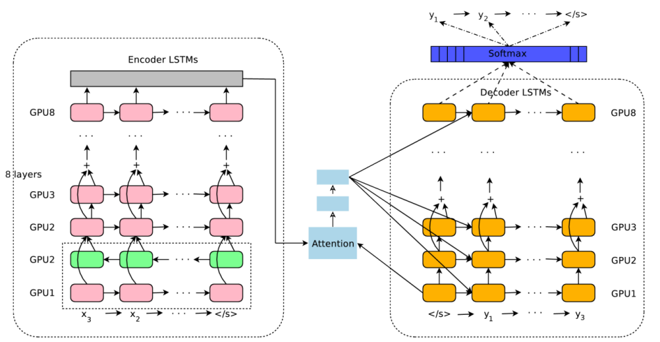
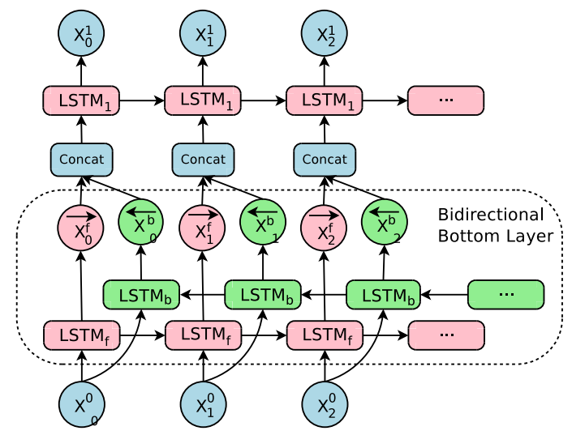
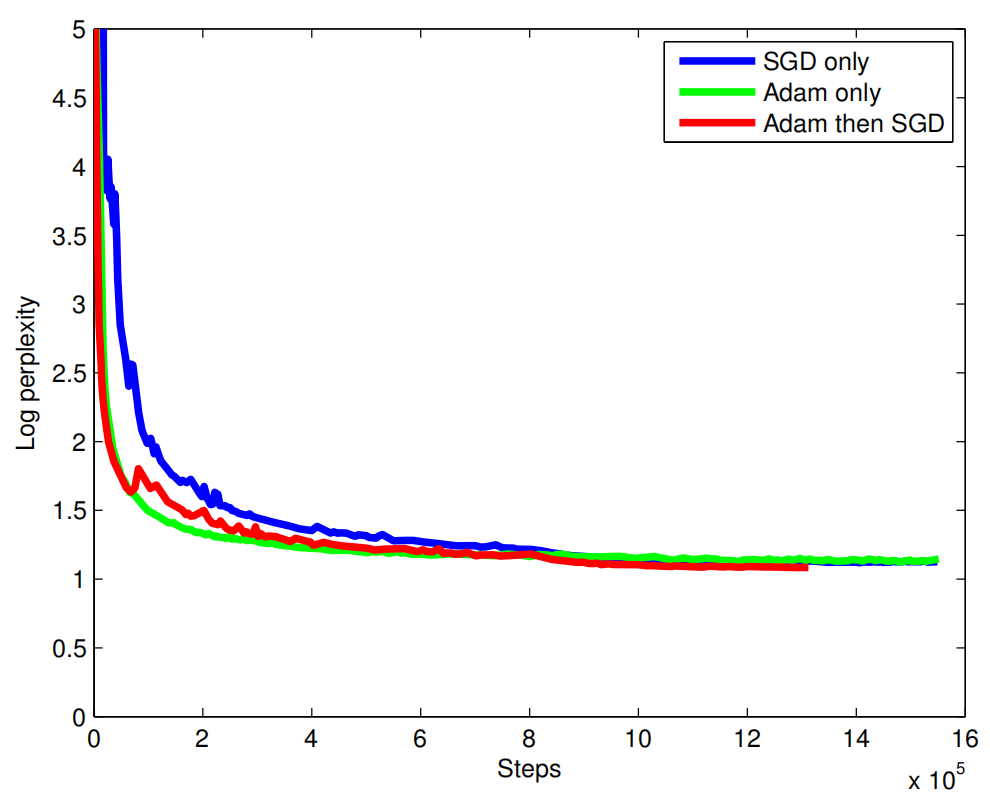
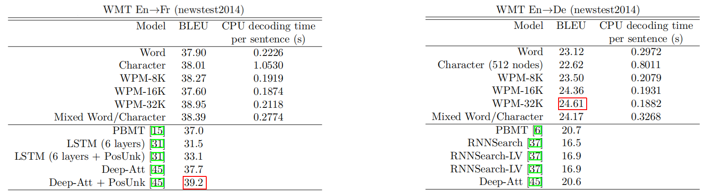
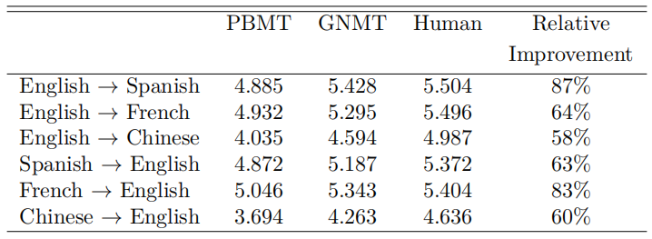
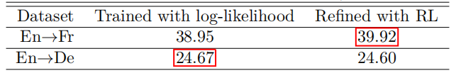
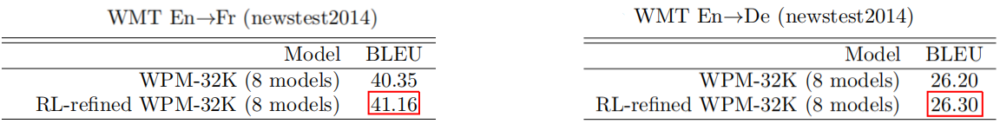

GNMT stands for "Google's Neural Machine Translation" which is a deep
machine translation model proposed in 2016 by Google Research and
published in this paper: [Google's Neural Machine Translation System:
Bridging the Gap between Human and Machine
Translation](https://arxiv.org/pdf/1609.08144.pdf). The official code
for this paper can be found in the TensorFlow's official GitHub
repository:
[TensorFlow/GNMT](https://github.com/NVIDIA/DeepLearningExamples/tree/master/TensorFlow/Translation/GNMT).

GNMT is a deep LSTM network with 8 encoder (1 bi-directional layer and 7
uni-directional layers) and 8 decoder layers (all uni-directional
layers) with residual connections throughout the architecture as well as
attention connections from the decoder network to the encoder. To
improve parallelism and therefore decrease training time, the model was
partitioned on 8 different GPUs; one for each layer.

    

> **Note:**\
In case you didn't pay attention, the first layer of the encoder module
is bi-directional to allow the best possible coverage of the source
context. The output from the forward path
${\overrightarrow{\mathbb{x}}}_t^{f}$ is concatenated with the output
from the backward path ${\overleftarrow{\mathbb{x}}}_t^{b}$ and then
fed to the next layer of the encoder:
>
> 

>     
> 

This model follows the common sequence-to-sequence learning framework.
It has three components: an encoder network, a decoder network, and an
attention network. Next, let's see how it works. Let
$\left( X,\ Y \right)$ be a source and target sentence pair where
$X = \left\\{ x_{1},\ ...x_{m} \right\\}$ is a set of $M$ tokens and
$Y = \left\\{ y_{1},\ ...y_{n} \right\\}$ is a set of $N$ tokens. The
encoder transforms the source sentence $X$ into a list of fixed sized
vectors:

$$\mathbb{x}_{1},\ ...\mathbb{x}_{m} = \text{EncoderRNN}\left( x_{1},\ ...x_{m} \right)$$

Given this list of vectors
$\left\\{ \mathbb{x}_1,\ ...\mathbb{x}_m \right\\}$, along with the
start-of-sentence symbol $y_{0} = \left\langle /s \right\rangle$,
the decoder generates the translation autoregressively (one token at a time),
until the special end-of-sentence symbol $\left\langle /s \right\rangle$
is produced:

$$y_{i} = \text{DecoderRNN}\left( \left\{ y_{0},\ ...y_{i - 1} \right\},\left\{ \mathbb{x}_{1},\ ...\mathbb{x}_{m} \right\} \right)$$

The encoder and decoder are connected through an attention module which
is a feed-forward network that allows the decoder to focus on different
regions of the source sentence during the course of decoding. Let
$y_{i - 1}$ be the decoder's output from the past decoding time step,
the attention context $a_{i}$ for the current time step is computed
according to the following formulas:

$$s_{t} = \text{Attention}\left( y_{i - 1},\ \mathbb{x}_{1},\ ...\mathbb{x}_{m} \right)$$

$$p_{t} = \text{Softmax}\left( s_{t} \right) = \frac{\exp\left( s_{t} \right)}{\sum_{t = 1}^{M}{\exp\left( s_{t} \right)}}$$

$$a_{i} = \sum_{t = 1}^{M}{p_{t}.}\mathbb{x}_{t}$$

Deep stacked networks often give better accuracy over shallower models,
but deep networks suffer from gradient vanishing; which means that
gradients get very small which makes training very slow or impossible at
sometimes. To overcome this issue, they used residual connections
between layers in the encoder and the decoder.

More concretely, let $\text{LSTM}_{i}$ and
$\text{LSTM}_{i + 1}$ be the $i^{\text{th}}$ and
$\left( i + 1 \right)^{\text{th}}$ LSTM layers in a stack, whose
parameters are $W^{i}$ and $W^{i + 1}$ respectively.
At the $t^{\text{th}}$ time step, the stacked LSTM residual
connection will be:

$$c_{t}^{i},m_{t}^{i} = \text{LSTM}_{i}\left( c_{t - 1}^{i},\ m_{t - 1}^{i},\ x_{t}^{i - 1};\ W^{i} \right)$$

$$x_{t}^{i} = m_{t}^{i} + x_{t}^{i - 1}$$

$$c_{t}^{i + 1},m_{t}^{i + 1} = \text{LSTM}_{i + 1}\left( c_{t - 1}^{i + 1},\ m_{t - 1}^{i + 1},\ x_{t}^{i};\ W^{i + 1} \right)$$

Neural Machine Translation models often operate with fixed word
vocabularies, but translation is fundamentally an open vocabulary
problem and that can cause problems. To fix this issue, they decided to
use a subword tokenization model called "Wordpiece Model".

Wordpiece Model
---------------

Wordpiece Model (WPM) is a word segmentation algorithm created by
Schuster and Nakajima in their paper: "[Japanese, Korean Voice
Search](https://static.googleusercontent.com/media/research.google.com/en/pubs/archive/37842.pdf)"
published in 2012 while there were trying to find a good word segmentor
to solve the Japanese/Korean voice problem at Google. This approach is
completely data-driven and the following is the algorithm:

1.  Initialize the vocabulary to include every character present in the
    training data.

2.  Build a character language model using the previous sequences.

3.  Merge those with the highest likelihood into a new symbol. For
    example \"$\text{ug}$\" would have only been merged if the
    probability of \"$\text{ug}$\" divided by \"$u$\" and \"$g$\" is
    greater than for any other character-pair.

4.  Keep merging until certain vocabulary size is met or the likelihood
    falls below a certain threshold.

At interference, use the built vocabulary to split words into subwords
that can be found in the vocabulary. Here is an example of a word
sequence and the corresponding wordpiece sequence:

$$Sentence:\ Jet\ makers\ feud\ over\ seat\ width\ with\ big\ orders\ at\ stake$$

$$wordpieces:\ \_ J\ et\ \_ makers\ \_ fe\ ud\ \_ over\ \_ seat\ \_ width\ \_ with\ \_ big\ \_ orders\ \_ at\ \_ stake$$

In the above example, the word "$\text{Jet}$" wasn't found in the
vocabulary, that'w why it was broken into two wordpieces "$\text{\_J}$" and
"$\text{et}$" that are in the vocabulary. Same goes for the word
"$\text{feud}$" which got broken into two wordpieces "$\text{\_fe}$" and
"$\text{ud}$". The other words remain as single wordpieces since they
were already in the vocabulary.

> **Note:**\
"\_" is a special character added to mark the beginning of a word.

Choosing the vocabulary of the wordpiece model is a hyper-parameter that
you can tune based on your experiments. However, a total vocabulary
between 8k and 32k wordpieces usually achieves better results and fast
decoding.

Beam Search
-----------

When decoding, they used beam search algorithm
($\text{beam size} = 3.0$) which maximizes the score function
$s\left( Y,\ X \right) = \log\left( P\left( Y \middle| X \right) \right)$.
After the hypothesis gets the end-of-sentence token, they applied a
refined version of the beam search algorithm which is exactly the same
as the standard beam search with two important refinements:

-   <u><strong>Coverage Penalty:</strong></u>\
    Coverage penalty aims at favoring translations that fully cover the
    source sentence according to the attention module. The coverage
    penalty is computed by the following formula knowing that
    $\left| X \right|$ is the length of the source sentence $X$,
    $p_{i,j}$ is the attention probability of the the $i^{\text{th}}$
    source word with the $j^{\text{th}}$ target word, and
    $\beta \in \left\lbrack 0,1 \right\rbrack$ is a hyper-parameter:

$$cp\left( X;Y \right) = \beta*\sum_{i = 1}^{\left| X \right|}{\log\left( \min\left( \sum_{j = 1}^{\left| Y \right|}p_{i,j},\ 1.0 \right) \right)}$$

-   <u><strong>Length Penalty:</strong></u>\
    With length penalty, they aimed at normalizing the sentence length
    to account for the fact that hypotheses have different length.
    Without it, beam search will favor shorter results over longer ones.
    The length penalty term is computed by the following formula knowing
    that is $\left| Y \right|$ the length of $Y$and
    $\alpha \in \left\lbrack 0,1 \right\rbrack$ is a hyper-parameter:

$$lp\left( Y \right) = \left( \frac{5 + \left| Y \right|}{5 + 1} \right)^{\alpha}$$

Now, the beam search score function is:

$$s\left( Y,\ X \right) = \frac{\log\left( P\left( Y \middle| X \right) \right)}{cp\left( X;Y \right) + lp\left( Y \right)}$$

**Note:**\
$\alpha \in \left\lbrack 0.6,0.7 \right\rbrack$ was usually found to be
best. However, they used $\alpha = \beta = 0.2$ in this paper. Also
notice that when $\alpha = 0$ and $\beta = 0$, the decoder falls back to
pure beam search.

Experiments & Results
---------------------

All models' trainable parameters were uniformly initialized between
$\left\lbrack - 0.04:0.04 \right\rbrack$. Gradient clipping was applied
at $5.0$. As an optimizer, they used a combination of Adam and simple
SGD learning algorithms. Adam was used for the first $60k$ steps, after
which they switched to simple SGD. For the Adam part, they used a
learning rate of $0.0002$, and $0.5$ for the SGD part. They used a
mini-batch of $128$ examples.

> **Note:**\
They used a combination of Adam and SGD because Adam (green) accelerated
training at the beginning, but converged to a worse point than the
combination (red) as shown below in the following graph:
>
>

>    
>

They evaluated the model on the WMT En→Fr dataset (36M examples), the
WMT En→De dataset (5M examples), as well as many Google's internal
production datasets. For testing, they used newstest2014; and for
validation, they used newstest2012 and newstest2013. To prevent
overfitting, they applied dropout with a dropout probability of $0.2$
for En→Fr and $0.3$ for En→De datasets.

The following table summarizes the results of running different
variations of GNMT on the En→Fr (left) and En→De (right) datasets
against the best Phrase-Based Machine Translation (PBMT) production
system for Google Translate along with the best models proposed by other
papers (last five models). As can be seen, "WPM-32K" achieves amazing
results.

    

As seen in the past table, they have tried <u><strong>six</strong></u>
variations of the GNMT model:

-   <u><strong>Word:</strong></u>\
    They selected the most frequent 212K source words as the
    source vocabulary and the most popular 80k target words as the
    target vocabulary. Out-of-Vocabulary (OOV) words were converted into
    special \<first_char\>\_UNK\_\<last_char\> symbols. Then, the
    attention mechanism was used to copy a corresponding word from the
    source to replace these unknown words during decoding.

-   <u><strong>Character:</strong></u>\
    They used characters instead of words as input to the GNMT and
    expected the decoder to generate characters as the output.

-   <u><strong>WPM:</strong></u>\
    All three models are the same GNMT model with the vocabulary size
    being the only difference. WPM-8k, WPM-16k, and WPM-32k refers to
    the same GNMT model with vocabulary of 8k, 16k, and 32k tokens
    respectively.

-   <u><strong>Mixed word/character:</strong></u>\
    This is a similar algorithm to the WPM that uses a fixed vocabulary.
    Then, out-of-vocabulary (OOV) words are collapsed into special
    prefixes (\<B\>,\<M\>, and \<E\>) prepended to the words'
    characters. These special prefixes mean: beginning, middle, and end
    of the word, respectively. For example, the OOV word "Miki" will be
    converted to "\<B\>M \<M\>i \<M\>k \<E\>i".

And the following table summarizes the GNMT (WMP-32k) performance on
Google's internal production datasets in comparison with the best
Phrase-Based Machine Translation (PBMT) production system for Google
Translate and the a human translator:

    

As expected, these results show that GNMT system outperforms the PBMT
system in every language pair but not to the extent of surpassing the
human translator.

RL-refined Model
----------------

Given a dataset of parallel text pairs denoted
$\mathcal{D} \equiv \left\\{ \left( X^{\left( i \right)},\ Y^{\left( i \right)} \right),\ ...\left( X^{\left( \left| \mathcal{D} \right| \right)},\ Y^{\left( \left| \mathcal{D} \right| \right)} \right) \right\\}$
of size $\left| \mathcal{D} \right|$, a machine translation model aims
at maximizing the sum of log probabilities of the ground-truth outputs
given the corresponding inputs:

$$\mathcal{O}_{\text{ML}}\left( \theta \right) = \sum_{i = 1}^{\left| \mathcal{D} \right|}{\log\ P_{\theta}\left( Y^{＊\left( i \right)} \middle| X^{\left( i \right)} \right)}$$

The main problem with this objective is that it does not reflect the
BLEU score; outputs with higher BLEU scores should obtain higher
probabilities. In this paper, they attempted to refine the model using
reinforcement learning as expressed below:

$$\mathcal{O}_{\text{RL}}\left( \theta \right) = \sum_{i = 1}^{\left| \mathcal{D} \right|}{\sum_{Y \in \mathcal{Y}}^{}{P_{\theta}\left( Y \middle| X^{\left( i \right)} \right)\text{.r}\left( {Y,Y}^{＊\left( i \right)} \right)}}$$

Where $r\left( {Y,Y}^{＊\left( i \right)} \right)$ denotes the
per-sentence score, and $\mathcal{Y}$ is a set of all the hypotheses
sentences. The BLEU score has some undesirable properties when used for
single sentences, as it was designed to be a corpus measure. Therefore,
they decided to use GLEU with reinforcement learning instead. For the
GLEU score, they recorded 1, 2, 3 or 4 (n-grams) tokens in output and
target sequence. Then, computed the recall in the ground truth sequence,
and the precision in the generated output sequence. Now, GLEU score is
simply the minimum of recall and precision:

$$GLEU = min\left( \text{precision}\left( Y^{＊} \right),\ Recall\left( Y \right) \right),\ \ \ GLEU \in \left\lbrack 0,1 \right\rbrack$$

To further stabilize training, they optimized a linear combination of
$\mathcal{O}_{\text{ML}}$ and $\mathcal{O}_{\text{RL}}$
objectives using a hyper-parameter $\alpha$ (typically set to be $0.017$):

$$\mathcal{O}_{\text{Mixed}}\left( \theta \right) = \alpha*\mathcal{O}_{\text{ML}}\left( \theta \right) + \mathcal{O}_{\text{RL}}\left( \theta \right)$$

The following table presents the average of 8 independent models
with/without refinement. The results shows that the refined model
slightly improves the performance:

    

To obtain state-of-the-art results on En→Fr dataset and En→Fr dataset
with $41.16$ and $26.30$ respectively, they combined 8 different
RL-refined models

    

> **Note:**\
The refinement model is applied after the ML model converges. Then, the
refinement is trained until the BLEU score does not change much on the
development set which usually happens after around 400k steps.
