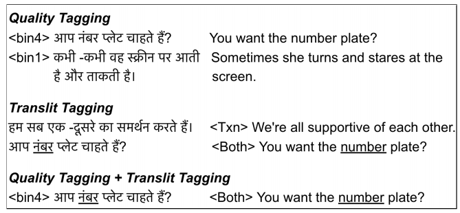
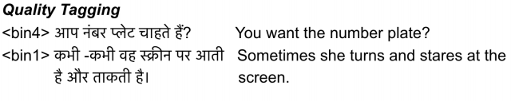
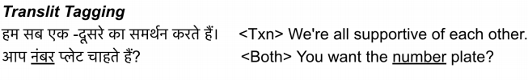
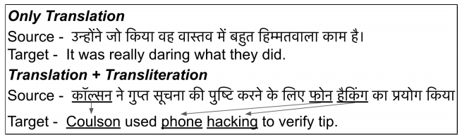
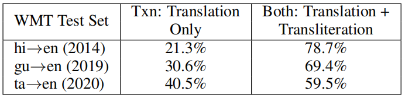
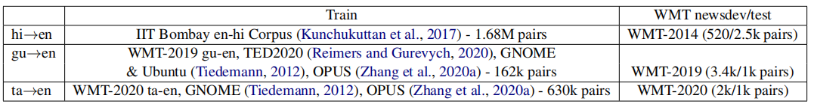
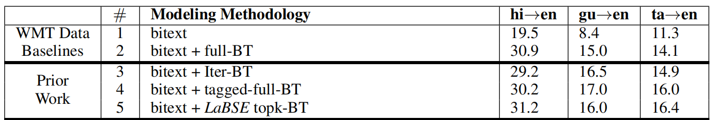
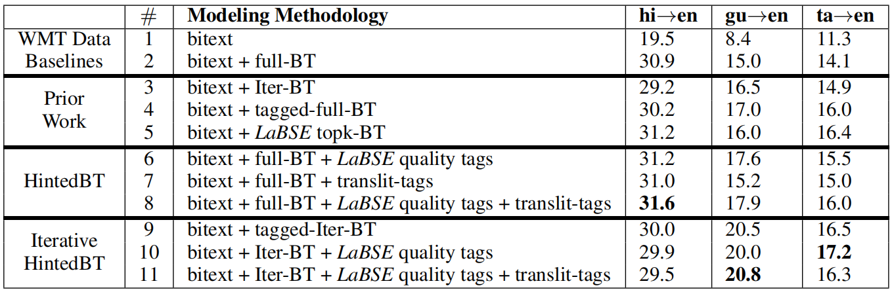

HintedBT is a family of techniques that provides <u><strong>hints through tags
on the source side and target side</strong></u> to the
[Back-translation](https://anwarvic.github.io/machine-translation/Back-Translation)
mechanism to improve the effectiveness of the provided monolingual data.
These techniques were proposed by Google Research in 2021 and published
in their paper: [HintedBT: Augmenting Back-Translation with Quality
and](https://arxiv.org/pdf/2109.04443.pdf).

[Back-translation](https://anwarvic.github.io/machine-translation/Back-Translation)
is one such widely used data augmentation technique in which synthetic
parallel data is created by translating monolingual data in the target
language to the source language using a baseline system. However, in
order to get high quality parallel back-translated (BT) data, we either
need a high quality target→source translation model or a high quality
parallel (bitext) data. Both are limited when it comes to low-resource
languages.

To overcome that, existing methods either use all BT data available which leads
to low-quality translation models, or use various cleaning techniques to filter
out lower quality BT data which reduces the amount of data available for
training low-resource languages even more.

HintedBT provides the solution of this problem by providing two
different techniques that can be combined or used independently:

-   Quality Tagging

-   Translit Tagging

    

Quality Tagging
---------------

Quality Tagging approach uses all the BT data by utilizing quality
information about each instance by using multiple tags on the source
sentence to hint of the quality of the BT pair. For each sentence pair,
the quality was determined by the following steps:

-   Use [LaBSE](https://anwarvic.github.io/cross-lingual-LM/LaBSE) to
    compute sentence embeddings of the two sentences. LaBSE is a
    BERT-based language agnostic cross-lingual model.

-   Compute the cosine similarity between these source and target
    embeddings.

-   This score is treated as the quality score

> **Note:**\
This method can be seen as an extension to the [Tagged
BT](https://anwarvic.github.io/machine-translation/Tagged_BT)
approach.

Now, we know how they calculated the quality of a sentence pair. Next, we need
to know how they designed the binning mechanism. By binning mechanism, I mean
how they divided all sentence pairs into bins where each bin has a bunch of
sentence pairs. In the paper, they designed the binning mechanism by using:

-   **Equal Volume Binning**: They calculated the quality score of the
    $N$ sentence-pairs, then they sorted them by their quality score,
    and finally divided them into $k$ equally sized groups.

-   **Four bins**: They experimented with different number of bins (see
    experiments) and found out that <u><strong>four</strong></u> or
    <u><strong>three</strong></u> bins provide the best performance.

The following figure shows a sentence-pair after applying Quality Tagging; the
tags indicate the bin index prepended to the source sentence:

    

> **Note:**\
They also experimented using <u>Equal Width Binning</u> (to divide the quality
score range) instead instead of <u>Equal Volume Binning</u> (to divide the data
points range) and found out that the former leads to unbalanced data which isn't
preferable.

Translit Tagging
----------------

Translit Tagging approach uses all the BT data by adding a tag to the
target sentence indicating whether this sentence pair needs either
<u><strong>translation</strong></u> or <u><strong>translation + transliteration
</strong></u>. Hence the name "Translit". If the target was fully translated,
the method will prepend \<Txn\> to the target sentence. Otherwise, it will
\<Both\> to the target sentence as seen below:

    

> **Note:**\
Transliteration is when you sound a word of one language using the
scripts of other languages. We do that all the time when writing our
names in other language; like "أحمد" will be written in English as "Ahmed". In
the following example, we can see the difference between translation and\
translation + transliteration:
>
> 

>     
> 

Transliteration is a big issue especially in low-resource languages.
According to the following table found in the paper, more than 60% of
the sentence-pairs in three different low-resource languages contain
both translation + transliteration:

    

This huge percentage of translation + transliteration in the datasets
puts a pressure on the trained model to identify implicitly which source
words should be translated to the target language and which need to be
transliterated. In this paper, they did that by using the following
steps:

-   For each word in the source sentence, they used FST (Finite State
    Transducer) transliteration models from this
    [paper](https://aclanthology.org/W17-4002.pdf) to generate 10
    English (i.e., the target language) transliterations.

-   If any of these transliterations are present in the corresponding
    target, they would categorize this pair as \<Both\>. As you might
    have guessed, it only needs one word to prepend this tag.

-   If not, they would categorize it as \<Txn\>.

> **Note:**\
They experimented prepending the translit tag to source sentence but it didn't
perform as we are going to discuss later in the experiments.

Experiments
-----------

In this paper, all experiments were performed on three low-resource
languages: Hindi→English (hi→en), Gujarati→English (gu→en), and
Tamil→English (ta→en). The training/dev/test stats of the data used can
be seen in the following table:

    

All three models used in these experiments were standard Transformer
architecture with 6 layers on the encoder and the decoder for hi→en and
4 layers on the decoder for both gu→en and ta→en. The dimension of
transformer layers, token embeddings and positional embeddings is
$1024$, the feed-forward layer dimension is $8192$, and number of
attention heads is $16$.

For training, we use the Adafactor optimizer with $\beta_{1} = 0.9$ and
$\beta_{1} = 0.98$, and the learning rate is varied with warm-up for
40,000 steps followed by decay as in the original paper for 300k step
using a batch size of 3k across all models and tokenize the source and
target using WordPiece tokenization.

### Baselines

In the paper, they presented five baseline models:

-   **bitext:** Model trained only on bitext data.

-   **bitext + full-BT:** Model trained on bitext data and an additional
    23M back-translated pairs.

-   **bitext + Iterative-BT:** Model trained with two iterations of
    back-translation (in the forward and reverse directions).

-   **bitext + tagged-full-BT:** Model trained on bitext data using
    tagged Back-Translation data. A tag is added to the source in every
    sentence pair to help the model distinguish between natural (bitext)
    and synthetic (BT) data.

-   **bitext + LaBSE topk-BT:** Model trained on bitext data and topk
    best quality BT pairs. Quality is estimated using LaBSE scores, and
    they grid-searched with at least 6 LaBSE threshold values and choose
    the one which gives the best BLEU on the dev set. The chosen
    threshold yields 20M BT sentences for hi→en, 10M for gu→en and 5M
    for ta→en.

    

### Results

The following table shows the comparison between different variations of
HintedBT and baseline models. As we can see, HintedBT provides the best
results on the three languages. Also, quality tagging provides similar
results to topk-BT and it's in face more efficient than topk-BT in terms
of computational resources:

    

