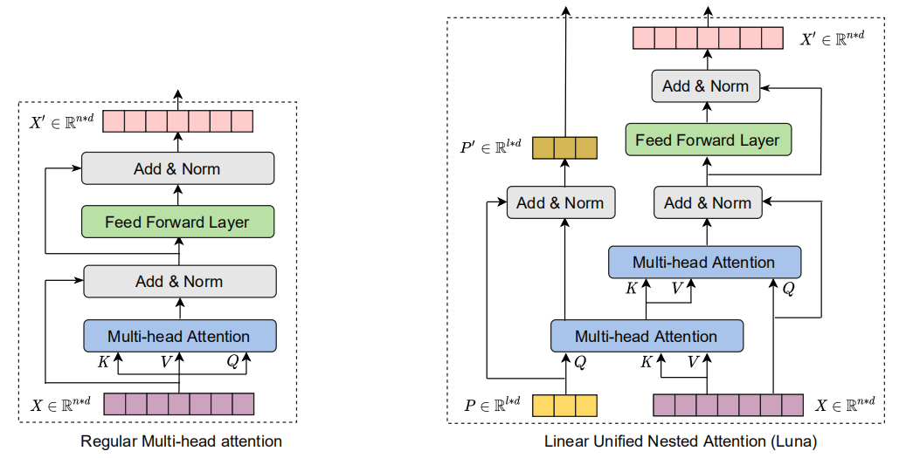
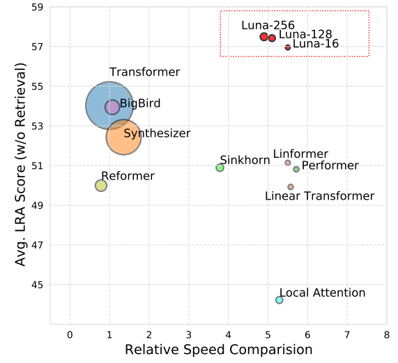
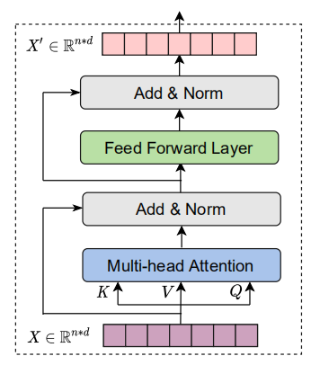
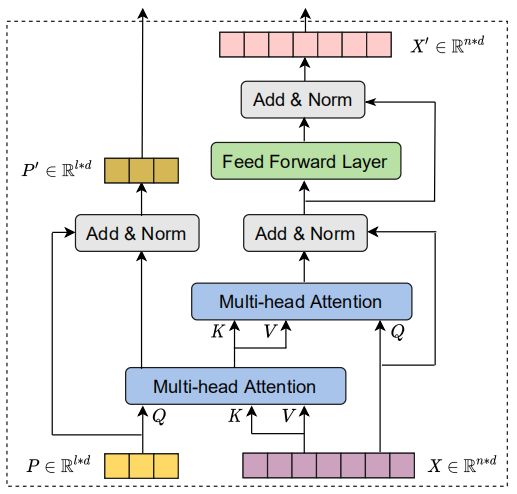
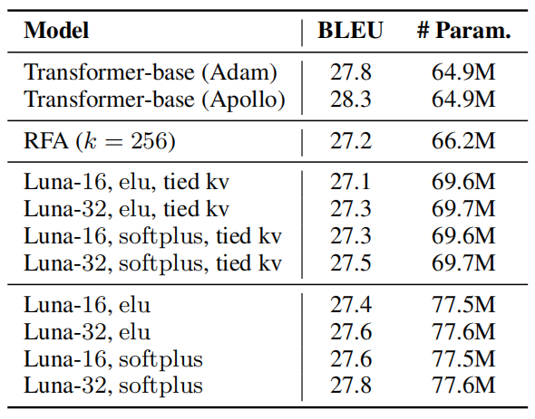
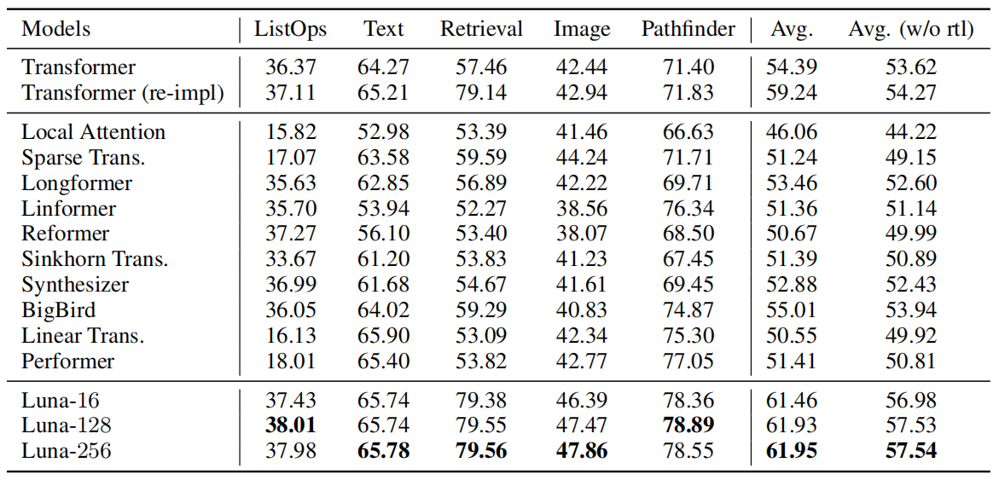
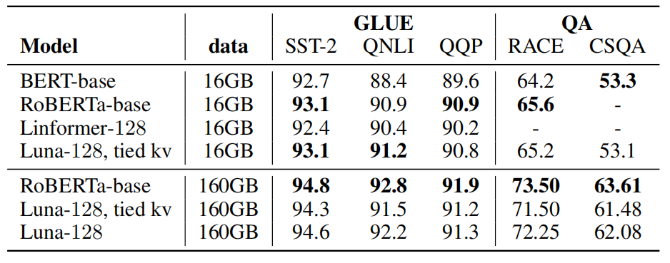
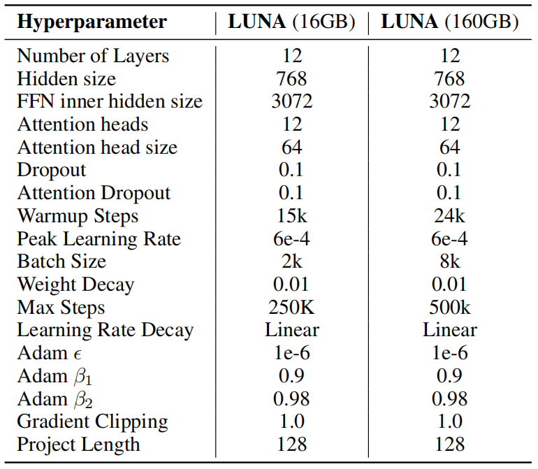

Luna stands for "Linear Unified Nested Attention" which is a novel
attention mechanism that yields linear time and space complexity as
opposed to standard attention mechanism proposed in the
[Transformer](https://anwarvic.github.io/machine-translation/Transformer)
architecture that yields quadratic time and space complexity. Luna was
proposed by FAIR in 2021 and published in the paper under the same name:
"[Luna: Linear Unified Nested
Attention](https://arxiv.org/pdf/2106.01540.pdf)". The official code
for this paper can be found in the following GitHub repository:
[fairseq-apollo](https://github.com/XuezheMax/fairseq-apollo).

    

As compared to other attention mechanism proposed by different models,
Luna achieves competitive or even better performance, while acquiring
prominent gains of efficiency in both speed and memory as shown in the
following figure:

    

Attention Recap
---------------

Before getting into Luna details, let's first recap the attention
mechanism. The traditional attention mechanism is a function of two
sequences: the query sequence $X \in \mathbb{R}^{n \times d}$ with
length $n$ and the context sequence $C \in \mathbb{R}^{m \times d}$ with
length $m$. And it outputs one sequence $Y \in \mathbb{R}^{n \times d}$
with the same length as the query $X$:

$$Y = \text{Attention}\left( X,\ C \right) = \text{softmax}\left( \frac{XW^{Q}\left( CW^{K} \right)^{T}}{\sqrt{d}} \right)CW^{V}$$

Where $d$ is the embedding dimension, and
$W^{Q},W^{K},W^{V} \in \mathbb{R}^{d \times d}$ are three learnable
parameters that project the input sequences into the space of query, key
and value matrices: $Q = XW^{Q},\ K = CW^{K},\ V = CW^{V}$ respectively.
Each head in the multi-head attention mechanism has different learnable
parameters.

> **Note:**\
In self-attention mechanism, $X = C$, where both come from either the
encoder or the decoder. In cross-attention, $X$ comes from the encoder
and $C$ comes from the decoder.

The matrix
$\text{softmax}\left( \frac{XW^{Q}\left( CW^{K} \right)^{T}}{\sqrt{d}} \right) \in \mathbb{R}^{n \times m}$
is called the "**attention matrix**" which specifies the alignment
scores between every pair of tokens in sequences of queries $X$ and
contexts $C$. Calculating the attention matrix takes
$O\left( \text{nm} \right)$ time and space, which is quadratic with
respect to the sequence length and becomes a significant bottleneck when
processing long sequences.

    

The other two key components of Transformer, besides attention, are
feed-forward networks (FFN) and layer normalization. Each Transformer
layer can be expressed as:

$$X_{A} = \text{LayerNorm}\left( \text{Attention}\left( X,\ C \right) + X \right)$$

$$X' = \text{LayerNorm}\left( \text{FFN}\left( X_{A} \right) + X_{A} \right)$$

Where $X'$ is the output of the transformer layer. Here, we used the
original post-layer normalization architecture which places layer
normalization after the residual connection.

Luna Attention
--------------

The key idea behind Luna attention is to decouple the attention function
mentioned above into two nested attention operations, both of which have
linear efficiency:

    

-   **Pack Attention:** Which packs the context sequence
    $C \in \mathbb{R}^{m \times d}$ into a fixed-length sequence
    $Y_{P} \in \mathbb{R}^{l \times d}$ with a fixed length $l$ using
    the standard attention function with $P \in \mathbb{R}^{l \times d}$
    as a query sequence (gonna explain where $P$ comes from in a
    second):

$$Y_{P} = \text{Attention}\left( P,\ C \right)$$

-   **Unpack Attention:** unpacks the sequence
    $Y_{P} \in \mathbb{R}^{l \times d}$ back to the length of the
    original query sequence $Y_{X} \in \mathbb{R}^{n \times d}$ using
    the same standard attention function:

$$Y_{X} = \text{Attention}\left( X,\ Y_{P} \right)$$

The complexity of pack attention and the unpack attention is
$O\left( \text{lm} \right)$ and $O\left( \ln \right)$ respectively which
is linear with respect to $m$ and $n$ respectively.

Now, the question is "how to get $P \in \mathbb{R}^{l \times d}$?". At
the first Luna layer, $P$ is created as a learnable positional
parameter. At other following layers, $P$ is calculated via the
following formula:

$$P^{+} = \text{LayerNorm}\left( Y_{P} + P \right)$$

Now, Luna layer, shown in the previous layer, is composed of the
following:

$$Y_{X},\ Y_{P} = \text{LunaAttention}\left( X,\ P,\ C \right)$$

$$X_{A},\ P_{A} = \text{LayerNorm}\left( Y_{X} + X \right),\ \text{LayerNorm}\left( Y_{P} + P \right)$$

$$X',\ P' = \text{LayerNorm}\left( \text{FFN}\left( X_{A} \right) + X_{A} \right),\ P_{A}$$

Experiments
-----------

To evaluate Luna on sequence-to-sequence modeling, they evaluated it on
WMT'14 English-German (EN→DE) machine translation dataset using BPE
vocabulary of 37K subwords. The Luna models was closely following the
architecture of Transformer-base: 6 encoder and decoder layers with 8
attention heads and model size of 512 and hidden size of 2048.

Unlike the Transformer-base, Luna was trained using Apollo optimizer
with learning rate of 0.1, $\beta = 0.9$ , and $\epsilon = 1e^{- 4}$.
For learning rate scheduling, they applied linear warm up the first 1000
steps. After learning rate warm up, they decayed the learning rate at
the 300,000 and 450,000 steps by decay rate 0.1. Gradient clips with 1.0
were applied. And the dropout ratio are set to 0.1. The weight decay
rate was set to $1e^{- 8}$.

The following table presents Luna results in comparison with Transformer
models trained using Adam and Apollo optimizers along with Random
Feature Attention (RFA) model. We can see that, Luna achieves similar
results to the Transformer model. Also, we note that Luna with softplus
activation function consistently outperforms ELU.

    

> **Note:**\
When saying Luna-16, we mean Luna where $l = 16$. Here, softplus and ELU
activation functions were used instead of the softmax in the attention
mechanism.

To evaluate the effectiveness of Luna on long sequences, they trained
Luna on the Long Range Arena (LRA) benchmark which consists of five
tasks, each designed for the purpose of evaluating Transformer models
under the long-context (from 1K to 8K tokens). The following table shows
that Luna outperforms baseline models on three out of five tasks and
performs comparably with the best performed model on the other two
tasks:

    

Also, Luna was pre-training on Masked Language Modeling (MLM) objective
and then fine-tuned on Natural Language Understanding downstream tasks
and was found out to have very similar results in comparison with
state-of-the-art models such as
[BERT](https://anwarvic.github.io/language-modeling/BERT) and
[RoBERTa](https://anwarvic.github.io/language-modeling/RoBERTa):

    

Luna-128 (16GB) was pre-trained on 16GB of monolingual data collected
from BookCorpus and English Wikipedia which is the same data used with
[BERT](https://anwarvic.github.io/language-modeling/BERT). Luna-128
(160GB) was pre-trained on 160GB of monolingual data collected from the
same sources in addition to CC-News, OpenWebText, and Stories which is
the same data used with
[RoBERTa](https://anwarvic.github.io/language-modeling/RoBERTa). The
following are the hyper-parameters used for pre-training Luna-128 (16GB
and 160GB):

    

