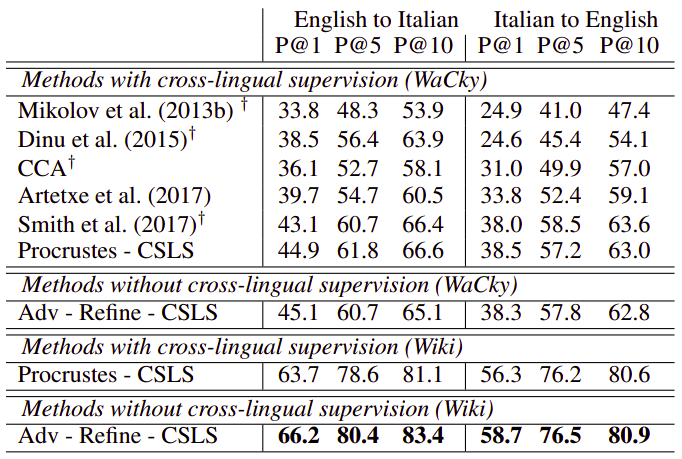
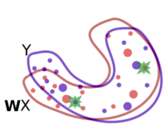
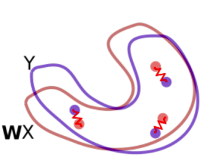
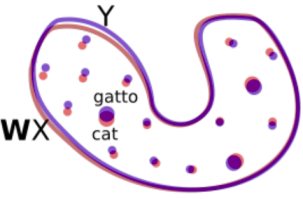

MUSE or "Multilingual Unsupervised and Supervised Embeddings" is a
framework created by Facebook AI in 2017 and published in this paper:
[Word Translation Without Parallel
Data](https://arxiv.org/pdf/1710.04087.pdf). The official implementation
of the framework can be found in this GitHub repository:
[MUSE](https://github.com/facebookresearch/MUSE).

From the name of the paper, we can see that MUSE is for <u><strong>word
translation</strong></u> not <u><strong>machine translation</strong></u> which shows that
MUSE is more of a look-up table (bilingual dictionary) rather than being
a machine translation model. The crazy part about MUSE is that It builds
bilingual dictionary between two languages without the use of any
parallel corpora. And despite that it outperforms supervised
state-of-the-art methods on English-Italian where metric is the average
precision over top 1, 5, 10 words respectively.

    

MUSE leverages adversarial training to learn that linear mapping from a
source to a target space and it operates in three steps as shown in the
following figure where there are two sets of embeddings trained
independently on monolingual data, English words in red denoted by
$\mathbf{X}$ and Italian words in blue denoted by $\mathbf{Y}$, which we
want to align/translate. In this figure, each dot represents a word in
that space where the dot size is proportional to the frequency of the
words in the training corpus.

    

MUSE focuses on learning a mapping $\mathbf{\text{WX}}$ between these
two sets such that translations are close in the shared space. It does
that in three steps:

1.  **Adversarial Model:**\
    Using adversarial learning, we learn a rotation matrix $\mathbf{W}$
    which roughly aligns the two distributions. The green stars are
    randomly selected words that are fed to the discriminator to
    determine whether the two word embeddings come from the same
    distribution.

    

2.  **Refinement Procedure:**\
    The mapping $\mathbf{W}$ is further refined via Procrustes. This
    method uses frequent words aligned by the previous step as anchor
    points, and minimizes an energy function that corresponds to a
    spring system between anchor points. The refined mapping is then
    used to map all words in the dictionary.

    

3.  **CSLS:**\
    Finally, we translate by using the mapping $\mathbf{W}$ and a
    distance metric (CSLS) that expands the space where there is high
    density of points (like the area around the word "cat"), so that
    "hubs" (like the word "cat") become less close to other word vectors
    than they would otherwise.

    

Adversarial Model
-----------------

Let $X = \left\\{ x_{1},\ ...x_{n} \right\\}$ and
$Y = \left\\{ y_{1},\ ...y_{m} \right\\}$ be two sets of $n$ and $m$ word
embeddings coming from a source and a target language respectively. An
adversarial setting formed as a two-player game where the two players
are:

-   <u><strong>Discriminator:</strong></u>\
    A classification model trained to distinguish between the mapped
    source embeddings $\mathbf{W}\mathbf{X}$ and the target embeddings
    $\mathbf{Y}$. The discriminator aims at maximizing its ability to
    identify the origin of an embedding.

$$\mathcal{L}_{D}\left( \theta_{D} \middle| W \right) = - \frac{1}{n}\sum_{i = 1}^{n}{\log P_{\theta_{D}}\left( \text{source} = 1 \middle| Wx_{i} \right)} - \frac{1}{m}\sum_{i = 1}^{m}{\log P_{\theta_{D}}\left( \text{source} = 0 \middle| y_{i} \right)}$$

-   <u><strong>W Mapping:</strong></u>\
    (Which can be seen as a generator) is model jointly trained to fool
    the discriminator by making $\mathbf{\text{WX}}$ and $\mathbf{Y}$ as
    similar as possible.

$$\mathcal{L}_{W}\left( W \middle| \theta_{D} \right) = - \frac{1}{n}\sum_{i = 1}^{n}{\log P_{\theta_{D}}\left( \text{source} = 0 \middle| Wx_{i} \right)} - \frac{1}{m}\sum_{i = 1}^{m}{\log P_{\theta_{D}}\left( \text{source} = 1 \middle| y_{i} \right)}$$

Where:

-   $\mathcal{L}_D$ is the discriminator loss while $\mathcal{L}_W$
    is the mapping loss.

-   $\theta_{D}$ is the discriminator parameters.

-   $W$ is the learned linear mapping.

-   $P_{\theta_{D}}\left( \text{source} = 1 \middle| z \right)$ is the
    probability that a vector $z$ is the mapping of a source embedding.
    And $P_{\theta_{D}}\left( \text{source} = 0 \middle| z \right)$ is
    the probability that a vector $z$ is the mapping of a target
    embedding.

Refinement Procedure
--------------------

The adversarial approach tries to align all words irrespective of their
frequencies. However, rare words are harder to align. Under the
assumption that the mapping is linear, it is then better to infer the
mapping using only the most frequent words as anchors. The mapping
$\mathbf{W}$ is further refined via Procrustes analysis which
advantageously offers a closed form solution obtained from the singular
value decomposition:

$$W^{*} = \underset{W \in O_{d}\left( \mathbb{R} \right)}{\arg\min}{\left\| WX - Y \right\|_{F} = UV^{T},\ \ \ \ \ \ \text{with }\text{U}\Sigma V^{T} = \text{SVD}\left( YX^{T} \right)}$$

This method uses frequent words aligned by the previous step as anchor
points, and minimizes an energy function that corresponds to a spring
system between anchor points. The refined mapping is then used to map
all words in the dictionary.

CSLS
----

CSLS stands for "Cross-Domain Similarity Local Scaling" which is a novel
metric proposed by the authors as a comparison metric between two
different language embeddings. Given a mapped source word embedding
$Wx_{s}$ and a target embedding $y_{t}$, the CSLS can be formulated as:

$$\text{CSLS}\left( Wx_{s},\ y_{t} \right) = 2\cos\left( Wx_{s},\ y_{t} \right) - r_{T}\left( Wx_{s} \right) - r_{S}\left( y_{t} \right)$$

$$r_{T}\left( Wx_{s} \right) = \frac{1}{K}\sum_{y_{t} \in \mathcal{N}_{T}\left( Wx_{s} \right)}^{}{\cos\left( Wx_{s},\ y_{t} \right)}$$

$$r_{S}\left( y_{t} \right) = \frac{1}{K}\sum_{Wx_{s} \in \mathcal{N}_{S}\left( y_{t} \right)}^{}{\cos\left( Wx_{s},\ y_{t} \right)}$$

Note that all $K$ elements of $\mathcal{N}\_{T}\left( Wx_{s} \right)$
are words from the target language and all $K$ elements of
$\mathcal{N}_{S}\left( y\_{t} \right)$ are mapped words from the
source language.

Training Details
----------------

-   They used unsupervised word vectors that were trained using
    fastText.

-   These correspond to monolingual embeddings of dimension 300 trained
    on Wikipedia corpora; therefore, the mapping $\mathbf{W}$ has size
    300×300.

-   Words are lower-cased, and those that appear less than 5 times are
    discarded for training.

-   As a post-processing step, they only considered the first 200k most
    frequent words.

-   For discriminator, they used a MLP with two hidden layers of size
    2048, and Leaky-ReLU activation functions with dropout of 0.1
    trained using stochastic gradient descent with a batch size of 32, a
    learning rate of 0.1 and a decay of 0.95 both for the discriminator
    and W mapping.
