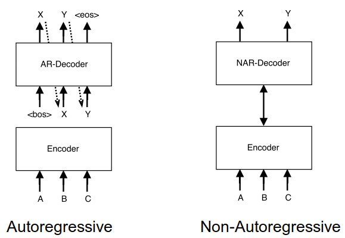

NAT, stands for "Non-Autoregressive Translation", is an NMT model that
avoids the autoregressive property of the decoding and produces its
outputs in parallel. NAT was created by Salesforce in 2018 and published
in their paper: "[Non-Autoregressive Neural Machine
Translation](https://arxiv.org/pdf/1711.02281.pdf)". The official code
for this paper can be found on the official Salesforce GitHub
repository: [nonauto-nmt](https://github.com/salesforce/nonauto-nmt).

Before getting into Non-Autoregressive model, let's first recap what is
an Autoregressive model. Given a source sentence
$X = \left( x_{1},\ ...x_{m} \right)$, an Autoregressive model the
distribution over possible output sentences
$Y = \left( y_{1},\ ...y_{n} \right)$ into a chain of conditional
probabilities with a an auto-regressive (left-to-right) manner:

$$p\left( Y \middle| X;\theta \right) = \prod_{t = 1}^{n}{p\left( y_{t} \middle| y_{0:t - 1},\ x_{1:m};\ \theta \right)}$$

Where the special tokens $y_{0} = \left\langle \text{bos} \right\rangle$
and $y_{n + 1} = \left\langle \text{eos} \right\rangle$ are used to
represent the beginning and end of all target sentences. These
conditional probabilities are parameterized using a neural network
$\theta$.

Now, let's get to the architecture proposed by this paper. The NAT
model, as shown in the following figure, is composed of the following
four modules: <u><strong>Encoder stack</strong></u>,
<u><strong>Decoder stack</strong></u>, a newly added
<u><strong>fertility predictor</strong></u>, and a <u><strong>translation
predictor</strong></u> for token decoding.

    

Encoder Stack
-------------

The encoder stays unchanged from the original Transformer network ☺.

Decoder Stack
-------------

To be able to parallelize the decoding process, the NAT needs to know
how long the target sentence will be. And since the target sentence
length is different but not that far from the source sentence, they
initialized the decoding process using copied source inputs from the
encoder side based on the word's "fertility".

Since we are processing the output as a whole, we no longer need the
masking before the self-attention. Instead, they only masked out each
query position only from attending to itself, which they found to
improve decoder performance relative to unmasked self-attention.

Also, they added a new block called "Multi-head Positional Attention" in
each decoder layer, which is a multi-head attention module with the same
general attention mechanism used in other parts of the Transformer
network:

$$A\text{ttention}\left( Q,K,\ V \right) = \text{softmax}\left( \frac{QK^{T}}{\sqrt{d_{\text{model}}}} \right)\text{.V}$$

This incorporates positional information directly into the attention
process and provides a stronger positional signal than the embedding
layer alone.

Fertility Predictor
-------------------

Fertilities are integers for each word in the source sentence that
correspond to the number of words in the target sentence that can be
aligned to that source word using a hard alignment algorithm like IBM
Model 2.

Using the fertility predictor and given a source sentence
$X = \left( x_{1},\ ...x_{m} \right)$, the condidtional probability
over possible output sentence $Y = \left( y_{1},\ ...y_{n} \right)$
is:

$$p\left( Y \middle| X;\theta \right) = \sum_{f_{1},\ ...f_{m} \in \mathcal{F}}^{}\left( \prod_{t = 1}^{m}{p_{F}\left( f_{t} \middle| x_{1:m};\ \theta \right)}.\prod_{t = 1}^{n}{p\left( y_{t} \middle| x_{1}\left\{ f_{1} \right\},\ ...x_{m}\left\{ f_{m} \right\};\ \theta \right)} \right)$$

Where:

-   $\mathcal{F} \in \left( f_{1},\ ...f_{m} \right)$ is the set of
    all fertility sequences, one fertility value per source token.
    Knowing that the sum of all fertility values is the length of the
    target sentence $\sum_{t = 1}^{m}f_{t} = n$.

-   $x\left\\{ f \right\\}$ denotes the source token $x$ repeated $f$
    times.

-   $p_{F}\left( f_{t} \middle| x_{1:m};\ \theta \right)$ is the
    fertility prediction model which is a one-layer neural network with
    a softmax classifier (L = 50 in our experiments) on top of the
    output of the last encoder layer. This models the way that fertility
    values are a property of each input word but depend on information
    and context from the entire sentence.

Translation Predictor
---------------------

At inference time, the model can identify the translation with the
highest conditional probability by marginalizing over all possible
latent fertility sequences. In other words, the optimal translation give
a source sentence $x$ and an optimal sequence of fertility values
$\widehat{f}$ is:

$$\widehat{Y} = G\left( x_{1:m},\ {\widehat{f}}_{1:m};\theta \right)$$

But searching and marginalizing over the whole fertility space is still
intractable. So, they proposed three heuristic decoding algorithms to
reduce the search space of the NAT model:

-   <u><strong>Argmax Decoding:</strong></u>\
    The optimal sequence of fertility value is the highest-probability
    fertility for each input word:

$${\widehat{f}}_{t} = \underset{f}{\arg\max}{p_{F}\left( f_{t} \middle| x_{1:m};\theta \right)}$$

-   <u><strong>Average Decoding:</strong></u>\
    The optimal sequence of fertility value is the the expectation of
    its corresponding softmax distribution:

$${\widehat{f}}_{t} = \text{Round}\left( \sum_{f_{t}}^{L}{p_{F}\left( f_{t} \middle| x_{1:m};\theta \right).f_{t}} \right)$$

-   <u><strong>Noisy parallel decoding (NPD):</strong></u>\
    A more accurate approximation of the true optimum of the target
    distribution is to draw samples from the fertility space and compute
    the best translation for each fertility sequence. We can then use
    the autoregressive teacher to identify the best overall translation:

$${\widehat{f}}_{t} = \underset{f_{t}\sim p_{F}}{\arg\max}{p\left( G\left( x_{1:m},\ f_{1:m};\theta \right) \middle| X;\theta \right)}$$

Training
--------

TO BE CONTINUED!!
