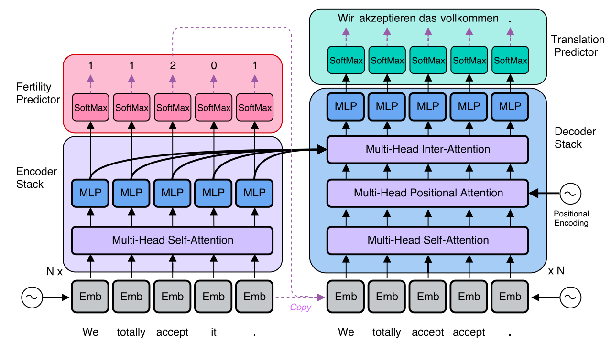
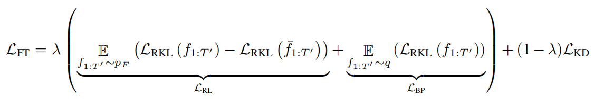
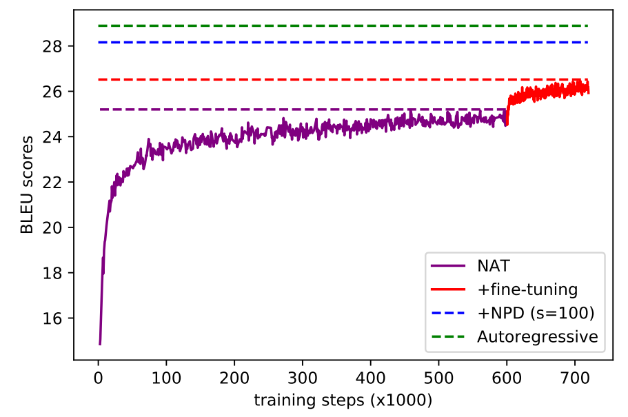
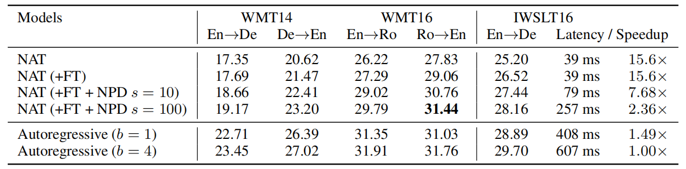
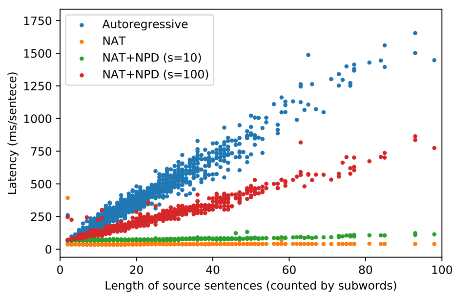
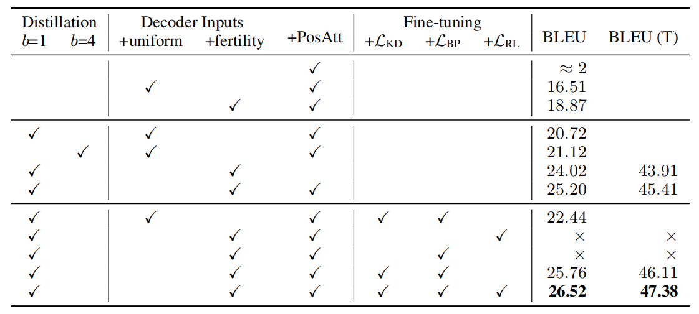

NAT, stands for "Non-Autoregressive Translation", is an NMT model that
avoids the autoregressive property of the decoding and produces its
outputs in parallel. NAT was created by Salesforce in 2017 and published
in their paper: "[Non-Autoregressive Neural Machine
Translation](https://arxiv.org/pdf/1711.02281.pdf)". The official code
for this paper can be found on the official Salesforce GitHub
repository: [nonauto-nmt](https://github.com/salesforce/nonauto-nmt).

Before getting into Non-Autoregressive model, let's first recap what is
an Autoregressive model. Given a source sentence
$X = \left( x_{1},\ ...x_{m} \right)$, an Autoregressive model factors the
distribution over possible output sentences
$Y = \left( y_{1},\ ...y_{n} \right)$ into a chain of conditional
probabilities with a an auto-regressive (left-to-right) manner as shown below:

$$p\left( Y \middle| X;\theta \right) = \prod_{t = 1}^{n}{p\left( y_{t} \middle| y_{0:t - 1},\ x_{1:m};\ \theta \right)}$$

Where the special tokens $y_{0} = \left\langle \text{bos} \right\rangle$
and $y_{n + 1} = \left\langle \text{eos} \right\rangle$ are used to
represent the beginning and end of all target sentences. These
conditional probabilities are parameterized using a neural network
$\theta$.

## NAT Architecture 

The autoregressive model corresponds to the word-by-word nature of human
language production and effectively captures the distribution of real
translations. That’s why they achieve state-of-the-art performance on
large-scale corpora. But there are also drawbacks such as individual steps of
the decoder must be run sequentially rather than in parallel which takes longer.
The NAT model proposed in this paper tries to solve that problem:

    

The NAT model, as shown in the following figure, is composed of the following
four modules: <u><strong>Encoder stack</strong></u>, <u><strong>Decoder stack
</strong></u>, a newly added <u><strong>fertility predictor</strong></u> added
at the end of the encoder stack, and a <u><strong>translation predictor
</strong></u> added at the end of the decoder stack.

    

### Encoder Stack

The encoder stays unchanged from the original Transformer network ☺.

### Decoder Stack

To be able to parallelize the decoding process, the NAT needs to know
how long the target sentence will be. And since the target sentence
length is different but not that far from the source sentence, they
initialized the decoding process using copied source inputs from the
encoder side based on the word's "fertility".

Since we are processing the output as a whole, we no longer need the
masking before the self-attention. Instead, they only masked out each
query position only from attending to itself, which they found to
improve decoder performance relative to unmasked/standard  self-attention.

Also, they added a new block called "<u><strong>Multi-head Positional
Attention</strong></u>" in each decoder layer, which is a multi-head attention
module with the same general attention mechanism used in other parts of the
Transformer network:

$$\text{Attention}\left( Q,K,\ V \right) = \text{softmax}\left( \frac{QK^{T}}{\sqrt{d_{\text{model}}}} \right)\text{.V}$$

This incorporates positional information directly into the attention
process and provides a stronger positional signal than the embedding
layer alone.

### Fertility Predictor

Words’ fertility are integers for each word in the source sentence that 
correspond to the number of words in the target sentence that can be aligned to
that source word if a hard alignment algorithm was used (like
[IBM Models](https://aclanthology.org/J93-2003.pdf) for example).

Using the fertility predictor and given a source sentence
$X = \left( x_{1},\ ...x_{m} \right)$, the conditional probability
over the possible output sentence $Y = \left( y_{1},\ ...y_{n} \right)$ is:

$$p\left( Y \middle| X;\theta \right) = \sum_{f_{1},\ ...f_{m} \in \mathcal{F}}^{}\left( \prod_{t = 1}^{m}{p_{F}\left( f_{t} \middle| x_{1:m};\ \theta \right)}.\prod_{t = 1}^{n}{p\left( y_{t} \middle| x_{1}\left\{ f_{1} \right\},\ ...x_{m}\left\{ f_{m} \right\};\ \theta \right)} \right)$$

Where:

-   $\mathcal{F} \in \left( f_{1},\ ...f_{m} \right)$ is the set of
    all fertility sequences, one fertility value per source token.
    Knowing that the sum of all fertility values is the length of the
    target sentence:

$$\sum_{t = 1}^{m}f_{t} = n$$

-   $p_{F}\left( f_{t} \middle| x_{1:m};\ \theta \right)$ is the
    fertility prediction model which is a one-layer neural network with
    a softmax classifier ($L = 50$  in these experiments) on top of the
    output of the last encoder layer. This models the way that fertility
    values are a property of each input word but depend on information
    and context from the entire sentence.

-   $x\left\\{ f \right\\}$ denotes the source token $x$ repeated
    $f$ times.

### Translation Predictor

At inference time, the model can identify the translation with the highest
conditional probability by marginalizing over all possible latent fertility
sequences. In other words, the optimal output translation sequence given a
source sentence $x$ and an optimal sequence of fertility values $\widehat{f}$
is:

$$\widehat{Y} = G\left( x_{1:m},\ {\widehat{f}}_{1:m};\theta \right)$$

As seen from the previous equation, finding an optimal output translation
sequence heavily depends on the fertility values. To search over the whole
fertility space is a big task. So, they proposed three heuristic decoding
algorithms to reduce the search space of the NAT model given the fertility
distribution $p_{F}$:

-   <u><strong>Argmax Decoding:</strong></u>\
    The optimal sequence of fertility value is the highest-probability
    fertility for each input word:

$${\widehat{f}}_{t} = \underset{f}{\arg\max}{p_{F}\left( f_{t} \middle| x_{1:m};\theta \right)}$$

-   <u><strong>Average Decoding:</strong></u>\
    The optimal sequence of fertility value is the the expectation of
    its corresponding softmax distribution ($L = 50$  in these experiments):

$${\widehat{f}}_{t} = \text{Round}\left( \sum_{f_{t}=1}^{L}{p_{F}\left( f_{t} \middle| x_{1:m};\theta \right).f_{t}} \right)$$

-   <u><strong>Noisy parallel decoding (NPD):</strong></u>\
    A more accurate approximation of the true optimum of the target
    distribution is to draw samples from the fertility space and compute
    the best translation for each fertility sequence. We can then use
    the autoregressive teacher to identify the best overall translation:

$${\widehat{f}}_{t} = \underset{f_{t}\sim p_{F}}{\arg\max}{p_{AR}\left( G\left( x_{1:m},\ f_{1:m};\theta \right) \middle| X;\theta \right)}$$

Loss Function
-------------

Given a source sentence $X = \left\{ x_{1},\ ...x_{m} \right\}$, a
target sequence $Y = \left\{ y_{1},\ ...y_{n} \right\}$ and a fertility
values $f_{1:m}$, the loss function of the NAT model $\mathcal{L}$ can
be described below:

$$\mathcal{L} = log\sum_{f_{1:m} \in \mathcal{F}}^{}{p_{F}\left( f_{1:m} \middle| x_{1:m};\ \theta \right)\text{.p}\left( y_{1:n} \middle| x_{1:m};\theta \right)}$$

The resulting loss function allows us to train the entire model in a
supervised fashion, using the inferred fertilities to simultaneously
train the translation model $p$ and supervise the fertility neural
network model $p_{F}$.

> **Note:**\
There are two possible options that can be used as labels for the the
fertility network. The first is an external aligner, which produces a
deterministic integer fertilities for each (source, target) pair in a
training corpus. The second option is the attention weights used in an
autoregressive teacher model.

After training the NAT model to convergence, they proposed a fine-tuning
step where they freeze a trained autoregressive teacher model while
train the NAT model on its soft labels. This introduced an additional
loss term consisting of the reverse K-L divergence with the teacher
output distribution:

$$\mathcal{L}_{\text{RKL}}\left( f_{1:m};\ \theta \right) = \sum_{t = 1}^{n}{\sum_{y_{t}}^{}\left\lbrack \text{log\ }p_{\text{AR}}\left( y_{t} \middle| {\widehat{y}}_{1:t},\ x_{1:m} \right).p_{\text{NA}}\left( y_{t} \middle| x_{1:m},\ f_{1:m};\theta \right) \right\rbrack}$$

Where $p_{\text{AR}}$ is the probability distribution of the
autoregressive teacher model, while $p_{\text{NA}}$ is the probability
distribution of the NAT model. ${\widehat{y}}_{1:t}$ is the optimal
output sequence which equals to
$G\left( x_{1:m},\ f_{1:m};\theta \right)$. Such a loss is more
favorable towards highly peaked student output distributions than a
standard cross-entropy error would be.

Then they trained the whole model jointly with a weighted sum
($\lambda = 0.25$) of the original distillation loss and two such terms,
one an expectation over the predicted fertility distribution, normalized
with a baseline, and the other based on the external fertility inference
model:

    

Where ${\overline{f}}_{1:m}$ is the average fertility computed by the
average decoding discussed before. The gradient with respect to the
non-differentiable $\mathcal{L}_{\text{RL}}$ term can be estimated with
REINFORCE, while term $\mathcal{L}_{\text{BP}}$ can be trained using
ordinary back-propagation

As seen from the below figure, using fine-tuning with a teacher model
really helps improving the NAT model's performance:

    

Results
-------

Experiments were run on three widely used public machine translation
corpora: [IWSLT16 En-De](https://wit3.fbk.eu/), [WMT14
En-De](http://www.statmt.org/wmt14/translation-task), and [WMT16
En-Ro](http://www.statmt.org/wmt16/translation-task). All the data are
tokenized using byte-pair encoding (BPE). For WMT datasets, BPE
vocabulary were shared; for IWSLT, they used separate vocabulary.
Additionally, they shared encoder and decoder word embeddings only in
WMT experiments.

NAT model was initialized using the teacher model. The teacher model is a
standard [Transformer](https://anwarvic.github.io/machine-translation/Transformer)
architecture with base configurations on the WMT dataset and smaller set
of hyper-parameters when trained on IWSLT dataset since it's smaller
than WMT. The two sets of configuration can be seen below:

 

<table>
    <thead>
        <tr>
            <th></th>
            <th>$$N$$</th>
            <th>$$d_{m}$$</th>
            <th>$$d_{\text{ff}}$$</th>
            <th>$$h$$</th>
            <th>$$\epsilon_{l_{s}}$$</th>
            <th>Warmup steps</th>
        </tr>
    </thead>
    <tr>
        <td><strong>WMT</strong></td>
        <td>6</td>
        <td>512</td>
        <td>2048</td>
        <td>8</td>
        <td>0</td>
        <td>10k</td>
    </tr>
    <tr>
        <td><strong>IWSLT</strong></td>
        <td>5</td>
        <td>287</td>
        <td>507</td>
        <td>8</td>
        <td>0</td>
        <td>746</td>
    </tr>
</table>

The following table shows the BLEU scores on official test sets
(newstest2014 for WMT En-De and newstest2016 for WMT En-Ro) and the
development set for IWSLT. The NAT models without NPD use argmax
decoding and latency is computed as the time to decode a single sentence
without mini-batching, averaged over the whole test set:

    

As seen from the previous table, the NAT performs between 2-5 BLEU
points worse than its autoregressive teacher across all three datasets.

The translation latency, computed as the time to decode a single
sentence without mini-batching, for each sentence in the IWSLT
development set as a function of its length. The autoregressive model
has latency linear in the decoding length, while the latency of the NAT
is nearly constant for typical lengths:

    

They also conducted an extensive ablation study with the proposed NAT on
the IWSLT dataset. First, they noted that the model fails to train when
provided with only positional embeddings as input to the decoder.
Second, they found out using teacher model really helps. Third, the
fertility-based copying improves performance by four BLEU points when
using ground-truth training or two when using distillation.

    

