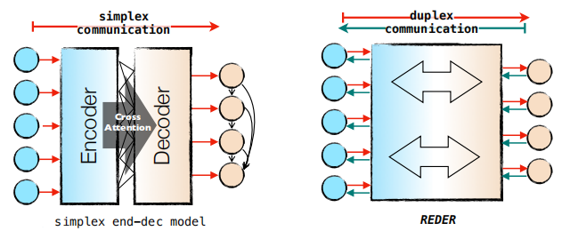
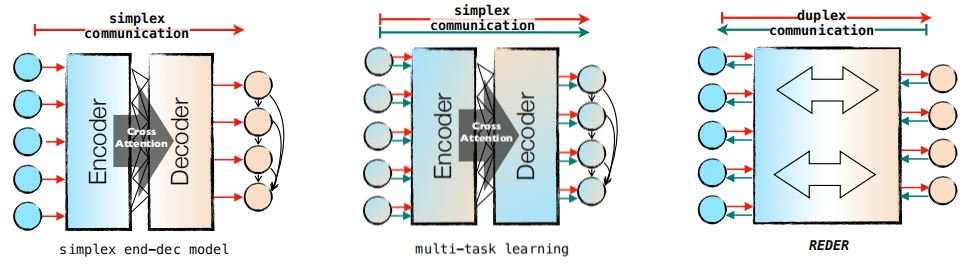
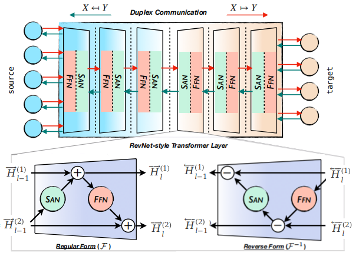
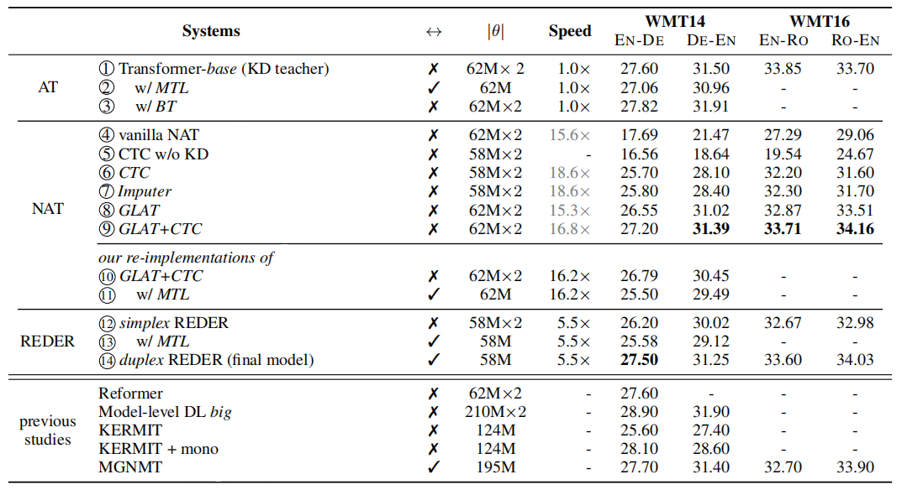
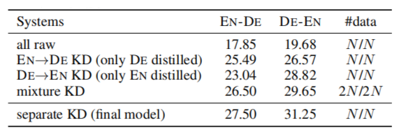
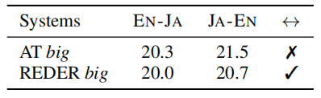

REDER stands for "**Re**versible **D**uplex Transform**er**" which is a
[Transformer](https://anwarvic.github.io/machine-translation/Transformer)
model where its both ends can simultaneously input and output a distinct
language thus enabling reversible machine translation by simply flipping
the input and output ends. REDER was proposed by ByteDance AI lab in
2022 and published in their paper: [Duplex Sequence-to-Sequence Learning
for Reversible Machine
Translation](https://arxiv.org/pdf/2105.03458.pdf). The official code
for this paper can be found in the following GitHub repository:
[REDER](https://github.com/zhengzx-nlp/REDER).

    

In this paper, they proposed an alternative approach for utilizing
bidirectional supervisions called <u><strong>duplex sequence-to-sequence</strong></u>
learning which is better than the typical sequence-to-sequence learning
where the encoder learns to represent the source language and the
decoder learns to generate the target language, and multi-task learning
where the encoder learns to represent multiple language simultaneously
while the decoder learns to generate multiple language simultaneously.

    

> **Note:**\
The name "Duplex" comes from telecommunications and computer networking
where the "simplex" communication means the communication channel is
unidirectional while the "duplex" communication is bidirectional.

We should note that building duplex seq2seq networks is non-trivial; and
that's because of the following reasons:

-   <u><strong>Reversibility:</strong></u>\
    Typical encoder-decoder networks such as Transformers are
    irreversible, i.e., one cannot just obtain its inverse function by
    flipping the same encoder-decoder network.

-   <u><strong>Homogeneity:</strong></u>\
    The decoder works autoregressively, while the encoder works in a
    non-autoregressive manner.

That's why REDER is designed without explicit encoder and decoder division
introducing two solutions (**Reversible Duplex Transformer** layers and
the **Symmetric Network** architecture) to address the reversibility and
homogeneity issues respectively as we are going to see next.

Reversible Duplex Transformer Layer
-----------------------------------

The following figure shows the overall architecture of REDER where we
can see that it has two ends: the source end (left) and the target end
(right). As illustrated, REDER is composed of a series of identical
Reversible Duplex Transformer layers. Since the network has two ends, it
defines a forward mapping function
$f_{\theta}^{\rightarrow}:X \rightarrow Y$ and a reverse mapping
function $f_{\theta}^{\leftarrow}:Y \rightarrow X$ that satisfy the
following reversibility:
$f_{\theta}^{\rightarrow} = \left( f_{\theta}^{\leftarrow} \right)^{- 1}$
and
$f_{\theta}^{\leftarrow} = \left( f_{\theta}^{\rightarrow} \right)^{- 1}$.

    

The Reversible Duplex Transformer layer is adopted from the Reversible
Networks (RevNet) where each layer is composed of two sub-layers: a
multi-head self-attention (SAN) and a feed-forward network (FFN) with a
special reversible design to ensure a duplex behavior.

Given a sentence pair $\left( x,y \right)$, the inner representations of
each layer in divided into two directions:

-   The forward direction $\overrightarrow{H}_l$ which is the
    concatenation of two halves
    $\left\lbrack \overrightarrow{H}_l^{\left( 1 \right)},\ \overrightarrow{H}_l^{\left( 2 \right)} \right\rbrack$:

$${\overrightarrow{H}}_{l} = F_{l}\left( \left\lbrack {\overrightarrow{H}}_{l - 1}^{\left( 1 \right)},\ {\overrightarrow{H}}_{l - 1}^{\left( 2 \right)} \right\rbrack \right) = \left\lbrack {\overrightarrow{H}}_{l}^{\left( 1 \right)},\ {\overrightarrow{H}}_{l}^{\left( 2 \right)} \right\rbrack$$

$${\overrightarrow{H}}_{l}^{\left( 1 \right)} = {\overrightarrow{H}}_{l - 1}^{\left( 1 \right)} + \text{SAN}\left( {\overrightarrow{H}}_{l - 1}^{\left( 2 \right)} \right)$$

$${\overrightarrow{H}}_{l}^{\left( 2 \right)} = {\overrightarrow{H}}_{l - 1}^{\left( 2 \right)} + \text{FFN}\left( {\overrightarrow{H}}_{l}^{\left( 1 \right)} \right)$$

-   The backward direction $\overleftarrow{H}_l$ which is the
    concatenation of two halves
    $\left\lbrack \overleftarrow{H}_l^{\left( 1 \right)},\ \overrightarrow{H}_l^{\left( 2 \right)} \right\rbrack$:

$${\overleftarrow{H}}_{l - 1} = F_{l}^{- 1}\left( \left\lbrack {\overleftarrow{H}}_{l}^{\left( 1 \right)},\ {\overleftarrow{H}}_{l}^{\left( 2 \right)} \right\rbrack \right) = \left\lbrack {\overleftarrow{H}}_{l - 1}^{\left( 1 \right)},\ {\overleftarrow{H}}_{l - 1}^{\left( 2 \right)} \right\rbrack$$

$${\overleftarrow{H}}_{l - 1}^{\left( 2 \right)} = {\overleftarrow{H}}_{l}^{\left( 2 \right)} + FFN\left( {\overleftarrow{H}}_{l}^{\left( 1 \right)} \right)$$

$${\overleftarrow{H}}_{l - 1}^{\left( 1 \right)} = {\overleftarrow{H}}_{l}^{\left( 1 \right)} + \text{SAN}\left( {\overleftarrow{H}}_{l - 1}^{\left( 2 \right)} \right)$$

> **Note:**\
The attention mechanism used in this paper is a relative self-attention
proposed in the "[Self-attention with relative position
representations](https://www.aclweb.org/anthology/N18-2074)" paper,
instead of the original one proposed in the Transformer paper.

Symmetric Network
-----------------

As discussed earlier, using reversible duplex transformer layers solves
the reversibility problem. Now, let's see how to solve the Homogeneity
problem. To achieve homogeneous computations, the model must satisfy the
following cycle consistency:

$$\forall x \in X:f_{\theta}^{\leftarrow}\left( f_{\theta}^{\rightarrow}\left( x \right) \right) = x,\ \ \ \ \ \ \ \ \forall y \in Y:f_{\theta}^{\rightarrow}\left( f_{\theta}^{\leftarrow}\left( y \right) \right) = y$$

One solution is to make the network symmetric which can be done as
follows: given an network of $L$ layers, the layers starting from $1$
till $\frac{L}{2}$ will be in reverse form, whereas the layers starting
from $\frac{L}{2} + 1$ to $L$ be in regular form:

$$f_{\theta}^{\rightarrow}\left( x \right) \triangleq F_{1}^{- 1} \circ \text{...} \circ F_{\frac{L}{2}}^{- 1} \circ F_{\frac{L}{2} + 1} \circ \text{...} \circ F_{L}\left( x \right)$$

$$f_{\theta}^{\leftarrow}\left( y \right) \triangleq F_{L} \circ \text{...} \circ F_{\frac{L}{2} + 1} \circ F_{\frac{L}{2}}^{- 1} \circ \text{...} \circ F_{1}^{- 1}\left( y \right)$$

And this property means that the REDER model works in a fully
non-autoregressive fashion in both reading and generating sequences.
Specifically, given an input sequence
$x = \left( x_{1},\ ...x_{n} \right)$, the i-th element of REDER's input
$x_{i}$ is the concatenation of two copies of the embedding of $x_{i}$
as shown below:

$${\overrightarrow{H}}_{0,i} = \left\lbrack {\overrightarrow{H}}_{0,i}^{\left( 1 \right)},\ {\overrightarrow{H}}_{0,i}^{\left( 2 \right)} \right\rbrack = \left\lbrack e\left( x_{i} \right),\ e\left( x_{i} \right) \right\rbrack$$

Once the forward computation is done, the concatenation of the output of
the model 
$\left\lbrack {\overrightarrow{H}}\_{L,i}^{\left( 1 \right)},\ {\overrightarrow{H}}\_{L,i}^{\left( 2 \right)} \right\rbrack$
serves as the representations of target translation after a softmax
operation is performed to measure the similarity between itself and the
concatenated embedding of ground-truth reference
$\left\lbrack e\left( y_{i} \right),\ e\left( y_{i} \right) \right\rbrack$
to obtain the prediction probability:

$$p\left( y_{i} \middle| x;\ \theta \right) = \text{softmax}\left( \frac{1}{2}{\left\lbrack e\left( y_{i} \right),\ e\left( y_{i} \right) \right\rbrack\ }^{T}.\left\lbrack {\overrightarrow{H}}_{L,i}^{\left( 1 \right)},\ {\overrightarrow{H}}_{L,i}^{\left( 2 \right)} \right\rbrack \right)$$

Objective Function
------------------

Given a parallel dataset
$\mathcal{D}\_{x,y} = \left( x^{\left( n \right)},\ y^{\left( n \right)} \right)_{n = 1}^{N}$
,the final objective of REDER is to minimize the following objective
function:

$$\mathcal{L}\left( \theta;\mathcal{D}_{x,y} \right) = \sum_{n = 1}^{N}\left( - \log\left( p_{\text{ctc}}\left( y^{\left( n \right)} \middle| x^{\left( n \right)};\theta \right) \right) - log\left( p_{\text{ctc}}\left( x^{\left( n \right)} \middle| y^{\left( n \right)};\theta \right) \right) + \lambda_{\text{fba}}\mathcal{L}_{\text{fba}}\left( x^{\left( n \right)} \middle| y^{\left( n \right)};\theta \right) + \lambda_{\text{fba}}\mathcal{L}_{\text{fba}}\left( y^{\left( n \right)} \middle| x^{\left( n \right)};\theta \right) + \lambda_{\text{cc}}\mathcal{L}_{\text{cc}}\left( x^{\left( n \right)};\theta \right) + \lambda_{\text{cc}}\mathcal{L}_{\text{cc}}\left( y^{\left( n \right)};\theta \right) \right)$$

Where:

-   $p_{\text{ctc}}\left( y^{\left( n \right)} \middle| x^{\left( n \right)};\theta \right)$
    is the CTC loss of the forward direction, while
    $p_{\text{ctc}}\left( x^{\left( n \right)} \middle| y^{\left( n \right)};\theta \right)$
    is the CTC loss of the backward direction.

-   $\mathcal{L}\_{\text{fba}}\left( x^{\left( n \right)} \middle| y^{\left( n \right)};\theta \right)$
    is the forward-backward agreement of the forward direction, while
    $\mathcal{L}\_{\text{fba}}\left( y^{\left( n \right)} \middle| x^{\left( n \right)};\theta \right)$
    is the forward-backward agreement of the backward direction. This
    loss function is calculated via the following formula knowing that
    $sg()$ is the stop-gradient operation:

$$\mathcal{L}_{\text{fba}}\left( x \middl| y;\theta \right) = \frac{1}{L}\sum_{l = 1}^{L}{1 - \cos\left( {\overrightarrow{H}}_{l},\ \text{sg}\left( {\overleftarrow{H}}_{l} \right) \right)}$$

-   $\mathcal{L}\_{\text{cc}}\left( x^{\left( n \right)};\theta \right)$
    is the cycle consistency loss of the forward direction, while
    $\mathcal{L}\_{\text{cc}}\left( y^{\left( n \right)};\theta \right)$
    is the cycle consistency of the backward direction. This loss
    function is calculated via the following formula:

$$\mathcal{L}_{\text{cc}}\left( x;\theta \right) = distance\left( x,\ f_{\theta}^{\leftarrow}\left( f_{\theta}^{\rightarrow}\left( x \right) \right) \right)$$

-   $\lambda_{\text{fba}}$ and $\lambda_{\text{cc}}$ are the
    coefficients of the auxiliary losses.

> **Note:**\
Training REDER is done in a a two-stage training setting, where we first train
REDER without using any auxiliary losses until a predefined number of updates,
and then activate the additional losses and continue training the model until
convergence.

Experiments
-----------

In the paper, they evaluated REDER on two standard translation
benchmarks: WMT14 English↔German (4.5M training pairs), and WMT16
English↔Romanian (610K training pairs). REDER was implemented using
[fairseq](https://github.com/pytorch/fairseq) framework and it consists
of $12$ stacked layers. The number of head is $8$, the model dimension
is $512$, and the FFN is $2048$. For regularization, they used a dropout
rate of $0.1$ and L2-regularization of $0.01$ and label smoothing with
$\epsilon = 0.1$. Also, they both $\lambda_{\text{fba}}$ and
$\lambda_{\text{cc}}$ to $0.1$ for all experiments. All models were
trained for 300K updates with a batch size of approximately 64K tokens.
For scoring, they average the best 5 checkpoints to obtain the final
model.

The following table shows the a comparison between REDER and other
existing models knowing that all NAT models were trained with Knowledge
Distillation (KD), also "MTL" stands for "multitask learning" and "BT"
stands for "back-translation". (row 4 ∼ row 9) employ greedy decoding
while (row 10 ∼ row 14) employ beam search decoding with beam size of
20.

    

From the previous table we can see:

-   REDER achieves competitive results compared with strong NAT
    baselines.

-   Duplex learning has more potential than multitask learning and
    back-translation.

-   REDER performs on par with autoregressive Transformer

Like other NAT approaches, they found out that REDER heavily relies
on knowledge distillation. The following table shows that the
accuracy of REDER without KD significantly drops:

    

To examine whether REDER can generalize to distant languages, they
conducted experiments on WMT20 English↔Japanese dataset. The
following table shows that REDER can achieve very close results
compared with Auto-regressive Transformer (AT) in such a large-scale
scenario with distant languages:

    

