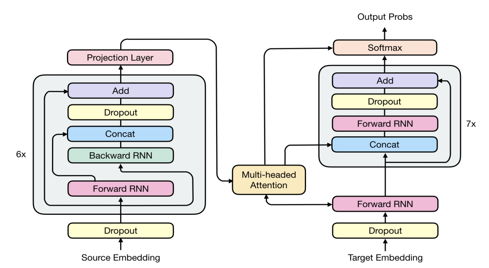
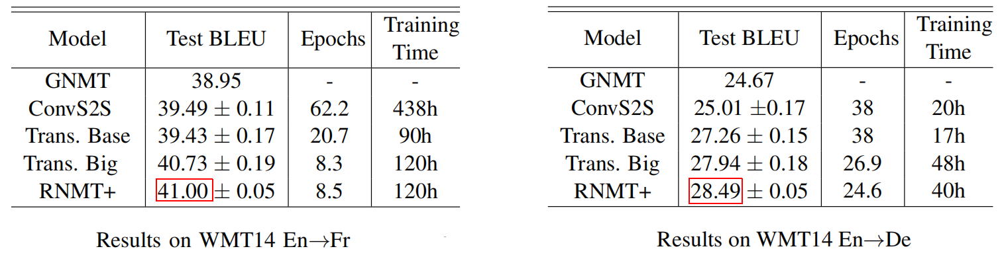
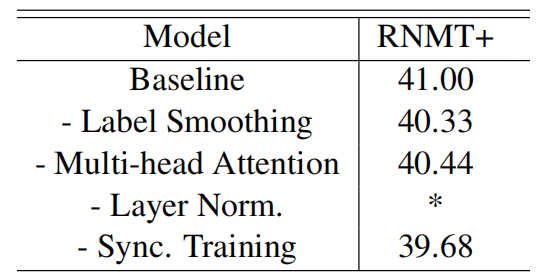
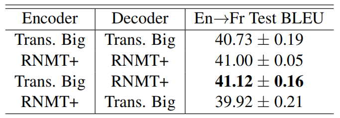
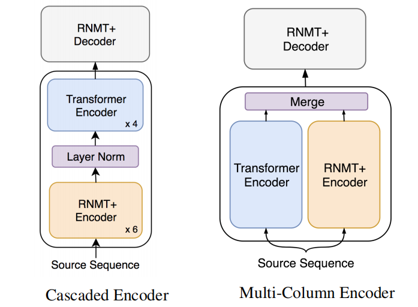
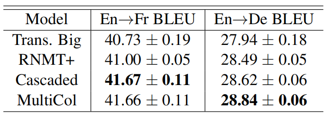

RNMT stands for "RNN N-based Neural Machine Translation models" which
are the models that used recurrent networks in the architecture. RNMT+
is an enhanced version of RNMT models proposed by Google AI in 2018 and
published in their paper: [The Best of Both Worlds: Combining Recent
Advances in Neural Machine
Translation](https://arxiv.org/pdf/1804.09849.pdf). In this paper, the
researchers took a step back and looked at techniques and methods that
contributed significantly to the success of recent models and tried to
apply them to the RNMT model resulting in RNMT+.

Architecture
------------

RNMT+ is a new architecture -as shown below- that was built using
different components borrowed from different previous architectures like
[RNN](https://anwarvic.github.io/machine-translation/RNN),
[ConvS2S](https://anwarvic.github.io/machine-translation/ConvS2S), and
[Transformers](https://anwarvic.github.io/machine-translation/Transformer).
These modifications made the model significantly outperform all
individual architectures.

RNMT+ consists of 6 bidirectional LSTM layers in the encoder. For each
bidirectional layer, the outputs of the forward layer and the backward
layer are concatenated before being fed into the next layer. The decoder
network consists of 8 unidirectional LSTM layers. Residual connections
are added to the third layer and above for both the encoder and decoder.
RNMT+ has $1024$ LSTM nodes in all encoder and decoder layers. The input
embedding dimension is $1024\ $as well

    

Inspired by the Transformer model, per-gate layer normalization is
applied within each LSTM cell which greatly stabilizes training. No
non-linearity is applied to the LSTM output. A projection layer is added
to the encoder final output. Multi-head additive attention is used
instead of the single-head attention other RNMT models. In addition to
feeding the attention context to all decoder LSTM layers, it is also fed
to the softmax.

Regarding regularization, they used the following techniques:

-   **Dropout:** They applied dropout to both embedding layers and each
    LSTM layer output before it is added to the next layer's input.
    Attention dropout is also applied.

-   **Label Smoothing:** They used uniform label smoothing with an
    $uncertainty = 0.1$.

-   **L2 Regularization:** L2 regularization (weight Decay) was applied
    only for WMT'14 En→De task as the corpus is smaller and thus more
    regularization is required.

Experiments
-----------

All experiments of this paper compared RNMT+ with ConvS2S and
Transformers. They were done on the standard WMT'14 En→Fr and En→De
datasets. Each sentence was tokenized using Moses tokenizer and then
encoded using Wordpiece Model. A shared vocabulary of 32K sub-word units
for each source-target language pair was used. They used newstest 2014
for testing and a combination of newstest 2012 and newstest 2013 for
validation.

For training, they used We use Adam optimizer with
$\beta_{1} = 0.9,\ \beta_{2} = 0.999,\ \epsilon = 10^{- 6}$ and varied
the learning rate according to the following schedule:

$$lr = 10^{- 4}*min\left( 1 + \frac{t*\left( n - 1 \right)}{n*p},\ n,\ n*\left( 2n \right)^{\frac{s - n*t}{e - s}} \right)$$

Where $t$ is the current step, $n$ is the number of concurrent model
replicas used in training, $p = 500$ is the number of warm-up steps,
$s = 600,000$ is the start step of the exponential decay, and
$e = 1,200,000$ is the end step of the decay. Specifically, they first
increased the learning rate linearly during the number of warm-up steps,
kept it a constant until the decay's start step $s$, then exponentially
decayed it until the decay end step $e$, and kept it at $5*10^{- 5}$
after the decay ends.

> **Note:**\
In order to ensure a fair setting for comparison, they implemented all
architectures using the same framework, the same pre-processed data and
evaluation methodology for all our experiments. The only thing changes
was the batch size: RNMT+ used $4096$ sentence pairs while ConvS2S and
Transformer used $65536$.

The following table shows that RNMT+ slightly performs better than the
Transformer-Big model on both WMT14 En→Fr (left table) and En→De (right
table) tasks. Note that the numbers before and after '$\pm$' are the
mean and standard deviation of test BLEU score over an evaluation
window.

    

The following table shows RNMT+ performance after removing each one of
the most important techniques used in the model independently. The
results shown below were obtained by averaging BLEU scores on WMT'14 En
→ Fr test set. An asterisk '\*' indicates an unstable training. From the
table, we can see that **layer normalization** is most critical
component to stabilize the training process.

    

Hybrid Models
-------------

In an encoder-decoder architecture, a natural assumption is that the
role of an encoder is to build feature representations that can best
encode the meaning of the source sequence, while a decoder should be
able to process and interpret the representations from the encoder and,
at the same time, track the current target history.

So, they tried to find out which model out of the two models
(Transformer-Big & RNMT+) has the best encoder and the best decoder.
They did that by combining the encoder from a certain model and the
decoder from the other model. The following table shows that the
Transformer-big architecture has the best encoder while RNMT+ has the
best decoder.

    

> **Note:**\
They tried to add ConvS2S to the past experiment, but it took a lot of
time to train it and the results weren't promising. So, they skipped it.

Better Encoder
--------------

Lastly, they tried to mix the RNMT+ encoder with the Transformer encoder
to produce a new architecture for the encoder that combines the best
things from the two models that could result in richer feature
representations. They tried two different architectures (as shown
below):

    

-   <u><strong>Cascaded Encoder:</strong></u>\
    The cascaded encoder aims at combining the representational
    power of RNNs and self-attention. The idea is to enrich a set of
    stateful representations by cascading a feature extractor with a
    focus on vertical mapping. The transformer encoder is fine-tuned
    while the RNMT+ encoder is frozen.

-   <u><strong>Multi-Column Encoder:</strong></u>\
    A multi-column encoder merges the outputs of several independent
    encoders into a single combined representation. They found out the
    best way to merge these outputs into a single representation is by a
    simple concatenation of individual column outputs.

According to the following table, the <u><strong>cascaded encoder</strong></u>
improves over the Transformer encoder by more than 0.5 BLEU points on the WMT'14
En→Fr task which suggests that the Transformer encoder is able to extract richer
representations if the input is augmented with sequential context. On the other
hand, the **multi-column encoder** followed by an RNMT+ decoder achieves better
results on WMT'14 En→De task.

    

