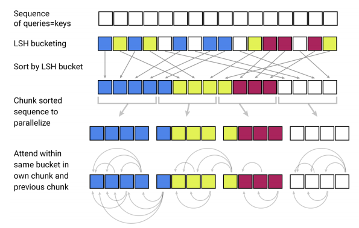
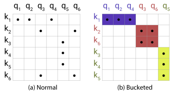
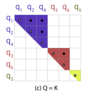
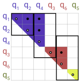

Reformer is an efficient version of the transformers proposed by Google
Research in 2020 and published in this paper: "[Reformer: The efficient
Transformer](https://arxiv.org/pdf/2001.04451.pdf)". The official code
for this paper can be found in this GitHub repository:
[reformer-pytorch](https://github.com/lucidrains/reformer-pytorch). In
this paper, the authors introduced two techniques to improve the memory
efficiency of Transformers while keeping the same great performance.

-   They replaced the dot-product attention by one that uses
    locality-sensitive hashing, changing its complexity from
    $O\left( N^{2} \right)$ to
    $O\left( N \text{log}\left( N \right) \right)$, where $N$ is the
    length of the sequence.

-   They used reversible residual layers instead of the standard
    residuals, which allows storing activations only once in the
    training process instead of $L$ times, where $L$ is the number of
    layers.

-   They split activations inside feed-forward layers and processing
    them in chunks which removes the effect of the depth and saves
    memory inside feed-forward layers.

    Before getting into more details, let's first see how a transformer
    model consumes memory assuming that the vocabulary is $V$, the word
    embedding size is $d$, the input sequence length is $L$, the depth
    of the feed-forward network is $d_{\text{ff}}$ where the $i^{th}$ layer
    has $N_{i}$ neurons, and the number of batches is $B$:

-   Word embedding matrix is $V*d$.

-   Positional Embedding is $d*L$.

-   Feed-forward weights $\prod_{i = 1}^{d_{\text{ff}}}N_{i}$.

-   The original paper uses 6 heads of attention, each attention head
    has:

    -   $3\*L\*d$ parameters for V, Q and K.

    -   $L*L$ attention weights.

        This is just for one layer, the memory with N layers is N-times
        larger than that due to the fact that activations need to be
        stored for back-propagation. And all of that was just for the
        encoder, the decoder takes even more memory. Also, this was done
        using one batch, using the batch size will roughly multiply this
        number by a factor of B. And the standard way of saving
        parameters is float-32 bit. So, all this needs to be multiplied
        by 4 to get the number of bytes needed for saving this model.
        Which is a lot!

Nowadays, researchers tend to use large-scale long-sequence transformers
since they yield great results. But this strains resources to the point
that this trend is breaking NLP research as these large Transformer
models can only realistically be trained in large industrial research
laboratories. And that's hurting the field since only the big
corporations are the ones who can afford such a thing. So, there was a
need for a more efficient Transformer.

LSH Attention
-------------

LSH Attention stands for "Locality-Sensitive Hashing Attention" which is
a memory and computationally efficient way to perform the attention
mechanism. A hashing scheme that assigns each vector $x$ to a hash
$h(x)$ is called "locality-sensitive" if nearby vectors get the same
hash with high probability and distant ones do not.

### Dot-product Attention

Before getting into the First, let's recap the standard attention used
in the original Transformer paper which was the scaled dot-product
attention:

$$\text{Attention}\left( Q,\ K,\ V \right) = softmax\left( \frac{QK^{T}}{\sqrt{d_{k}}} \right)V$$

As we can see from the previous formula, the input consists of queries
$Q$, keys $K$ and values $V$. These matrices are obtained by projecting
the contextualized word embedding (Word embedding + position embedding)
into $Q$, $K$, and $V$ (each of $B\*L\*d$ dimension) using three different
feed-forward networks.

### Modifications

LSH attention can be seen as a more optimized form of the scaled-dot
product attention which was obtains using the following modifications:

-   It uses the same feed-forward network to obtain both $Q$ and $K$ as
    it turns out that this does not affect the performance of the
    Transformer model.

-   It doesn't calculate the whole $QK^{T}$ term. It only computes the
    attention for each query $q_{i}$ separately and then re-computes it
    on the backward pass when needed for gradients.

-   According to the equation, the model actually is interested in the
    most similar q and k represented in the
    $\text{softmax}\left( QK^{T} \right)$ term. That's why LSH attention
    only considers a subset of $K$ that are close to $q_{i}$ rather than
    the whole $K$. The problem of finding nearest neighbors quickly in
    high-dimensional spaces can be solved by [Local-sensitivity
    hashing](http://arxiv.org/abs/1509.02897) scheme, hence the name of
    the mechanism.

So, now let's rewrite the same scaled-dot product attention formula
after putting in mind the mentioned modifications:

$$o_{i} = \sum_{j \in \mathcal{P}_{i}}^{}{\exp\left( q_{i}.k_{j} - z\left( i,\ \mathcal{P}_{i} \right) \right)v_{j}}$$

$$\mathcal{P}_{i} = \left\{ j:\ i \geq j \right\}$$

As you can see, now we are considering just a single query position i at
a time (denoted $q_{i}$). We introduced the notion
$\mathcal{P}_{i}$ to represent the set that the query at position
i attends to. And we replaced the normalizing term in the softmax
$\sum_{i \in L}^{}{\exp\left( q_{i}.k_{i} \right)}$ with a
function $z$.

For batching purposes, we typically perform attention over a larger set
${\widetilde{\mathcal{P}}}_{i} = \left[ 0,\ 1,\ ...,\ l \right]$
while masking out elements not in $\mathcal{P}_{i}$ using a
masking function $m()$. So, the formula becomes:

$$o_{i} = \sum_{j \in {\widetilde{\mathcal{P}}}_{i}}^{}{\exp\left( q_{i}.k_{j} - m\left( j,\ \mathcal{P}_{i} \right) - z\left( i,\ \mathcal{P}_{i} \right) \right)v_{j}}$$

$$\text{m}\left( j,\ \mathcal{P}_{i} \right) = \left\{ \begin{matrix}
\infty\ \ \ \ \ \ \text{if}\text{j} \notin \mathcal{P}_{i} \\
0\ \ \ \ \ \ \text{otherwise} \\
\end{matrix} \right.$$

### LSH Attention Mechanism

Now, let's turn to LSH attention, which we can think of in terms of
restricting the set $\mathcal{P}_{i}$ by only allowing attention
within a single hash bucket
$\mathcal{P}_{i} = \left( j:h\left( q\_{i} \right) = h\left( k\_{i} \right) \right)$.
And this can be done by the following steps:

    

-   First, apply the LSH scheme over the given queries Q and keys K by
    employing random projections. To get $b$ hashes, we first fix a
    random matrix $R$ of size
    $\left\lbrack b_{k},\ \frac{b}{2} \right\rbrack$. And then define a
    hashing function $h(x) = \text{argmax}(\lbrack xR; - xR\rbrack)$
    where $\lbrack u;\ v\rbrack$ denotes the concatenation of two
    vectors knowing that they ensured that
    $h\left( k_{j} \right) = h\left( q_{j} \right)$ by setting
    $\frac{q_{j}}{\left\| q_{j} \right\|}$.

-   Then, sort the queries and keys according to their hash bucket and
    then allow attention within each bucket (right graph) rather than
    the full matrix (left graph).

    

-   Next, they sorted the queries by bucket number and, within each
    bucket, by sequence position; this defines a permutation where
    $i \rightarrow s_{i}$ after sorting. In the sorted attention matrix,
    pairs from the same bucket will cluster near the diagonal.

    

-   Hash buckets in this formulation tend to have different number of
    queries and keys. In fact, it is possible for a bucket to contain
    many queries but no keys. To alleviate these issues, they process
    $m$ consecutive queries where they attend to each other, and one
    chunk back. In the following graph $m = 2$.

    

-   Following our earlier notation, this corresponds to setting where
    $m = \frac{2*l}{n_{\text{buckets}}}$ where $l$ is the sequence
    length and the average bucket size is
    $\frac{l}{n_{\text{buckets}}}$:

$${\widetilde{\mathcal{P}}}_{i} = \left\{ j:\ \left\lfloor \frac{s_{i}}{m} \right\rfloor - 1 \leq \left\lfloor \frac{s_{j}}{m} \right\rfloor \leq \left\lfloor \frac{s_{i}}{m} \right\rfloor \right\}$$

Multi-round LSH attention
-------------------------

With hashing, there is always a small probability that similar items
nevertheless fall in different buckets. This probability can be reduced
by doing multiple rounds of hashing with $n_{\text{rounds}}$ distinct
hash functions
$\left( h^{\left( 1 \right)},\ h^{\left( 2 \right)},\ ...\  \right)$
such that:

$$\mathcal{P}_{i} = \bigcup_{r = 1}^{n_{\text{rounds}}}\mathcal{P}_{i}^{\left( r \right)}\ \ \ \ \ \ \ \ \mathcal{P}_{i}^{\left( r \right)} = \left\{ j:\ h^{\left( r \right)}\left( q_{i} \right) = h^{\left( r \right)}\left( q_{j} \right) \right\}$$

The multi-round case essentially involves performing LSH attention
$n_{\text{rounds}}$ times in parallel. So, starting with the original
formula:

$$o_{i} = \sum_{j \in {\widetilde{\mathcal{P}}}_{i}}^{}{\exp\left( q_{i}.k_{j} - m\left( j,\ \mathcal{P}_{i} \right) - z\left( i,\ \mathcal{P}_{i} \right) \right)v_{j}}$$

We can combine it with the multiple rounds hashing like so:

$$o_{i} = \sum_{r = 1}^{n_{\text{rounds}}}{\exp\left( z\left( i,\ \mathcal{P}_{i}^{\left( r \right)} \right) - z\left( i,\ \mathcal{P}_{i} \right) \right)}\sum_{j \in {\widetilde{\mathcal{P}}}_{i}}^{}{\frac{1}{N_{i,j}}\exp\left( q_{i}.k_{j} - m\left( j,\ \mathcal{P}_{i}^{\left( r \right)} \right) - z\left( i,\ \mathcal{P}_{i}^{\left( r \right)} \right) \right)v_{j}} = \sum_{r = 1}^{n_{\text{rounds}}}{\exp\left( z\left( i,\ \mathcal{P}_{i}^{\left( r \right)} \right) - z\left( i,\ \mathcal{P}_{i} \right) \right)}o_{i}^{\left( r \right)}$$

Each round of LSH attention produces a vector $o_{i}^{\left( r \right)}$
that can be computed independently from other rounds, except for the
inclusion of a term $N_{i,j}$ to avoid that they folded the $N_{i,j}$
factor into the masking term . So, the becomes:

$$o_{i}^{\left( r \right)} = \sum_{j \in {\widetilde{\mathcal{P}}}_{i}}^{}{\exp\left( q_{i}.k_{j} - m_{i,j}^{\left( r \right)} - z\left( i,\ \mathcal{P}_{i}^{\left( r \right)} \right) \right)v_{j}}$$

Where;

$$m_{i,j}^{\left( r \right)} = \left\{ \begin{matrix}
\ \ \ \infty\ \ \ \ \ \ \text{if}\ \ \text{j} \notin \mathcal{P}_{i} \\
10^{5}\ \ \ \ \text{if}\ \ i = j \\
\log N_{i,j}\ \ \ \text{otherwise} \\
\end{matrix} \right.$$

$$N_{i,j} = \left| \left\{ r':\ j \in \mathcal{P}_{i}^{\left( r' \right)} \right\} \right|$$

They introduced a special case for $m_{i,j}^{\left( r \right)}$ for when
$i = j$. This case is added because causal masking in a standard
Transformer allows position $i$ to attend to itself, which is not
desirable in a shared-QK formulation. They set the mask to a large but
finite value to disallow attention-in-place, except in the situation
where a token has no other valid attention targets.

Reversible Transformer
----------------------

TO BE CONTINUED
