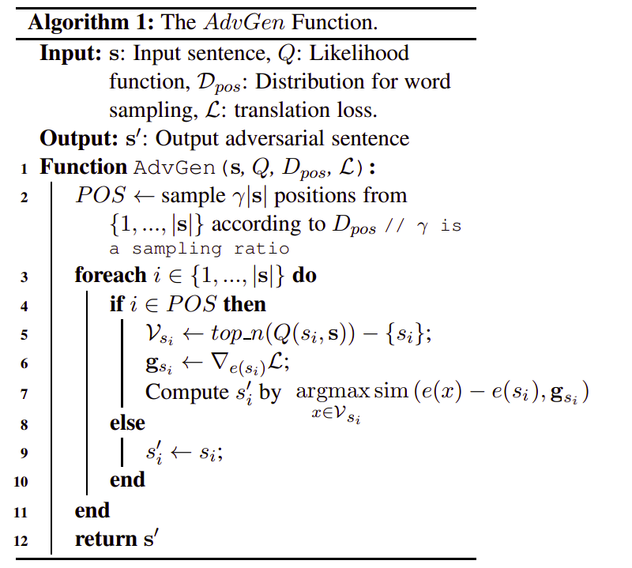
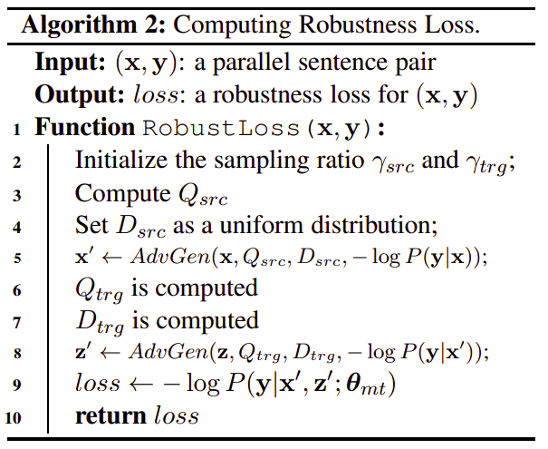

Neural machine translation (NMT) often suffers from the vulnerability to
noisy perturbation in the input. Google AI has proposed an approach to
improving the robustness of NMT models called AdvGen published in 2019
in their paper: [Robust Neural Machine Translation with Doubly
Adversarial Inputs](https://arxiv.org/pdf/1906.02443.pdf). AdvGen
consists of two parts:

-   Attack the translation model with adversarial source examples.

-   Defend the translation model with adversarial target inputs to
    improve its robustness against the adversarial source inputs.

    This approach achieves significant improvements over the previous
    state-of-the-art Transformer model on two common translation
    benchmarks: Chinese-English and English-German which substantiates
    that the proposed model improves the generalization performance over
    the clean benchmark datasets.

AdvGen
------

AdvGen is a gradient-based approach to construct adversarial examples
and use these examples to both attack as well as defend the NMT model.
The intuition behind it is that an ideal model would generate similar
translation results for similar input sentences despite any small
difference caused by perturbations.

### Attack Source Input

Given a parallel sentence pair $(x,\ y)$, For the original input $x$, we
induce a possible adversarial word ${x'}_{i}$ for the token $x_{i}$ in
x:

$${x'}_{i} = \underset{x \in \mathcal{V}_{x_{i}}}{\arg\max}\left( \text{sim}\left( e\left( x \right) - e\left( x_{i} \right) \right),\ g_{x_{i}} \right)$$

Where:

-   $e\left( x_{i} \right)$ is the embedding of token $x_{i}$.

-   $g_{x_{i}}$ is a gradient vector with respect to
    $e\left( x_{i} \right)$:

$$g_{x_{i}} = \frac{\partial}{\partial e\left( x_{i} \right)} - logP\left( y \middle| x;\ \theta \right)$$

-   $sim( \cdot ,\  \cdot )$ denotes the similarity function by
    calculating the cosine distance between two vectors.

-   $\mathcal{V}_{x\_{i}}$ is a subset of the vocabulary for
    the source language that is specific for each token $x_{i}$
    is defined as the n most probable words among the top n scores calculated
    by $a$ is a bidirectional language model for the source language
    $P_{\text{lm}}$:

$$\mathcal{V}_{x_{i}} = top\_ n\left( Q\left( x_{i},\ x \right) \right);\ \ \ \ Q\left( x_{i},\ x \right) = P_{\text{lm}}\left( x \middle| x_{< i},\ x_{> i};\ \theta_{\text{lm}}^{x} \right)$$

More formally, the AdvGen function can be written as an algorithm like so:

    

### Defense Target Input

After generating an adversarial example $x'$, we treat $(x',\ y)$ as a
new training data point to improve the model's robustness. These
adversarial examples in the source tend to introduce errors which may
accumulate and cause drastic changes to the decoder prediction. To
defend the model from errors in the decoder predictions, AdvGen
generates an adversarial target input.

Formally, let $z$ be the decoder input for the sentence pair $(x,\ y)$.
Using the same AdvGen function, we will generate an adversarial target
input $z'$ from $z$ by:

$$z' = \text{AdvGen}\left( z,\ Q_{\text{trg}},\ D_{\text{trg}},\  - \log P\left( y \middle| x' \right) \right)$$

Note that:

-   For the target, the translation loss in the attack part
    $- logP\left( y \middle| x;\ \theta \right)$ is replaced by
    $- logP\left( y \middle| x' \right)$.

-   $Q_{\text{trg}}$ is the likelihood for selecting the target
    word candidate set $\mathcal{V}_{z}$. To compute it, we combine
    the NMT model prediction $P_{\text{nmt}}$ with a bidirectional
    language model $P_{\text{lm}}$ for the target language with a
    tunable hyper-parameter $\lambda$ that balances the importance
    between two models as follow:

$$Q_{\text{trg}}\left( z_{i},\ z \right) = \lambda P_{\text{lm}}\left( z \middle| z_{< i},\ z_{> i};\ \theta_{\text{lm}}^{y} \right) + \left( 1 - \lambda \right)P_{\text{nmt}}\left( z \middle| z_{< i},\ x';\ \theta_{\text{nmt}} \right)$$

-   $D_{\text{trg}}$ is a distribution for sampling positions for the
    target input. Different from the uniform distribution used in the
    source, in the target sentence we want to change those relevant
    words influenced by the perturbed words in the source input. To do
    so, we use the attention matrix $M$ learned in the NMT model,
    obtained at the current mini-batch, to compute the distribution over
    $(x,\ y,\ x')$ by:

$$P\left( j \right) = \frac{\sum_{i}^{}M_{\text{ij}}\ \delta\left( x_{i},\ {x'}_{i} \right)}{\sum_{k}^{}{\sum_{i}^{}M_{\text{ik}}\ \delta\left( x_{i},\ {x'}_{i} \right)}},\ \ \ j \in \left\lbrack 1,\ ...,\ \left| y \right| \right\rbrack$$

Where $M_{\text{ij}}$ is the attention score between
$x_{i}$ and $y_{j}$; and
$\delta\left( x_{i},\ {x'}_{i} \right)$ is an indicator function
that yields 1 if $x_{i} \neq {x'}_{i}$ and 0 otherwise.

Robustness Loss
---------------

    

This algorithm details the entire procedure to
calculate the robustness loss for a parallel sentence pair $(x,\ y)$.
This algorithm takes at most a 20% time overhead compared to the
standard Transformer model.

Accordingly, we compute the robustness loss on $S$ as:

$$\mathcal{L}_{\text{robust}}\left( \theta_{\text{nmt}} \right) = \frac{1}{\left| S \right|}\sum_{\left( x,y \right) \in S}^{}{- \log P\left( y \middle| x',\ z';\ \theta_{\text{nmt}} \right)}$$

And the final loss will be a combination of four loss functions:

$$\mathcal{L}\left( \theta_{\text{nmt}},\ \theta_{\text{lm}}^{x},\ \theta_{\text{lm}}^{y} \right) = \mathcal{L}_{\text{clean}}\left( \theta_{\text{nmt}} \right) + \mathcal{L}_{\text{lm}}\left( \theta_{\text{lm}}^{x} \right) + \mathcal{L}_{\text{robust}}\left( \theta_{\text{nmt}} \right) + \mathcal{L}_{\text{lm}}\left( \theta_{\text{lm}}^{y} \right)$$

Where:

-   $\mathcal{L}_{\text{lm}}\left( \theta\_{\text{lm}}^{x} \right)$
    and $\mathcal{L}_{\text{lm}}\left( \theta\_{\text{lm}}^{y} \right)$
    are loss functions for source and target bidirectional language models,
    respectively.

-   $\mathcal{L}_{\text{clean}}\left( \theta\_{\text{nmt}} \right)$
    is the loss function for the NMT model.

-   $\mathcal{L}_{\text{robust}}\left( \theta\_{\text{nmt}} \right)$
    is the robustness loss.
