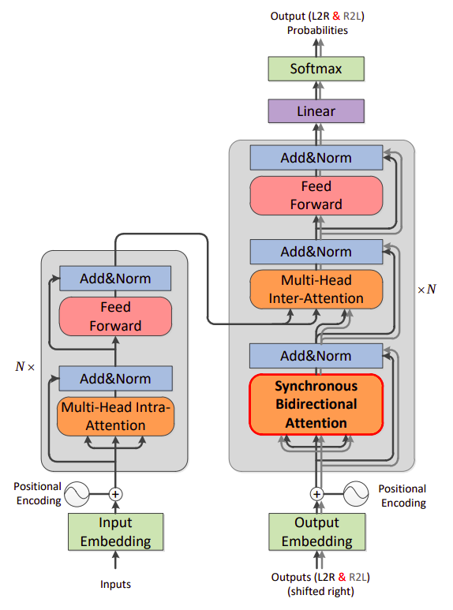

SB NMT stands for "Synchronous Bi-directional Neural Machine
Translation" which is a model proposed by the the University of Chinese
Academy of Sciences in 2019 and published in their paper under the same
name: [Synchronous Bidirectional Neural Machine
Translation](https://arxiv.org/pdf/1905.04847.pdf). The official code
for this paper can be found on the following GitHub repository:
[sb-nmt](https://github.com/wszlong/sb-nmt).

SB-NMT architecture is the same as the standard Transformer with the
exception that the decoder has a <u><strong>Synchronous Bi-directional
Attention</strong></u> sub-layer instead of the Multi-head Self-attention one
which enable the decoder to predict its outputs using left-to-right and
right-to-left decoding simultaneously and interactively, in order to
leverage both of the history and future information at the same time.

    

TO BE CONTINUED...
