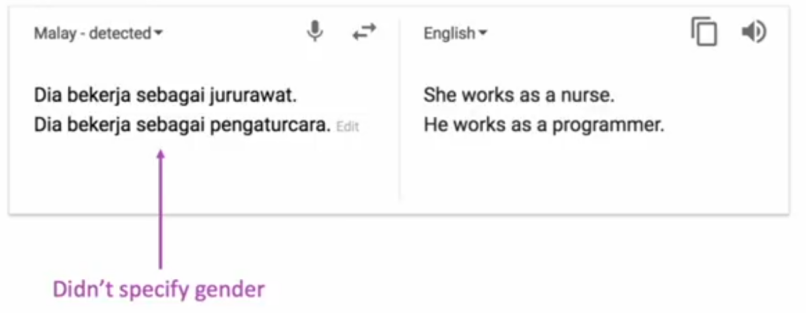
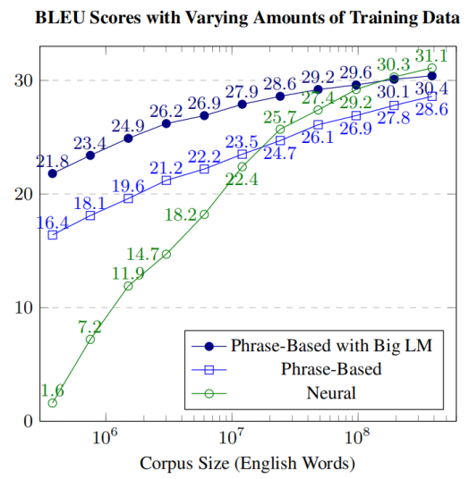
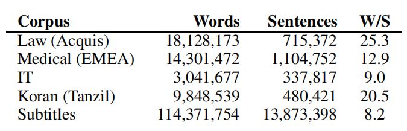
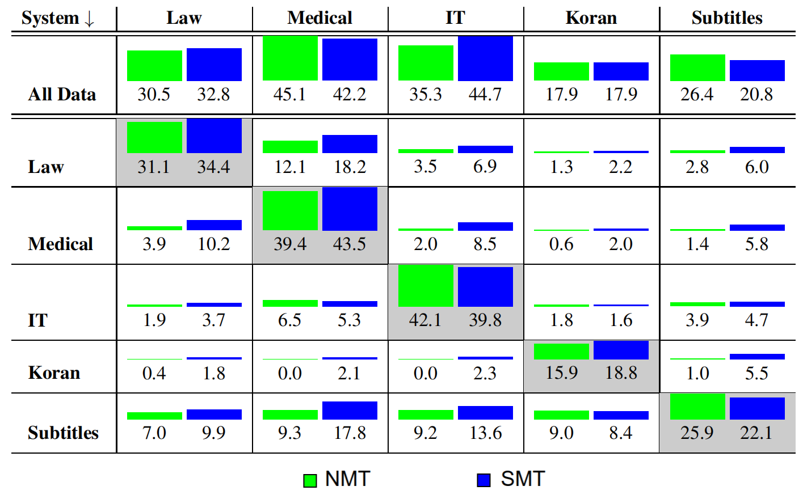
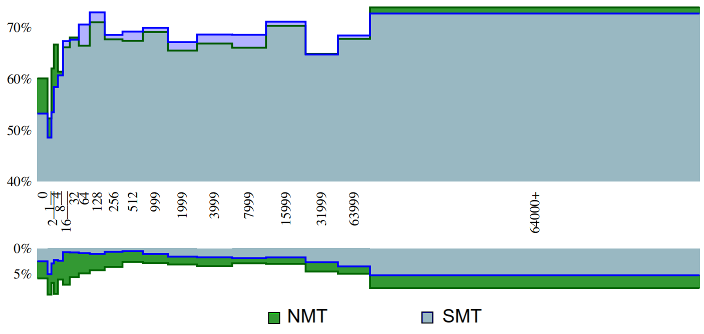
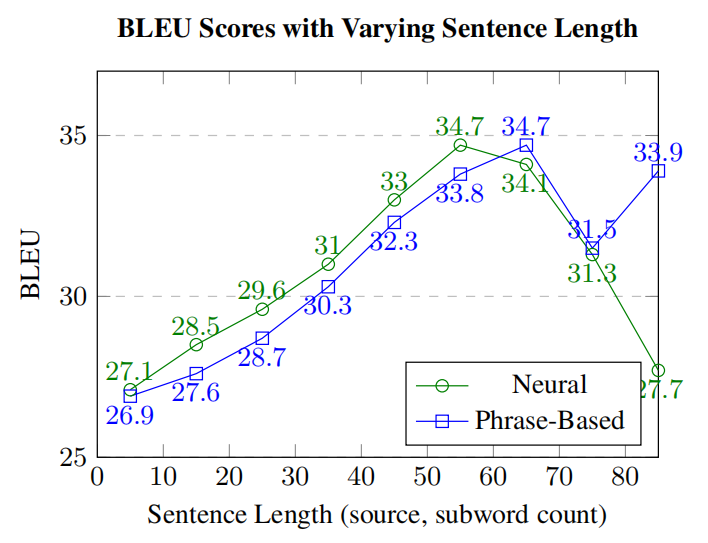
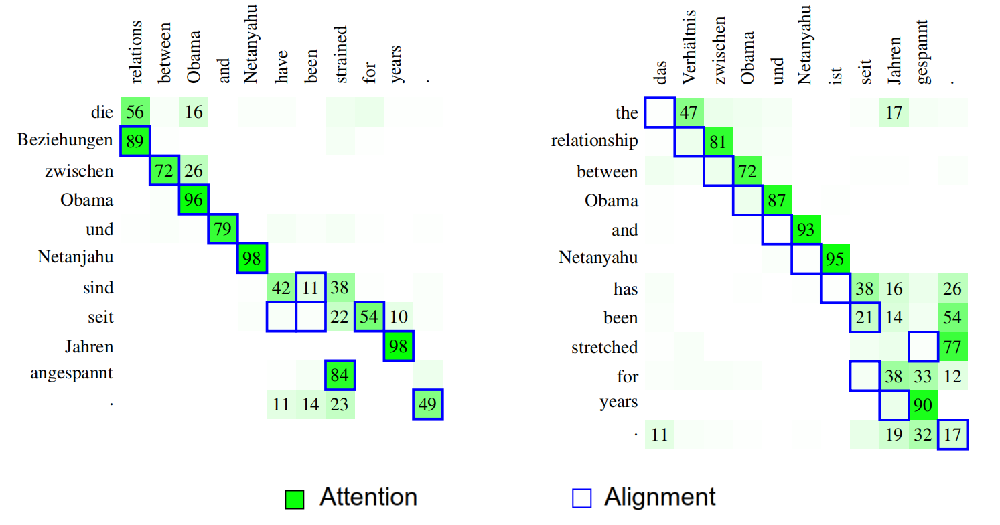
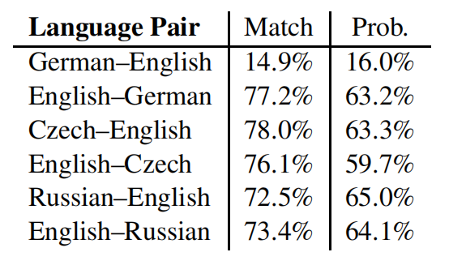
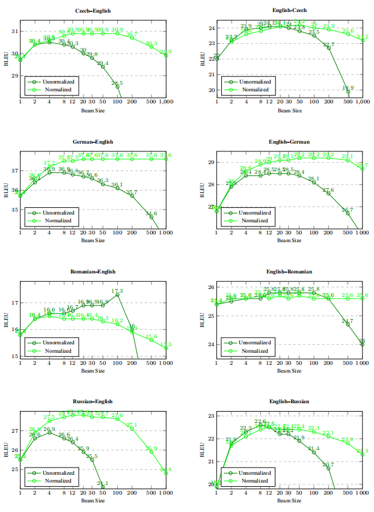

Although the NMT had made remarkable achievements on particular
translation experiments, researchers were wondering if the good
performance persists on other tasks and can NMT indeed replace SMT.
Accordingly, [Junczys-Dowmunt et
al.](http://workshop2016.iwslt.org/downloads/IWSLT_2016_paper_4.pdf) who
performed experiments on the "United Nations Parallel Corpus" which
involves 15 language pairs and 30 translation directions, and NMT was
either on par with or surpassed SMT across all 30 translation directions
in the experiment measured through BLEU scores which proves how
promising NMT is.

When comparing NMT with SMT, we can see that NMT has some pros like:

-   NMT does not need prior domain knowledge with translation, which
    enables zero-shot translation.

-   NMT produces more fluent results.

-   NMT produces more phrase-similarities between different languages.

-   NMT is language-agnostic. You can use it basically for any language.

On the other side, there are still problems and challenges of NMT need
to be tackled:

-   The training and decoding process is quite slow.

-   The style of translation can be inconsistent for the same word.

-   There exists an "out-of-vocabulary" problem on the translation
    results.

-   The "black-box" neural network mechanism leads to poor
    interpretability; thus the parameters for training are mostly picked
    based on experience.

-   Biases is very clear in NMT:

    

Because of the characteristics of NMT and its superiority over SMT, NMT
also starts to be adopted by the industry recently:

-   In September 2016, the Google Translate team published a blog
    showing that they had started using NMT to replace Phrase-Based
    Machine Translation for Chinese-English translations on their
    product. The NMT they deployed is named Google Neural Machine
    Translation (GNMT), and a paper: "[Google's Neural Machine
    Translation System: Bridging the Gap between Human and Machine
    Translation](https://arxiv.org/pdf/1609.08144.pdf)" was published at
    the same time to explain that model in details.

-   In 2017, Facebook AI Research (FAIR) announced their way of
    implementing NMT with CNN, which can achieve a similar performance
    as the RNN-based NMT while running nine times faster.

-   In June 2017, Google released a solely attention-based NMT model
    which used neither CNN nor RNN and purely based on the "attention"
    mechanism under the name "[Attention is All you
    need](https://arxiv.org/pdf/1706.03762.pdf)".

-   In July 2017, Amazon released their NMT implementation with MXNet.

-   Microsoft talked about their usage of NMT in 2016, although not
    revealed any further technical details yet.

In June 2017, two researchers from John Hopkins University published a
paper under the name: [Six Challenges for Neural Machine
Translation](https://arxiv.org/pdf/1706.03872.pdf) which discusses the
most urging problems in Neural Machine Translation systems in comparison
with Statistical ones. And the found out that all problems can be
summarized in six challenges as mentioned below; knowing that all NMT
models used in this paper were trained using [Nematus
toolkit](https://github.com/rsennrich/nematus) and all SMT models were
trained using [Moses toolkit](http://www.stat.org/moses/):

## Training Data Size

A well-known property of SMT systems is that increasing amounts of
training data lead to better results. To measure the effect of the
training data size on NMT systems in the paper, they built
English-Spanish systems on [WMT13
data](http://statmt.org/wmt13/translation-task.html) of about 385.7
million English words paired with Spanish. To measure the effect of
different training dataset size, they split the data in the following
ratios: $\frac{1}{1024},\ \frac{1}{512},\ ...\frac{1}{2},\ 1$ and
measured the models performance at each data size as shown in the
following figure:

    

As shown, NMT exhibits a much steeper learning curve starting with very
bad results and ending with outperforming SMT, and even beating the SMT
system with a big language model. The contrast between the NMT and SMT
learning curves is quite striking which shows that <u><strong>NMT systems are
superior when having enough data; while SMT systems are superior with
small amount of training data</strong></u>.

## Domain Mismatch

Domain in machine translation is defined by information from a specific
source which could be different from other domains in <u><strong>topic</strong></u>,
<u><strong>style</strong></u>, <u><strong>level of formality</strong></u>,
<u><strong>complexity</strong></u> ...etc. Same words in different domains have
different translations and expressed in different styles. To measure how well
Neural Machine Translation (NMT) and Statistical Machine Translation (SMT) hold
up with domain mismatch, they trained five different systems using five
different corpora from different domains as shown below:

    

They used German-English pairs with test sets sub-sampled from the data.
A common byte-pair encoding (BPE) is used for all training runs. The
following figure shows a comparison between NMT and SMT systems BLEU
scores when trained on the corpora at the row and tested on the corpora
at the column:

    

The previous figure shows that <u><strong>in-domain NMT and SMT systems are
similar (NMT is better for IT and Subtitles, SMT is better for Law,
Medical, and Koran), the out-of-domain performance for the NMT systems
is worse in almost all cases.</strong></u>

> **Note:**\
A currently popular approach for domain adaptation is to train a general
domain system, followed by training on in-domain data for a few epochs.

## Rare Words

The next problem that we will discuss is the effect of rare words on NMT
and SMT systems. To measure that effect, they used pre-trained NMT and
SMT systems that have the same case-sensitive BLEU score of 34.5 on the
WMT 2016 English-German news test set (for the NMT model, this reflects
the BLEU score resulting from translation with a beam size of 1).

Then, they followed the approach described in this paper: [Interpolated
backoff for factored translation models
](https://aclanthology.org/2012.amta-papers.9.pdf) for examining the effect
of source word frequency on translation accuracy. This approach can be
summarized in the following steps:

-   First, they align the source sentence and the machine translation
    output from each system using [fast-align
    toolkit](https://github.com/clab/fast_align) with "gdfa"
    (grow-diag-final-and).

-   Now, each source word is either unaligned ("dropped") or aligned.
    For each target word that was aligned, they checked if that word
    appears in the reference translation or not.

    -   If the target word appears the same number of times in the  hypothesis
        as in the reference, they awarded the system a score of one.

    -   If the target word appears more times in the hypothesis than in  the
        reference, they awarded the system a fractional credit the equals to
        $\frac{\text{reference\_count}}{\text{hypothesis\_count}}$.

    -   If the target word does not appear in the reference, they didn't  award
        the system.

-   Then, all scores over the full set of target words is averaged to compute
    the precision for that source word.

-   Finally, words are binned by frequency and average translation
    precisions can be computed.

The following figure shows the words-frequency bins on the x-axis
and the average precision on the y-axis. The values above the
horizontal axis represent precisions, while the lower portion
represents what proportion of the words were dropped/deleted.

    

From the previous figure, the first item of note is that the NMT system
has an overall higher proportion of deleted words. Of the 64379 words
examined, the NMT system deleted 3769 while the SMT system deleted 2274.
The next interesting observation is what happens with unknown words
(left-most side of the figure). The SMT system translates these
correctly 53.2% of the time, while the NMT system translates them
correctly 60.1% of the time.

To sum up, <u><strong>Surprisingly, NMT systems (at least those using byte-pair
encoding) is better than SMT systems on translation very infrequent
words. However, both NMT and SMT systems do continue to have difficulty
translating some infrequent words, particularly those belonging to
highly-inflected categories.</strong></u>

## Long Sentences

A well-known flaw of early encoder-decoder NMT models was the inability
to properly translate long sentences. However, this was fixed by using
the [attention
mechanism](https://anwarvic.github.io/machine-translation/Attention). To
measure the effect of long sentences on NMT (with attention mechanism)
and SMT systems, they used the large English-Spanish dataset (from
before) and broke it up into buckets based on sentence length (1-9
subword tokens, 10-19 subword tokens, \... etc.) and computed
corpus-level BLEU scores for each bucket.

The following figure shows that <u><strong>NMT is better than SMT in general,
but SMT system outperforms NMT on sentences of length 60 and
higher</strong></u>:

    

The quality for the two systems is relatively close, except for the very
long sentences (80 and more tokens). The quality of the NMT system is
dramatically lower for these since it produces too short translations.

## Word Alignments

Some might think that the attention mechanism in NMT systems plays the
role of the word alignment between the source and target sentences. To
examine this, the researchers compared the soft attention matrix in NMT
with word alignments obtained by [fast-align
toolkit](https://github.com/clab/fast_align). The following figure shows
two the difference on two sentences (left when translating from
English→German; right when doing the opposite):

    

As seen from the left example, most words match up pretty well and both
are a bit fuzzy around the words "have-been" / "sind". In the right
example, all the alignment points appear to be off by one position
despite the fact that the NMT translation quality was pretty good. Over
all sentences, they measured how well the attention mechanism of the NMT
system matches the alignments of fast-align using two metrics:

-   **Match score:** that checks for each output if the aligned input
    word according to fast-align is indeed the input word that received
    the highest attention probability.

-   **Probability mass score:** that sums
    up the probability mass given to each alignment point obtained from
    fast-align.

The following table shows alignment scores for the two systems. The
results suggest that there is a big overlap between attention and word
alignments keeping in mind that German--English was definitely an
outlier:

    

<u><strong>These results shows that attention might look similar to word
alignments. However, it suggests that it has a broader role</strong></u>. For
instance, when translating a verb, attention may also be paid to its
subject and object since these may disambiguate it.

## Beam Search

In SMT and NMT, beam search is still the most used technique for
decoding. Usually the translation quality in both system increases when
a bigger beam size is chosen. But when comes to NMT, does this pattern
go on forever?!

Actually, experiments run on the NMT system using 8 language pairs
suggest otherwise. As shown below, worse translations are found beyond a
certain beam size in almost all cases. The optimal beam size varies from
4 (Czech--English) to around 30 (English--Romanian).

    

Normalizing sentence level model scores by length of the output
alleviates the problem somewhat and also leads to better optimal quality
in most cases (5 of the 8 language pairs investigated). Based on these
experiments, <u><strong>optimal beam sizes are in the range of 30--50 in almost
all cases, but quality still drops with larger beams.</strong></u> The main
cause of deteriorating quality are shorter translations under wider
beams.
