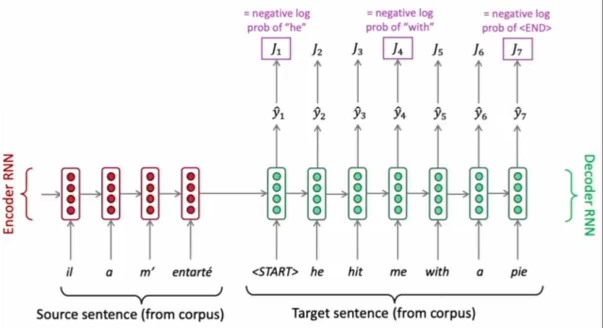
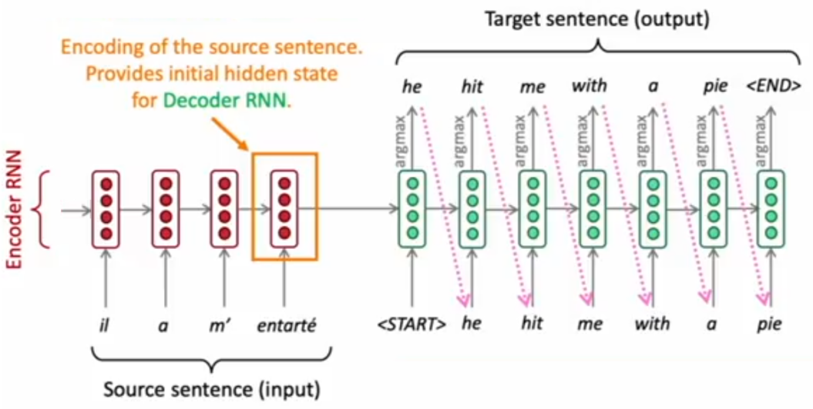
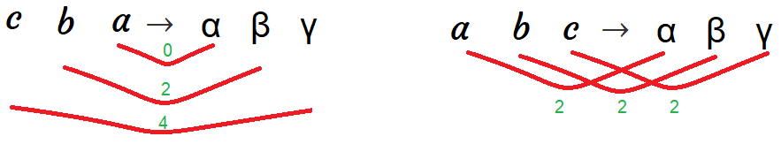
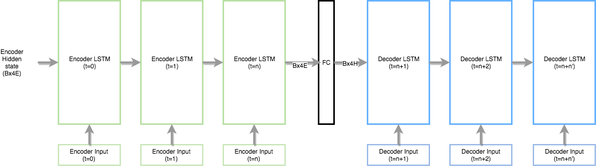
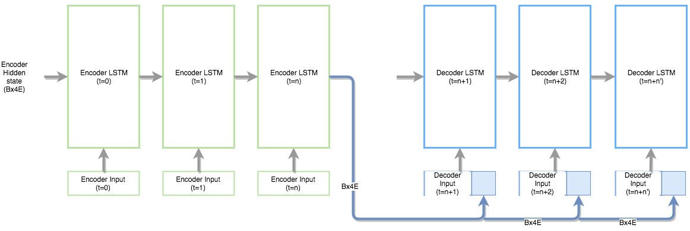
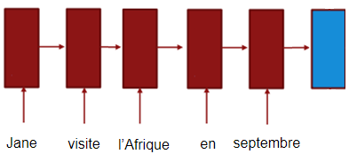
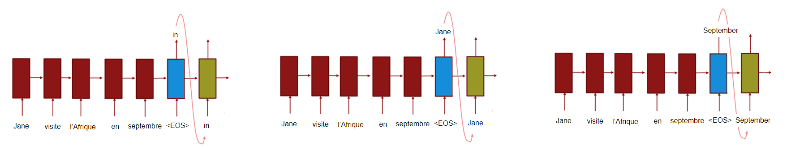

Sequence-to-sequence (seq2seq) models or encoder-decoder architecture,
created by IlyaSutskever and published in their paper: [Sequence to
Sequence Learning with Neural Networks](https://arxiv.org/pdf/1409.3215.pdf)
published in 2014, have enjoyed great success in a machine translation,
speech recognition, and text summarization.

When training, Seq2Seq system first reads the source sentence using a
neural network called "encoder" to build a **context Vector** (the last
RNN output in the encoder architecture) which is a sequence of numbers
that represents the sentence meaning. Then using another neural network
called "decoder" which takes the translated words along with the context
vector and tries to train the decoder to predict these words when given
similar context vector.

    

> **Note:**\
We should know that the input to both the encoder and the decoder are
word-embedding and not the word itself. So, when translating from one
language to another, you need to have two sets of word embedding.

When testing, we only have the input sentence for the encoder. So, we
use the encoder architecture to generate the context vector that will be
used as the initial state for the decoder architecture to generate the
translated sentence.

And as we can see in the following image, the output of each time step
in the decoder will be fed back to it the decoder to generate more. And
each word generated has the highest probability among all other words in
the vocabulary.

    

> **Notes:**
>
> - One of the tricks that we usually use in Machine Translation, and it
    helps to improve the performance, is to reverse the input sentence
    when training the model. So, if the (English, Foreign) pair is "a b
    c" → "α β γ", then we reverse the source sentence and keep the
    target as it is. So, now the (English, Foreign) pair is "c b a" → "α
    β γ". This increases the performance as the distance between the
    associated words become lower than before and the average distance
    between corresponding words in the source and target is unchanged.
>
> 

>     
> 

>
> - The trend in NMT is not using so much epochs in training. The
    seq2seq paper mentioned before uses 7.5 epochs for training $12$
    million sentences containing 348 million English words and 304
    million French words. And the "[Effective Approaches to
    Attention-based Neural Machine
    Translation](https://arxiv.org/pdf/1508.04025.pdf)" paper used about
    12 epochs.
>
> - There is a trick we can use that doubles the training speed which is
    when creating mini-batches, we batch the short sentences (\< 30
    words) together and the long sentences together. Padding is also
    added per batch.
>
> - Some people would train the encoder and the decoder separately. You
    can do that with no problem, but it's preferable to train them
    altogether as an end-to-end solution.
> 
> - One of the biggest problems we should avoid when creating such a
    model is to avoid the greedy approach when dealing with the
    generated sentence. By greedy approach, I mean choosing every word
    based on current word probability without putting into consideration
    the following words. That's why we will stick with another approach
    which is the "Beam Search".

Different Layers
----------------

In this part, we are going to discuss a very special case in a Seq2Seq
architecture, but first let's recap its architecture. Seq2Seq system
first reads the source sentence using a neural network called "encoder"
to build a **context vector(s)**. These vectors are being used as the
initial value for the hidden states in the decoder. The decoder is
another neural network that uses the context vector(s) to emit a
translation, word by word.

    

In the previous graph, the number of layers in the encoder is the same
as the decoder. But what happens when the number of layers differ
between them. How we are going to use the context vector(s) as the
initial value for the decoder? According to this answer on Quora, there
are two approaches:

-   Use a single layer fully connected (FC) network between the encoder
    and decoder. The FC network has (encoder layers) number of input
    neurons and (decoder layers) number of output/hidden layer neurons.
    This way the sizes of the encoder and decoder would be reconciled
    and you can initialize the decoder hidden states from the output of
    FC network.

    

-   Use the encoder hidden state output as an extension to the decoder
    input and initialize the decoder hidden states randomly. This
    technique is used in papers like: A Persona-Based Neural
    Conversation Model.

    

Beam Search
-----------

The difference between Beam Search and Greedy Algorithm is that the
first chooses a certain number of candidates for each step (based on the
<u><strong>beam width</strong></u>) unlike the latter which chooses only
the most likely candidate for each step. So, we can consider the greedy
algorithm as a beam search algorithm with a beam width of 1. Let's see how we
can do that with our example, "Jane visite l'Afrique en septembre", step by
step. First, we will form our encoder network like so:

    

Using a beam width of $3$, we will choose the most likely three words
from our vocabulary based on the context vector (Blue). In other words,
we will get the three words that has the highest
$P\left( y^{\left\langle 1 \right\rangle} \middle| x \right)$ where $x$
is the context vector (Blue block). Let's assume the most likely words
are "In", "Jane" and "September". Now, we will have to create three
decoder networks, one for each word like so:

    

And for each choice of these three choices, we will consider what should
be the second word. We will also get the three most likely words
according to the probability
$P\left( y^{\left\langle 2 \right\rangle} \middle| x,y^{\left\langle 1 \right\rangle} \right)$.
So, we will have $3 \ast 3 = 9$ choices for the second step. Then, we
will filter it down to 3 by considering the highest three probabilities
of these nine choices. And we will keep doing that till the end of the
generated (translated) sentence. If the end of sentence symbols \</s\>
is generated to one of the choices, then we stop generating words in
this choice.

So in the end, the Beam Search Algorithm will produce the sentence with
the highest probability of
$P\left( y^{\left\langle 1 \right\rangle}\ldots y^{\left\langle T_{x} \right\rangle} \middle| x \right)$
which equal to
$P\left( y^{\left\langle 1 \right\rangle} \middle| x \right) \ast P\left( y^{\left\langle 2 \right\rangle} \middle| x,y^{\left\langle 1 \right\rangle} \right) \ast P\left( y^{\left\langle 3 \right\rangle} \middle| x,y^{\left\langle 1 \right\rangle},y^{\left\langle 2 \right\rangle} \right) \ast \ldots P\left( y^{\left\langle T_{y} \right\rangle} \middle| x,y^{\left\langle 1 \right\rangle},\ldots y^{\left\langle T_{y} - 1 \right\rangle} \right)$.
In other words, the Beam Search Algorithm tries to maximize:

$$\arg\max_{y}\prod_{t = 1}^{T_{y}}{P\left( y^{\left\langle T_{y} \right\rangle} \middle| x,\left\{ y^{\left\langle 1 \right\rangle},\ldots y^{\left\langle T_{y} - 1 \right\rangle} \right\} \right)}$$

One way to optimize the previous formula is to use the logarithmic
summation instead of the product. So, by taking logs, we end up with a
more numerically stable algorithm that is less prone to numerical
rounding errors:

$$\arg\max_{y}\sum_{t = 1}^{T_{y}}{\log\left( P\left( y^{\left\langle T_{y} \right\rangle} \middle| x,\left\{ y^{\left\langle 1 \right\rangle},\ldots y^{\left\langle T_{y} - 1 \right\rangle} \right\} \right) \right)}$$

Now, there\'s one other change to this function that makes the machine
translation algorithm work even better. If we have a very long sentence,
the probability of that sentence is going to be small, because we're
multiplying as many terms with numbers where all of them are less than 1.

So, if we multiply all the numbers that are less than 1 together, we
just tend to end up with a smaller probability. That's why the Beam
Search prefers short sentences. To avoid that, we modify the former
equation and divide by the length of the sentence like so:

$$\frac{1}{T_{y}^{\alpha}} \ast \arg\max_{y}\sum_{t = 1}^{T_{y}}{\log\left( P\left( y^{\left\langle T_{y} \right\rangle} \middle| x,\left\{ y^{\left\langle 1 \right\rangle},\ldots y^{\left\langle T_{y} - 1 \right\rangle} \right\} \right) \right)}$$

The parameter $\alpha \in \lbrack 0,1\rbrack$ is a hyper-parameter for
smoothing the sentence length. So, if $\alpha$ is equal to $1$, then
we're completely normalizing by length. If $\alpha$ is equal to $0$,
then $T_{y}$ will be $1$ which means that we're not normalizing at all.
So, $\alpha$ is somewhat in between full normalization and no
normalization. It's another hyper-parameter we have within that can be
tuned to get better results.

Finally, how do we choose the beam width? The larger the beam width is,
the more possibilities we\'re considering and the better the sentence we
will probably find. But also the the more computationally expensive our
algorithm is as we\'re also keeping a lot more possibilities around. So,
how to choose that perfect value?

In production systems, it\'s not uncommon to see a beam width maybe
around $10$, and a beam width of $100$ would be considered very large
for a production system, depending on the application. But for research
systems where people want to squeeze out every last drop of performance
in order to publish the paper with the best possible result. It\'s not
uncommon to see people use beam widths of $1,000$ or $3,000$.

So, to be on the safe side, we should try other variety of values of the
beam width as we work through our application. So, for many
applications, we would expect to see a huge gain as you go from a beam
width of $1$, which is very greedy search, to $3$, to maybe $10$. But
the gains as you go from $1,000$ to $3,000$ in beam width might not be
as big.
