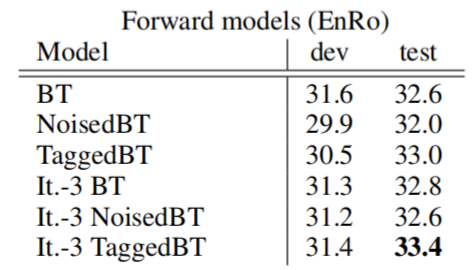
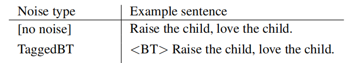
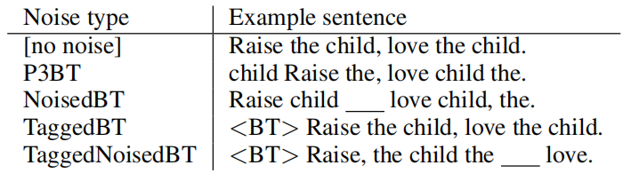
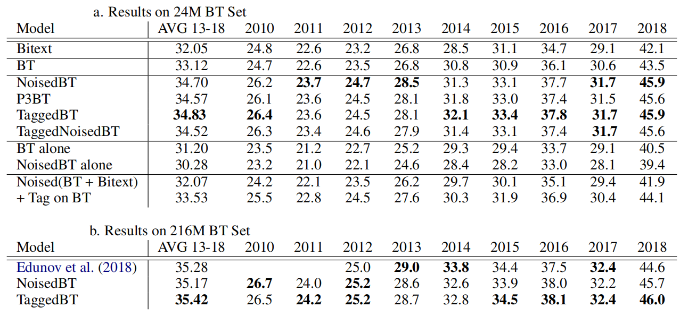
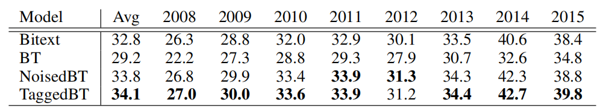
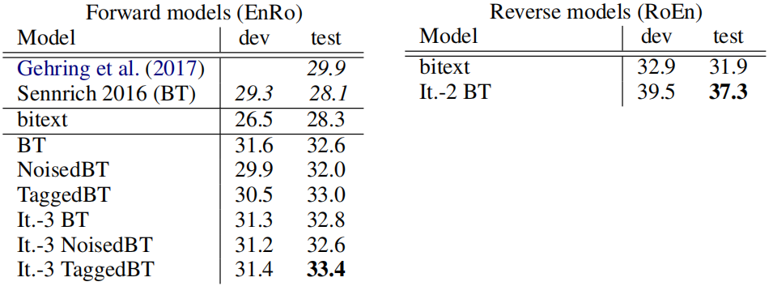

Tagged BT stands for "Tagged Back-Translation" which is a simpler
alternative [Noised
BT](https://anwarvic.github.io/machine-translation/Back-Translation/#Noised%20BT),
consisting of tagging back-translated source sentences with an extra token.
Tagged BT was proposed in 2019 by Google and published in this paper: [Tagged
Back-translation](https://arxiv.org/pdf/1906.06442.pdf).
Tagged BT results on WMT outperform noised BT in English-Romanian and match
performance on English-German:

    

This work hypothesizes that Noised BT outperformed Back-Translation
because Noised BT was signaling the model that the source side is
back-translated, allowing it to treat the synthetic parallel data
differently than the natural bitext. To support this hypothesis, they
prepended each sentence of the synthetic data (which comes from
Back-translation) with a reserved token
$\left\langle \text{BT} \right\rangle$ as shown below:

    

Iterative Tagged BT
-------------------

An Iteration-1 Tagged BT model is a Tagged BT model where the
back-translations were generated by a model trained only on bitext. An
iteration-2 Tagged BT model is a Tagged BT model where the
back-translations were generated by an Iteration-1 Tagged BT model. And
so on. In a more general form, an Iteration-k BT model is trained on BT
data generated by an Iteration-(k-1) BT model, for $k > 1$.

Experiments
-----------

For bitext data, experiments were performed on WMT18 En-De, WMT16 En-Ro,
and WMT15 En-Fr bitext. They filtered out empty sentences and sentences
longer than 250 subwords. They removed pairs whose whitespace-tokenized
length ratio is greater than 2.

For monolingual data, WMT Newscrawl data (2007-2017 for De, 2016 for Ro,
2007-2013 for En, and 2007-2014 for Fr) were used. They filtered
sentences with more than 70 tokens or 500 characters. Furthermore, after
back-translation, They removed any sentence pairs where the
back-translated source is longer than 75 tokens or 550 characters.

The data stats used in the experiments can be found in the following
table;

<table>
    <thead>
        <tr>
            <th></th>
            <th>En-De</th>
            <th>En-Ro</th>
            <th>Ro-En</th>
            <th>En-Fr</th>
        </tr>
    </thead>
    <tr>
        <td><strong>Bitext Size</strong></td>
        <td>5 M</td>
        <td>0.6 M</td>
        <td>0.6 M</td>
        <td>41 M</td>
    </tr>
    <tr>
        <td><strong>Monolingual Size</strong></td>
        <td>216.5 M</td>
        <td>2.2 M</td>
        <td>149.9 M</td>
        <td>39 M</td>
    </tr>
</table>

They used the standard
[Transformer](https://anwarvic.github.io/machine-translation/Transformer)
implemented in the
[lingvo](https://github.com/tensorflow/lingvo#machine-translation)
framework; they used the transformer-base setup for En-Ro data and the
transformer-big setup for both En-De and En-Fr. Both use a vocabulary of
32k subword units.

In this paper, they compared Tagged BT model with standard
Back-Translation, Noised BT model, 3-tokens constrained permutation BT
(P3BT), and Noised Tagged BT model:

    

The following table shows the BLEU score on Newstest En-De dataset with
back-translated data either sampled down to 24M or using the full set of
216M sentence pairs. As shown, Tagged BT is on par with or slightly
superior to their Noised BT, out-performing it on four test sets and
under-performing it on three:

    

The following table shows the BLEU score of En-Fr test sets which is a
much higher-resource language pair than En-De. Same as before, Tagged BT
out-performs all other methods, beating Noised BT by an average of +0.3
BLEU over all test sets.

    

Same applies for En-Ro (left table) and Ro-En (right table):

    

