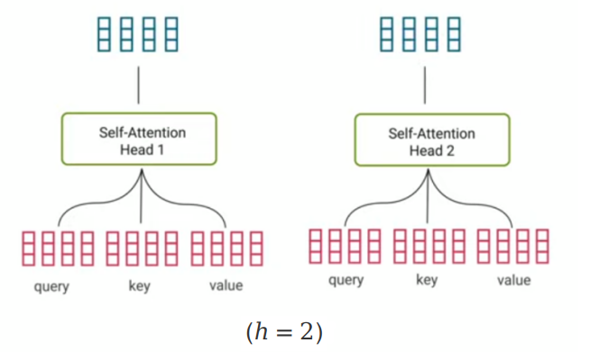
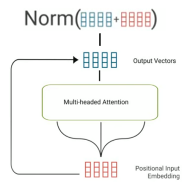

Transformers were introduced in 2017 by Google in the "[Attention is all
you need](https://arxiv.org/pdf/1706.03762.pdf)" paper. Transformer
architecture was created in attempt to combine all good things from
Seq2Seq architecture and ConvS2S with attention mechanisms. So, it deals
with the text data in an encoder-decoder architecture the same as
Seq2Seq and tries to parallelize the input data the same as CNNs.

In this paper, the Transformer architecture consists of six layers of
encoder and six layers of decoder. The following image represents the
transformer architecture in just one layer:

    

In this transformer architecture, there are three different attention
mechanisms used:

-   Attention between the input tokens (self-attention).

-   Attention between the output tokens (self-attention).

-   Attention between the input and the output tokens

The attention between the input (or output) tokens is called
**self-attention** because the attention is between the same parameters.

Padding
-------

To be able to parallelize sentences with different lengths in
transformer, we need to define a value that represents the maximum
length (MAX_LENGTH) found in our training data. And all sentences whose
length is less than MAX_LENGTH should be padded using a PAD vector.

So, in the following image we have a mini-batch of three sentences where
the longest one is seven-tokens long. And the MAX_LENGTH is nine. In
practice, PAD is the $0^{th}$ index of the embedding matrix which means it
will be learnable vector. It's learnable for convenience not because we
need it to be. Also, the PAD vector should be ignored when computing the
loss.

    

Encoder
-------

    

We are going to focus on the encoder part
of the transformer architecture which consists of different modules:

-   **Embedding:** where we map words into vectors representing their
    meaning such that similar words will have similar vectors.

-   **Positional Encoding:** Word meaning differs based on its position
    in the sentence. Positional vector is a vector of the same size as
    the embedding vector that gives context based on word-position in a
    sentence. This can be done by applying following equation:

$$\text{PE}_{\left( \text{pos},\ 2i \right)} = \sin\left( \frac{\text{pos}}{10000^{\frac{2i}{d}}} \right)$$

$$\text{PE}_{\left( \text{pos},\ 2i + i \right)} = \cos\left( \frac{\text{pos}}{10000^{\frac{2i}{d}}} \right)$$

&emsp;&emsp;&emsp;&emsp;Where "pos" is the word position/index (starting from zero). "i" is
the $i^{th}$ value of the word embedding and "d" is the size of the word
embedding. So, if "i" is even, then we are going to apply the first
equation and if "i" is odd, then we are going to apply the second
equation. After getting the **positional vectors**, we add them to the
original embedding vector to get context vector:

    

I know these functions don't make sense and the original paper says the
following: "We tried to encode position into word embedding using sinusoidal
functions and using learned positional embeddings, and we found that the two
versions produced nearly identical results. But in case you wanted to dig
deeper in this part, check this
[video](https://www.youtube.com/watch?v=dichIcUZfOw). It's a good start. Also,
look into the
"[Attention Is All You Need](https://arxiv.org/pdf/1706.03762.pdf)" paper and this
[article](https://towardsdatascience.com/master-positional-encoding-part-i-63c05d90a0c3).

-   **Single-Head Self-Attention:**\
    Self-attention allows the encoder to associate each input word to
    other words in the input. To achieve self-attention, we feed the
    input into three different linear fully-connected layers to produce
    three different vectors which are **query** Q, **key** K, and
    **value** V. The size of them all is the same size as the word
    embedding "$d$".

    

    
&emsp;&emsp;&emsp;The name of these three vectors comes from retrieval systems. So,
when you type a <u><strong>query</strong></u> on Google to search for, this query
will be mapped to a set of results <u><strong>keys</strong></u> to score each
result. And the highest results will be the <u><strong>values</strong></u> you
were looking for.

&emsp;&emsp;&emsp;So, we are going to perform a dot product of Q and K to get a score
matrix that scores the relation between each word in the input and
the other words in the input as well.

    

&emsp;&emsp;&emsp;Then, these scores are getting scaled down by dividing over the
square root of the dimension of query and key (which is $d$) to
allow more stable gradients as the dot product could lead to
exploding values:

    

&emsp;&emsp;&emsp;Then, we are going to perform a Softmax over these down-scaled
scores to get the probability distribution which is called the
<u><strong>attention weights</strong></u>:

    

&emsp;&emsp;&emsp;Finally, we are going to perform a dot product between the attention
weights and the values V to get an output vector. The higher the attention
weight is, the higher it contributes to the output vector.

    

You should know that the **concat** and **Linear** blocks at the end of
the mechanism aren't related to the multi-head which we are going to
talk about in a second.

-   **Multi-Head Self-Attention:**\
    A multi-head self-attention is just performing the single-head
    self-attention N times and <u><strong>concatenating</strong></u> the output
    vectors together. In theory, this will make each head learn
    something different about the input. After concatenation, we apply a
    linear fully-connected layer to match dimensions for the residual
    connection.

    

-   **Residual Connection & Normalization**:
    After the multi-head self-attention, we have output vectors, we add
    the positional input embedding to the output vectors which is known
    as a residual connection. The main use for these residual
    connections is to prevent the vanishing gradient problem.

    

&emsp;&emsp;&emsp;Then, we apply a batch or layer normalization. The difference is
pretty subtle where the batch normalization normalizes over all data in the
batch and the layer normalization normalizes over all weights in the layer.

    

-   **Feed-forward & Residual & Norm**:
    Now, the normalization output gets fed to the feed-forward network
    for further processing. The feed-forward network is just a couple of
    linear layers with a ReLU in between as shown in the attached
    figure.

&emsp;&emsp;&emsp;Then, the input is added to the output as a residual connection,
then we apply some kind of normalization either layer of batch.

    

Decoder
-------

    

In this part, we are going to focus on the
decoder part of the transformer architecture. As we can see, it's the
same components as the encoder except for two things:

-   **Shifted-right inputs**:
    Input (sentence in another language) is shifted right by one word
    while training because we want to make sure the encoder was able to
    get this word before updating its value.

-   **Masked Multi-Head self-Attention**:
    The masked multi-head is a little bit different than the
    multi-head self-attention one. As the masked one will only be able
    to access the previous words not the following one. In order to
    solve that, we are going to create look-ahead mask matrix that masks
    any further values with -inf.

    

&emsp;&emsp;&emsp;We are using -inf as a small numbers that will be zero
when applying the Softmax.

-   **Multi-head Attention \#2:**
    The query and key of this block will come from the encoder output
    and the values will be the output of the masked multi-head block.

Layer Normalization
-------------------

Normalization is an important part of the Transformer architecture as it
improves the performance and avoids the overfitting. Here, we are going
to discuss the different layer normalization techniques that can be used
based as suggested by this paper: [Transformers without Tears: Improving
the Normalization of
Self-Attention](https://arxiv.org/pdf/1910.05895.pdf) The official code
for this paper can be found in this GitHub repository:
[transformers_without_tears](https://github.com/tnq177/transformers_without_tears).

This paper compares between two different orders of layer normalization
in the Transformer architecture:

-   <u><strong>Post-Norm:</strong></u>\
    Post-normalization is the default type of normalization used in the
    standard Transformer architecture. It's called that because it
    occurs after the residual addition:

$$x_{l + 1} = \text{LayerNorm}\left( x_{l} + F_{l}(x_{l}) \right)$$

-   <u><strong>Pre-Norm:</strong></u>\
    Pre-normalization is applied immediately before the sublayer.
    Pre-Norm enables warmup-free training providing greater stability
    and doesn't get affected by the weight initialization unlike
    Post-Norm:

$$x_{l + 1} = x_{l} + F_{l}\left( \text{LayerNorm}(x_{l}) \right)$$

> <u><strong>Very Important Note:</strong></u>
In the paper, they found out that post-normalization works best
with high-resource languages while pre-normalization works best with
low-resource languages.

Also, in the paper, they proposed an alternative to the layer
normalization:

-   <u><strong>Scale-Norm:</strong></u>
    Scale-Norm is an alternative for layer normalization. As we can see
    from the following equation, Scale-Norm replaced the two learnable
    parameters $\gamma,\ \beta$ in layer normalization with one global
    learned scalar $g$:

$$S\text{caleNorm}\left( x;g \right) = g\frac{x}{\left\| x \right\|}$$

-   <u><strong>Scale-Norm + Fix-Norm:</strong></u>
    Fix-Norm is applied to the word embeddings. It looks exactly like
    Scale-Norm with only one global learnable scalar g, so we can apply
    both of them jointly like so:

$$ScaleNorm + FixNorm\left( x,w;g \right) = g\frac{\text{w.x}}{\left\| w \right\|.\left\| x \right\|}$$

And the following are the results published in the paper on various
machine translation directions:

    

LayerDrop
---------

LayerDrop is a novel regularization method for Transformers used to
prevent them from overfitting. This method was proposed by Facebook AI
in 2019 and published in this paper: [Reducing Transformer Depth On
Demand With Structured Dropout](https://arxiv.org/pdf/1909.11556.pdf).
The official code for this paper can be found in the official Fairseq
GitHub repository:
[fairseq/layerdrop](https://github.com/pytorch/fairseq/tree/main/examples/layerdrop).

[Deep Networks with Stochastic
Depth](https://arxiv.org/pdf/1603.09382.pdf) paper has shown that
dropping layers during training can regularize and reduce the training
time of very deep convolutional networks. And this is the core idea of
LayerDrop where entire layers are randomly dropped at training time
which regularizes very deep Transformers and stabilizes their training,
leading to better performance.

The following figure shows a comparison of a 9-layer transformer trained
with LayerDrop (right) and 3 transformers of different sizes (left). As
we can see, the different pruned version of the transformer on the right
obtained better results than the same sized transformers trained from
scratch:

    

Which shows that LayerDrop also acts like a distillation technique that
can lead to small and efficient transformers of any depth which can be
extracted automatically at test time from a single large pre-trained
model, without the need for finetuning.

LayerDrop does not explicitly provide a way to select which group of
layers will be dropped. So, the publishers considered several different
pruning strategies:

-   <u><strong>Every Other:</strong></u>
    A straightforward strategy is to simply drop every other layer.
    Pruning with a drop rate $p$ means dropping the layers at a depth
    $d$ such that
    $d \equiv 0\left( \text{mod}\left\lfloor \frac{1}{p} \right\rfloor \right)$.
    This strategy is intuitive and leads to balanced networks.

-   <u><strong>Search on Valid:</strong></u>
    Another possibility is to compute various combinations of layers to
    form shallower networks using the validation set, then select the
    best performing for test. This is straightforward but
    computationally intensive and can lead to overfitting on validation.

-   <u><strong>Data Driven Pruning:</strong></u>
    Another approach is to learn the drop rate of each layer. Given a
    target drop rate $p$, we learn an individual drop rate $p_{d}$ for
    the layer at depth $d$ such that the average rate over layers is
    equal to $p$.

    The "**Every Other**" works the best with the following drop rate
    $p$ where $N$ is the number of layers, $r$ is the target pruned
    size:

$$p = 1 - \frac{r}{N}$$

> **Note:**
In the paper, they used a LayerDrop rate of $p = 0.2$ for all their
experiments. However, they recommend using $p = 0.5$ to obtain very
small models at inference time.

DropHead
--------

DropHead is another novel regularization method for Transformers used to
prevent overfitting. This method was proposed by Microsoft Research Asia
in 2020 and published in this paper: [Scheduled DropHead: A
Regularization Method for Transformer
Models](https://arxiv.org/pdf/2004.13342.pdf). There is unofficial
implementation for this paper, it can be found in this GitHub
repository:
[drophead-pytorch](https://github.com/Kirill-Kravtsov/drophead-pytorch).

In the core, DropHead drops entire attention heads during training to
prevent the multi-head attention model from being dominated by a small
portion of attention heads which can help reduce the risk of overfitting
and allow the models to better benefit from the multi-head attention.
The following figure shows the difference between dropout (left) and
DropHead (right):

    

In the paper, they proposed a specific dropout rate scheduler for the
DropHead mechanism, which looks like a V-shaped curve (green curve
below): It applies a relatively high dropout rate of $p_{\text{start}}$
and linearly decrease it to $0$ during the early stage of training,
which is empirically chosen to be the same training steps for learning
rate warmup. Afterwards, it linearly increases the dropout rate to
$p_{\text{end}}$. To avoid introducing additional hyper-parameters, they
decided to set $p_{\text{start}} = p_{\text{end}}$.

    

