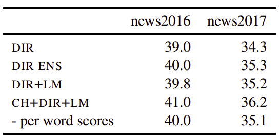
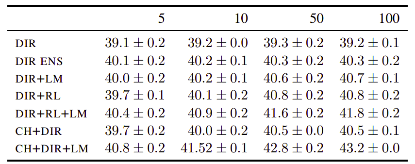

Transformer model directly estimates the posterior probability of a
target sequence $y$ given a source sequence $x$. The Noisy Channel model
operates in the reverse direction. It estimates the likelihood
probability $p\left( x \middle| y \right)$ with the help of a language
model probability $p\left( y \right)$. To do so, the Noisy channel model
applies the Naive Bayes Rule:

$$p\left( y \middle| x \right) = \frac{p\left( x \middle| y \right)\text{.p}\left( y \right)}{p\left( x \right)}$$

The model responsible for calculating $p\left( y \middle| x \right)$ is
called "**Direct Model**", the model responsible for calculating
$p\left( x \middle| y \right)$ is called "**Channel Model**". Modeling
$p(x)$ is ignored since it is constant for all $y$.

The noisy channel approach was widely used in statistical machine
translation. However, in this paper: [Simple and Effective Noisy Channel
Modeling for Neural Machine
Translation](https://arxiv.org/pdf/1908.05731.pdf) published by FAIR in
2019 they decided to use the standard Transformer architecture as a
channel model. The official code for this paper can be found in the
fairseq official GitHub repository:
[fairseq/noisychannel](https://github.com/pytorch/fairseq/tree/master/examples/noisychannel).

In this paper, a standard Transformer model is used as the channel
model, they basically trained the model to translate the target sentence
to the source sentence. And they trained another Transformer model as
the direct model. And they also trained a transformer language model.

Experiments
-----------

Using the English-German WMT'17 dataset for training, news2016 for
validation and news2017 for testing, they used:

-   <u><strong>Language Model:</strong></u>They trained two big Transformer language models with
    [adaptive input
    representations](https://github.com/pytorch/fairseq/blob/main/examples/language_model/README.adaptive_inputs.md)
    with 12 blocks. one on the German newscrawl data distributed by
    WMT'18 comprising 260M sentences and another one on the English
    newscrawl data comprising 193M sentences. Both use a BPE vocabulary
    of 32K tokens.

-   <u><strong>Direct Model:</strong></u>
    They use big Transformers where the encoder and decoder embeddings
    are not shared between them since the source and target vocabularies
    were learned separately.

-   <u><strong>Channel Model:</strong></u>
    They trained Transformer models to translate from the target to the
    source (En-De).

For comparison, they tried the following configurations:

-   DIR: just the direct model.

-   DIR ENS: an ensemble of two direct models.

-   DIR+LM: a direct model + a language Model.

-   DIR+RL: a direct model + a right-to-left seq2seq model.

-   DIR+RL+LM: a direct model + a right-to-left seq2seq model + a
    language model.

-   CH+DIR: a channel model + a direct model.

-   CH+DIR+LM: a channel model + a direct model + a language model.

### Online Decoding

To perform decoding in the noisy channel model, we will need to perform
a two-step beam search. For beam size $k_{1}$ in the channel model, we
will collect $k_{2}$ possible next words extensions from the direct
model for each beam. The, we will score the resulting
$k_{1} \times k_{2}$ according to the following equation:

$$\frac{1}{t}\log p\left( y \middle| x \right) + \frac{\lambda}{s}\left( \log p\left( x \middle| y \right) + \log p\left( y \right) \right)$$

Where $t$ is the length of the target prefix $y$, $s$ is the source
sentence length and $\lambda$ is a tunable weight.

In online decoding, you don't have the whole target sentence. In this
case, you can't use the right-to-left seq2seq model since it doesn't
know how the target sentence will be like. The following table
summarizes the BLEU score over news2016 and news2017 en-de datasets:

    

The previous results were produces using $k_{1} = 5,\ k_{2} = 10$.

### Re-ranking

In re-ranking, you have access to the full target sentence. The purpose
is just re-rank them. The following table shows the re-ranking BLEU with
different n-best list sizes on news2016 of WMT De-En. As we can see, the
noisy channel model configuration obtained the highest scores:

    

