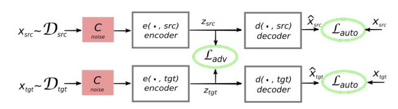
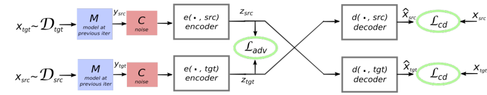

The second model proposed in this area was created by Facebook AI in
2017 and published in this paper: "[Unsupervised Machine Translation
Using Monolingual Corpora only](https://arxiv.org/pdf/1711.00043.pdf)".
The proposed system follows a standard encoder-decoder architecture with
standard attention mechanism assisted by a back-translation procedure
where

-   There is one encoder which is a three-layer bidirectional RNN
    responsible for encoding source sentences $\mathcal{D}_{\text{src}}$
    to a latent space $Z$.

-   There is one decoder which is a three-layer unidirectional RNN
    responsible for decoding target sentences $\mathcal{D}_{\text{tgt}}$
    to a latent space $Z$.

-   All RNNs use LSTM cells with 300 hidden units, and the
    dimensionality of the embeddings is set to 300 as well.

The key idea is to build a common latent space between two languages
and to learn to translate by reconstructing in both domains
according to two principles:

-   **Denoising:** The model has to be able to reconstruct a sentence in
    a given language from a noisy version of it, as in standard
    denoising auto-encoders.

    

-   **Cross-domain Translation:** The model also has to be able to
    reconstruct a source sentence given a noisy translation of the same
    sentence in the target language, and vice versa.

    

Denoising
---------

The whole idea of the system is to train a model to reconstruct its own
input. More concretely, the system takes an input sentence in a given
language, encode it using the shared encoder, and reconstruct the
original sentence using the decoder of that language. That's why we have
two decoders for each language.

But this training procedure is essentially a trivial copying task. And
it's highly probable that our model could just blindly copy elements
from the input sequence without gaining any real knowledge. In order to
avoid that, they used <u><strong>denoising</strong></u>. Denoising is
the process of applying a noise function on the input. They used two
different noise functions:

-   **Shuffling:** They shuffle the input sentence where a word at
    position $i$ can't be further than either $i - k$ or $i + k$ where
    they found out that $k = 3$ is a good value.

-   **Dropping:** They drop every word in the input sequence by a
    probability of $p = 0.1$

This way, the system needs to learn about the internal structure of
the languages involved to be able to recover the correct word order.
At the same time, by discouraging the system to rely too much on the
word order of the input sequence.

Cross-domain Translation
------------------------

The second objective is to constrain the model to be able to map an
input sentence from a the language $\ell_{1}$ to $\ell_{2}$ and vice
versa. The principle can be summarized in the following steps:

-   We will use an earlier version of the model, denoted $M$, to
    generate a translation $y$ of a given sentence $x$.

-   Then, this translation $y$ will be denoised using our denoising
    functions (discussed in the last part) to get a corrupted version of
    the translation $C\left( y \right)$.

-   This corrupted version $C\left( y \right)$ will be inserted as input
    to the current version of the model and the model will try to
    reconstruct $x$ from $C\left( y \right)$.

Adversarial Training
--------------------

To boost performance, they created another neural network, which we will
refer to as the discriminator, to classify between the encoding of
source sentences and the encoding of target sentences.

The discriminator is a multilayer perceptron with three hidden layers of
size 1024, Leaky-ReLU activation functions and an output logistic unit.
The discriminator is trained using RMSProp with a learning rate of
0.0005.

The discriminator operates on the output of the encoder , which is a
sequence of latent vectors $Z$ and produces a binary prediction about
the language of the encoder input sentence.

Final Objective Function
------------------------

The final objective function at one iteration of our learning algorithm
is thus:

$$\mathcal{L}\left( \theta_{\text{enc}},\ \theta_{\text{dec}},\ Z \right) = \lambda_{\text{auto}}\left\lbrack \mathcal{L}_{\text{auto}}\left( \theta_{\text{enc}},\ \theta_{\text{dec}},\ Z,\ src \right) \\
+ \mathcal{L}_{\text{auto}}\left( \theta_{\text{enc}},\ \theta_{\text{dec}},\ Z,\ tgt \right) \right\rbrack \\
+ \lambda_{\text{cd}}\left\lbrack \mathcal{L}_{\text{cd}}\left( \theta_{\text{enc}},\ \theta_{\text{dec}},\ Z,\ src,\ tgt \right) \\
+ \mathcal{L}_{\text{cd}}\left( \theta_{\text{enc}},\ \theta_{\text{dec}},\ Z,\ src,\ tgt \right) \right\rbrack \\
+ \lambda_{\text{adv}}\left\lbrack \mathcal{L}_{\text{adv}}\left( \theta_{\text{enc}},\ Z \middle| \theta_{D} \right) \right\rbrack$$

Where:

-   $\mathcal{L}_{\text{auto}}$ is the auto-encoding loss function;
    where
    $\widehat{x}\sim d\left( e\left( C\left( x \right),\ \ell \right),\ \ell \right)$
    means that $\widehat{x}$ is a reconstruction of the corrupted
    version of $x$. And $\mathrm{\Delta}\left( \widehat{x},\ x \right)$
    is the sum of token-level cross-entropy losses:

$$\mathcal{L}_{\text{auto}}\left( \theta_{\text{enc}},\ \theta_{\text{dec}},\ Z,\ \ell \right) = \mathbb{E}_{x\sim D_{\ell},\ \widehat{x}\sim d\left( e\left( C\left( x \right),\ \ell \right),\ \ell \right)}\left\lbrack \mathrm{\Delta}\left( \widehat{x},\ x \right) \right\rbrack$$

-   $\mathcal{L}_{\text{cd}}$ is the cross-domain translation loss
    function:

$$\mathcal{L}_{\text{cd}}\left( \theta_{\text{enc}},\ \theta_{\text{dec}},\ Z,\ \ell_{1},\ \ell_{2} \right) = \mathbb{E}_{x\sim D_{\ell_{1}},\ \widehat{x}\sim d\left( e\left( C\left( M\left( x \right) \right),\ \ell_{2} \right),\ \ell_{1} \right)}\left\lbrack \mathrm{\Delta}\left( \widehat{x},\ x \right) \right\rbrack$$

-   $\mathcal{L}_{\text{adv}}$ is the adversarial loss function where
    $e\left( x_{i},\ell_{i} \right)$ is the output of the encoder and
    $p_{D}$ is the discriminator output which is either $0$ or $1$:

$$\mathcal{L}_{\text{adv}}\left( \theta_{\text{enc}},\ \text{Z\ } \middle| \ \theta_{D} \right) = - \mathbb{E}_{\left( x_{i},\ \ell_{i} \right)}\left\lbrack \log\left( p_{D}\left( \ell_{i} \middle| e\left( x_{i},\ell_{i} \right) \right) \right) \right\rbrack$$

-   $\lambda_{\text{audo}},\ \lambda_{\text{cd}},\ \lambda_{\text{adv}}$
    are hyper-parameters weighting the importance of the auto-encoding,
    cross-domain translation and adversarial loss respectively.
