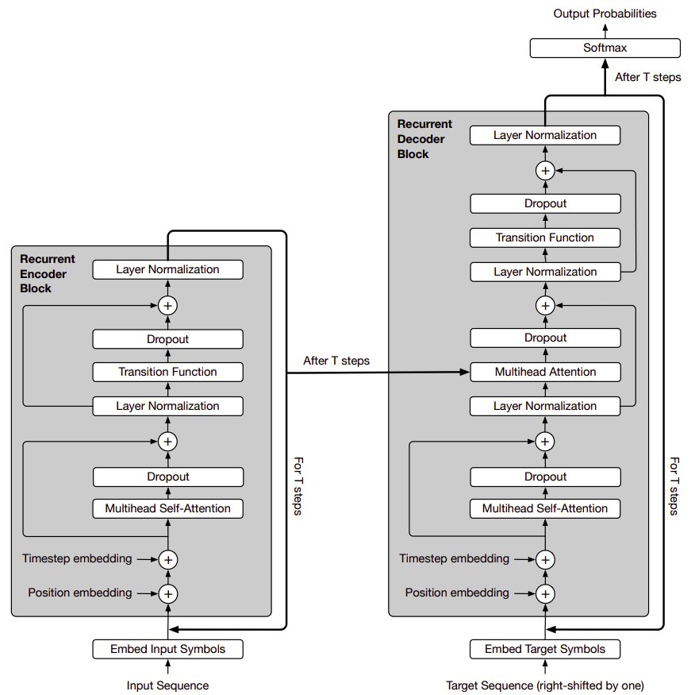
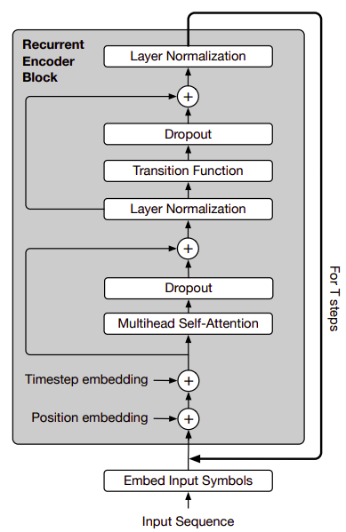
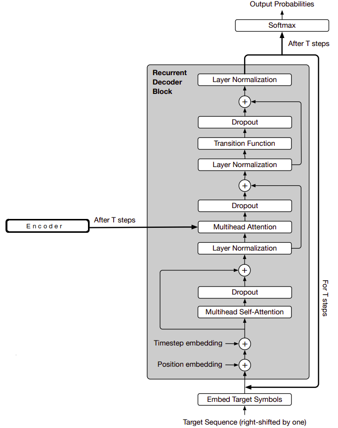
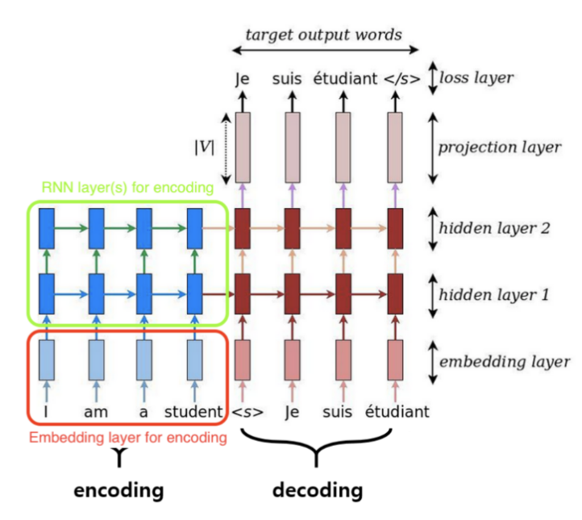

In "Universal Transformers", the researchers from Google extended the
standard Transformer architecture to be computationally universal
(Turing complete) using a novel, efficient flavor of parallel-in-time
recurrence which yields stronger results across a wider range of tasks.
This model was proposed by Google AI in 2018 and published in their
paper: [Universal Transformers](https://arxiv.org/pdf/1807.03819.pdf).
The official code of this paper can be found on the Tensor2Tensor
official GitHub repository:
[tensor2tensor/universal_transformer.py](https://github.com/tensorflow/tensor2tensor/tree/master/tensor2tensor/models/research).

The Universal Transformer (UT) combines the **parallelizability** of the
Transformer and the **recurrent inductive bias** of RNNs, which seems to
be better suited to a range of natural language understanding problems.
As shown in the following figure, the Universal Transformer is based on
the popular encoder-decoder architecture commonly used in most neural
sequence-to-sequence models:

<div align="center">
    
</div>

Unlike the standard transformer, Both the encoder and decoder of the
Universal Transformer operate by applying a recurrent neural network to
the representations of each of the positions of the input and output
sequence, respectively. Now, let's describe the encoder and decoder in
more detail.

Encoder
-------

<div align="center">
    
</div>
Given an input sequence of length $m$ and
d-dimensional embeddings, we will have a matrix
$H^{0} \in \mathbb{R}^{m \times d}$. The UT then iteratively computes
representations $H^{t}$ at step $t$ for all $m$ positions in parallel by
applying:

-   The first step in the encoder is to apply the position/time
    embedding. For the positions $1 \leq i \leq m$ and the time-step
    $1 \leq t \leq T$ separately for each vector-dimension
    $1 \leq j \leq d$, the position/time embedding
    $P^{t} \in \mathbb{R}^{m \times d}$ is applied according to the
    following formula:

$$P_{i,2j}^{t} = \sin\left( \frac{i}{10000^{\frac{2j}{d}}} \right) + \sin\left( \frac{t}{10000^{\frac{2j}{d}}} \right)$$

$$P_{i,2j + 1}^{t} = \cos\left( \frac{i}{10000^{\frac{2j}{d}}} \right) + \cos\left( \frac{t}{10000^{\frac{2j}{d}}} \right)$$

-   The multi-headed self-attention mechanism defined before in the
    standard Transformer paper: [Attention is all you
    need](https://arxiv.org/pdf/1706.03762.pdf):

$$\text{MultiHead}\left( H^{t} \right) = Concat\left( \text{head}_{1},...\text{head}_{k} \right)\ W^{O}$$

$$\text{head}_{i} = \text{Attention}\left( H^{t}W_{i}^{Q},H^{t}W_{i}^{K},H^{t}W_{i}^{V} \right) = \text{softmax}\left\lbrack \frac{H^{t}W_{i}^{Q}\left( H^{t}W_{i}^{K} \right)^{T}}{\sqrt{d}} \right\rbrack H^{t}W_{i}^{V}$$

&emsp;&emsp;&emsp;They map the state $H^{t}$ to queries, keys and values with affine
projections using learned parameter matrices
$W_{i}^{Q},W_{i}^{K},W_{i}^{V} \in \mathbb{R}^{d \times \frac{d}{k}},W_{i}^{O} \in \mathbb{R}^{d \times d}$
where $d$ is the embedding size and $k$ is the number of heads.

-   The multi-headed self-attention is followed by a dropout and a
    residual connection:

$$\text{Dropout}\left( \text{MultiHead}\left( H^{t - 1} + P^{t} \right) \right)$$

-   Then, the dropped-out multi-headed self-attention block is followed
    by a layer normalization accompanied by a transition function as
    shown below:

$$H^{t} = \text{LayerNorm}\left( A^{t} + \text{Dropout}\left( \text{Transition}\left( A^{t} \right) \right) \right)$$

$$A^{t} = \text{LayerNorm}\left( \left( H^{t - 1} + P^{t} \right) + \text{Dropout}\left( \text{MultiHead}\left( H^{t - 1} + P^{t} \right) \right) \right)$$

-   In the paper, they used one of two different $Transition()$
    functions:

    -   Either a separable convolution as described in the [Xception
        paper](https://arxiv.org/pdf/1610.02357.pdf).

    -   Or a fully-connected neural network that consists of a single
        ReLU activation function between two affine transformations,
        applied to each row of $A^{t}$.

After $T$ steps (each updating all positions of the input sequence in parallel),
the final output of the Universal Transformer encoder is a matrix
$H^{t} \in \mathbb{R}^{m \times d}$ for the $m$ symbols of the input sequence.

Decoder
-------

<div align="center">
    
</div>

The decoder shares the same basic structure of the encoder. However,
after the self-attention function, the decoder additionally also attends
to the final encoder representation $H^{t}$. The encoder-decoder
Multi-head attention uses the same multihead self-attention function but
with queries Q obtained from projecting the decoder representations, and
keys and values (K and V ) obtained from projecting the encoder
representations.

Like the Transformer model, the UT is autoregressive; meaning it
produces its output one symbol at a time. Which means that the decoder
self-attention distributions are masked so that the model can only
attend to positions to the left of any predicted symbol.

To generate the output, the per-symbol target distributions are obtained
by applying an affine transformation $O \in \mathbb{R}^{d \times V}$
from the final decoder state to the output vocabulary size $V$ followed
by a softmax which yields an ($m \times V$)-dimensional output matrix
normalized over its rows:

$$p\left( y_{\text{pos}} \middle| y_{\left\lbrack 1:pos - 1 \right\rbrack},\ H^{T} \right) = \text{softmax}\left( OH^{T} \right)$$

Note that $H^{T}$ is the encoder's final output, not the transpose of
$H$.

Dynamic Halting
---------------

In sequence processing systems, certain symbols (e.g. some words or
phonemes) are usually more ambiguous than others. It is therefore
reasonable to allocate more processing resources to these more ambiguous
symbol. [Adaptive Computation Time
(ACT)](https://arxiv.org/pdf/1603.08983.pdf) is mechanism implemented to
do exactly that in standard RNNs.

Inspired by it, the researchers of this paper added a dynamic ACT
halting mechanism to each symbol of the encoder. Once the per-symbol
recurrent block halts, its state is simply copied to the next step until
all blocks halt, or we reach a maximum number of steps.

This dynamic halting was implemented in TensorFlow as follows. In each
step of the UT with dynamic halting, we are given the halting
probabilities, remainders, number of updates up to that point, and the
previous state (all initialized as zeros), as well as a scalar threshold
between 0 and 1 (a hyper-parameter).

```python
def should_continue(u0, u1, halting_probability, u2, n_updates, u3):
    return tf.reduce_any(
        tf.logical_and(
            tf.less(halting_probability, threshold),
            tf.less(n_updates, max_steps)))

# Do while loop until above is false
(_, _, _, remainder, n_updates, new_state) = tf.while_loop(
    should_continue,
    ut_with_dynamic_halting,
    (state, step, halting_probability, remainders, n_updates, previous_state))
```
Then, they compute the new state for each position and calculate the new
per-position halting probabilities based on the state for each position.
The UT then decides to halt for some positions that crossed the
threshold, and updates the state of other positions until the model
halts for all positions or reaches a predefined maximum number of steps:

```python
def ut_with_dynamic_halting(state, step, halting_probability, remainders, n_updates, previous_state):
    # calculate the probabilities based on the state
    p = common_layers.dense(state, 1, activation=tf.nn.sigmoid, use_bias=True)

    # mask of inputs which have not halted at this step
    still_running = tf.cast(tf.less(halting_probability, 1.0) tf.float32)

    # mask of inputs which halted at this step
    new_halted = tf.cast(tf.greater(halting_probability + p * still_runing, threshold) tf.float32) * still_running

    # mask of inputs which have not halted and didn\'t halt at this step
    still_running = tf.cast(tf.less_equal(halting_probability + p * still_runing, threshold) tf.float32) * still_running

    # Add the halting probability for this step to the halting
    # probabilities for those inputs which haven\'t halted yet
    halting_probability += p * still_running

    # compute remainders for the inputs which halted at this step
    remainders += new_halted * (1 - halting_probability)

    # compute remainders for the inputs which halted at this step
    halting_probability += new_halted * remainders

    # increment n_updates for all inputs which are still running
    n_updates += still_running + new_halted

    # compute the weight to be applied to the new state and output
    # 0 when the input has already halted,
    # p when the input hasn\'t halted yet,
    # the remainders when it halted this step.
    update_weights = tf.expand_dims(p * still_running + new_halted * remainders, -1)

    # apply transformation to the state
    transformed_state = transition(self_attention(state))

    # Interpolate transformed and previous states for non-halted inputs
    new_state = (transformed_state * updated_weights) + ( previous_state * (1 - update_weights))

    # increment steps
    steps += 1

    return (transformed_state, step, halting_probability, remainders, n_updates, new_state)
```

Machine Translation
-------------------

In the paper, they trained a Universal Transform on the WMT 2014
English-German translation task using the same setup as in the standard
transformer in order to evaluate its performance on a large-scale
sequence-to-sequence task. The universal transformer improves by 0.9
BLEU over the standard Transformer and 0.5 BLEU over a Weighted
Transformer with approximately the same number of parameters:

<div align="center">
    
</div>

> **Note:**\
The $Transition()$ function used here is a fully-connected recurrent
transition function. Also, the dynamic ACT halting wasn't used.
