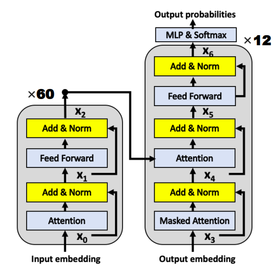
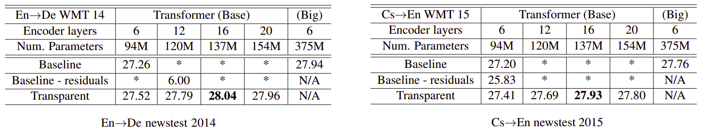
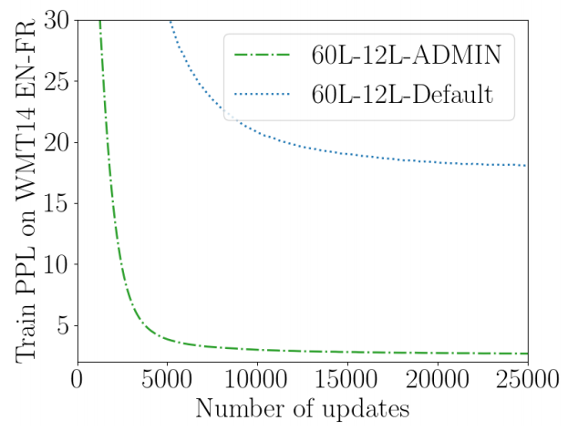
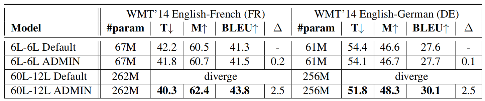
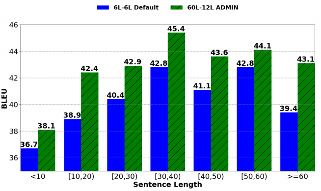
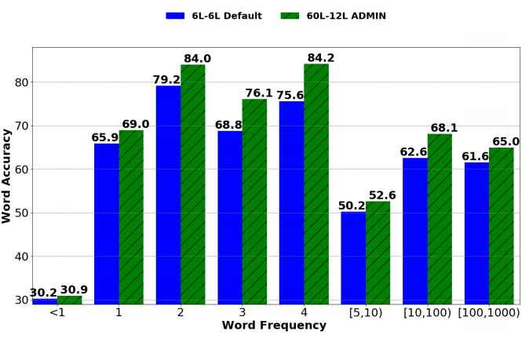
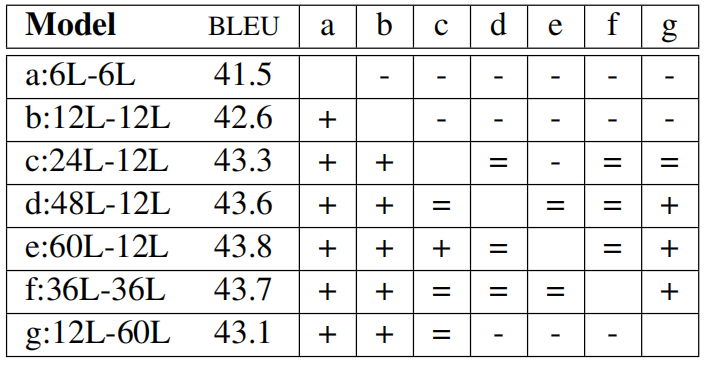

Using a simple yet effective initialization technique that stabilizes
training, researchers at Microsoft Research were able to build very deep
[Transformer](https://anwarvic.github.io/machine-translation/Transformer)
models with up to 60 encoder layers. These models were explored in this
paper published in 2020: [Very Deep Transformers for Neural Machine
Translation](https://arxiv.org/pdf/2008.07772.pdf). The official code
for this paper can be found in the following GitHub repository:
[exdeep-nmt](https://github.com/namisan/exdeep-nmt).

    

> **Note:**\
I suggest reading the
[Transformer](https://anwarvic.github.io/machine-translation/Transformer)
post first before going on especially the part about "Layer
Normalization".

The capacity of a neural network influences its ability to model complex
functions. Very deep neural network models have proved successful in
computer vision such as ResNet-101 and Inception networks. In NMT,
researchers from Google have shown in this paper: [Training Deeper
Neural Machine Translation Models with Transparent
Attention](https://arxiv.org/pdf/1808.07561.pdf) (published in 2018)
that it is difficult to train deep Transformers whose encoder depth is
increased beyond 12 layers as shown in the following table:

    

In the previous table, * indicates that a model failed to train. As we
can see, Transformers beyond 12 layers all failed to train. And that's
due to gradient vanishing; since the error signal needs to traverse
along the depth of the encoder.

That's why models with "Transparent" attention were able to train.
"Transparent Attention" behaves akin to creating trainable weighted
residual connections along the encoder depth, allowing the dispersal of
error signal simultaneously over encoder depth and time.

In this paper, they are re-investigating the deeper Transformer models
but with a new initialization technique called ADMIN which remedies the
problem. This enables training Transformers that are significantly deep.

ADMIN Initialization
--------------------

The ADMIN initialization technique was proposed in 2020 by researchers
from Microsoft and published in this paper: [Understanding the
difficulty of training
transformers](https://arxiv.org/pdf/:2004.08249.pdf). This technique
reformulates the layer-normalization equation. First, let's recap the
layer normalization formula used in the
[Transformer](https://anwarvic.github.io/machine-translation/Transformer)
model:

$$x_{i} = \text{LayerNom}\left( x_{i - 1} + f\left( x_{i - 1} \right) \right)$$

Where $f$ represents either the attention function or the feed-forward
sub-layer. This process repeats $2 \times N$ times for a $N$-layer
encoder and $3 \times M$ times for a $M$-layer decoder. ADMIN
reformulates this equation by using a constant vector $\omega_{i}$ that
is element-wise multiplied to $x_{i - 1}$ in order to balance the
contribution against $f\left( x_{i - 1} \right)$:

$$x_{i} = \text{LayerNom}\left( x_{i - 1}.\omega_{i} + f\left( x_{i - 1} \right) \right)$$

ADMIN initialization method is effective in ensuring that training does
not diverge, even in deep networks. It involves two phases:

-   **Profiling Phase:** At the profiling phase, we follow these steps:

    -   We randomly initialize the model parameters and we set $\omega_{i} = 1$.

    -   Then, we and perform one step forward pass.

    -   Then, compute the variance of the residual output at each layer:

$$V\text{ar}\left\lbrack f\left( x_{i - 1} \right) \right\rbrack$$

-   **Training Phase:** At the training phase, we follow these steps:

    -   We fix $\omega_{i}$ to be:

$$\omega_{i} = \sqrt{\sum_{j < i}^{}{V\text{ar}\left\lbrack f\left( x_{i - 1} \right) \right\rbrack}}$$

-   Then, train the model like normal.

-   After training is finished, $\omega_{i}$ can be removed to recover the
    standard Transformer architecture.

The following figure shows the learning curve of 60L-12L Transformer
when initialized with the default initialization once and with ADMIN
once. As we can see, the default initialization has difficulty
decreasing the training perplexity; its gradients hit NaN, and the
resulting model is not better than a random model.

    

Experiments
-----------

Experiments were conducted using Transformers with 512-dim word
embedding, 2048 feed-forward model size, and 8 heads on standard WMT'14
English-French (36 Million) dataset using 40k subword vocabulary, and
English-German (4.5 Million) dataset using 32k subword vocabulary. They
used max tokens of 3584 in each batch. They used RAdam optimizer with
two configurations:

-   **French-English:** 8000 warm-up steps, 50 max epochs, and 0.0007 as
    learning rate.

-   **German-English:** 4000 warm-up steps, 50 max epochs, and 0.001 as
    learning rate.

The following table shows the test results on WMT'14 benchmarks, in
terms of TER (T↓), METEOR (M↑), and BLEU. ∆ shows difference in BLEU
score against baseline 6L-6L. As we can see, 60L-12L ADMIN outperforms
all other models and achieves new state-of-the-art benchmark results on
WMT14 English-French (43.8 BLEU and 46.4 BLEU with back-translation) and
WMT14 English-German (30.1 BLEU):

    

The following figure shows the BLEU score over multiple sentence length
ranges of 6L-6L default Transformer versus 60L-12L ADMIN transformer
which indicates that Very Deep Transformer shows progress over all
sentence lengths.

    

Same results can be seen in the following figure when considering the
word frequency. As we can see, Very Deep Transformers improve
translation of low frequency and high frequency words as well:

    

Also, they experimented with different number of encoder and decoder
layers and results are shown in the following table where (+) means the
row outperforms the column, (-) means under-performs, and (=) means no
statistically significant difference.

    

The pairwise comparison of models shown that <u><strong>deeper encoders are more
worthwhile than deeper decoders</strong></u>.
