As NMT systems are built on deep learning methodology which means that
they exhibit both the strengths and weaknesses of the approach. For
example, NMT systems make the best use of very large datasets but on the
other hand they are poorly understood. For example, in many commercial
translation systems, entering repeated words many times occasionally
results in strange translations like this one from Vice's [blog
post](https://www.vice.com/en_uk/article/j5npeg/why-is-google-translate-spitting-out-sinister-religious-prophecies):

    

This phenomenon was named "Hallucination" by researchers at Google AI
when writing their paper: [Hallucinations in Neural Machine
Translation](https://openreview.net/pdf?id=SJxTk3vB3m) published in 2018. They
called it "Hallucination" since the output is untethered from the input. The
paper "[The Curious Case of Hallucinations in Neural Machine Translation
](https://arxiv.org/pdf/2104.06683.pdf)" published in 2021 by Microsoft has
categorized the "Hallucination" phenomenon into two categories:

-   Hallucinations under Perturbations (HP)

-   Natural Hallucinations (NH)

Hallucination Under Perturbation (HP)
-------------------------------------

This type of hallucination was first discussed by [Hallucinations in
Neural Machine Translation](https://openreview.net/pdf?id=SJxTk3vB3m)
paper which was published in 2018 by Google AI. In this paper, the
researchers were able to reproduce hallucination by just adding a single
token to the input source sentence. They called this process
"perturbation". And they defined the hallucination as <u><strong>a translation
of a perturbed input sentence that has almost no words in common with
the translation of the unperturbed sentence</strong></u>. Hallucination Under
Perturbation can be categorized into four types:

-   Grammatically correct output that bears no relation to the input
    text:

    

-   Ungrammatical output with oscillatory structure:

    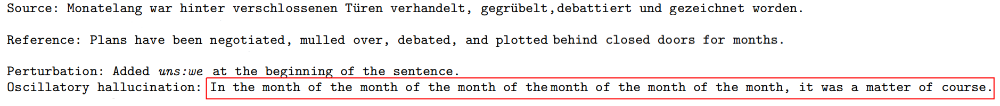

-   Output that remains largely in the source language:

    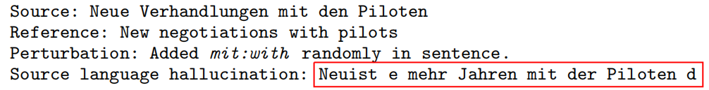

-   Output that jumps to the end of the sequence:

    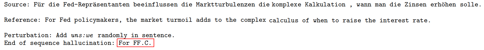

Using the [GNMT](https://anwarvic.github.io/machine-translation/GNMT)
model with a single layered bidirectional LSTM in the encoder and two
layered unidirectional LSTM in the decoder plus the attention mechanism,
BPE encoded vocabulary, and the following algorithm, they were able to
produce hallucination in $73\%$ of sentences in WMT De→En 2016 test set
using a greedy decoding and $48\%$ using beam search decoding:

    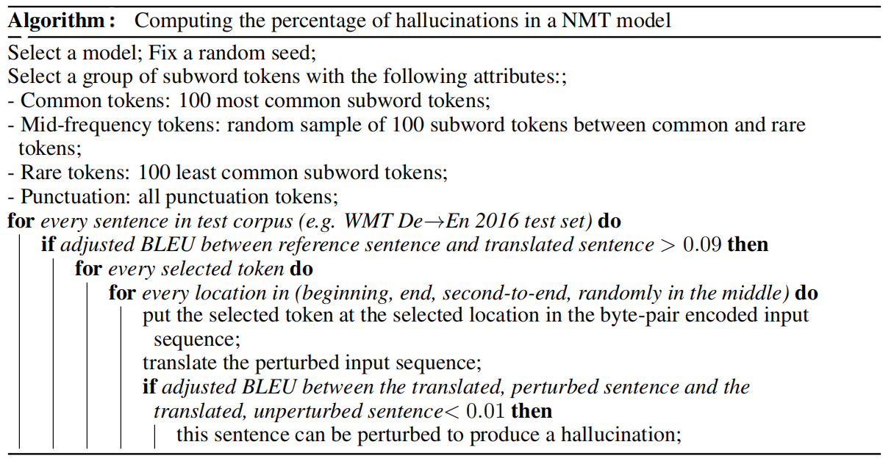

The algorithm goes as follows:

-   First, they split tokens into several types: common (100 most common
    tokens), rare (100 least common tokens), mid-frequency tokens
    (randomly sampled 100 tokens from the remaining tokens), and
    punctuation tokens.

-   Then, they used an **adjusted BLEU** score to evaluate the model's
    hypotheses. They adjusted the BLEU score by re-weighting the n-grams
    in the BLEU score computation to favor having any words in common
    between the two sentences (1.0 for one-grams and 0.8 for bi-grams
    and disregarded other n-grams).

-   According to the paper, poor translations tend to have adjusted BLEU
    score $\leq 0.09$. So, they discarded them and kept good
    translations. The following are few examples on how the adjusted
    BLEU scores change by changing the translation quality:

    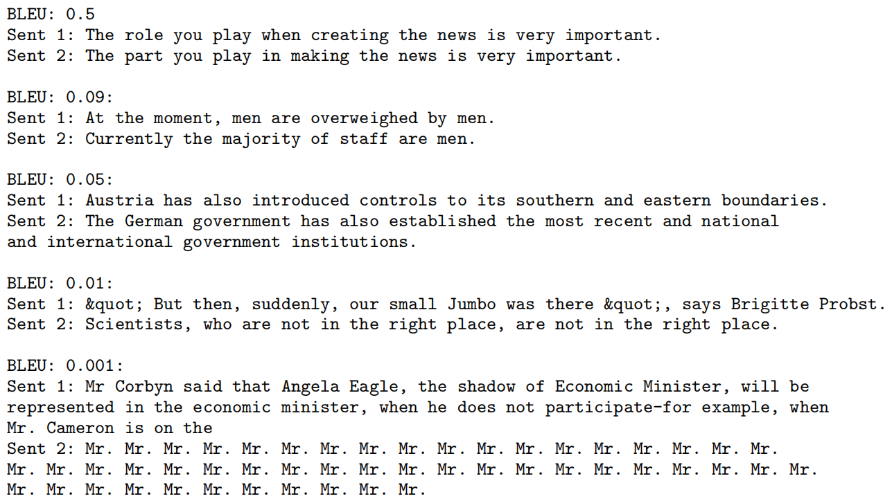

-   Then, each source sentence in the dataset -that had good translation- is
    perturbed by inserting a token at one of the following positions:
    <u><strong>beginning</strong></u>, <u><strong>end</strong></u>,
    <u><strong>second to the end</strong></u>, or <u><strong>randomly in the
    middle</strong></u>.

-   Then, the model tries to translate this perturbed sentence. If the
    adjusted BLEU score of the new translation is $\leq 0.01$, this
    sentence is considered a "hallucination".

They studied the effect of different hyper-parameters (canonical model with
greedy decoding, beam search decoding, 512 & 1024 hidden units, 16k & 32k BPE
codes) respectively affected hallucination percentages. They found that
**beam search** and **increasing the vocabulary size to 32K BPE codes** did
significantly lower the mean percentage of hallucinations; that's why they
have a red star ☺.

    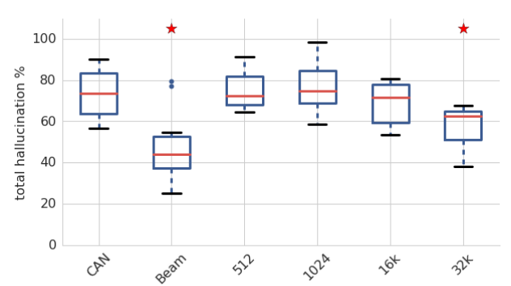

They also studied how different types of perturbations (using common tokens
only, using mid-frequency tokens only, using rare tokens only, at the beginning
of the sentence, at the end of the sentence, at the second-end of the sentence,
randomly in the middle of the sentence) respectively impacted the hallucination
percentage of the canonical model. As seen from the following figure,
<u><strong>adding a perturbing token to the beginning</strong></u> of the input
sequence produces the least hallucinations.

### Reduce HP

Later in the same paper, they investigated the effect of different
methodologies on the hallucination percentage. They used the following
techniques along with the canonical GNMT model introduced earlier:

-   **DO:** Dropout regularization of $0.1$ in all feed-forward layers.

-   **L2E:** L2 regularization on embeddings.

-   **L2R:** L2 regularization on recurrent weights.

-   **L2:** L2 regularization on all weights

-   **DA:** Data augmentation on the training data by perturbing all
    training sentences. This doubled the training set.

-   **TDIS:** "Tied Decoder with Initial State" is a dynamical
    regularization method where the initial state of the decoder was
    tied to last step of the encoder.

-   **CFN:** "Chaos-free network" is a dynamical regularization method
    which cannot produce chaos. This was done by replacing the LSTM
    cells with CFN cells with 256 hidden units.

> **Note:**\
All L2 regularization used weighting hyper-parameters of $1 \times 10^{- 4}$
and $1 \times 10^{- 5}$.

According to the following graph, the canonical model with the augmented
training data <u><strong>(DA) has the least percentage of
hallucination</strong></u>. On the other hand, the CFN model resulted in a
significant increase in the hallucination percentage:

    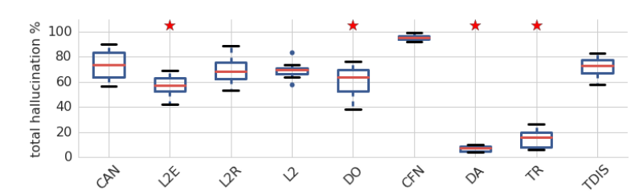

Since Data augmentation (DA) resulted in the least hallucination percentage,
they studied it further with different perturbation methods. They found out
that <u><strong>DA model would be less prone to hallucinate when perturbed with
types of tokens or positions it had been trained against</strong></u>.

    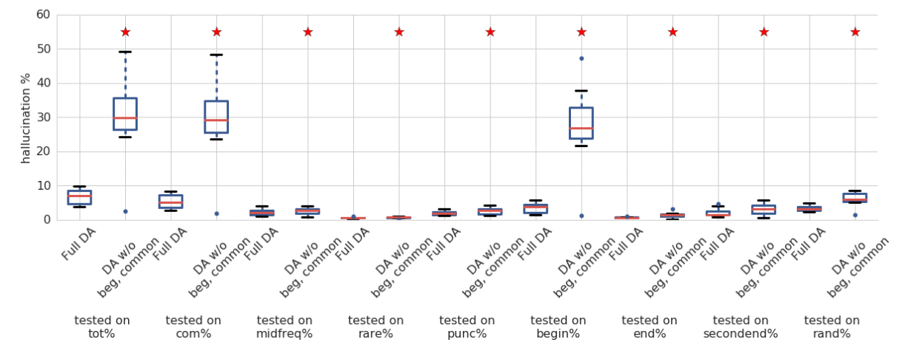

And according to the previous graph, <u><strong>the most reliable way to produce
hallucination is to append a common token at the beginning of the source
sentence</strong></u>.

> **Very Important Note:**\
They studied the [Transformer
](https://anwarvic.github.io/machine-translation/Transformer) model (TR)
implemented in the [Tensor2Tensor](https://github.com/tensorflow/tensor2tensor)
library with tiny-configuration (2 hidden layers, 128 hidden size, 512 filter
size, and 4 heads) and had a greedy BLEU score of 17.5, which is a little lower
than our GNMT models. They found out that the transformer model hallucinates
significantly less than the GNMT canonical model. However, it still can be
perturbed to hallucinate on average $15\%$ of the time.
>
> 

>    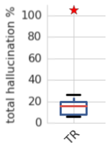
> 

### Reason Behind HP

In the "[Hallucinations in Neural Machine
Translation](https://openreview.net/pdf?id=SJxTk3vB3m)" paper, the
researchers didn't provide an answer to "why this perturbation generates
hallucination?". Luckily, the paper "[The Curious Case of Hallucinations
in Neural Machine Translation](https://arxiv.org/pdf/2104.06683.pdf)"
published in 2021 has a hypothesis that explains the reason which is
"<u><strong>Samples that have high memorization values in the NMT model
are most likely to generate hallucinations when perturbed</strong></u>".

To validate this hypothesis, they used the Memorization Value Estimator
(MVE) algorithm proposed by this paper: "[What neural networks memorize
and why: Discovering the long tail via influence
estimation](https://papers.nips.cc/paper/2020/hash/1e14bfe2714193e7af5abc64ecbd6b46-Abstract.html)"
to calculate the memorization values of sentences. The MVE algorithm can
be seen down below where $S$ is IWSLT-2014 De-En dataset with $n = 160k$
samples, $A$ is a Transformer model, $t = 10$, $M$ is BLEU:

    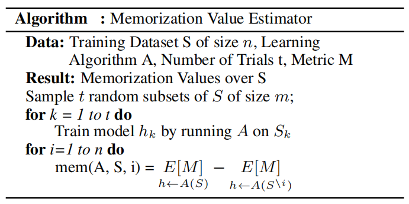

Then, they perturbed the highest sentences that values into a certain
range of memorization values. And Since, each input sentence can appear
in the hallucinated samples multiple times, they reported both Unique
and Total number of Hallucinations generated:

    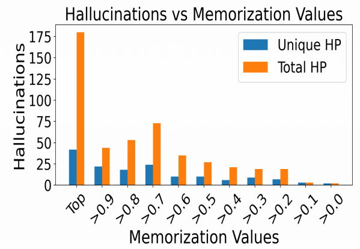

The previous figure shows that as the memorization values increase, the number
of unique (Unique HP) as well as total hallucinations (Total HP) keeps
increasing as well, demonstrating a <u><strong>strong positive correlation
between hallucination frequency and memorization values</strong></u>.

Natural Hallucination (NH)
--------------------------

Natural Hallucinations is the type of hallucination that happens to an
unperturbed input source sequence where the NMT model tend to generate
translations that are severely inadequate. Natural hallucinations can be
categorized into two categories:

-   **Detached Hallucinations:** A fluent but completely inadequate
    translation.

    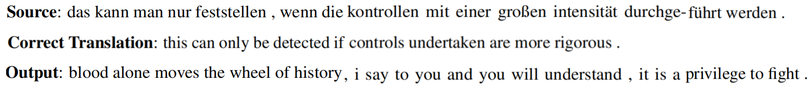

-   **Oscillatory Hallucinations:** A translation that contains
    repeating n-grams.

    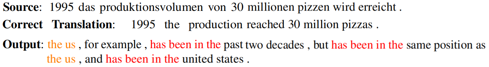

### Reason Behind NH

In the same paper, the researchers provided a hypothesis to explain why
Natural Hallucinations exist. They suggested that <u><strong>Corpus-level
noise patterns (invalid source-target pairs) dictate the type of natural
hallucinations generated by the NMT model</strong></u>.

To validate this hypothesis, they needed to create corpus-level noised
data. To be able to do that, they first constructed IRS (invalid
reference set) which is a small set of 21 invalid source-target pairs
chosen randomly. Then, they created four different corpus-level noised
data; each is 21k samples of invalid source-target sentence pairs. By
invalid, I mean the target sentence is not a valid translation for the
source sentence.

The idea behind designing the following corpus-level noise patterns is
that they are very common in web-based corpora due to the widespread of
automatic mining algorithms. Also, each noise pattern challenges
something different in the translation model:

<table>
    <thead>
        <tr>
            <th>Noise Pattern</th>
            <th>Description</th>
            <th>Challenges</th>
        </tr>
    </thead>
    <tr>
        <td>Unique-Unique (U-U)</td>
        <td>21K random unique source sentences; each sentence is paired with
        an unrelated unique random target sentence.</td>
        <td>Both encoder and decoder are required to produce representations
        that are vastly different than the one seen before in the data.</td>
    </tr>
    <tr>
        <td>Repeat-Repeat (R-R)</td>
        <td>21 unique source sentences from IRS, and pair each with unrelated
        unique random target sentence from IRS, and repeat each such pair 1000
        times.</td>
        <td>Challenges the memorization of the model.</td>
    </tr>
    <tr>
        <td>Repeat-Unique (R-U)</td>
        <td>The same 21 random unique source sentences as RR, repeat each 1000
        times, and pair each repeat with unrelated unique random target
        sentence from WMT.</td>
        <td>The decoder is required to generate unique translations for the
        same sources, thereby encouraging decoder instability.</td>
    </tr>
    <tr>
        <td>Unique-Repeat (U-R)</td>
        <td>21 random unique target sentences from the IRS. Each target
        sentence is repeated 1000 times, each repeat is paired with an
        unrelated unique random source sentence from WMT.</td>
        <td>The encoder is required to produce the same representations for
        unique inputs.</td>
    </tr>
</table>

Then, they trained 5 transformer models. Each model is six layers with
$512$ embedding size, $1024$ FFN layer dimension, and $4$ attention
heads. Training was done on the IWSLT En-De 2014 corpus (160K samples) +
corpus-level noised data leaving one model without noise. Then, they
analyzed the resulting models in terms of the generated translations on
three different sets:

-   **IWSLT:** The IWSLT De-En 2014 test set.

-   **Invalid reference set (IRS):** The 21 unique detached
    source-target sentence pairs.

-   **Valid reference set (VRS):** The same 21 source sentences as the
    IRS, but now they are paired with their valid (correct) references.

> **Note:**\
IRS set exists in four corpus-noise patterns: it is contained in the
RR training data, its source sentences are present in the RU
training data and its target sentences are present in the UR
training data. The main purpose of evaluating models on IRS is to
measure memorization of the overlapping source/targets.

Using the above three evaluation sets, they computed the following metrics:

-   **BLEU:** The BLEU score for each evaluation set.

-   **IRS-NH:** The percentage of natural hallucinations (NH) (manually
    identified) in the translations of the IRS.

-   **IRS-OH:** The percentage of oscillatory hallucinations (OH)
    (manually identified) in the translations of the IRS.

-   **IRS-Repeats:** The percentage of the hallucinations that exactly
    match a reference in the training data.

The results can be seen in the following table where the boxes marked with '-'
are the cases that didn't convey any useful information:

    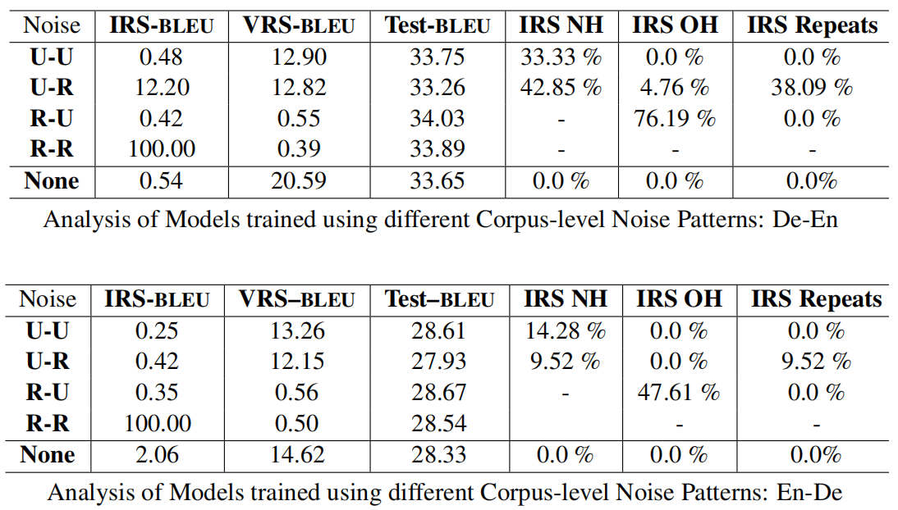

From the previous table, we can say the following:

-   The Test-BLEU is not greatly affected by the corpus-level noise.

-   The IRS-BLEU indicates that the model memorized the IRS data when
    R-R noise pattern is used, which makes total sense.

-   The U-R and U-R noise patterns lead to high natural hallucinations.

-   The R-U noise pattern leads to a very high percentage of oscillatory
    hallucinations.

The past hallucination stats were done manually. This is not scalable,
that's why they proposed an automatic NH detection algorithm that can
work on scale. The algorithm works at the corpus-level:

    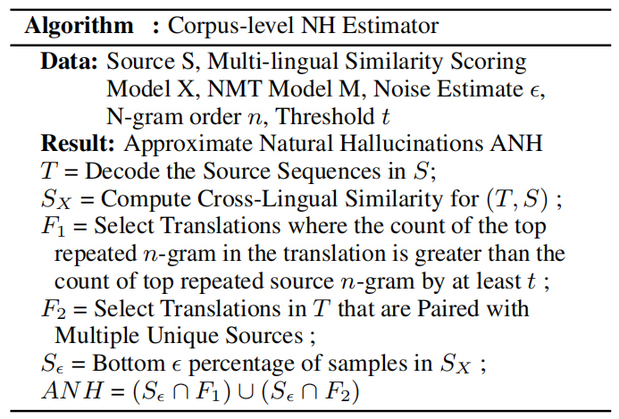

They used the past algorithm to measure the effect of Knowledge
Distillation (KD) and Back-translation (BT) techniques on natural
hallucinations. And they found out that:

-   For both KD and BT, U-R noise pattern leads to severe amplifications
    while R-R causes the least hallucinations.

-   For KD, all noise patterns lead to increase in natural
    hallucination.

-   For BT, U-R and U-U noise patterns lead to large number of repeated
    generations.

The official code and datasets used in the past experiments can be found in the
following GitHub repository: [hallucinations](https://github.com/vyraun/hallucinations).
