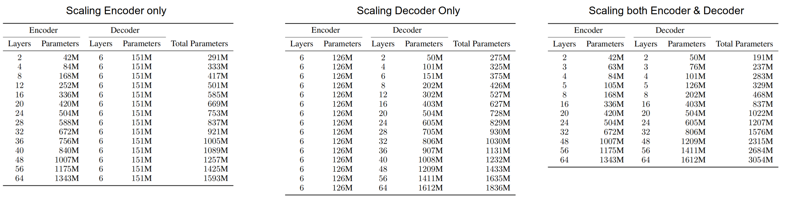
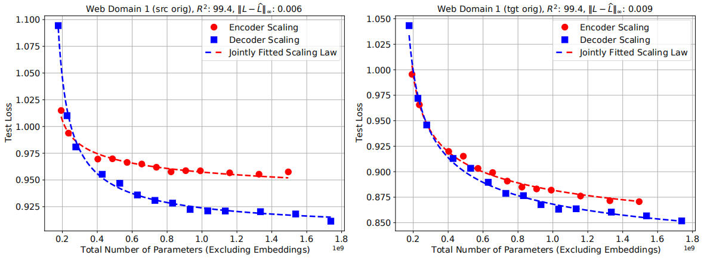
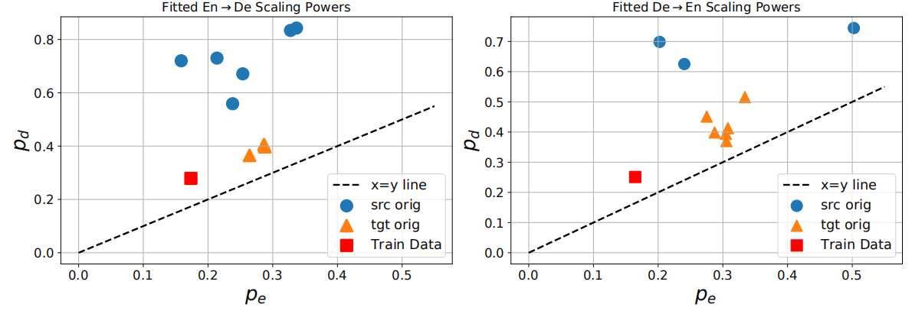
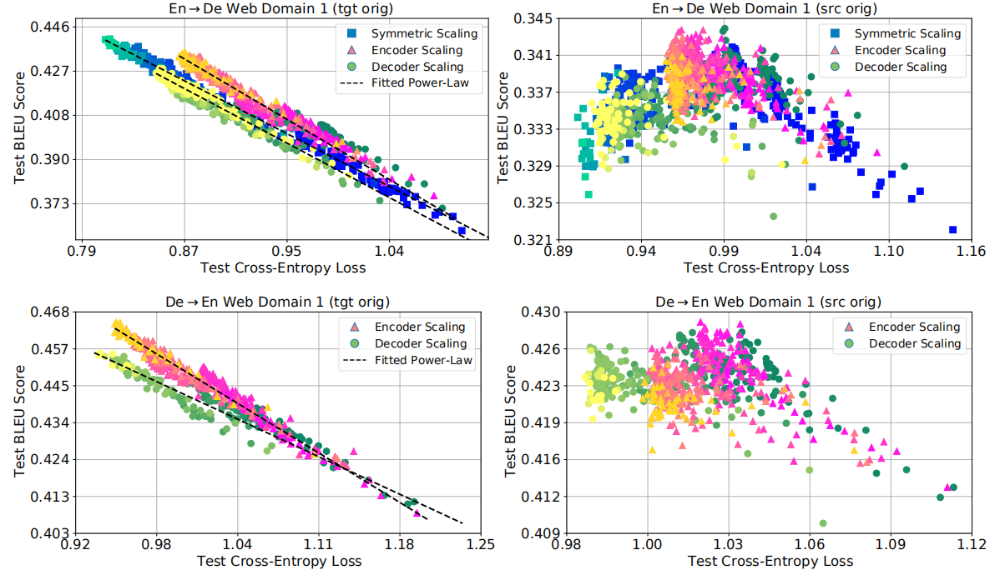

Scaling model sizes, datasets and the total computation budget has been
identified as a reliable approach to improve generalization performance
on several machine learning tasks. Here, we are going to discuss a paper
called "[Scaling Laws for Neural Machine
Translation](https://arxiv.org/pdf/2109.07740.pdf)" published by Google
Research in 2021 where the researchers study the effect of scaling the
transformer depths on the performance.

Experiments
-----------

All experiments in this paper were performed using a series of
[Transformer](https://anwarvic.github.io/machine-translation/Transformer)
networks where the model dimension to $1024$, feed-forward layer
dimension to $8192$, number of attention heads to $16$, attention hidden
dimension to $1024$, and varying layers as shown in the following figure
knowing that the baseline is a 12-layer encoder 12-layer decoder
Transformer model:

<div align="center">
    
</div>

All models were trained with a cross-entropy loss and Adafactor
optimizer. All models were trained for $500k$ training steps with a
fixed batch-size of $500k$ tokens. All models were regularized using a
dropout rate of $0.1$, label smoothing of $0.1$, and a gradient clipping
of $10$ to improve the training stability.

### Training Data

All results -in this paper- were reported on two language pairs,
(English→German) and (German→English) using an in-house web-crawled
dataset with around 2.2 billion sentence pairs for both translation
directions. A sentence-piece vocabulary of size $32k$ was used for
training all models. This dataset provides a large enough training set
to ensure the dataset size is not a bottleneck in the model performance.

### Evaluation Data

To evaluate these models, they used a variety of test sets covering
different domains such as <u><strong>Web-Domain</strong></u>,
<u><strong>News-Domain</strong></u>, <u><strong>Wikipedia</strong></u>, and
<u><strong>Patents</strong></u>. The news-domain test sets come from the
WMT2019 evaluation campaign (newstest2019) while the other test sets are
internal test sets.

Throughout the paper, they refer to a certain data as either
"source-original" or "target-original", here is the difference:

-   **Source-original:** means that the <u><strong>source</strong></u>
    sentences have been crawled from the web while the reference translations
    were generated later by professional translators.

-   **Target-original:** means that the <u><strong>target</strong></u>
    sentences have been crawled from the web while the reference
    translations were generated later by professional translators.

Scaling Effect on Loss
----------------------

In the paper, the researchers were able to find a formula that could
capture the effect of scaling the encoder/decoder layers on the
performance of a certain test set. Given the English→German web-domain
test set, they trained multiple models with different encoder/decoder
layers and measured the perplexity of each model on the test set. The
following graph shows the performance of the encoder-scaling and
decoder-scaling on source-original (left) and target-original (right):

<div align="center">
    
</div>

As we can see, the dashed line of each case fits the points perfectly
(variance $R^{2} = 99.4$). These dashed lines were creating using the
power law of the form:

$$\widehat{L}\left( N \right) = \alpha N^{- p} + L_{\infty}$$

Where $N$ is the total number of parameters outside of embedding /
softmax layers and $\left( \alpha,\ p,\ L_{\infty} \right)$ are the
fitted parameters of the power law <u><strong>which change based on the
data</strong></u>.

Now, given a Transformer model of $\overline{N}_e$ encoder layers
and $\overline{N}_d$ decoder layers trained on a certain dataset,
the following formula predicts the new performance on the same dataset
when the encoder layers become $N_e$ and the decoder layers become
$N_d$:

$$\widehat{L}\left( N_{e},\ N_{d} \right) = \alpha\left( \frac{\overline{N}_e}{N_{e}} \right)^{p_{e}}\left( \frac{\overline{N}_d}{N_{d}} \right)^{p_{d}} + L_{\infty}$$

Where the parameters
$\left( \alpha,\ p_{e},\ p_{d},\ L_{\infty} \right)$ are achieved using
the following algorithm that uses `scipy.optimize.least_squares()`
function for curve fitting while using `'soft_l1'` loss option which is
a popular option to have some robustness to outliers:

```python
def func(p, x, y):
    """
    Fitting a bi-variate scaling law.
    p: A 1-D array of dim 4, corresponding to alpha, p_e, p_d, l_inf.
    x: A matrix of dimension n \times 2. First column encoder params,
    second col decoder params.
    y: A 1-D array of log-perplexity of dim n.
    """
    x_e = NE_bar / x[:,0]
    x_d = ND_bar / x[:,1]
    return p[0] * np.power(x_e, p[1]) * np.power(x_d, p[2]) + p[3] - y


def fit_model(x, y, f_scale):
    X = x.to_numpy().copy()
    y = y.to_numpy().copy()
    if np.isnan(X).any() or np.isnan(y).any():
        raise ValueError('Data contains NaNs')
    if len(y.shape) > 1 or y.shape[0] != X.shape[0]:
        raise ValueError('Error in shapes')
    p0 = np.zeros((4 ,))
    p0[0] = 0.2 # alpha
    p0[1] = 0.4 # p_e
    p0[2] = 0.6 # p_d
    p0[3] = 1.0 # l_inf
    fit = least_squares(func, p0, loss='soft_l1', f_scale=f_scale,
        args=(X, y), max_nfev=10000, bounds=(0, 10))
return fit
```

> **Note:**\
The parameter $\alpha$ corresponds to the maximum loss reduction
compared to the baseline model, while the parameter $L_{\infty}$
corresponds to the irreducible loss of the data.

The above formula captures the scaling behavior of the Transformer NMT
models over a certain dataset. The following figure shows different
values of the encoder exponent and the decoder exponent over multiple
test sets:

<div align="center">
    
</div>

As we can see, the decoder exponents $p_{d}$ were observed to be larger
than the encoder exponents $p_{e}$. As a result, <u><strong>when improving the
test loss is concerned, it is much more effective to scale the decoder
rather than the encoder</strong></u>. This is contrary to the usual practice
where many practitioners train NMT models with deep encoders and shallow
decoders.

Now to a very important question, "what is the optimal Transformer size
given a certain dataset?" The paper proposed the following formula which
predicts the optimal size for both the encoder and the decoder:

$$N_{e}^{*} = \frac{p_{e}}{p_{e} + p_{d}}B,\ \ \ \ \ \ \ \ N_{d}^{*} = \frac{p_{d}}{p_{e} + p_{d}}B$$

Where $B$ is the total number of parameters you can afford in your
organization. In addition, when optimally scaling the model, the scaling
law reduces to:

$$\alpha^{*} \equiv \alpha\left( \frac{\overline{N}_e\left( p_{e} + p_{d} \right)}{p_{e}} \right)^{p_{e}}\left( \frac{\overline{N}_d\left( p_{e} + p_{d} \right)}{p_{e}} \right)^{p_{d}}$$

> <u><strong>Important Note:</strong></u>\
In the paper, they found out that symmetrically scaling the encoder and
decoder layers, which yields $\frac{N_{d}}{N} \approx 0.55$, is barely
distinguishable from the optimal scaling scheme.

Scaling Effect on Quality
-------------------------

They examined the effects of scaling on the output quality as measured
by BLEU score. The following figure presents the co-evolution of BLEU
score and cross-entropy loss throughout the training for all of our
models.

<div align="center">
    
</div>

Depending on the construction of the test sets, two different empirical
behaviors emerge:

-   On <u><strong>target-original test sets</strong></u>, larger models are able to
    improve (lower) the test loss which was accompanied with consistent
    improvements (increases) in BLEU score. In fact, the following
    simple power law can capture the relation:

$$BLEU = c_{B}L^{- p_{B}}$$

-   On <u><strong>source-original test sets</strong></u>, larger models
    consistently achieve better (lower) test losses, however, beyond a certain
    threshold, BLEU scores begin to deteriorate.

-   Also, a careful look at the left-subplots brings up another
    interesting trend. At similar values of the test loss,
    <u><strong>encoder-scaled models result in better generation quality
    compared to decoder-scaled models</strong></u>. This findings agrees with
    previous work that relied on encoder-scaling when optimizing for
    BLEU.

