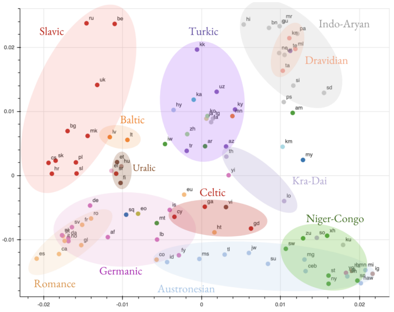
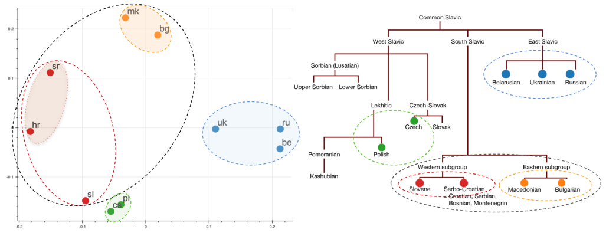
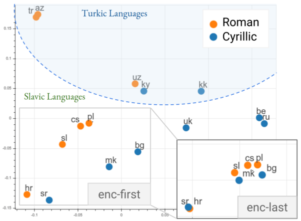
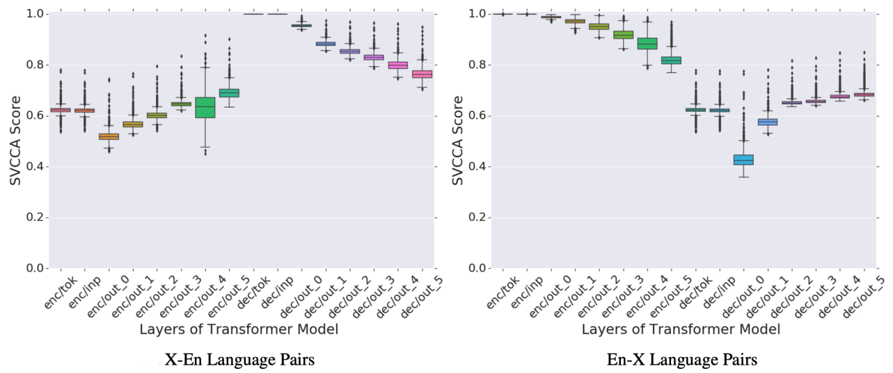

Multilingual Neural Machine Translation (MNMT) models have yielded large
empirical success in transfer learning settings. However, these
black-box representations are poorly understood, and their mode of
transfer remains elusive. This paper "[Investigating Multilingual NMT
Representations at Scale](https://arxiv.org/pdf/1909.02197.pdf)"
published by Google in 2019 attempted to understand MNMT representations
(specifically [Google's
M4](https://anwarvic.github.io/multilingual-nmt/M4) model) using
Singular Value Canonical Correlation Analysis (SVCCA). Google's
unofficial code for the SVCCA framework can be found on their official
GitHub repository: [google/svcca](https://github.com/google/svcca).

## SVCCA Recap

As mentioned earlier, SVCCA stands for "Singular Value Canonical
Correlation Analysis" which is a technique to compare vector
representations in a way that is both invariant to affine
transformations and fast to compute. This framework was proposed by
Google Brain in 2018 and published in this paper: [SVCCA: Singular
Vector Canonical Correlation Analysis for Deep Learning Dynamics and
Interpretability](https://arxiv.org/pdf/1706.05806.pdf). The following
is how SVCCA works.

For a given dataset of $n$ examples
$X = \left\\{ x_{1},\ ...\ x_{n} \right\\}$,
$z_{i}^{l} \in \mathbb{R}^{n}$ is defined as a vector of the neuron $i$
values of layer $l$ in a neural network across all examples. <u><strong>Note
that this is a different vector from the often-considered "layer
representation" vector of a single point.</strong></u> Within this
formalism, the Singular Vector Canonical Correlation Analysis (SVCCA)
proceeds as follows:

-   SVCCA takes as input two (not necessarily different) sets of neurons
    (typically layers of a network):

$$l_{1} = \left\{ z_{1}^{l_{1}},\ ...z_{n}^{l_{1}} \right\},\ \ \ \ \ l_{2} = \left\{ z_{1}^{l_{2}},\ ...z_{n}^{l_{2}} \right\}$$

-   First, SVCCA performs a Singular Value Decomposition (SVD) of each
    subspace to get smaller dimension while keeping $99\%$ of the
    variance.

$${l'}_{1} = SVD\left( l_{1} \right) = \left\{ {z'\ }_{1}^{l_{1}},\ ...{z'\ }_{n_{1}}^{l_{1}} \right\},\ \ where\ n_{1} < n$$

$${l'}_{2} = SVD\left( l_{2} \right) = \left\{ {z'\ }_{1}^{l_{2}},\ ...{z'\ }_{n_{2}}^{l_{2}} \right\},\ \ where\ n_{2} < n$$

-   Then, SVCCA uses the Canonical Correlation Analysis (CCA) to
    linearly transform ${l'}_1$ and ${l'}_2$ to be as aligned as
    possible. CCA is a well established statistical method for
    understanding the similarity of two different sets of random
    variables. It does that by linearly transform (${l'}_1$ and
    ${l'}_2$) vectors to another vectors (${\widetilde{l}}_1$ and
    ${\widetilde{l}}_2$) where the correlation
    $corr = \left\\{ \rho_1,\ ...\rho_{\min\left( n_1, n_2 \right)} \right\\}$
    is maximized:

$${\widetilde{l}}_{1} = W_{1}{l'}_{1} = \left\{ {\widetilde{z}}_{1}^{l_{1}},\ ...{\widetilde{z}\ }_{n_{1}}^{l_{1}} \right\}$$

$${\widetilde{l}}_{2} = W_{2}{l'}_{2} = \left\{ {\widetilde{z}}_{1}^{l_{2}},\ ...{\widetilde{z}\ }_{n_{2}}^{l_{2}} \right\}$$

-   With these steps, SVCCA outputs pairs of aligned directions,
    (${\widetilde{z}}_i^{l_1}$ , ${\widetilde{z}}_i^{l_2}$) and
    how well they correlate, $\rho_i$.

Now that we have reviewed what SVCCA is all about; let's get back to
the paper and see how they used SVCCA. In the paper, they applied
SVCCA on the sentence-level of the hidden representation of
[Google's M4](https://anwarvic.github.io/multilingual-nmt/M4) model
averaging over the sequence time-steps.

More concretely, given a batch of size $B$ sentences of max length
$T$ in a certain language, the hidden representation of any layer of
this MNMT model will be a tensor of $(B \times T \times C)$
dimension where $C$ is the model's dimension. Applying an average
pooling operation on the time-steps (sentence length) will result in
a matrix of $(B \times C)$ dimension. This is equivalent to assuming
that every token in a sentence from language A is equally likely to
be aligned to each token in an equivalent sentence in language B.

## MNMT Learns Language Similarity

Using the top-layer of the encoder of [Google's
M4](https://anwarvic.github.io/multilingual-nmt/M4) model, they have
clustered all languages together based on their SVCCA similarities.
Then, they used the "Laplacian Eigenmaps" algorithm implemented in
scikit-learn as
[sklearn.SpectralEmbedding](
https://scikit-learn.org/stable/modules/generated/sklearn.manifold.SpectralEmbedding.html)
method to visualize these similarities across all languages found in the
dataset that was used to train [Google's
M4](https://anwarvic.github.io/multilingual-nmt/M4). This dataset is an
English-centric dataset containing sentences in 103 languages. The
following figure is the result:

    

From analyzing these similarities, they have observed remarkable
findings:

-   The resulting clusters are grouped not only by the language-family
    (e.g. Slavic), but also by branches within the language-family (e.g.
    South Slavic), branches within those branches (e.g. Western
    Subgroup), and dialects within those (e.g. Serbo-Croatian). The
    following figure is a visualization of the Slavic languages:

    

-   Clustering captures the linguistic similarity
    between languages (sharing similar grammatical properties) and the
    lexical similarity (having the same alphabet/scripts and thus
    sharing many subwords). However, the the lexical similarity gets
    weaker as we move up on the encoder level. The following figure
    shows the representations of the Turkic and Slavic languages; within
    each family there are languages that are written in Cyrillic and
    Roman alphabets. As you can see languages that use Cyrillic-scripts
    (blue) are clustered together according to the first encoder layer's
    representation. However, they get closer to the Roman-scripts
    languages (orange) at the last encoder layer's representation.

    

-   Similarity evolves across encoder/decoder Layers. For each layer,
    they first computed the pair-wise similarity between all pairs of
    languages. Then, they aggregated these score into a distribution and
    represented in the following figures.

    -   As seen in the X-to-English (left) figure:

        -   On the encoder side: the similarity between the source
            languages (X) increase as we move up the encoder layer,
            suggesting that the encoder attempts to learn a common
            representation for all source languages. However,
            representations at the last layer of the encoder are far
            from being perfectly aligned.

        -   On the decoder side: as the decoder incorporates more
            information from the source language (X), representations
            of the target (En) diverge. This is in line with some
            findings that show that the translated text is predictive
            of the source language.

    -   For English-to-Any (right) figure: We observe a similar trend
        where representations of the source language (En) diverge as
        we move up the encoder. Same as it happens with the decoder of
        the left figure.

    

