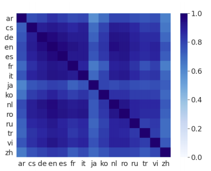
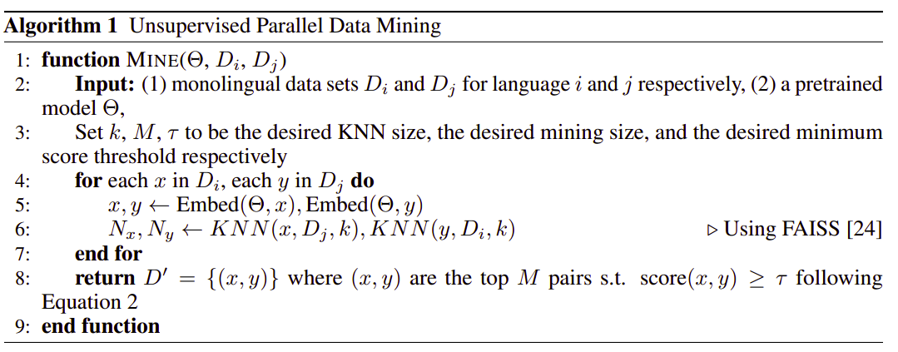
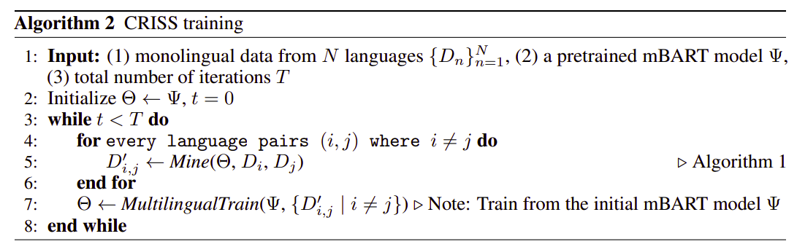
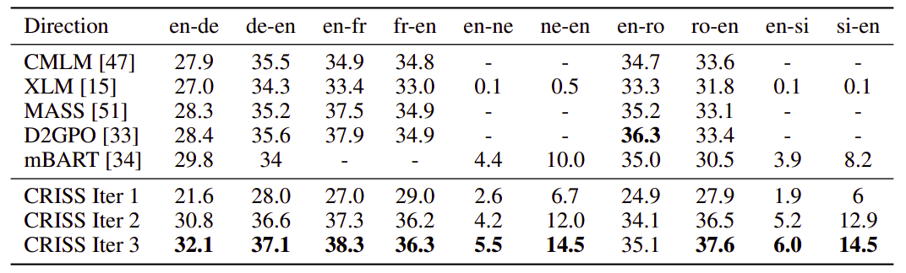

CRISS stands for "**C**ross-lingual **R**etrieval for **I**terative
**S**elf-**S**upervised Training" which was created by FacebookAI in
2020 and published in this paper: "[Cross-lingual Retrieval for
Iterative Self-Supervised
Training](https://arxiv.org/pdf/2006.09526.pdf). The official code for
this paper can be found in the fairseq GitHub repository:
[criss](https://github.com/pytorch/fairseq/blob/master/examples/criss).

CRISS is a novel self-supervised training technique that iteratively
trains a multilingual NMT model on mined bi-text data with the help a
cross-lingual model. The cross-lingual language model used here is a
pre-trained mBART model as shown below:

    

As see from the previous figure, CRISS consists of different components:

-   Cross-lingual language model (pre-trained mBART).

-   Bi-text Mined data.

-   Multilingual NMT (standard Seq2Seq Transformer Model).

Pre-trained mBART
-----------------

mBART is used with CRISS because it's able to form a language-agnostic
sentence representation. To understand the language agnosticity of
mBART, they performed the following study on the TED58 dataset which
contains multi-way translations of TED talks in 58 languages.

For each language pair, they encoded both the source and target
sentences using mBART to obtain two sentence representations. They did
that for the whole dataset. Then, for each sentence in the source
language, then found the closest sentence in the target language using
cosine similarity. And they found out that mBART was able to retrieve
the correct translation with 57% accuracy on average as shown in the
following figure:

    

The high retrieval accuracy suggests that the pre-trained mBART model is able
to generate language agnostic representation that are aligned at the semantic
level in the vector space. Moreover this cross-lingual representation can be
improved by a relatively small amount of parallel data of just one direction.
As we can see from the following figure, the sentence retrieval accuracy
was improved for all language directions by 27% (absolute) on average
after fine-tuning it on just Japanese-English parallel dataset (223, 000
sentence pairs in the IWSLT17).

    

> **Note:**\
This is a very important discover! This means that in order to train a
multilingual model that can translate between N languages, we don't need
to fine-tune it all $N(N - 1)$ language pairs, but only a subset of
them.

Bi-text Mining
--------------

To mine bi-text data without supervised signals, they proposed the
following algorithm which uses monolingual data of two languages as an
input and a pre-trained MNMT model. The full algorithms can be seen
below:

    

As we can see, the algorithm is pretty self-explanatory with three
additional functions used. Let's understand them one-by-one:

-   <u><strong>Embed():</strong></u>\
    This function takes a sentence and a model and returns the sentence
    representation of the given sentence resulting from the give model.

-   <u><strong>KNN():</strong></u>\
    This is the K-Nearest-Neighbor algorithm. This function takes as
    input three variables: the vector representation of the source
    sentence, the dataset of the target language, and an integer k. And
    it returns the nearest k vectors from the given dataset to the given
    sentence representation.
    [FAISS](https://github.com/facebookresearch/faiss) tool is used here
    for fast searching.

-   <u><strong>score():</strong></u>\
    This function takes as an input two sentence representations
    and returns the score based on the margin function which is
    considered cosine score normalized by average distances. The margin
    scoring function is defined below:

$$\text{score}\left( x,y \right) = \frac{\cos\left( x,y \right)}{\sum_{z \in N_{x}}^{}\frac{\cos\left( x,z \right)}{2k} + \sum_{z \in N_{y}}^{}\frac{\cos\left( z,y \right)}{2k}}$$

Using this algorithm enables us to create bi-text data in an
unsupervised manner. Now, let's get to how to use this mined bi-text
data to train MNMT model.

Multilingual Training
---------------------

The following algorithm shows how to perform a multilingual training.
First, we simply augment each mined pair $\left( x,y \right)$ of
sentences by adding a target language token at the beginning of y to
form a target language token augmented pair $\left( x,y' \right)$. Then,
we aggregate all mined pairs $\left\\{ \left( x,y \right)' \right\\}$
of the mined language pairs into a single data set to train a standard
seq2seq machine translation transformer models from the pre-trained
mBART model.

    

Unsupervised MT
---------------

CRISS was evaluated on unsupervised neural machine translation
benchmarks that cover both low resource and high resource language
directions. For English-French, they used WMT'14, for English-German and
English-Romanian, they used WMT'16 test data, and for English-Nepali and
English-Sinhala, they used Flores test set.

As shown in the following table, the CRISS model overperforms
state-of-the-art in 9 out of 10 language directions:

    

