CeMAT stands for " **C**onditional masked language pr**e**training model
for **Ma**chine **T**ranslation" which is a bidirectional encoder and a
<u><strong>bidirectional</strong></u> decoder multilingual
[Transformer](https://anwarvic.github.io/machine-translation/Transformer)
model with a cross-attention module for bridging them. CeMAT was
proposed by Huawei Noah's Ark Lab in 2022 and published in their paper:
[Universal Conditional Masked Language Pre-training for Neural Machine
Translation](https://arxiv.org/pdf/2203.09210.pdf). The official code
for this paper can be found in Huawei Noah's Ark Lab official GitHub
repository:
[huawei-noah/CeMAT](https://github.com/huawei-noah/Pretrained-Language-Model/CeMAT).

    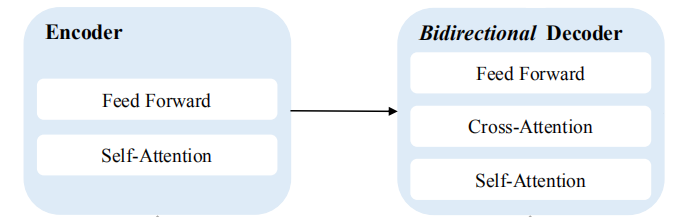

Benefiting from the bidirectional decoder structure, CeMAT can provide
unified initialization parameters not only for Autoregressive
translation, but also for non-autoregressive translation (NAT) directly.
NAT has been attracting more and more attention because of its feature
of parallel decoding, which helps to greatly reduce the translation
latency.

    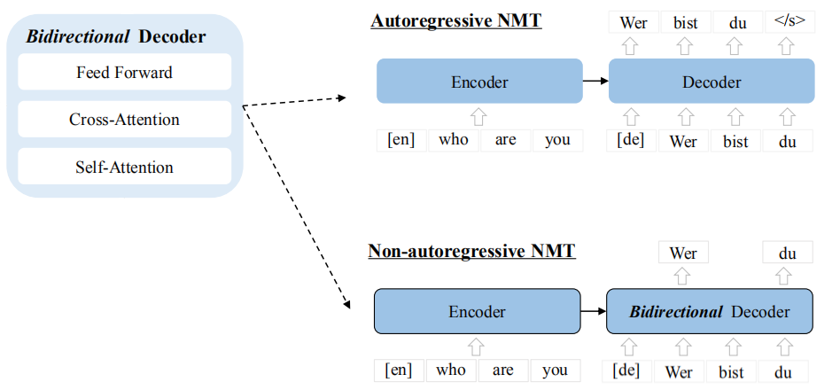

As seen in the following figure, CeMAT follows the
pre-training-then-fine-tuning paradigm where the model is jointly
pre-trained using Masked Language Modeling (MLM) on the encoder side and
Conditional MLM (CMLM) on the decoder side with large-scale monolingual
and bilingual texts in many languages.

    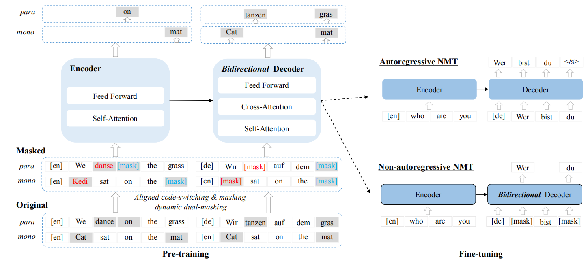

Pre-training
------------

As said earlier, CeMAT is jointly trained by MLM and CMLM on the source
side and the target side, respectively. MLM was first proposed in
[BERT](https://anwarvic.github.io/language-modeling/BERT) while CMLM was
proposed by
[Mask-Predict](https://anwarvic.github.io/machine-translation/CMLM_Transformer)
paper. MLM predicts masked tokens given the remaining sentence, CMLM
predicts masked tokens given the source sentence + the remaining of
target sentence.

Given a training data of $M$ language-pairs
$D = \left\\{ D_{1},\ D_{2},\ ...D_{M} \right\\}$ where
$D_{i}\left( m,n \right)$ is a collection of sentence pairs in language
$L_{m}$ and $L_{n}$, respectively. A sentence pair is denoted
$\left( X_{m},Y_{n} \right) \in D_{i}\left( m,n \right)$, where $X_{m}$
is the source text in the language $L_{m}$, and $Y_{n}$ is the
corresponding target text in the language $L_{n}$. For monolingual
corpora, they create pseudo bilingual text by copying the sentence
$\left( X_{m},X_{m} \right)$ and $\left( Y_{n},Y_{n} \right)$.

To enhance model's pre-training, they introduced a novel two-step
masking strategy on both monolingual and bilingual corpora:

-   Aligned code-switching & Masking.

-   Dynamic dual-masking.

### Aligned Code-Switching & Masking

To replace the source word or phrase with a new word in another
language, they use a multilingual translation dictionary provided by
[MUSE](https://anwarvic.github.io/machine-translation/MUSE) with this
method which consists of three steps:

-   <u><strong>Aligning:</strong></u>\
    Utilize a multilingual translation dictionary to get a set
    of aligned words
    $A = \left\\{ ...,\ \left( x_{m}^{i},\ y_{n}^{j} \right),\ ... \right\\}$.
    The word pair $\left( x_{m}^{i},\ y_{n}^{j} \right)$ denotes that
    the $i^{\text{th}}$ word in the source $X_{m}$ and $j^{\text{th}}$
    word in the target $Y_{n}$ are translations of each other.

-   <u><strong>Code-Switching Replace (CSR):</strong></u>\
    Given an aligned word pair $\left( x_{m}^{i},\ y_{n}^{j} \right)$,
    they select a new replacement word ${\widehat{x}}_k^i$ that is a
    translation of $x_m^i$ in language $L_k$. The new word
    ${\widehat{x}}_k^i$ is randomly selected from a multilingual
    dictionary.

-   <u><strong>Code-Switching Masking (CSM):</strong></u>\
    After replacing $x_m^i$ with ${\widehat{x}}_k^i$,
    $y_n^j$ is masked with a universal
    $\left\lbrack \text{mask} \right\rbrack$ token.

Then, CeMAT will be trained to predict it in the output layers of
the bidirectional decoder. The following figure shows the process of
aligned code-switching & masking. According to the following
example, "dance", "tanzen", and "danse". "danse" is selected to
replace "dance", and "tanzen" is replaced by
$\left\lbrack \text{mask} \right\rbrack$.

    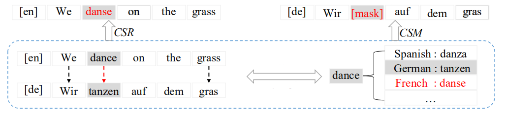

During pre-training, at most $15\%$ of the words in the sentence
will be performed by CSR and CSM. For monolingual data, we set this
ratio to $30\%$. After this process, the translation sentence pair
$\left( X_{m},Y_{n} \right)$ becomes
$\left( \text{CSR}\left( X_{m} \right),\text{CSM}\left( Y_{n} \right) \right)$
and it will be further dynamically dual-masked at random as we are
going to see next.

### Dynamic Dual Masking

Limited by the
[MUSE](https://anwarvic.github.io/machine-translation/MUSE) dictionary,
the ratio of aligned word pairs is usually small, around 6% of the
bilingual corpora. To further increase the training efficiency, they
performed dynamic dual-masking on both bilingual and monolingual data
where $10\%$ of masked tokens are replaced with a random token, $10\%$
remain unchanged, and $80\%$ are replaced with
$\left\lbrack \text{mask} \right\rbrack$ token:

-   **Bilingual Data:**

    -   They randomly select a subset of the target words and mask them
        with a ratio of $u \in \mathcal{U}\left( 0.2,\ 0.5 \right)$
        sampled from a uniform distribution.

    -   Then, they randomly select a subset of the source words and mask
        them with a ratio of  $\mu \in \mathcal{U}\left( 0.1,\ 0.2 \right)$
        sampled from a uniform distribution where $\mu \leq u$ to force the
        bidirectional decoder to obtain more information from the encoder.

-   **Monolingual Data:** Since the source and target are identical
    before masking, they sample
    $u = \mu \in \mathcal{U}\left( 0.3,\ 0.4 \right)$ from a uniform
    distribution and mask the same subset of words on both sides. This
    will avoid the decoder directly copying the token from the source.

The following figure shows that the word "gras" from the target
sentence and "on" from the source sentence were dynamically masked;
both are highlighted with yellow.

    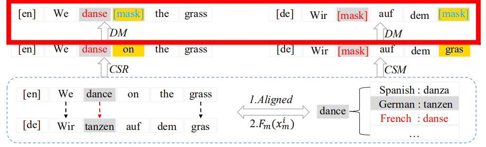

After applying these two steps, we jointly train the encoder and
decoder on MLM and CMLM tasks. Given the masked sentence pair
$\left( \text{DM}\left( \text{CSR}\left( X_{m} \right) \right),DM\left( \text{CSM}\left( Y_{n} \right) \right) \right)$
which will be denoted as
$\left( {\widehat{X}}_m,{\widehat{Y}}_n \right)$ for simplicity,
the final training objective is formulated as follows:

$$\mathcal{L} = - \sum_{\left( {\widehat{X}}_{m},{\widehat{Y}}_{n} \right) \in \widehat{D}}^{}{\left( 1 - \lambda \right)\mathcal{L}_{\text{MLM}} + \lambda\mathcal{L}_{\text{CMLM}}}$$

$$\mathcal{L}_{\text{MLM}} = \sum_{y_{n}^{j} \in y_{n}^{\text{mask}}}^{}{\log\left( P\left( x_{n}^{j} \middle| {\widehat{X}}_{m} \right) \right)}$$

$$\mathcal{L}_{\text{CMLM}} = \sum_{x_{m}^{j} \in x_{m}^{\text{mask}}}^{}{\log\left( P\left( y_{n}^{j} \middle| {\widehat{X}}_{m},{\widehat{Y}}_{n} \right) \right)}$$

Where $x_{m}^{\text{mask}}$ are the set of masked source words and
$y_{n}^{\text{mask}}$ are the set of masked target words. And and
$\lambda$ is a hyper-parameter to balance the influence of both tasks.
In the paper, it was set $\lambda = 0.7$.

Fine-tuning
-----------

As said earlier, CeMAT has a bidirectional decoder which can be
fine-tuned on either autoregressive translation or non-autoregressive
translation.

-   **Autoregressive Translation:** In this setup, CeMAT consists of a
    bidirectional encoder and a unidirectional decoder. The encoder maps
    a source sentence $X_{m}$ into hidden representations which are then
    fed into the decoder which predicts the $t^{\text{th}}$ token in a
    target language $L_{n}$ conditioned on $X_{m}$ and the previous
    target tokens $y_{n}^{< t}$. The training objective of
    autoregressive translation is to minimize the negative
    log-likelihood:

$$\mathcal{L}\left( \theta \right) = \sum_{\left( X_{m},Y_{n} \right) \in D\left( m,n \right)}^{}{\sum_{t = 1}^{\left| Y_{n} \right|}{- \log\left( P\left( y_{n}^{t} \middle| X_{m},\ y_{n}^{< t};\ \theta \right) \right)}}$$

-   **Non-autoregressive Translation:** In this setup, CeMAT consists of
    a bidirectional encoder and a bidirectional decoder which can be
    used to predict the target sequences in parallel. The training
    objective of NAT is formulated as follows:

$$\mathcal{L}\left( \theta \right) = \sum_{\left( X_{m},Y_{n} \right) \in D\left( m,n \right)}^{}{\sum_{y_{n}^{i} \in y_{n}^{\text{mask}}}^{}{- \log\left( P\left( y_{n}^{t} \middle| X_{m},\ y_{n}^{\backslash mask};\ \theta \right) \right)}}$$

Experiments
-----------

For pre-training, they used the English-centric multilingual parallel
corpora of
[PC32](https://anwarvic.github.io/multilingual-nmt/mRASP), and
then collected 21-language monolingual corpora from [common
crawl](https://commoncrawl.org). Then, BPE tokenization was used on the
entire data sets after tokenization using
[Moses-decoder](http://www.stat.org/moses/) for most languages and
[KyTea](http://www.phontron.com/kytea) for Japanese and
[jieba](https://github.com/fxsjy/jieba) for Chinese. The full statistics
of the data used are shown in the following table:

    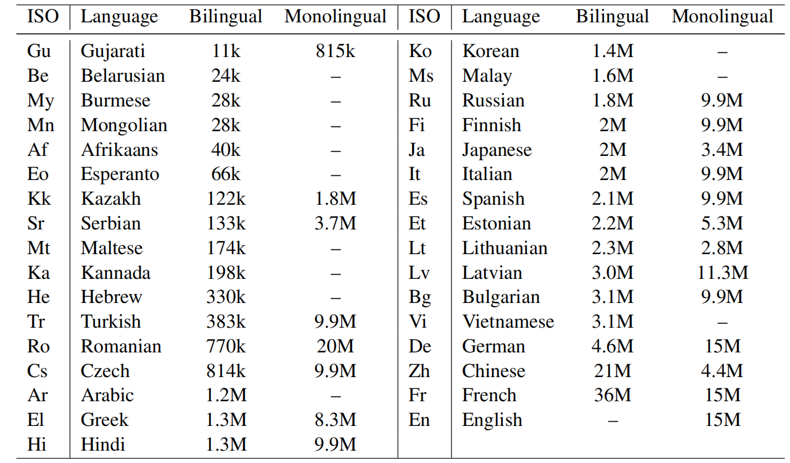

For pre-training, they used a
[Transformer](https://anwarvic.github.io/machine-translation/Transformer)
architecture with 6-layer encoder and 6-layer bidirectional decoder with
a model dimension of $1024$ and $16$ attention heads that use sinusoidal
positional embedding with pre-norm residual connection. They pre-trained
the model using Adam optimizer
($\epsilon = e^{- 6},\ \beta_{1} = 0.9,\ \beta_{2} = 0.98$) for $300K$
steps with a batch size of 4096 tokens. Also, they used polynomial decay
scheduling with a warm-up step of $10,000$.

After pre-training, they fine-tuned the model on autoregressive
translation of 8 popular language pairs (shown in the following table)
that can be divided into four categories according to their size:
low-resource ($\left\lbrack < 1M \right\rbrack$), medium-resource
($\left\lbrack 1M,\ 10M \right\rbrack$), high-resource
($\left\lbrack 10M,\ 25M \right\rbrack$), and extremely high-resource
($\left\lbrack > 25M \right\rbrack$).

    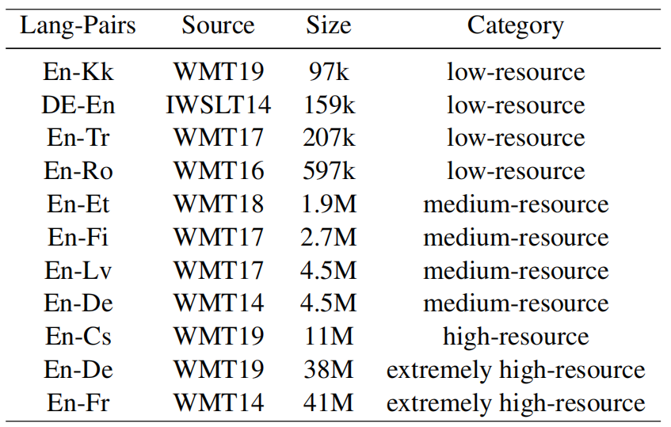

The following table shows that CeMAT outperforms
[mBART](https://anwarvic.github.io/multilingual-nmt/mBART) and
[mRASP](https://anwarvic.github.io/multilingual-nmt/mRASP) for all
language pairs but two directions. As the scale of the dataset
increases, the benefits of pre-training models are getting smaller and
smaller

    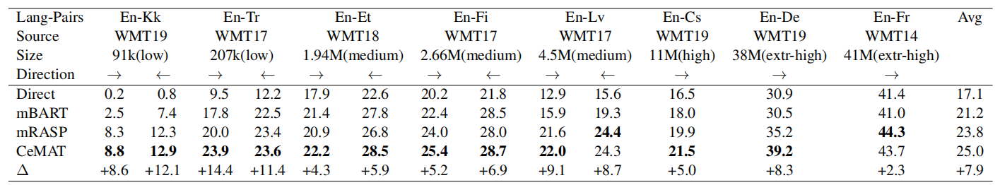

They further compare CeMAT with more existing multilingual pre-trained
models on three popular translation directions, including WMT14 En→De,
WMT16 En↔Ro. The followig table show that CeMAT obtains competitive
results on these languages pairs on average, and achieves the best
performance on En→Ro.

    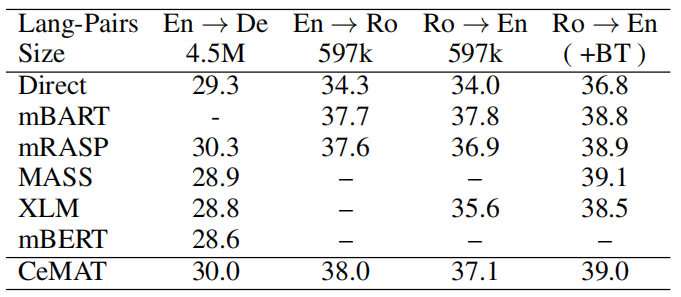

> **Note:**\
The "Direct" baseline mentioned in earlier results is a
[mask-predict](https://anwarvic.github.io/machine-translation/CMLM_Transformer)
model.

And for NAT fine-tuning, they evaluated CeMAT on three popular datasets:
WMT14 En↔De, WMT16 En↔Ro and IWSLT14 En↔De. For a fair comparison with
baselines, they only used the bilingual PC32 corpora to pre-train CeMAT
and they used knowledge distillation on WMT14 En↔De tasks. The following
table shows that CeMAT outperforms other multilingual models. This
suggests that we can use the traditional pre-training method to
fine-tune the NAT task.

    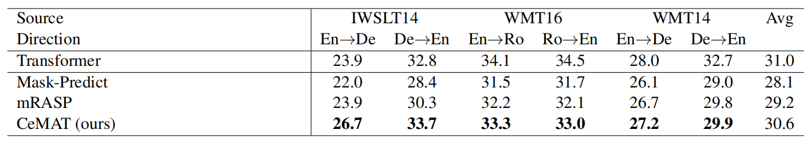

As an ablation study, they trained CeMAT without some of the proposed
techniques and the following table shows that all the highest
performance is achieved when using all proposed techniques:

    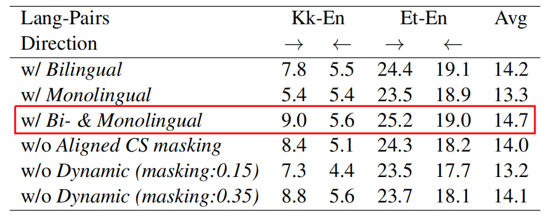

