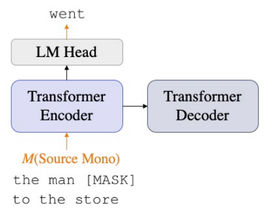
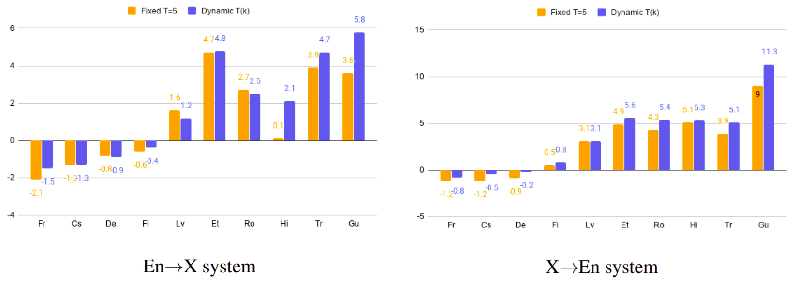
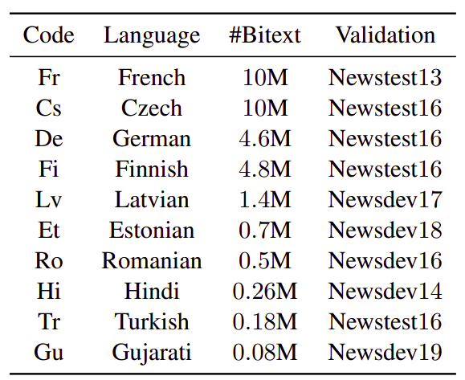
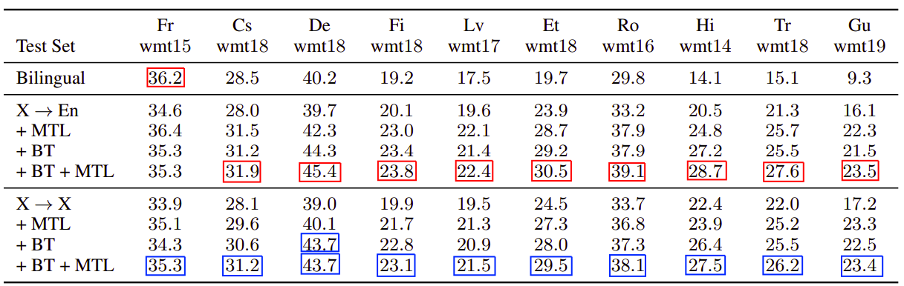
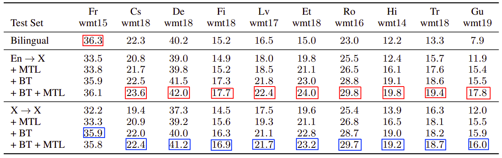
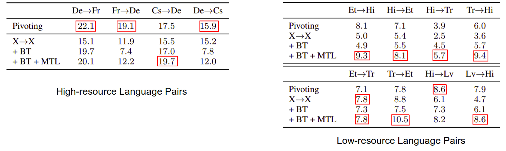
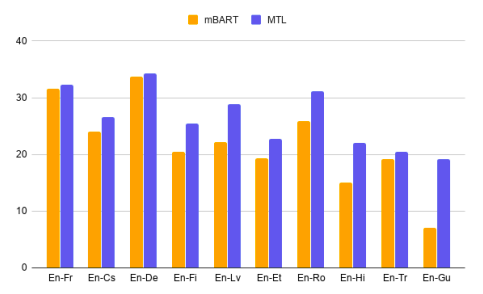

MTL stands for "Multi-task Learning" and it is a framework that jointly
trains multilingual neural machine translation (MNMT) models on bitext
data and monolingual data. The bitext data is used for the translation
task while the monolingual data is used for the denoising language
modeling tasks. This framework was proposed by Microsoft in 2020 and
published in their paper: [Multi-task Learning for Multilingual Neural
Machine Translation](https://arxiv.org/pdf/2010.02523.pdf).

Remember that multi-task learning (MTL) trains the model on several
tasks to improve generalization performance. In this paper, the
translation task is the main task combined with two denoising language
modeling tasks that help improving the quality of the translation task.
The two denoising tasks are:

-   <u><strong>Masked Language Model (MLM):</strong></u>\
    This task was first introduced in the
    [BERT](https://anwarvic.github.io/language-modeling/BERT) model
    where tokens are randomly masked and fed into the model and the
    model attempts to predict the masked tokens based on their context.
    BERT was an encoder-only architecture. To adapt this idea to the
    encoder-decoder architecture, they added an additional output layer
    (**LM Head**) during training which was dropped during inference.

    

-   <u><strong>Denoising Auto-encoding (DAE):</strong></u>\
    This task was first introduced in this [paper](Extracting and
    composing robust features with denoising autoencoders.) back in 2008
    where the target-side sentence is fed to the encoder along with the
    Language ID and the decoder attempts to reconstruct the original
    sentence. In this paper, they introduced three different types of
    noise functions:

    

        
    

    -   **Text Infilling:** Same as
        [mBART](https://anwarvic.github.io/multilingual-nmts/mBART)
        model, they randomly sampled text spans from the input with
        span lengths drawn from a Poisson distribution
        ($\lambda = 3.5$) and replaced all words in each span with a
        single masking token.

    -   **Word Drop & word blank:** They randomly sampled words from the
        input sentence which were either removed or replaced with
        blanking tokens for each token position.

    -   **Word Swapping (Shuffling):** Following this
        [paper](https://arxiv.org/pdf/1711.00043.pdf), they slightly
        shuffled the input sentence where a word at position $i$ can't
        be further than either $i - k$ or $i + k$, and $k = 3$ is the
        maximum swapping distance.

In the training process, the two self-learning objectives are combined with the
cross-entropy loss for the translation task:

$$\mathcal{L} = \mathcal{L}_{\text{MT}} + \mathcal{L}_{\text{MLM}} + \mathcal{L}_{\text{DAE}}$$

> **Note:**\
A language ID symbol $\lbrack LID\rbrack$ of the target language is
appended to the input sentence in the translation and DAE tasks.

Dynamic Noise Ratio
-------------------

Training algorithms perform better when starting with easier tasks. And
gradually moving to harder ones and increasing the learning difficulty
can potentially help avoid saturation. Therefore, the researchers of
this paper has proposed a **Dynamic Noise Ratio** parameter that can
balance the difficulty level of MLM and DAE tasks by using a noising
ratio $R$ as a function of the training epochs $k$:

$$R\left( k \right) = \min\left( R_{m},\ \left( k - 1 \right)\frac{R_{m} - R_{0}}{M} + R_{0} \right)$$

Where $R_{0}$ and $R_{m}$ are the lower and upper bound for the noising
ratio respectively and $M$ is the number of warm-up epochs.

> **Note:**\
In case of MLM, the noising ratio $R$ refers to the masking ratio in
MLM; the masking ratio is how many sequences will be masked. In BERT,
the masking ratio was 15%. In the case of DAE, the noising ratio $R$ is
the length of the blank span that needs to be filled.

Dynamic Temperature Sampling
----------------------------

One serious yet common problem for MNMT is data imbalance across
different languages. Training the model with uniform data distribution
would starve the low-resource language pairs since they are less
probable to be chosen. One approach to solve that issue is a
<u><strong>temperature-based sampling</strong></u> . Temperature sampling is an
effective heuristic to up-sample the the probability of low-resource
pairs. It works like so; for language pair $l$ with bitext corpus
$\left| D_{l} \right|$, the probability of sampling an instance of the
same language pair is:

$$p_{l} \propto \left( \frac{\left| D_{l} \right|}{\sum_{k}^{}\left| D_{k} \right|} \right)^{\frac{1}{T}}$$

While this sampling method improves translation quality for low-resource
languages, performance gradually decreases for high resource languages.
To get over that, the researchers of this paper proposed a <u><strong>dynamic
temperature data sampling</strong></u> method that samples more high-resource
language pairs in the early stage of training and gradually shift more
attention to the low-resource languages as shown in the following
function where the temperature $T$ is a function of the number of
training epochs $k$ and $N$ is the number of warm-up epochs. Also, they
added a lower-bound $T_{0}$ and a higher-bound $T_{m}$ for the
temperature.

$$T\left( k \right) = \min\left( T_{m},\ \left( k - 1 \right)\frac{T_{m} - T_{0}}{N} + T_{0} \right)$$

From the past equation the sampling temperature starts from a smaller
value $T_{0}$, resulting in sampling leaning towards true data
distribution and gradually increases low-resource languages more to
avoid them getting starved.

The following graph shows the performance gain of data sampling
strategies compared to the standard temperature sampling ($T = 5$) which
clearly shows that dynamic temperature sampling has better performance
on low-resource language pairs. All results are reported as ∆ BLEU
relative to the corresponding bilingual baseline on validation sets:

    

Data
----

As said earlier, the MTL framework jointly trains multilingual neural
machine translation (MNMT) model on bitext data and monolingual data.
The bitext data is used for the multilingual translation task and the
monolingual data is used for the denoising tasks.

Bitext data training data comes from the WMT corpus; they concatenated
all resources except WikiTitles provided by WMT of the latest available
year and filtered out the duplicated pairs and pairs with the same
source and target sentence.

Then, they tokenized all data with the SentencePiece model forming a
vocabulary shared by all the source and target languages with $32k$
tokens for bilingual models ($16k$ for Hi and Gu) and $64k$ tokens for
multilingual models. For validation, they randomly sampled $1,000$
sentence pairs from each individual validation set and concatenated them
to construct a multilingual validation set.

The following figure shows a list of 10 languages ranked by the size of
the bitext corpus translating to/from English:

    

Regarding the monolingual data, they mainly used data from
[NewsCrawl](http://data.statmt.org/news-crawl/) after applying a series
of filtration rules to remove the low-quality sentences, including
duplicated sentences, sentences with too many punctuation marks or
invalid characters, sentences with too many or too few words, etc. Then,
they randomly select $5M$ filtered sentences for each language. For
low-resource languages without enough sentences from NewsCrawl, they
leveraged data from CCNet.

Experiments
-----------

Regarding the multilingual models, they used the
[fairseq](https://github.com/pytorch/fairseq) implementation of the
Transformer-big setting with a 6-layer encoder and decoder. The
dimensions of word embeddings, hidden states, and non-linear layer were
set as $1024$, $1024$ and $4096$ respectively, the number of heads for
multi-head attention was set as $16$.

For the low-resource bilingual models (Tr, Hi, and GU), they used a
smaller model setting with 3-encoder and decoder layers, $256$ embedding
and hidden dimension to avoid overfitting and acquire better
performance.

All models were optimized with Adam with $\beta_{1} = 0.9$,
$\beta_{2} = 0.98$. They set the learning rate schedule as the standard
transformer paper with initial learning rate $5 \times 10^{- 4}$. Label
smoothing was adopted with $0.1$. And during inference, they used beam
search with a beam size of $5$ and length penalty $1.0$.

The following table shows the BLEU scores of 10 languages → English
translation with bilingual, X→En (many-to-English MNMT) and X→X
(many-to-many MNMT) systems. The languages are arranged from
high-resource (left) to low-resource (right):

    

The following table shows the same as the previous one but when
considering English → 10 languages translation:

    

The results from the past two tables show that models trained with
multitask learning (+MTL) significantly outperform the multilingual and
bilingual baselines demonstrating the effectiveness of the proposed
framework.

> **Note:**\
BT means "Back-translation" where they used target-to-source bilingual
models to back translate the target-side monolingual sentences into the
source domain for each language pair. They used the same monolingual
data for back-translation as the multi-task learning.

They further evaluated the proposed approach on zero-shot translation of
non English-Centric language pairs. The following table shows that MTL
framework significantly improves the zero-shot translation quality of
the X→X system especially for low-resource language pairs, further
demonstrating the effectiveness of the proposed approach:

    

> **Note:**\
For the pivoting method, the source language was translated into
English first, and then translated into the target language.

At the end, the researchers of this paper compared the MTL framework
with [mBART](https://anwarvic.github.io/multilingual-nmts/mBART), the
state-of-the-art multilingual pre-training method for NMT. They
pre-trained mBART on
[CC25](https://dl.fbaipublicfiles.com/fairseq/models/mbart/mbart.CC25.tar.gz)
corpus and fine-tuned it on the same bitext training data used in MTL.
As shown in the following figure, MTL outperforms mBART on all language
pairs:

    

This suggests that in the scenario of NMT, jointly training the model
with MT task and self-supervised learning tasks could be a better task
design than the separated pre-training and fine-tuning stages.

Also, It is worth noting that mBART is utilizing much more monolingual
data; for example, it uses 55B English tokens and 10B French tokens,
while this approach is using just 100M tokens each. This indicates that
MTL is more data efficient.
