GNMT stands for "Google Neural Machine Translation" which is a
<u><strong>bilingual</strong></u> machine translation architecture that was
discussed before in this post:
[GNMT](https://anwarvic.github.io/machine-translation/GNMT). Here, we
are going to discuss how they extended the bilingual nature of the GNMT
model to be multilingual. The Multilingual GNMT architecture, as seen in
the following figure, was proposed in 2016 by the Google Research team
and published in this paper: [Google's Multilingual Neural Machine
Translation System: Enabling Zero-Shot
Translation](https://arxiv.org/pdf/1611.04558.pdf). The official code
for this paper can be found in the TensorFlow's official GitHub repository:
[TensorFlow/GNMT](https://github.com/NVIDIA/DeepLearningExamples/tree/master/TensorFlow/Translation/GNMT).

    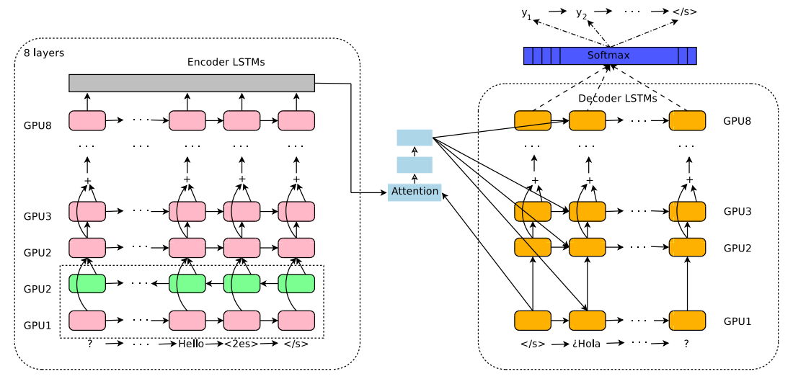

The researchers of this paper have found out that this architecture,
which is used mainly for bilingual translation, can be extended to
multiple languages using a simple method that doesn't change anything in
the architecture. <u><strong>The method they used was just to add an artificial
token to the input sequence to indicate the required target
language.</strong></u> That's it!! All other parts of the system like
encoder, decoder, attention mechanism, and shared WordPiece vocabulary
stayed exactly the same.

> **Note:**\
This paper was the first paper to validate the use of true multilingual
translation using a single encoder-decoder model. That's why some
consider it the founding basis for Multilingual NMT systems.

Architecture
------------

The multilingual GNMT model architecture is identical to the
[GNMT](https://anwarvic.github.io/machine-translation/GNMT) model as
shown below with only one addition which is to add an artificial token
at the beginning of the input sentence to indicate the required target
language. In this example, the token $\left\langle 2es \right\rangle$
indicates that the target sentence is in Spanish. Also, the source
sentence is reversed as a processing step.

    

To be able to make use of multilingual data within a single system, they
proposed adding an artificial token at the beginning of the input
sentence to indicate the target language. For instance, to translate to
Spanish (from any language), the $\left\langle 2es \right\rangle$ token
should be added to the beginning of the source sentence like so:

$$\left\langle 2es \right\rangle\ Hello,\ how\ are\ you? \rightarrow Hola,\ ¿cómo\ estás?$$

Instead of:

$$Hello,\ how\ are\ you? \rightarrow Hola,\ ¿cómo\ estás?$$

> **Very Important Note:**\
When training, they didn't specify the source language. Not specifying
the source language is simpler, and can handle input with code-switching
(as discussed later. Also, context provides enough language
evidence to produce the correct translation when there are two words
with the same spelling in two different source languages that have
different meanings.

Data
----

In this paper, they trained the model on publicly-available datasets
along with Google-internal production datasets. The datasets used for
most of the experiments performed in this paper were:

-   WMT'14 English(En)→French(Fr).

-   WMT'14 English→German(De).

-   Internal dataset English↔Japanese(Ja).

-   Internal dataset English↔Korean(Ko).

-   Internal dataset English↔Spanish(Es).

-   Internal dataset English↔Portuguese(Pt).

They used a shared WordPiece model of all the source and target data
with $32,000$ word pieces. They used newstest2014 and newstest2015 as
test sets. They used a combination of newstest2012 and newstest2013 as
the development set.

Results
-------

The training protocols used here are mostly identical to the
[GNMT](https://anwarvic.github.io/machine-translation/GNMT). The only
thing changed was that they used larger batch sizes with a slightly
higher initial learning rate to speed up the convergence of these
models.

> **Note**:\
In the paper, they compared uniform batching (each batch has one language-pair) and mixed batching (each batch has more than one language- pair) and they found out that mixed batching significantly improve efficiency of the serving system.

In training, they applied the multilingual GNMT in several different
configurations: **Many-to-One**, **One-to-Many**, and **Many-to-Many**.
And to measure the influence of varying amounts of training data per
language pair, they explored two strategies:

-   **Oversampling:** where they over-sampled the data from all language
    pairs to be of the same size as the largest language pair

-   **No Oversampling:** where they mix the data as is without any
    change.

### Many-to-One

Here, the multilingual GNMT have multiple source languages and a single
target language. Since there is only a single target language, no
additional source token is required. In this part, they performed three
sets of experiments:

-   They combined German→English and French→English to train a
    multilingual GNMT and compared it to two single bilingual models
    trained independently.

    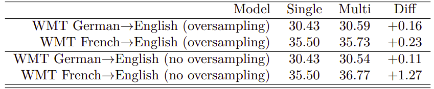

-   They combined Japanese→English and Korean→English (**with oversampling**)
    and compared it to two single bilingual models trained independently.

    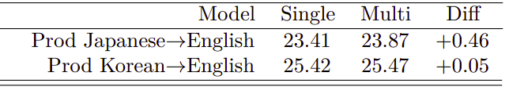

-   They combined Spanish→English and Portuguese→English (**with
    oversampling**) and compared it to two single bilingual models
    trained independently.

    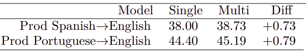

All results presented above shows that multilingual GNMT outperforms the
baseline single systems despite the fact that all of the models have the
same architecture and number of parameters.

### One-to-Many

Here, the multilingual GNMT have a single source language and multiple
target languages. Here, they prepended the input with an additional
token to specify the target language. As before, they performed three
sets of experiments:

-   They combined English→German and English→French to train a
    multilingual GNMT and compared it to two single bilingual models
    trained independently.

    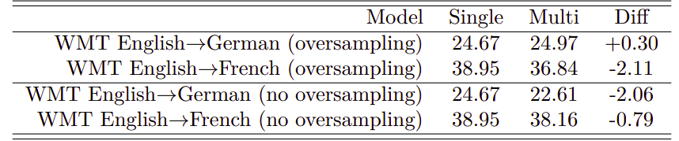

-   They combined English→Japanese and English→Korean(**with
    oversampling**) and compared it to two single bilingual models
    trained independently.

    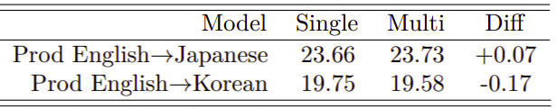

-   They combined English→Spanish and English→Portuguese (**with
    oversampling**) and compared it to two single bilingual models
    trained independently.

    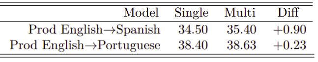

All results presented above shows that multilingual GNMT outperforms the
baseline single systems in some cases but not always.

> **Note:**\
Based on the first table, The model with no oversampling achieves better
results on the larger language (English→French) compared to the smaller
one (English→German).

### Many-to-Many

Here, the multilingual GNMT have multiple source languages and multiple
target languages. Here, they prepended the input with an additional
token to specify the target language. As before, they performed three
sets of experiments:

-   They combined English↔German and English↔French to train a
    multilingual GNMT and compared it to four single bilingual models
    trained independently.

    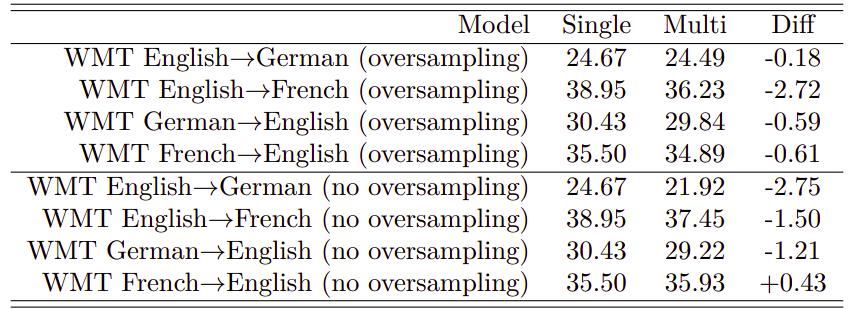

-   They combined English↔Japanese and English↔Korean(**with
    oversampling**) and compared it to four single bilingual models
    trained independently.

    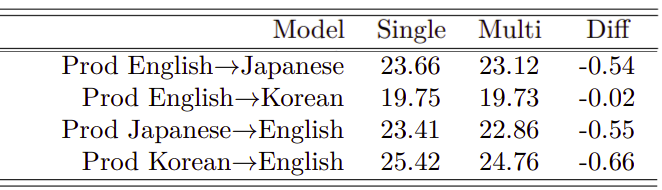

-   They combined English↔Spanish and English↔Portuguese (**with
    oversampling**) and compared it to four single bilingual models
    trained independently.

    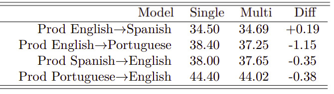

The results presented above show that the multilingual production models
with the same model size and vocabulary size as the single language
models are quite close to the baselines. The average relative loss in
BLEU score across all experiments is only approximately $2.5\%$.

### Large-scale Model

In this part, they tried to combine 12 language pairs having a total of
$12*255M = 3B$ parameters into a single multilingual model. To achieve
that, they tried a range of multilingual models starting from $255M$
(the same size as a single GNMT) up to $650M$ parameters. The following
table shows the results knowing that all models were over-sampled:

    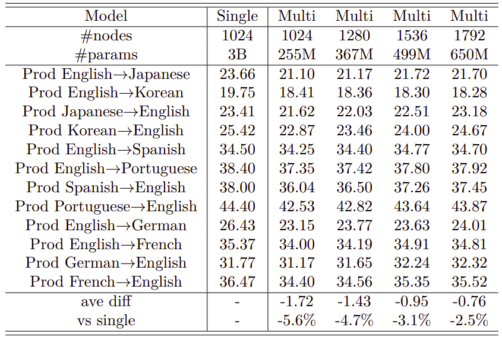

The table above shows that multilingual models are on average worse than
the bilingual models and the average difference gets smaller when going
to larger multilingual models. However, the largest multilingual model
still has about five times less parameters than the combined single
models which requires roughly 1/12-th of the training time (or computing
resources).

Zero-shot Translation
---------------------

Zero-shot Translation is when the model is able to translate between
language pairs that has never seen during training. Some call it
"Implicit Bridging"; unlike "Explicit Bridging" where we translate the
source language to a bridge language (usually English) and then to the
target language.

    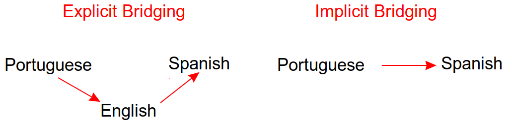

To demonstrate the zero-shot performance, they build two multilingual
models:

-   Model trained on (Portuguese→English and English→Spanish)\... 2
    pairs.

-   Model trained on (Portuguese↔English and English↔Spanish)\... 4
    pairs.

The following table shows the comparison of phrase-based machine translation
(PBMT) system, Bilingual NMT, and Multilingual NMT on Portuguese→Spanish
translation:

    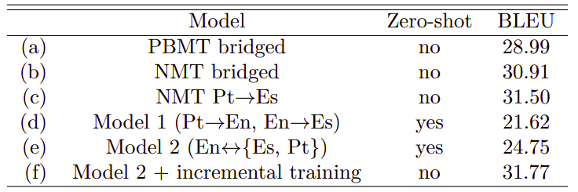

From the previous table, we can see that:

-   NMT system outperforms the PBMT system.

-   Both Model 1 and Model 2 can perform zero-shot translation with
    reasonable quality and Model 2 outperforms Model 1 by up to 3 BLEU
    points while having the same number of parameters.

-   The model at the last row (f) achieves that highest BLEU. This model
    can't be called zero-shot since it is created by incrementally
    training Model 2 with a small amount of true Portuguese→Spanish
    parallel data.

> **Note:**\
The zero-shot translation works better when the source and target
languages are from the same family; like Portuguese and Spanish.
They tried zero-shot learning (implicitly bridged) with Spanish and
Japanese and the result was worse as shown below:
>
> 

>     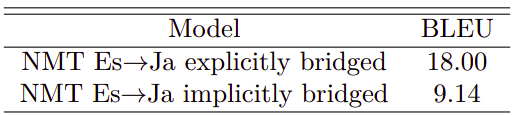
> 

The model at the last row had the best performance which raises an
important question: what is the best way to use additional parallel
data when you have multilingual GNMT? To answer this question, they
trained a multilingual GNMT model on English↔{Belarusian(Be),
Russian(Ru), Ukrainian(Uk)} languages which they called
"<u><strong>Zero-shot</strong></u>", then they tried to add additional
Ru↔{Belarusian(Be), Ukrainian(Uk)} parallel data in two different
ways:

-   Training a new multilingual model with all available parallel data
    mixed equally. They called this "<u><strong>From-scratch</strong></u>".

-   Incrementally training the multilingual model on the additional
    parallel data. They call this "<u><strong>Incremental</strong></u>".

The following table shows that incrementing the zero-shot models with a small
amount of additional parallel data achieves almost the same results as
training the model from-scratch:

    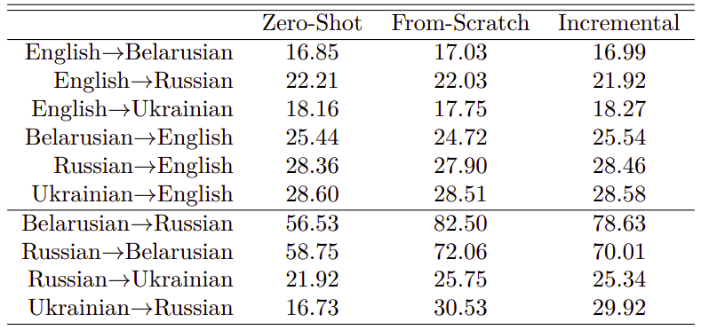

Code-Switching
--------------

Code-switching is the process of forming a sentence in more than one
language as shown in the following figure where we can see a sentence
formed by mixing English and Hindi. Interestingly, multilingual GNMT can
handle code-switching sentences <u><strong>despite the fact that no such
code-switching samples were present in the training data</strong></u>.

    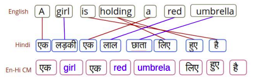

I would love to see some examples of how the model performed on
code-switching samples, but sadly they didn't provide any. No problem,
though! It still one of the best papers I have ever read. Respect!
