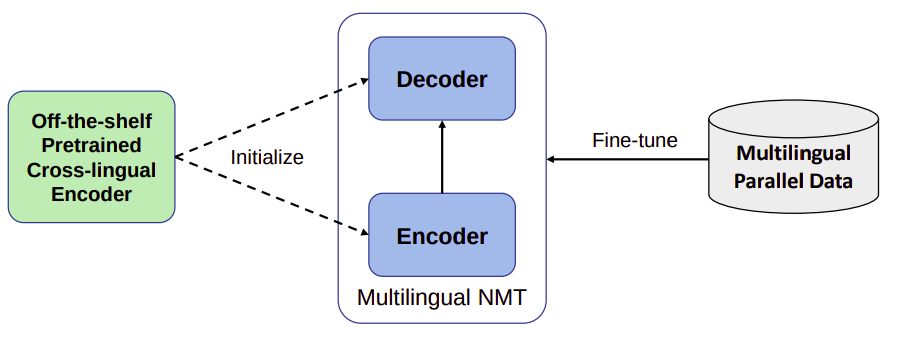
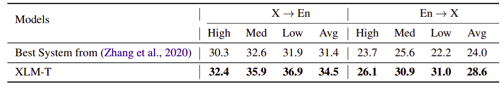
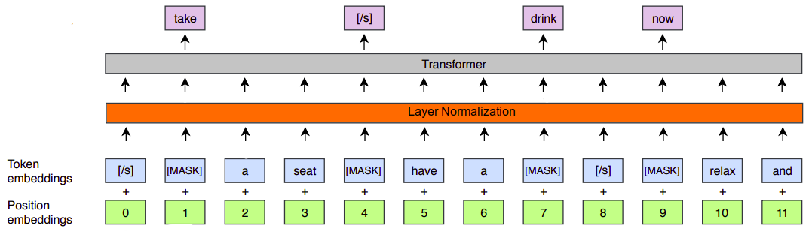
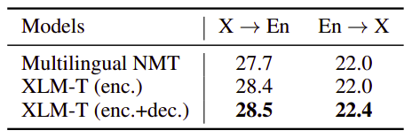
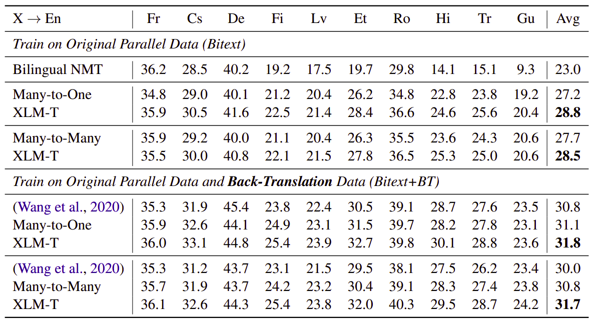
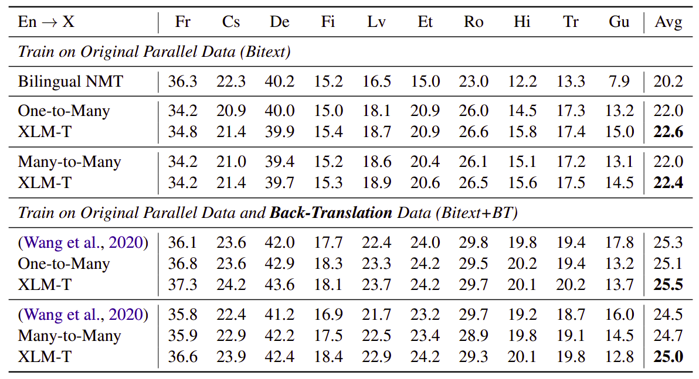
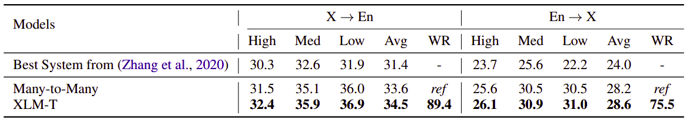

XLM-T stands for "Cross-lingual Language Modeling-Transformer" which is
a multi-lingual machine translation model proposed by Microsoft in 2020
and published in their paper: [XLM-T: Scaling up Multilingual Machine
Translation with Pretrained Cross-lingual Transformer
Encoders](https://arxiv.org/pdf/2012.15547.pdf). The official code of this
paper can be found in Microsoft's official GitHub repository:
[unilm/xlmt](https://github.com/microsoft/unilm/tree/master/xlmt). Most
existing MNMTs adopt a randomly initialized Transformer backbone. In
this work, the researchers used an a pre-trained cross-lingual
Transformer encoder such as
([XLM](https://anwarvic.github.io/cross-lingual-lm/XLM) or
[XLM-R](https://anwarvic.github.io/cross-lingual-lm/XLM-R)) to
initialize both the encoder and decoder of the multilingual NMT model,
and then fine-tuned it with multilingual parallel data.

    

In this paper, the researchers have adopted XLM-R BASE as the pretrained
encoder and conduct extensive experiments on multilingual machine translation
with 10 language pairs from [WMT](http://www.statmt.org/) dataset and 94
language pairs from [OPUS](http://opus.nlpl.eu/opus-100.php) datasets; the
stats of these datasets can be found on page 13 of the paper. XLM-T achieved
significant and consistent gains on both high, medium and low-resource 
languages. The following table shows that clearly in comparison with the best
system from this paper ([Zhang et al., 2020](https://arxiv.org/pdf/2004.11867.pdf))
on high/medium/low resource language pairs from OPUS-100 test sets.

    

Initialization Strategy
-----------------------

XLM-R BASE model has 12-layer encoder, 6-layer decoder, 768 hidden size,
12 attention head, and 3,072 dimensions of feed-forward layers and was
trained in 100 languages using more than two terabytes of filtered
CommonCrawl data with MLM objective. In the paper, the researchers used
it to initialize both the encoder and decoder of the Transformer-based
multilingual NMT model.

-   <strong><u>Initializing cross-lingual encoder:</u></strong>\
    To initialize the encoder with pre-trained XLM-R, the researchers tried to
    make the architectures consistent. To be able to do that, they did the
    following:

    -   They added a layer-normalization layer after the embedding layer
        and did not scale up the word embedding.

    -   They used post layer normalization for both the attention layers
        and feed-forward layers.

    -   They changed the activation function inside the feed-forward
        layers to be GELU instead of ReLU.

    

-   <strong><u>Initializing cross-lingual decoder:</u></strong>\
    The architecture of the decoder is the same as that of the encoder, except
    that there is a cross-attention layer after the self-attention layer.

To analyze the effect this initialization strategy, they conducted an
ablation study by removing the encoder initialization and decoder
initialization. The following table summarizes the results:

    

It shows that the encoder initialization mainly contributes to the
improvements of X → En. Similarly, the decoder initialization mainly
benefits E → X. Moreover, it concludes that the encoder initialization
contributes to more gains than the decoder initialization for
multilingual NMT. Now, we have our pre-trained encoder-decoder MNMT
model ready to be fine-tuned. Let's see how fine-tuning was performed.

Multilingual Fine-tuning
------------------------

Suppose we have $L$ languages to translate in a model. Among these
languages, we have $N$ bilingual corpora, each of which contains
parallel sentences
$\left\\{ \left( x_{L_{i}}^{1},\ x_{L_{j}}^{1} \right),\left( x_{L_{i}}^{2},\ x_{L_{j}}^{2} \right),\ ...\left( x_{L_{i}}^{k},\ x_{L_{j}}^{k} \right) \right\\}$
between language $L_{i}$ and language $L_{j}$, where $k$ is the number
of training instances. Given the corpora, we are able to train a
multilingual model $P_{\theta}$ that enables the translation among
different languages. With the parallel data of $N$ language direction,
the model is learned with the following objective:

$$L = - \sum_{i}^{N}{\sum_{j \neq i}^{N}{\log\left( P_{\theta}\left( x_{L_{i}}^{k},\ x_{L_{j}}^{k} \right) \right)}}$$

A simple concatenation of all parallel data will lead to poor
performance on low-resource translation because of the imbalanced data.
The researchers in the paper used temperature sampling to up-sample
low-resource languages. For a given language pair $l$ with $D_{l}$
parallel sentences, the probability of the sample being from language
$L_{i}$ using this strategy is:

$$p_{L_{i}} = \left( \frac{D_{L_{i}}}{\sum_{j}^{N}D_{L_{j}}} \right)^{\frac{1}{T}}$$

To reduce over-sampling of low-resource languages in the early stage of
training, they employed a dynamic temperate sampling mechanism. The
temperature is low at the beginning of training and is gradually
increased for the first several epochs as shown in the following
formula:

$$T_{i} = \min\left( T,\ T_{0} + \frac{i}{N}\left( T - T_{0} \right) \right)$$

where $T_{0}$ is the initial temperature, $T$ is the peak temperature,
and $N$ is the number of warming-up epochs. In the paper, they used
$T_{0} = 1.0$, $T = 5.0$, and $N = 5$ for all of their experiments.

Training & Testing
------------------

The model was trained using Adam Optimizer with $\beta_{1} = 0.9$ and
$\beta_{2} = 0.98$. The learning rate is in the range of $3e^{- 4}$ to
$5e^{- 4}$ with a warming-up step of $4,000$. Label smoothing
cross-entropy was used with $0.1$ smoothing ratio. The dropout of
attention layers was set to $0.0$, while being $0.1$ for the rest.

The source length and the target length were limited to be
$256\ $tokens. For the WMT-10 dataset, the batch size was $4,096$ and
the gradients were accumulated for $16$ batches. For the OPUS-100
dataset, the batch size was $2,048$ and the gradients were updated every
$32$ batches. During testing, they used beam search with a beam size of
$5$ with $1.0$ as length penalty. All results below were obtained by
averaging the last 5 checkpoints.

In this paper, they used two baselines one is bilingual and the other is
many-to-many; both are Transformer-big architecture with a 6-layer
encoder and decoder and the embedding size, the hidden size, embedding
size and the number of attention head is 1024, 1024, and 16 respectively
while the dimension of feed-forward layer is 4096. These two baselines
were using SentencePiece model with a vocabulary size of 64,000 tokens
extracted from the training set.

The following table shows the BLUE score bilingual, many-to-English, and
many-to-many models on WMT-10. On the top are the models trained with
original parallel data, while the bottom are combined with
back-translation. The languages are ordered from high-resource (left) to
low-resource (right).

    

And the following table is the same as before but when the source
language is English instead of English being the target as in the
previous table:

    

The previous two tables were showing the results on WMT-10 dataset. The
following table shows the BLEU score in comparison with the best model
in this paper ([Zhang et al.,
2020](https://arxiv.org/pdf/2004.11867.pdf)) on high/medium/low resource
language pairs in OPUS-100 test sets. "WR" is the win ratio (%) compared
to *ref*:

    

