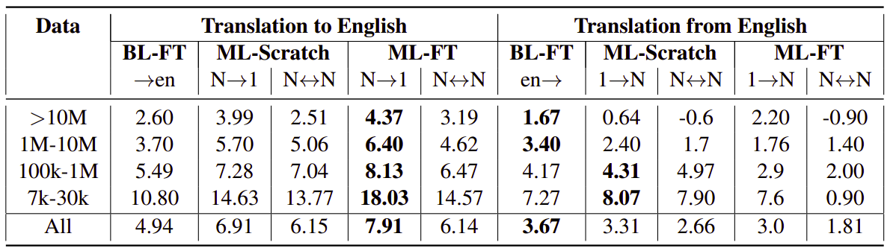
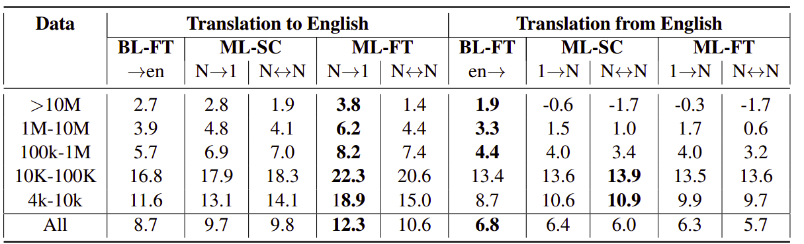
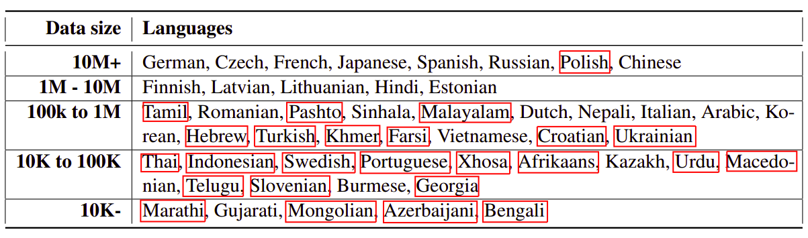

In this part, we are going to discuss this paper: [Multilingual
Translation with Extensible Multilingual Pretraining and
Finetuning](https://arxiv.org/pdf/2008.00401.pdf) (the official code:
[mbart](https://github.com/pytorch/fairseq/tree/master/examples/mbart))
which doubles the number of languages in mBART to support multilingual
machine translation models of 50 languages without loss of performance.
Also, This paper tried to fix some of the issues found in mBART such as:

-   mBART was pre-trained using noising functions like "Text infilling"
    and "sentence permutation" and it was fine-tuned on machine
    translation on bitext. As you can see, fine-tuning on bitext to
    translate from one language to another does not leverage the full
    capacity of the multilingual pre-training.

-   mBART was only trained on 25 languages, so fine-tuning to translate
    on a model not part of these 25 languages is not possible.

    In this paper, they propose multilingual fine-tuning (ML-FT) on
    mBART that leads to doubling the supported languages without loss of
    performance on the original 25 languages and without starting from
    scratch. This sallows languages to be added flexibly, while
    preserving the performance.

Multilingual Fine-tuning
------------------------

Multilingual fine-tuning (ML-FT) is proposed as a replacement to the
bilingual fine-tuning used earlier in the mBART paper. So, instead of
training a model from language i to language j, a model is trained to
translate N languages to N other languages which creates one model
capable of translating many languages to many other languages, which has
efficiency and storage maintenance benefits.

To perform multilingual fine-tuning, they collected bitexts of different
language pairs $\left( i,\ j \right)$ into a collection
$\mathcal{B}_{i,j} = \left( \left( x\_{i},\ y\_{i} \right) \right)$
for each direction of any two languages $i$ and $j$. Each bitext pair
$\left( x_{i},\ y_{i} \right)$ is augmented by adding a language token
at the beginning. And since the training dataset sizes are imbalanced as
different languages have different quantities of bitext, they trained
the model with temperature up-sampling, which up-samples lower resource
pairs:

$$p_{i,\ j} \propto \left( \frac{\left| \mathcal{B}_{i,\ j} \right|}{\sum_{i,j}^{}\mathcal{B}_{i,\ j}} \right)^{\frac{1}{T}}$$

To measure the effect of the multilingual fine-tuning method over mBART,
compared it with three strong baselines:

-   **Bilingual from Scratch (BL-Scratch):**\
    They trained bilingual translation models with standard Transformer
    models for translation into and from English to 49 languages.

-   **Bilingual Fine-tuning (BL-FT):**\
    Bilingual finetuning adapts the mBART model into bilingual machine
    translation models by training for longer on translation bitext. For
    each language direction, they fine-tuned for 40K updates.

-   **Multilingual from Scratch (ML-Scratch):**\
    They trained 3 different multlilingual models from scratch for 500K
    updates and through different batch sizes, learning rates, and
    upsampling temperature for best performing. These 3 models are:

    -   **Many-to-one (N → 1):** It encodes N languages and decodes to
        English.

    -   **One-to-Many (1 → N):** It encodes English and decoded to N
        languages.

    -   **Many-to-Many (N ↔ N):** It encodes and decodes N languages
        using English as a pivot language (L1 → English → L2).

First, they evaluated mBART on the original 25 languages using different
fine-tuning methods. The following results are the improvement in BLEU compared
to BL-Scratch which show that ML-FT has consistently stronger results in the
Many-to-one setting. However, in the one-to-Many setting BL-FT is better:

    

Then, they extended the bitext data to another 25 languages forming a dataset
of 50 languages (ML 50 Benchmark) and they extended mBART embedding layers with
randomly initialized vectors for the extra set of 25 language tokens. The
following results are the improvement in BLEU compared to BL-Scratch which
show the effect as before which is ML-FT has consistently stronger results in
the Many-to-one setting:

    

These results show that ML-FT is the best fine-tuning methods
for multilingual neural machine translation systems no matter
the number of languages supported.

ML50 Benchmark
--------------

To demonstrate the impact of multilingual fine-tuning on additional
languages, the published created the ML50 Benchmark. ML50 standardizes
the training and evaluation schemes across 50 different languages, from
extremely low resource languages like Xhosa and Gujarati to high
resource languages like French and German. The full list of languages is
shown in the following table:

    

The languages surrounded by a red box are the new 25 languages added to
the benchmark. As we can see, there are five categories to the 50
languages based on the amount of available training data.

mBART-25 Vs mBART-50
--------------------

In this part, we are going to discuss if adding additional languages to
mBART is harmful for performance on the original 25 languages knowing
that the model remains the same size. The following figure show a
comparison between mBART-25 and mBART-50 over the original 25 languages
when doing bilingual fine-tuning (BL-FT):

    

We can see that the performance is almost exactly the same with both
models, indicating that the number of languages can be doubled without
loss of performance.That's outstanding!! This means that we can extend
mBART to other languages without loss of performance in the original
languages.

To put things into perspective, the original mBART was trained for 2.5
weeks on 256 Nvidia V100 GPUs on only 25 languages. There are hundreds
of different languages in the world, so restarting pre-training from
scratch to add any new language would be difficult. These results show
that extending mBART to another set of languages is possible using
ML-FT.
