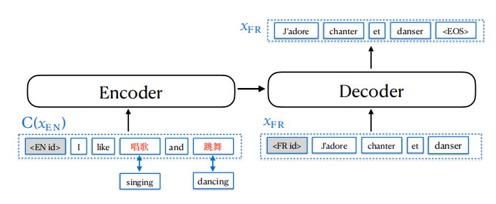
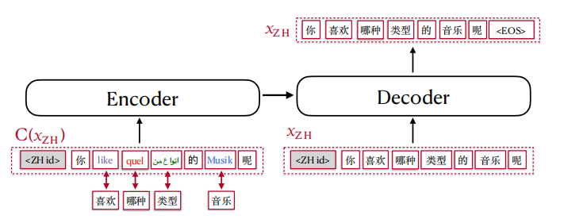
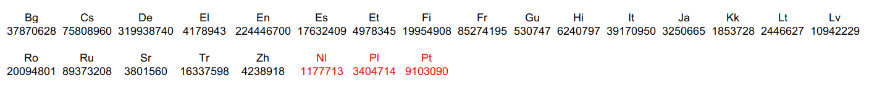
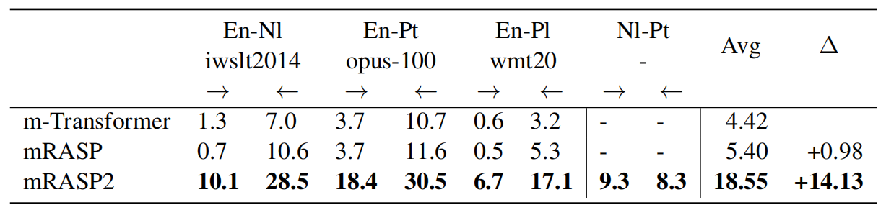
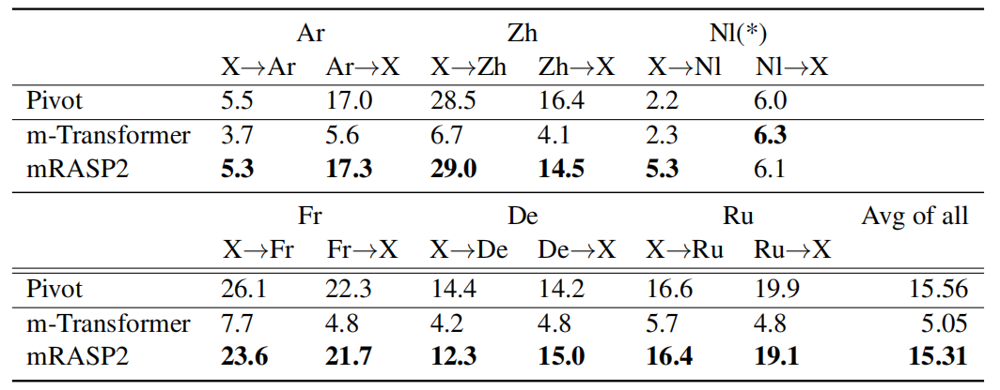
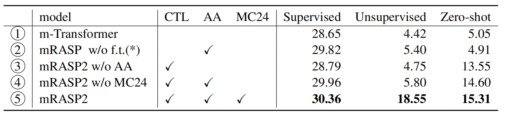

mRASP2 stands for "**m**ultilingual **R**andom **A**ligned
**S**ubstitution **P**re-training". It's mRASP<u><strong>2</strong></u> because it's
an extension to the
[mRASP](https://anwarvic.github.io/multilingual-nmt/mRASP) model
proposed by the same lab (ByteDance AI Lab) a year earlier. mRASP2
framework was proposed in 2021 and published in this paper: [Contrastive
Learning for Many-to-many Multilingual Neural Machine
Translation](https://arxiv.org/pdf/2105.09501.pdf). The official code
for this paper can be found in this GitHub repository:
[mRASP2](https://github.com/PANXiao1994/mRASP2).

mRASP2, as shown in the following figure, is a framework for training
many-to-many multilingual neural machine translation models using both
parallel corpora and monolingual corpora. This framework is empowered by
two techniques:

-   **mCOLT:** a contrastive learning scheme for the encoder to close
    the gap among representations of similar sentences across different
    languages.

-   **Aligned Augmentation (AA):** Data augmentation on both parallel
    and monolingual data to create pseudo-pairs to improve multilingual
    translation quality.

    

The base architecture of mRASP2 is the state-of-the-art
[Transformer](https://anwarvic.github.io/machine-translation/Transformer).
A little different from
[mRASP](https://anwarvic.github.io/multilingual-nmt/mRASP), they chose a larger
setting with a 12-layer encoder and a 12-layer decoder to increase the model
capacity. The model dimension is $1024$ on $16$ heads. To ease the training of
the deep model, they applied Layer Normalization for word embedding and
pre-norm residual connection for both encoder and decoder.

More formally, $D$ denotes all parallel datasets involved in training where
$D_{i,j}$ denotes a parallel dataset of $\left( L_{i},\ L_{j} \right)$ language
pair. To distinguish different languages, they added an additional language
identification token preceding each sentence, for both source side and target
side.

mCOLT
-----

mCOLT stands for "**m**ultilingual **Co**ntrastive **L**earning for
**T**ranslation" which is a contrastive loss function for the encoder.
Its key idea is to minimize the representation gap of similar sentences
of different languages and maximize that of irrelevant sentences. More
formally, given a bilingual translation pairs
$\left( x^{i},\ x^{j} \right) \in D$ where
$\left( x^{i},\ x^{j} \right)$ is a positive example, and
$\left( x^{i},\ y^{j} \right)$ is a negative example as $y^{j}$ is
randomly sampled from the same language $L_{j}$. The objective of
contrastive learning is to minimize the following loss:

$$\mathcal{L}_{\text{ctr}} = \sum_{x^{i},x^{j} \in D}^{}{- \log\left( \frac{\frac{e^{\text{sim}^{+}\left( \mathcal{R}\left( x^{i} \right),\ \mathcal{R}\left( x^{j} \right) \right)}}{t}}{\sum_{y^{j}}^{}\frac{e^{\text{sim}^{-}\left( \mathcal{R}\left( x^{i} \right),\ \mathcal{R}\left( y^{j} \right) \right)}}{t}} \right)}$$

Where:

-   $sim()$ calculates the cosine similarity of different sentences.
    $sim +$ and $sim -$ denote positive and negative similarity
    respectively. To simplify implementation, the negative samples are
    sampled from the same training batch.

-   $\mathcal{R}\left( x \right)$ denotes the encoded output of an
    arbitrary sentence $x$.

-   $t$ is the temperature. Higher temperature increases the difficulty
    to distinguish positive sample from negative ones. In the paper,
    temperature was set to $0.1$.

Now, the training loss $\mathcal{L}$ used for training mRASP2 is a combination
of two loss functions; the contrastive loss $\mathcal{L}_{\text{ctr}}$
defined above and the cross entropy $\mathcal{L}_{\text{ce}}$:

$$\mathcal{L} = \mathcal{L}_{\text{ce}} + \lambda\left| s \right|\mathcal{L}_{\text{ctr}}\ \ \ \ \ \ \ \ \ \ \ \ \ \ \ \mathcal{L}_{\text{ce}} = \sum_{x^{i},x^{j} \in D}^{}{- \log\left( P_{\theta}\left( x^{i} \middle| x^{j} \right) \right)}$$

Where

-   $\lambda$ is the coefficient to balance the two training losses. In
    the paper, it was set to $1.0$.

-   $\left| s \right|$ is the average sequence length since
    $\mathcal{L}_{\text{ctr}}$ is calculated on the sentence-level
    and $\mathcal{L}_{\text{ce}}$ is calculated on the token-level.

-   $x^{i}$ and $x^{j}$ represent sentences in language $L_{i}$ and
    $L_{j}$ respectively.

-   $\theta$ is the parameter of multilingual Transformer model.

Aligned Augmentation
--------------------

Aligned Augmentation (AA) is a data augmentation technique that can be
applied on both parallel and monolingual data in order to improve
multilingual translation quality. Aligned Augmentation is considered an
extension of RAS (Random Aligned Substitution) which was proposed in
[mRASP](https://anwarvic.github.io/multilingual-nmt/mRASP) paper.

For a bilingual sentence pair $\left( x^{i},\ x^{j} \right)$ in two
languages $L_{i}$ and $L_{j}$, Aligned Augmentation creates a perturbed
sentence $C\left( x^{i} \right)$ by replacing aligned words from a
[MUSE](https://anwarvic.github.io/machine-translation/MUSE) synonym
dictionary with a probability of $90\%$ and keep them unchanged
otherwise; forming a pseudo-parallel training example
$\left( C\left( x^{i} \right),\ x^{j} \right)$:

    

For a monolingual sentence $x^{i}$ of language $L_{i}$, Aligned
Augmentation creates a perturbed sentence $C\left( x^{i} \right)$ the
same way as the bilingual sentence; forming a pseudo self-parallel
example $\left( C\left( x^{i} \right),\ x^{i} \right)$:

    

Now, both a pseudo-parallel training example
$\left( C\left( x^{i} \right),\ x^{j} \right)$ and a pseudo
self-parallel example $\left( C\left( x^{i} \right),\ x^{i} \right)$
will be used to increase the training data and therefore boosting the
multilingual translation quality.

Experiments
-----------

In their experiments, they used the
[Transformer](https://anwarvic.github.io/machine-translation/Transformer)
model with 12 encoder layers and 12 decoder layers. The embedding size
and FFN dimension were set to $1024$ on $16$ heads. For multilingual
vocabulary, They followed the shared BPE vocabulary of $64,808$ tokens
plus $59$ language tokens such as
$\left\langle \text{EN\ id} \right\rangle$,
$\left\langle \text{FR\ id} \right\rangle$\...etc.

They also used a dropout rate of $0.1$, as well as a learning rate of
$3e^{- 4}$ with polynomial decay scheduling and a warm-up step of $10k$.
For optimization, they use Adam optimizer with $\epsilon = 1e^{- 6}$ and
$\beta_{2} = 0.98$. To stabilize training, they set the threshold of
gradient norm to be $5.0$ and clip all gradients with a larger norm.

For bilingual data, they used the Parallel Corpus (PC32) proposed in the
[mRASP](https://anwarvic.github.io/multilingual-nmt/mRASP) paper. PC32
contains 97.6 million parallel sentences of 32 English-centric language
pairs. The following figure shows the languages found in the corpus
along with the number of sentences available for each language:

    

For monolingual data, they created Monolingual Corpus (MC24) of 1.01
billion sentences of 24 languages. MC24 is a subset of the [Newscrawl
dataset](http://data.statmt.org/news-crawl) by using only those
languages in PC32, plus three additional languages (Nl, Pl, Pt)
highlighted in red in the following figure:

    

In order to balance the volume across different languages, they applied
temperature sampling of $T = 5$. For a given language pair $l$ with
$D_{l}$ number of parallel sentences, the probability of the sample
being from language $l$ is:

$$p_{l} = \left( \frac{D_{l}}{\sum_{k}^{}D_{k}} \right)^{\frac{1}{T}}$$

Results
-------

The following table shows the BLEU score of different models (bilingual,
pre-trained then fine-tuned, and multilingual) on the evaluation sets of
WMT benchmark. As shown in the following table, mRASP2 clearly improves
multilingual baselines by a large margin in 10 translation directions.

    

> **Note:**\
m-Transformer is a many-to-many 12 layers standard transformer model
trained on PC32 dataset and used as a baseline. As we can see from the
past table, this model achieves very competitive results and they
explained that that was due to these reasons:
>
> - They used a batch size of 3 million tokens. The batch size plays a
    crucial role in the success of training multilingual NMTs.
>
> - They used gradient norm to stable the training. Without it, the
    large scale training will collapse sometimes.

The following table shows the BLEU score of unsupervised translation on IWSLT,
WMT, and OPUS-100 evaluations sets. These three models were trained on only
monolingual data and mRASP2 outperforms them by a huge margin on all
language-pairs:

    

The following table shows the BLEU score of zero-shot translation on OPUS-100
evaluations sets. As we can see, mRASP2 achieves consistent BLEU gains in
zero-shot directions on different evaluation sets:

    

To understand what contributes to the performance gain, they conducted
analytical experiments and reported the results in the following table:

    

And they found out the following:

-   ③ performs comparably with ① in supervised and unsupervised scenarios,
    whereas achieves a substantial BLEU improvement for zero-shot translation. <u><strong>This indicates that by introducing contrastive loss, we can
    improve zero-shot translation quality without harming other
    directions.</strong></u>

-   ① and ② perform poorly for zero-shot directions. <u><strong>This means
    contrastive loss is crucial for the performance in zero-shot
    directions.</strong></u>

-   mRASP2 further improves BLEU in ③, ④, and ⑤ especially in unsupervised
    directions. Therefore it is safe to say that <u><strong>mRASP2 learns a
    better representation space by using monolingual data.</strong></u>
