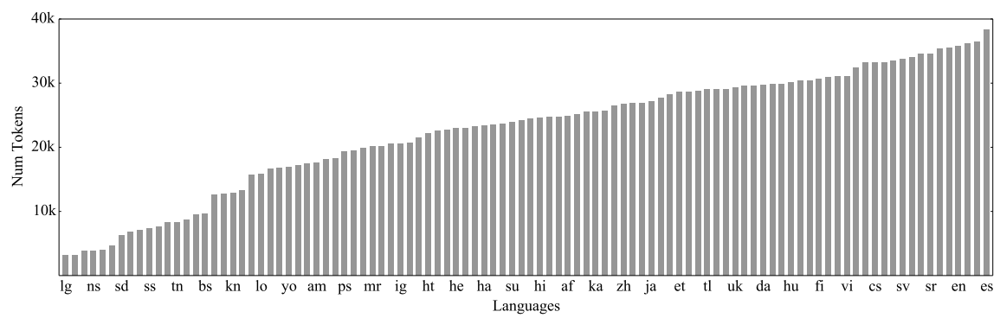

M2M stands for "Many-to-Many" which is a multilingual NMT model using
many-to-many datasets. The model was created by Facebook AI in 2020 and
published in their paper: "[Beyond English-Centric Multilingual Machine
Translation](https://arxiv.org/pdf/2010.11125.pdf)". The official code
for this paper can be found on the official FairSeq repository:
[m2m_100](https://github.com/pytorch/fairseq/tree/main/examples/m2m_100)

Since multilingual NMT models are hungry for data and the most
resourceful language currently is English, most of the existing
multilingual NMT models use data either translated from or to English.
This English-Centric bias in the data results in models not reflective
of how people use translation and empirically leads to lower performance
for non-English translation directions. M2M model is considered a true
Many-to-Many multilingual translation model that can translate directly
between any pair of 100 languages.

Our focus on non-English-Centric models brings gains of more than 10
BLEU when directly translating between non-English directions while
performing competitively to the best single systems of WMT.

Architecture
------------

M2M is basically a a large Transformer sequence-to-sequence model, which is
composed of two modules: 12-layer encoder and 12-layer decoder. It contains 8192 Feed-Forward-Network size and 1024 embedding dimension. The weight matrices of
the input and output embeddings. The total parameter count is 1.2B.

The encoder takes the sequence of tokens
$W = \left( w_{1},\ ...w_{S} \right)$ and the source language $l_{s}$
and produces a sequence of embeddings of the same length
$H = \left( h_{1},\ ...h_{S} \right)$:

$$H = \text{encoder}\left( W,\ l_{s} \right)$$

Then, the decoder is fed the sequence of embeddings $H$ with the target
language $l_{t}$ and sequentially produces the target sentence token by
token $V = \left( v_{1},\ ...v_{S} \right)$:

$$v_{i + 1} = \text{decoder}\left( H,\ l_{t},\ v_{1}\text{...}v_{i} \right)$$

The Transformer architecture has been designed for the bilingual case,
where the target language is fixed. In the case of multilingual machine
translation, the target language is not fixed, so they added a special
token in the encoder indicating the source language $l_{s}$ and a
special token in the decoder indicating the target language $l_{t}$.

    

The model is trained with the Adam optimizer and warmed-up first for
4000 updates, with label smoothing 0.1. For regularization, the dropout
parameter is tuned between {0.1, 0.2, 0.3}. To stabilize the training of
deeper Transformers, it is trained with LayerDrop 0.05 and
pre-normalization.

To train M2M, they used SentencePiece as a subword tokenizer. And since
SentencePiece produces subword units depending on their frequency in the
training dataset which would favor high-resource languages, they decided
to add monolingual data for low resource languages to compensate. Also,
they used a temperature sample which means that choosing language $l$
equals $p_{l}^{\frac{1}{T}}$. The following is the language distribution
of the vocabulary containing 128k token:

    

Building Data
-------------

The superior performance of M2M-100 was achieved by building a
large-scale Many-to-Many dataset comprising 7.5B training sentences for
100 languages (you can find the full set of languages in page: 6 of the
paper). We considerably reduce the complexity of this task through the
automatic construction of parallel corpora with a novel data mining
strategy that exploits language similarity to avoid mining all
directions. We also leverage back-translation to improve the quality of
our model on zero-shot and low resource language pairs.

CHECK THE PAPER FOR MORE DETAILS REGARDING HOW THEY MINDED THE DATA\....
IT'S A LOT!!

### Evaluation Set

To cover their set of 100 languages and 2200 directions, they brought
together data from a variety of sources. We describe each evaluation
dataset below:

-   WMT:\
    The majority of language pairs from WMT go through English and the
    data is from the news domain. We consider data for 13 languages.

-   WAT:\
    The WAT competition covers Asian languages paired with English.
    They used it for Burmese-English.

-   IWSLT:\
    The IWSLT translation competition contains data from TED talks
    paired with English translations. We use data for 4 languages.

-   FLORES:\
    FLORES pairs two low resource languages, Sinhala and Nepali, with
    English in the Wikipedia domain.

-   TED --- The TED Talks dataset:\
    It contains translations between more than 50 languages; most of
    the pairs do not include English. The evaluation data is n-way
    parallel and contains thousands of directions.

-   Autshumato:\
    Autshumato is an 11-way parallel dataset comprising 10 African
    languages and English from the government domain.

-   Tatoeba:\
    Tatoeba Challenge covers 692 test pairs from mixed domains where
    sentences are contributed and translated by volunteers online. The
    evaluation pairs we use from Tatoeba cover 85 different languages.

English-Centric Bias
--------------------

As said before, English-Centric multilingual models have some bias that
lowers their performance for non-English translation. To test that, they
trained the same architecture on the full 100 language Many-to-Many
dataset and on the English part of the data using the same vocabulary.
They trained the model for 500K updates which corresponds to one pass
over the entire Many-to-Many dataset and 3.5 passes on the
English-centric data.

Then, they compared the performance of both models on different types of
directions, namely, any language to English (To English), English to any
language (From English), and all the directions not involving English
(Non-English). And the following is the results averaging over all
directions:

    

On the pairs including English, both models achieve similar performance.
For the non-English pairs, we consider two translation strategies for
the English-Centric model: directly translating as if the model was
trained on the pair -- by using the corresponding language tokens -- or
by pivoting through English. The M2M model outperforms direct
translation with the English-Centric model by 10.2 BLEU and when the
English-Centric model uses pivoting by 5.5 BLEU.

While this result is not surprising, it confirms that a purely
English-Centric model has limited potential on non-English pairs, and
there is a fundamental need for training on Many-to-Many data.

TO BE CONTINUED