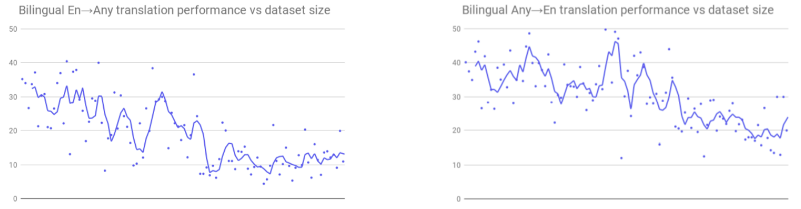
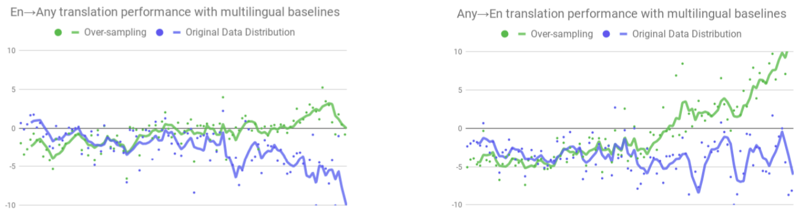
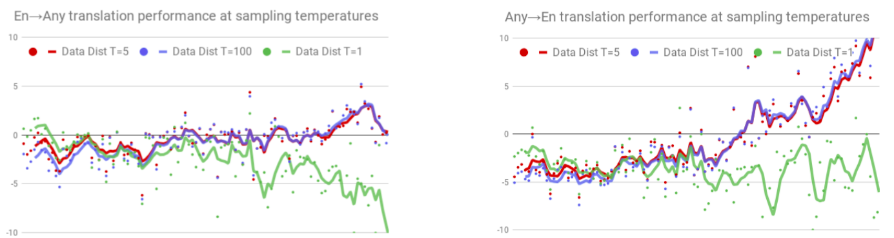
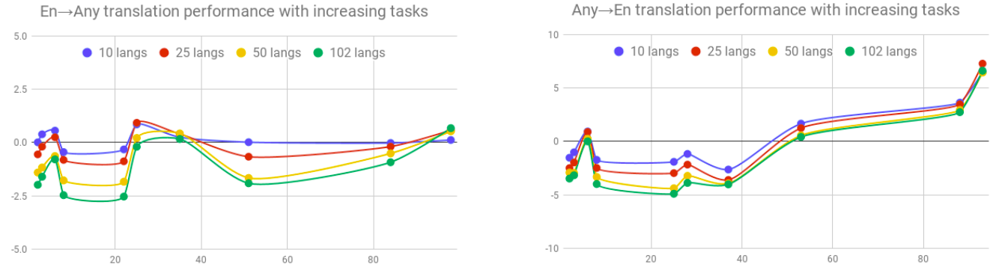

M4 stands for "Massively Multilingual, Massive Machine Translation"
which is a multilingual NMT model that is trained on over 25 billion
parallel sentences in 103 languages. This model was proposed by Google
AI in 2019 and published in their paper: [Massively Multilingual Neural
Machine Translation in the Wild: Findings and
Challenges](https://arxiv.org/pdf/1907.05019.pdf).

M4 is a Transformer-big model with a single encoder and decoder shared
across all the language pairs. In order to guide the translation with
the intended target language, a target language token is prepended to
every source sequence to be translated. M4 demonstrates effective
transfer learning ability, significantly improving translation quality
of low-resource languages, while keeping high-resource language
translation quality on-par with competitive bilingual baselines. Up to
this point in history, this model is the largest multilingual NMT system
in terms of the number of languages considered.

The aim of this paper is to highlight key challenges and open problems
on the way to building a real-world massively multilingual translation
system. All experiments done in this paper were done using the standard
transformer architecture implemented in the Google's open-source
[Lingvo](https://github.com/tensorflow/lingvo) framework.

Data
----

The data used to train M4 is an in-house corpus generated by crawling
and extracting parallel sentences from the web. This corpus contains
parallel documents for 102 languages, to and from English, containing a
total of 25 billion sentence pairs. The following is the full list of
all languages used in this dataset:

    

The following figure illustrates the data distribution across language
pairs for all 204 language pairs. The x-axis indicates the language pair
index, and the y-axis depicts the number of training examples available
per language pair on a logarithmic scale. Dataset sizes range from 35k
for the lowest resource language pairs to 2 billion for the largest.

    

This was the data for training. To minimize the data imbalance on the
validation/test sets, they created validation and test sets as multi-way
aligned datasets containing more than 3k and 5k sentence pairs
respectively for all languages.

Bilingual Baselines
-------------------

For high-resource language pairs, they used Transformer-Big setup which
contains around 375M parameters. For most medium and low resource
languages, they used Transformer-Base setup. Also, they used shared
source-target sentence-piece model vocabulary with 32k tokens and
dropout as a regularizer. All models were trained with Adafactor with
momentum factorization, a learning rate schedule of (3.0, 40k), and a
per-parameter norm clipping threshold of 1.0. For Transformer Base
models, they used a learning rate schedule of (2.0, 8k).

The following figure summarizes BLEU score (y-axis) of individual
bilingual models on all 204 supervised language pairs. Languages
(x-axis) are arranged in decreasing order of available training data
from left to right. Each dot represents the BLEU score of one bilingual
model and a trailing average is used to show the trend.

    

For a more clarified results, the following table shows the average BLEU
score of bilingual models over different groups of languages. High 25
refers to the top 25 languages by dataset size (left-most portion of the
previous figure), while low 25 refers to the bottom 25 (right-most
portion of the previous figure) and mid-52 is the middle 52 languages
(the ones in the middle of the previous figure):

    

Transfer-Inference Tradeoff
---------------------------

In this section, we are going to dicuss the effect of data imbalance
across languages through the lens of transfer and interference. Transfer
is the ability to use the knowledge learned from high-resource languages
to improve the performance over low-resource languages. Inference is the
effect of learning new languages over the old ones. Two desired
characteristics of any universal machine translation model which are:

-   Maximum positive **transfer** to low-resource languages.

-   Minimum **interference** (negative transfer) for high-resource
    languages.

In the paper, they measured the effect of transfer-inference of M4
against bilingual baselines by training a single Transformer-Big
with a shared vocabulary of 64k tokens with 0.1 dropout probability
and the same values as the bilingual baselines used for other
hyper-parameters. Also, they used a batch-size of 4M tokens and they
followed two strategies when sampling:

1.  All the available training data is combined as it is. For a given
    language pair $l$ with $D_{l}$ parallel sentences, the probability
    of the sample being from language $l$ using this strategy is:

$$p_{l} = \frac{D_{l}}{\sum_{k}^{}D_{k}}$$

2.  Use temperature sampling to up-sample low-resource languages. For a
    given language pair $l$ with $D_{l}$ parallel sentences, the
    probability of the sample being from language $l$ using this
    strategy is:

$$p_{l} = \left( \frac{D_{l}}{\sum_{k}^{}D_{k}} \right)^{\frac{1}{T}}$$

The following figure shows the effect of sampling strategy on the
performance of multilingual models. On the axis, languages are arranged
in decreasing order. On the y-axis, BLEU score is reported relative to
those of the bilingual baselines. Also, two multilingual models were
trained: one to translate from any language to English (Any→En) and the
other to translate English to any language (En→Any):

    

From this graph, we can find out the following:

-   Following temperature sampling (green) maximizes transfer and beats
    bilingual baselines by large margins, especially in the Any→En
    direction (right-most portion). However, this also has significantly
    hurt the performance on high resource languages (left-most portion).

-   On the other hand, sampling based on the true data distribution
    (strategy (i)) retains more performance on high resource languages,
    at the cost of sacrificing performance on low resource languages.

-   Also, the transfer-interference tradeoff is more pronounced in the
    Any→En direction than that for the En→Any direction.

In the paper, they tried different values for the $T$ in the
temperature sampling and noticed that $T = 5$ improves performance
on the high resource languages for both translation directions
compared to $T\  = \ 100$, while also retaining high transfer
performance on low resource languages. However, performance on high
and medium resource languages still lags behind their bilingual
baselines by significant margins:

    

To highlight the exact effect of interference with increasing
multilinguality, they trained three additional multilingual models
on a growing subset of 10, 25, and 50 languages. The specific
languages were chosen to get a mixed representation of data size,
script, morphological complexity and inter-language relatedness.

The following figure shows the effect of different languages on the
translation performance of multilingual models with a temperature
sampling of $T = 5$. Language were sorted in decreasing order of
available training data from left to right. Each point represents a
certain language group of 10 languages; for example each blue point
represents a certain group of 10 languages.

    

The figure clearly highlights how performance degrades for all
language pairs, especially the high and medium resource ones, as the
number of tasks (languages) grows.

Multilinguality
---------------

As we have seen in the past experiments, multilinguality has a positive
impact on low-resource languages. To understand how multilinguality
affects languages when translating to or from English, they inspected
three different settings:

-   En→Any model: Translating from English.

-   Any→English model: Translating to English.

-   All→All model: Translating from any language to any language.

They noticed that the Any→En model achieves huge improvements over
bilingual baselines for all low-resource languages (rightmost
portion of the right figure). On the other hand, the En→Any model
has lesser deterioration in the performance on high resource
languages (leftmost portion of the left figure), while the
performance on low resource languages does not improve by much
(rightmost portion of the left figure).

    

This difference in performance between the transfer for Any→En and
En→Any can be explained as the Any→En model can be considered as a
<u>multi-domain model</u> where each source language constitutes a
separate domain. And the En→Any model can be considered as a
<u>multi-task model</u> with each target language representing a
separate task. <u><strong>This suggests that multilingual models might be
more amenable to transfer across input domains than transfer across
tasks.</strong></u>

Another strong indicator of transfer in multilingual models is the
quality on zero-shot translations. The following table shows the the
zero-shot performance on selected language pairs. As we can see,
zero-shot performance for most language pairs increases as we move
from the 10 language model to the 102 language model:

    

Vocabulary
----------

In the paper, they constructed shared vocabulary among all languages
using Sentence Piece Model (SPM) to handle out-of-vocabulary tokens and
remove complexity that may arise from language specific pre-processing.
The following table compares the quality of two models trained using
vocabularies of size 32k and 64k:

    

From the table, we can see that the model with the smaller 32k token
vocab does noticeably worse on high resource languages when translating
in both directions, and on Any→En translation in all resource settings.
On the other hand, the smaller vocab model performs marginally better
when translating into low resource languages on En→Any . For other
medium resource languages, increased vocabulary size appears to be
better on all directions.

Architecture Capacity
---------------------

The quality of any neural network is largely dependent on its
architecture and its capacity. The following figure shows the effect of
increasing capacity on the performance of multilingual models. The plots
correspond to three different models with temperature sampling of
$T = 5$, shared vocabulary of 64k tokens and 4M batch size:

-   **Blue:** Transformer-Big setup which means 6 layers (400M param),
    feed-forward hidden dimensions set to 4096, 16 attention heads and
    an attention hidden dimension set to 1024.

-   **Green:** 12 layer <u>wide</u> model (1.3B param), feed-forward
    hidden dimensions set to 16384, 32 attention heads and an attention
    hidden dimension set to 2048.

-   **Red:** 24 layer <u>deep</u> model (1.3B param), feed-forward
    hidden dimensions set to 4096, 16 attention heads and an attention
    hidden dimension set to 1024.

    

From the past figure we can find out the following:

-   Bigger models improves performance by significant amounts on the
    high resource languages, when compared to the Transformer-big
    baseline (blue curve).

-   The deep model (red curve) beats both, the baseline (blue) and the
    equivalent capacity wide model, by significant margins on most of
    the language pairs.

-   Unlike the wide model (green curve), the deep model (red curve) does
    not overfit in low resource languages and, in fact, significantly
    enhances transfer to low resource languages on the Any→En
    translation tasks.

-   The wide model (green curve) while significantly improving
    performance on the high resource languages, fails to show similar
    gains in the low resource setting.

-   While the deep model (red curve) shows great performance
    improvements, it comes bundled with high decoding latency, a
    significantly larger computational footprint, and trainability
    concerns including vanishing/exploding gradients, early divergence,
    ill-conditioned initial conditions etc.
