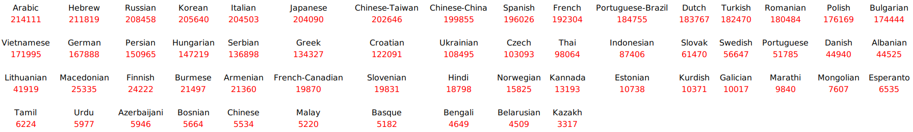
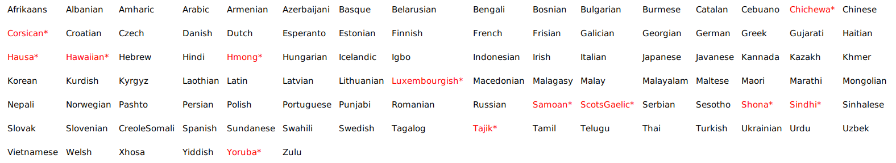

Massively MNMT is a multilingual many-to-many NMT model proposed by
Google Research in 2019 and published in their paper: [Massively
Multilingual Neural Machine
Translation](https://aclanthology.org/N19-1388.pdf). Massively MNMT is a
standard Base-Transformer with 6 layers in both the encoder and the
decoder. To enable many-to-many translation, the authors added a
target-language prefix token to each source sentence.

The main question in this paper is how well a single NMT model can scale
to support a very large number of language pairs. To answer this
question, the model was trained under two training settings:

-   <u><strong>Low-resource Setting</strong></u>\
    Language-pairs have limited training examples.

-   <u><strong>High-resource Setting:</strong></u>\
    Language-pairs have plenty of training examples.

In these settings, they created three different massively MNMTs with
exactly the same architecture:

-   <u><strong>Many-to-many model:</strong></u>\
    Trained using data from and to English (116 directions).

-   <u><strong>One-to-many model:</strong></u>\
    Trained using data from English (58 directions).

-   <u><strong>Many-to-one model:</strong></u>\
    Trained using data to English (58 directions).

For model fine-tuning, they created a development set by uniformly sampling
from a concatenation of all the individual language pair development sets,
resulting in 13k development examples.

> **Note:**\
In this paper, the baseline models in the following tables are
bilingual models, each trained for a specific language-pair.

Low-resource Setting
--------------------

In this setting, we are going to evaluate the performance of the
Massively MNMT over 59 languages with few training examples gathered
from [TED talks](https://github.com/neulab/word-embeddings-for-nmt)
parallel corpus. This dataset is highly imbalanced, with language pairs
including between 214k to 3.3k sentence pairs for training as shown in
the following table:

    

In this setting, the model dimension is set at 512, hidden dimension
size of 2048 and 8 attention heads. The model's 93M trainable parameters
were trained using the inverse square root learning rate schedule with
learning rate set at 3 and 40k warm-up steps. The vocabulary used in
this setting is 32k sub-words.

To evaluate the three models, they used the following four languages:
Azerbeijani (Az), Belarusian (Be), Galician (Gl) and Slovak (Sk) as they
present an extreme low-resource case with as few as 4.5k training
examples for Belarusian-English. The following two tables show the test
BLEU score:

    

The previous left table shows that the **many-to-many model**
outperforms all other models when translating into English. This is
surprising as it uses the same X→En data as the **many-to-one model**.
One possible explanation is that the many-to-one model overfits the
English side of the corpus since the English sentences are overlapping
across the different language pairs, making it much easier for the model
to memorize.

On the other hand, the previous right table shows an opposite trend; the
**many-to-many model** performs worse than the **one-to-many model**.
This quality degradation may be due to the English-Centric setting:
since most of the translation directions the model is trained on are
into English, this leaves less capacity for the other target languages.

High-resource Setting
---------------------

In this setting, they scaled the number of languages to 103 (shown
below) and the number of examples per language-pair to 940k on average.
The 13 languages colored in red had less than 1M examples, while the
rest had exactly 1M. This data is not publicly available:

    

In this setting, the model dimension is set at 1024, hidden dimension
size of 8192 and 16 attention heads. The model's 473.7M trainable
parameters were trained using the inverse square root learning rate
schedule with learning rate set at 3 and 40k warm-up steps. The
vocabulary used in this setting is 64k sub-words.

To evaluate the three models, they used 10 languages different
typological families: Arabic (Ar), Hebrew (He), Romance -- Galician
(Gl), Italian (It), Romanian (Ro), German (De), Dutch (Nl), Belarusian
(Be), Slovak (Sk) and Azerbaijani (Az) and Turkish (Tr). The following
two tables show the test BLEU score:

    

The former two tables show that the **many-to-many model** outperforms
bilingual baseline models. This shows that many-to-many models can work
well in realistic settings with millions of training examples, 102
languages and 204 jointly trained directions to-and-from English.

The first table shows that the **many-to-one model** here performs
better than the **many-to-many model**. This shows that the previous
result in the low-resource setting was due to overfitting in the
many-to-one model.

The second table shows the same trend as the low-resource setting where
the **one-to-many model** outperforms the **many-to-many model**. Again,
this advantage may be due to the one-to-many model handling a smaller
number of tasks while not being biased towards English in the target
side like the many-to-many model.

Multilinguality Vs Performance
------------------------------

They tried to better understand the trade-off between the number of
languages involved and the translation accuracy while keeping the model
fixed. So, they created four additional English-Centric datasets,
containing 5, 25, 50 and 75 languages. They made sure that the 25
language subset contains the 5 language subset, the 50 language subset
contains the 25 language subset and so on. Then, they trained the same
transformer model used for the high-resource setting (with 473.7M
parameters) on each of these subsets and measure the performance in two
manners:

-   <u><strong>Supervised Manner:</strong></u>\
    Where they evaluated the model based on translation directions that
    it was trained on. They found out that the more languages you add,
    the less performance you get knowing that the gap isn't that big as
    shown below:

    

-   <u><strong>Zero-shot Manner:</strong></u>\
    Where they evaluated the model based on translation directions that
    it has never seen. They found out that by adding more languages, the
    model is forced to create a more generalized representation to
    better utilize its capacity, which improves zero-shot performance.
    And the balance between capacity and generalization is best in the
    mid range (50-to-50 model):

    

