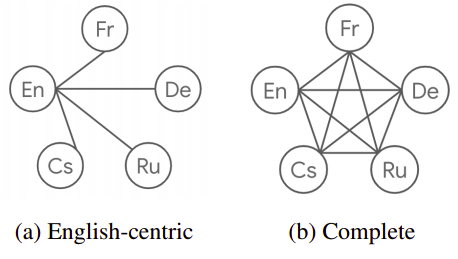
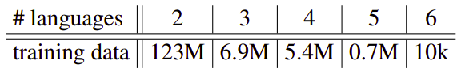
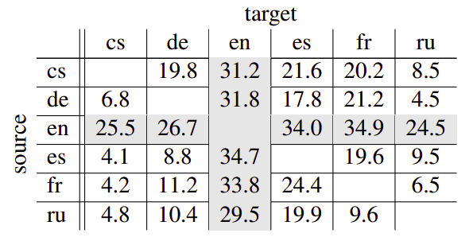

cMNMT stands for "Complete Multilingual Neural Machine Translation"
which is a multilingual NMT model proposed by Google Research in 2020
and published in their paper: "[Complete Multilingual Neural Machine
Translation](https://arxiv.org/pdf/2010.10239.pdf)". Multilingual Neural
Machine Translation models are called <u><strong>complete</strong></u> when they are
trained for all possible source-target pairs. The following figure shows
the difference between the data of an English-Centric MNMT (left) and a
complete MNMT (right) on a six-languages dataset:

    

The publishers proposed this model as they noticed that MNMT models are
commonly trained on a joint set of bilingual corpora which is acutely
English-Centric (English either as the source or target language). While
direct data between two languages that are non-English is explicitly
available at times but not used. That's why they proposed a new way
called "Multi-way Aligned Data" that can make use of these unused
directions.

Multi-way Aligned Data
----------------------

Multi-way Aligned Data is the method proposed by the researchers to
align training examples from different language pairs when either their
source or target sides are identical. So, if you have X↔Y parallel data
and Z↔Y parallel data, then you can align them to get X↔Y↔Z as shown in
the following example where X is "German", Y "English" and Z "Spanish":

    

In the paper, they used five more languages beside English (en) from the
public WMT datasets:

-   Czech (cs): Data collected from WMT 2018.

-   French (fr): Data collected from WMT 2014.

-   German (de): Data collected from WMT 2014.

-   Spanish (es): Data collected from WMT 2013.

-   Russian (ru): Data collected from WMT 2018.

As you might now, some of the datasets provided in these benchmarks
are multi-way parallel by construction. As shown in the following
table, the vast majority (123 million) of the examples do only have
translations into two languages while 10,000 sentences have
translations in all 6 languages.

    

Using this data, the researchers were able to construct non-English
bilingual training examples by pairing the non-English sides of two
training examples with identical English translations.

Model
-----

cMNMT is a standard transformer-big model size that uses a vocabulary of
64,000 subword units trained for 500,000 updates using an average batch
size of around 33,000 sentences (∼1 million tokens). Due to the data
imbalance across languages, they used temperature-sampling to up-sample
low-resource language pairs as seen in the following equation where $p$
is a language pair and $D\left( p \right)$ is the size of the available
parallel data:

$$p_{p} = \left( \frac{D\left( p \right)}{\sum_{q}^{}{D\left( q \right)}} \right)^{\frac{1}{T}}$$

To study the performance of this model, it was compared with several
baselines on the newstest2013 dataset; All bilingual baselines used a
vocabulary of 32,000 subwords, while all multilingual baselines used a
vocabulary of 64,000 subword units. All multilingual models were trained
for 500,000 updates while bilingual models were trained for 400,000
steps as they converged earlier using a batch size of around 8,000
sentences (∼260,000 tokens):

-   <u><strong>Bilingual models:</strong></u>\
    They trained two bilingual baselines (using either transformer-base
    or transformer-big) for each language pair. They experimented with
    several dropout rates and found that $dropout = 0.1$ works best for
    transformer-base while $dropout = 0.3$ works best for
    transformer-big. As can be seen from the following two tables, the
    translation quality of the non-English language pairs is far behind
    the ones for English-centric pairs:

    

-   <u><strong>MNMT based on English-centric data:</strong></u>\
    **They trained a multilingual NMT model on the original WMT
    English-centric training data. All non-English language pairs are
    unseen during training and BLEU scores measure zero-shot
    performance. The following table shows that non-English language
    pairs are consistently lower than the ones for English-Centric
    pairs:

    

-   <u><strong>Bridging non-English language pairs:</strong></u>\
    For the bridging approach, the source sentence cascades
    through the source→English and English→target systems to generate
    the target sentence. The following table shows that the BLEU scores
    for all non-English pairs are higher compared to all previous
    baselines:

    

The bridging process has several limitations:
    
-   Translation errors accumulate in the pipeline.

-   Decoding time gets doubled since inference has to be run twice.

-   Bridging through a morphologically low language (i.e. English),
    important information could be lost (i.e. gender).

The following table compares the performance of cMNMT with the best baseline
model (the bridging one). As you can see, the BLEU scores for the non-English
language pairs go up from at least 1.4 BLEU to 5.0 BLEU. And when comparing our
cMNMT model to the English-centric baseline, we can see an average BLEU
increase of 14.6 BLEU for all nonEnglish language pairs:

    

