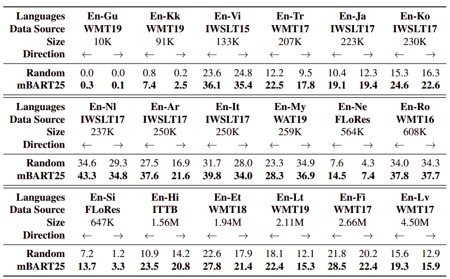

mBART stands for "Multilingual Bidirectional Auto-regressive
Transformer" which is a multilingual NMT model proposed by FacebookAI in
2020 and published in their paper: "[Multilingual Denoising Pre-training
for Neural Machine Translation](https://arxiv.org/pdf/2001.08210.pdf)".
The official code for this paper can be found in the fairseq GitHub
repository:
[mbart](https://github.com/pytorch/fairseq/tree/master/examples/mbart).
mBART is the first method for pre-training a complete
sequence-to-sequence model by denoising full texts in multiple
monolingual data, while previous approaches have focused only on the
encoder/decoder.

The whole idea behind mBART is to apply the BART architecture to
large-scale monolingual corpora across many languages where the input
texts are noised by masking phrases and permuting sentences. This will
create a universal language model that is able to denoise this input
text which makes translation from one language to another achievable.

    

Pre-training
------------

The data used for pre-training mBART is monolingual data of 25 different
languages collected by [common crawl](https://commoncrawl.org/). The table below
shows the size of the collected data.

    

The model used in this paper is a standard sequence-to-sequence
Transformer architecture from [fairseq
repository](https://github.com/pytorch/fairseq/) with:

-   12 layers of encoder and 12 layers of decoder. The model's dimension
    is 1024 on 16 heads (∼ 680M parameters).

-   They included an additional layer-normalization layer on top of both
    the encoder and decoder, which they found stabilized the training.

-   The model was trained for 500 steps using Adam optimizer with
    0.000001 learning rate and 0.98 beta2 and linear learning rate
    decay. The training took around 2.4 weeks despite using 256 Nvidia
    V100 GPUs.

-   They started the training with dropout 0.1 and reduced it to 0.05 at
    250K steps and 0 at 400K steps.

    Regarding the encoder:

-   For each instance, they packed as many consecutive sentences as
    possible sampled from the corresponding corpus of a certain
    language \<LID\>, until either it hits the document boundary or
    reaches the 512 max token length.

-   Sentences in the instance are separated by the end of sentence
    (\</S\>) token.

-   The language ID token is appended at the end of the instance.

    

Regarding the decoder:

-   The decoder input is the original text with one position offset
    which is the language id symbol \<LID\> as it's used as the
    initial token to predict the sentence.

    

Following the BART paper, they uses two types of noise:

-   **Text Infilling**: They masked around 35% of the words in each
    instance by random sampling a span length according to a Poisson
    distribution (λ = 3.5).

-   **Sentence Permutation**: They also permuted the order of sentences
    within each instance.

Fine-tuning
-----------

We fine-tune our multilingual pre-trained models on a single pair of
parallel data, feeding the source language into the encoder and decoding
the target language. Note that they used monolingual data for
pre-training and parallel corpus for fine-tuning. In the paper, they
used different pre-trained models to compare between while fine-tuning:

a.  **BART-En/Ro**: Baseline model for just one pair (English -
    > Romanian).

b.  **mBART25**: Uses all 25 languages.

c.  **mBART06**: Uses just 6 European languages \[Ro (Romanian), It
    (Italian), Cs (Czech), Fr (French), Es (Spanish) and En(English)\].

d.  **mBART02**: They used 4 different versions of this model; one for
    -\> each pair of the following pairs: ( English-German,
    -\> English-Romanian, English-Italian).

e.  **Random**: don't know exactly :D.

For all these models, they trained using 0.3 dropout, 0.2 label
smoothing, 2500 warm-up steps, 3e−5 maximum learning rate with a
maximum of 40K training updates for all low and medium resource
pairs and 100K for high resource pairs. The final models are
selected based on validation likelihood. For decoding, we use
beam-search with beam size 5 for all directions.

All models use the same vocabulary. Not all tokens will frequently
occur in all pre-training corpora, but later experiments show that
this large vocabulary can improve generalization in multilingual
settings even for unseen languages.

The following table shows a comparison between mBART25 and Random
baseline on low/medium-resource parallel corpora. Using mBART25
weights shows gains on all the low and medium resource pairs. While
fine-tuning fails in extremely low-resource setting such as En-Gu,
which only have roughly 10k instances:

    

The following table shows a comparison between mBART25 and Random
baseline on high-resource parallel corpora in the direction of En
\--\> X. As you can see, there weren't consistent gains, and
pre-training slightly hurts performance when \>25M parallel sentence
are available as if they wash out the pre-trained weights
completely:

    

> **Note:**\
In the paper, they tried using back-translation with low-resource
language and mBART25 and it did improve.

Analysis
--------

In my opinion, this is one of the best parts about this paper where they
try to answer the most common questions regarding their paper:

-   <u><strong>How many languages should you pre-train on?</strong></u>\
    When monolingual data is plentiful, pre-training
    pre-training on multiple languages slightly hurts the final
    results (\<1 BLEU). On the other hand, when monolingual data is
    limited, pre-training on more languages helps.

-   <u><strong>Is pre-training essential for using mBART?</strong></u>\
    Without any pre-training, mBART tends to overfit and perform much
    worse than the baseline.

-   <u><strong>How many pre-training steps are needed?</strong></u>\
    After just 25K steps, pre-trained models outperform the
    best baseline. The models keep improving by over 3 BLEU for the
    rest of steps and have not fully converged after 500K steps.

-   <u><strong>Is fine-tuning helps with unseen pre-trained languages?</strong></u>\
    Surprisingly, yes! They performed an experiment where they used
    mBART02 and mBART06 to translate En-Ar (English-Arabic), En-De
    (English-German), and En-DI (English-Dutch) where they weren't in
    the pre-training data. And these two models showed competitive
    results compared with mBART25. This result suggests that the
    pre-trained Transformer layers learn universal properties of
    language that generalize well even with minimal lexical overlap.

-   <u><strong>How does mBART behave with unseen Source or Target languages in
    the pre-training?</strong></u>\
    If both sides are unseen, the performance (in terms of difference
    from mBART25) is worse than where at least one language is seen
    during pre-training. Fine-tuning unseen languages on source side
    is more difficult than the target side. Although mBART06
    outperforms mBART02 by a margin on when the source side is
    missing.
