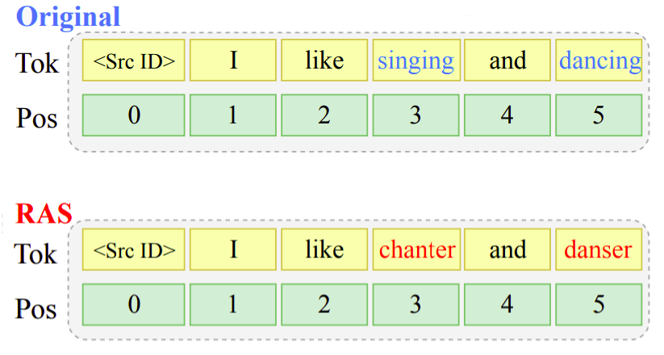
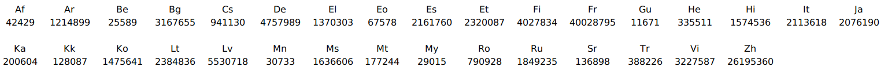
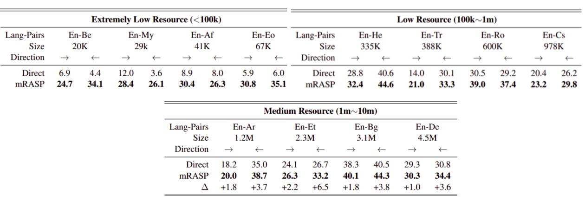

mRASP stands for "multilingual Random Aligned Substitution Pre-training"
which is a pre-training method for multilingual NMT models proposed by
ByteDance AI Lab in 2021 and published in their paper: "[Pre-training
Multilingual Neural Machine Translation by Leveraging Alignment
Information](https://arxiv.org/pdf/2010.03142.pdf)". The official code
for this paper can be found on this GitHub repository:
[mRASP](https://github.com/linzehui/mRASP).

mRASP is actually a standard Transformer-large architecture with 6-layer
encoder and 6-layer decoder. The model dimension is 1,024 on 16 heads
with replacing ReLU (Rectified Linear Unit) with GeLU (Gate Linear Unit)
as activation function on feed forward network. It also uses learned
positional embeddings.

    

The key idea in mRASP is its novel technique of RAS (Random Aligned
Substitution) pre-training, which brings words and phrases with similar
meanings across multiple languages closer in the representation space
achieving a a common initial multilingual NMT model that can be later
fine-tuned on any language pair.

Pre-training via RAS
--------------------

Given a parallel sentence $\left( x^{i},\ x^{j} \right)$ in two
different languages $L_{i}$ and $L_{j}$, RAS (Random Aligned
Substitution) randomly replaces a word $x_{t}^{i}$ at index $t$ in the
source language $i$ to a another word $d_{i,k}\left( x_{t}^{i} \right)$
in a different random language $L_{k}$ using MUSE dictionary which is
basically a look-up table trained in an unsupervised fashion that is
able to translate $x_{t}^{i}$ word in language $L_{i}$ to
$d_{i,k}\left( x_{t}^{i} \right)$ word in language $L_{k}$ where
$d_{i,k}$ is the dictionary translating function.

As we can see in the following figure, the words "singing" and "dancing"
were replaced by "chanter" and "danser" which have the same meaning in
French. For RAS, they used the top 1000 words in dictionaries and only
substituted words in source sentences. Each word is replaced with a
probability of $30\%$ according to the En-X bilingual dictionaries. And
if one word has multiple replacements, they randomly select one
substitution from all candidates To address polysemy.

    

With these replacement, the original bilingual pair
$\left( x^{i},\ x^{j} \right)$ will construct a code-switched
sentence pair $\left( C\left( x^{i} \right),\ x^{j} \right)$.
Considering a parallel dataset $\mathcal{D}_{i,j}$ of language
pair $\left( L_{i},L_{j} \right)$ and $\theta$ is the
parameter of mRASP, the pre-training loss is defined as:

$$\mathcal{L}^{\text{pre}} = \sum_{i,j \in \mathcal{D}}^{}{\mathbb{E}_{\left( x^{i},x^{j} \right)\sim\mathcal{D}_{i,j}}\lbrack - \log P_{\theta}\left( x^{i} \middle| C\left( x^{j} \right) \right)\rbrack}$$

In pre-training phase, mRASP was trained using Adam optimizer with and
linear decay scheduling with $\epsilon = 10^{- 8},\ \beta_{2} = 0.98$. A
warm-up step of 4000 is used. And the model was pre-trained for a total
of 150000 steps. Also, a subword vocabulary of 64,808 tokens were
created using BPE.

> **Note:**\
To distinguish from different translation pairs, they simply added
language tokens. For instance, the following En→Fr sentence "**How are
you? → Comment vas tu?**" is transformed to "**\<en\> How are you? →
\<fr\> Comment vas tu?**".

### PC32

PC32 stands for "Parallel Corpus 32" and this is the data created for
training mRASP containing 32 English-Centric Parallel data of 197
million pair of sentences. This dataset was collected from various
sources: [ted](https://github.com/neulab/word-embeddings-for-nmt),
[wmt](http://www.statmt.org/),
[europarl](http://opus.nlpl.eu/Europarl-v8.php),
[paracrawl](https://paracrawl.eu/),
[open-subtitles](http://opus.nlpl.eu/OpenSubtitles-v2018.php),
[qed](http://opus.nlpl.eu/QED-v2.0a.php). The following table summaries
the number of sentences of English-X where X denotes languages involved:

    

Fine-tuning
-----------

For fine-tuning, they collected 14 pairs of parallel corpus to simulate
different scenarios. The collected data was divided into four
categories:

-   Extremely low resource (\<100K): such as En-Be (Belarusian), En-My
    (Burmese), En-Af (Afrikaans), and En-Eo (Esperanto).

-   Low resource(\>100k and \<1M): such as En-He (Hebrew), En-Tr
    (Turkish), En-Ro (Romanian), and En-Cs (Czech).

-   Medium resource (\>1M and \<10M): such as En-Ar (Arabic), En-Et
    (Estonian), En-Bg (Bulgarian), and En-De (German).

-   Rich resource (\>10M): such as En-Zh (Chinese), and En-Fr (French).

    mRASP model was fine-tuned on the target language pairs. They
    applied a dropout rate of 0.3 for all pairs except for rich resource
    with 0.1. They carefully tuned the model, setting different learning
    rates and learning scheduler warm-up steps for different data scale.
    For inference, we use beam-search with beam size 5.

Experiments
-----------

To better quantify the effectiveness of the proposed pre-training
method, they compared mRASP with a direct model which is a randomly
initialized model. The following table shows that mRASP obtains better
results on different language-pairs:

    

To illustrate the generalization of mRASP, they also conducted
experiments on translation directions that haven't been seen in the
pre-training phase. The following table shows that mRASP obtains
significant gains for each category for different scales of datasets,
indicating that even trained with exotic languages, with pre-training
initialization, the model still works reasonably well.

    

