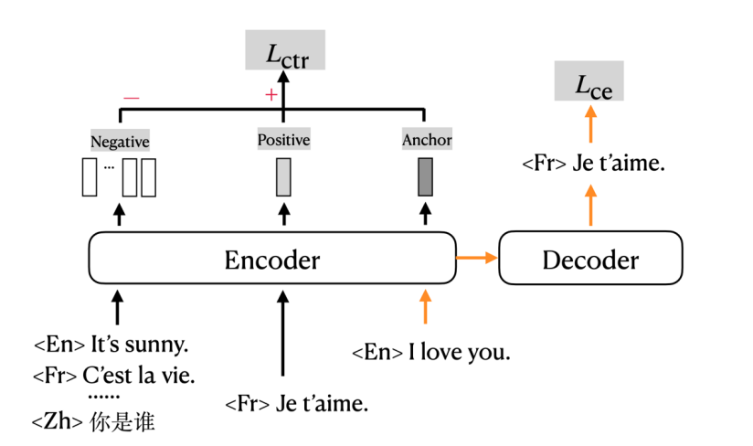

mRASP2 or mCOLT, "a **m**ultilingual **Co**ntrastive **L**earning
framework for **T**ranslation", which is a framework defined to reduce
the representation gap of different languages. This framework was
proposed by ByteDance AI Lab in 2021 and published in their paper:
[Contrastive Learning for Many-to-many Multilingual Neural Machine
Translation](https://arxiv.org/pdf/2105.09501.pdf). The official code
for this paper can be found in this GitHub repository:
[mRASP2](https://github.com/PANXiao1994/mRASP2).

mCOLT/mRASP2 is a multilingual neural machine translation model that
supports complete many-to-many multilingual machine translation. It
employs both parallel corpora and multilingual corpora in a unified
training framework.

    

As shown in the previous figure, mCOLT takes a pair of parallel
sentences (or augmented pseudo-pair) and computes normal cross entropy
loss with a multi-lingual encoder-decoder. In addition, it computes
contrastive loss on the representations of the aligned pair (positive
example) and randomly selected non-aligned pair (negative example).

TO BE CONTINUED
