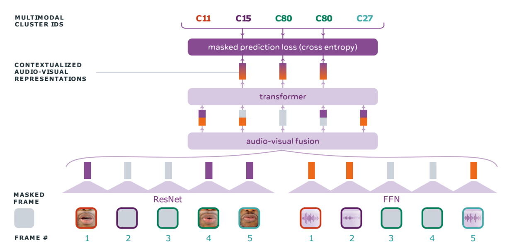
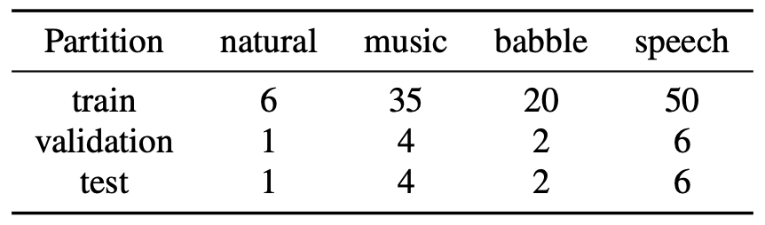
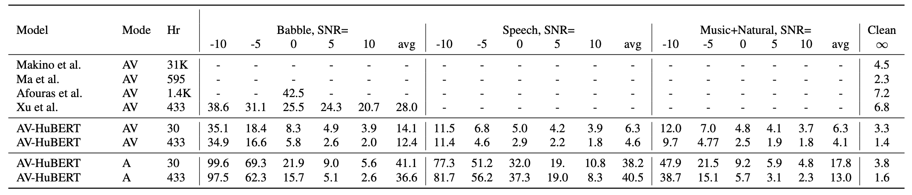
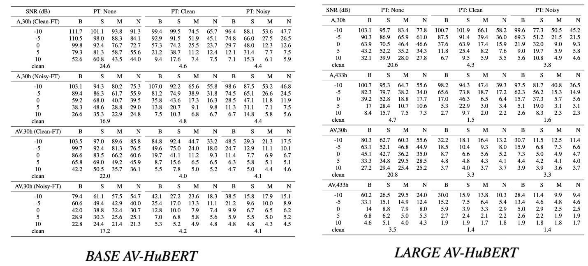
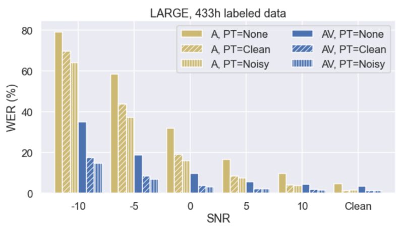
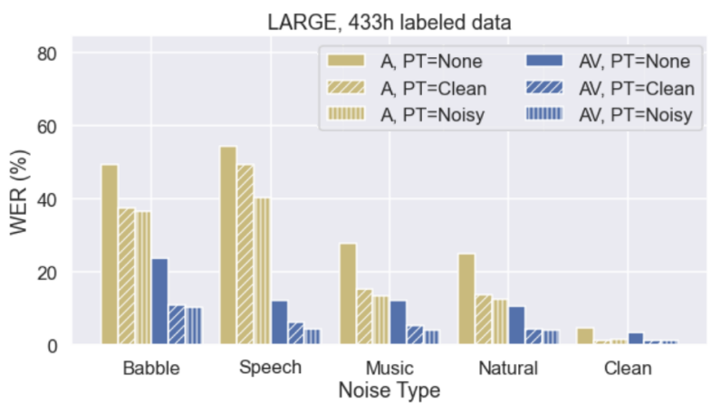
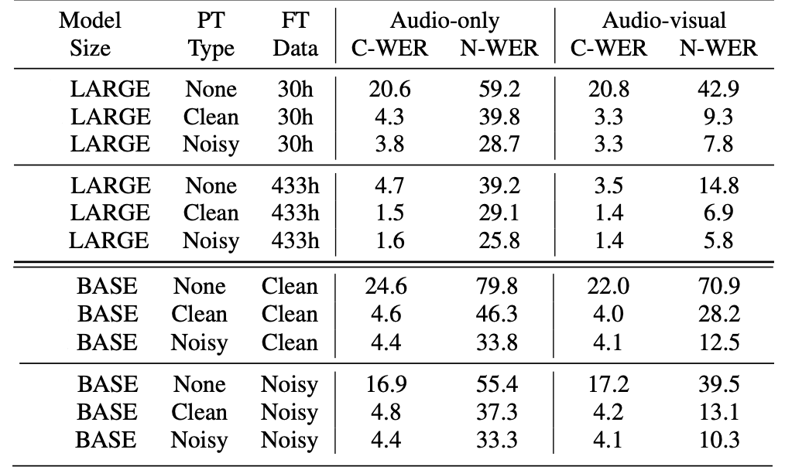

Audio-based automatic speech recognition (ASR) degrades significantly in
noisy environments. One way to help with that, is to complement the
audio stream with visual information that is invariant to noise which
helps the model performance. Mixing visual stream with audio stream is
known as Audio-visual speech recognition (AVSR).

Here, we are going to discuss this paper titled "[Robust Self-Supervised
Audio-Visual Speech Recognition](https://arxiv.org/pdf/2201.01763.pdf)"
which was proposed by Meta in 2022 where authors try to fine-tune
AV-HuBERT to the audio-visual speech recognition task. The official
implementation of this paper can be found in Facebook Research's
official GitHub repository:
[facebookresearch/av_hubert](https://github.com/facebookresearch/av_hubert).
Before getting into the different details mentioned in this paper, it's
a good idea to have an overview of how AV-HuBERT works first.

## AV-HuBERT Recap

AV-HuBERT stands for "**A**udio-**V**isual **H**idden **U**nit **BERT**"
which is a multi-modal self-supervised speech representation learning
model which encodes audio and image sequences into audio-visual
features. [HuBERT](https://anwarvic.github.io/speech-recognition/HuBERT)
can be considered a
[BERT](https://anwarvic.github.io/language-modeling/BERT) for the
"Audio" modal, and AV-HuBERT can be considered a
[BERT](https://anwarvic.github.io/language-modeling/BERT) for
"Audio-Visual" multi-modal systems. AV-HuBERT was proposed by Meta in
2022 and published in this paper: "[Learning Audio-Visual Speech
Representation by Masked Multimodal Cluster
Prediction](https://arxiv.org/pdf/2201.02184.pdf)".

    

AV-HuBERT, as shown in the previous figure, is a model that combines
audio features with the visual features. More formally, given an audio
stream $A = \left\lbrack a_{1},\ ...a_{T} \right\rbrack$ and a visual
stream $I = \left\lbrack i_{1},\ ...i_{T} \right\rbrack$ aligned
together, AV-HuBERT is pre-trained using the following steps:

-   First, both the input audio stream $A$ and the image stream $I$ are
    going to be masked independently using two different masking
    probabilities $m_{a}$ and $m_{v}$. That's because inferring the
    masked targets given the audio stream is more straightforward than
    using the visual stream stream. So, setting a high masking
    probability for acoustic frames is essential to help the whole model
    capture the language characteristics. On the contrary, setting a
    high masking probability for the visual input hurts its ability to
    learn meaningful features.

    -   The audio stream $A$ will be masked into $\widetilde{A}$ by a
        binary masking $M$. Specifically, $\forall t \in M$, $a_{t}$
        is replaced with a masked embedding following the same masking
        method as
        [HuBERT](https://anwarvic.github.io/speech-recognition/HuBERT).

    -   In parallel, the input image stream $I$ will be masked into
        $\widetilde{I}$ by a novel masking strategy where some
        segments in the visual stream will be substituted with random
        segments from the same video. More formally, given an input
        video $I = \left\lbrack i_{1},\ ...i_{T} \right\rbrack$, an
        imposter segment
        $J = \left\lbrack j_{1},\ ...j_{\mathcal{T}} \right\rbrack$
        taken from the original video will be used to corrupt the
        input video to $\widetilde{I}$. This is done by masking $n$
        intervals
        $M = \left\\{ \left( s_i, t_i \right) \right\\}_{1 \leq i \leq n}$
        and replacing them with the imposter video $J$ using an offset
        integer $p_i$ sampled from the interval
        $\left\lbrack 0,\ \mathcal{T} - t_i + s_i \right\rbrack$,
        as shown in the following formula:

$${\widetilde{I}}_{\left( s_{i}:t_{i} \right)} = J_{\left( p_{i}:t_{i} + t_{i} - s_{i} \right)},\ \ \forall 1 \leq i \leq n$$

-   Then, an audio encoder, which is a simple Fully-Forward Network
    (FFN) will be used to extract acoustic features
    $F^{(a)} = \left\lbrack f_{1}^{(a)},\ ...f_{T}^{(a)} \right\rbrack$
    from the masked audio stream $\widetilde{A}$, and in parallel a
    visual encoder, which is a modified ResNet-18, will be used to
    extract visual features
    $F^{(v)} = \left\lbrack f_{1}^{(v)},\ ...f_{T}^{(v)} \right\rbrack$
    from the visual stream $\widetilde{I}$.

-   Then, these acoustic features $F^{(a)}$ will be concatenated with
    the visual features $F^{(v)}$ on the channel-dimension forming
    audio-visual features $F^{(av)}$ according to two random
    probabilities $p_{m}$ and $p_{a}$ useful for modality dropout; as
    shown in the following equation:

$$F^{(av)} = \left\{ \begin{matrix}
    concat\left( F^{(a)},\ F^{(v)} \right), & \text{with  } p_{m} \\
    concat\left( F^{(a)},\ 0 \right), & \text{with  } \left( 1 - p_{m} \right)p_{a} \\
    concat\left( 0,\ F^{(v)} \right), & \text{with  } \left( 1 - p_{m} \right)\left( 1 - p_{a} \right) \\
\end{matrix} \right.$$

-   Then, the acoustic-visual features are encoded into a sequence of
    contextualized features
    $E = \left\lbrack e_{1},\ ...e_{T} \right\rbrack$ via the
    transformer encoder
    ([BERT](https://anwarvic.github.io/language-modeling/BERT));
    followed by a linear projection layer which maps features into
    logits:

$$p_{t} = Softmax\left( W.e_{t} + b \right)$$

-   Finally, AV-HuBERT is pre-trained to **[first identify the fake
    frames and then infer the labels belonging to the original
    frames]{.underline}** according to the following loss function:

$$\mathcal{L} = - \sum_{t \in M^{(a)} \cup M^{(v)}}^{}{\log\left( p_{t}.z_{t} \right)} - \alpha\sum_{t \notin M^{(a)} \cup M^{(v)}}^{}{\log\left( p_{t}.z_{t} \right)}$$

&emsp;&emsp;&emsp;Where $Z = \left\lbrack z_{1},\ ...z_{T} \right\rbrack$ is the clustered
representations using clustering algorithm (e.g. k-means) such that each
$z_{t}$ belongs to one of $V$ different clusters (codebooks).

$$z_{t} = kmeans\left( h_{t} \right),\ \ \ \ \ z_{t} \in \left\{ 1,\ 2,\ ...V \right\}$$

-   The input features $h_{t}$ to the clustering algorithm change based
    on the training iteration:

    -   For the first iteration, MFCC acoustic features extracted from
        the input audio stream $A$ are used.

    -   For the other iterations, intermediate layers of the Visual
        HuBERT model are used.

## Noise-Augmentation

Since AV-HuBERT was pre-trained on clean data, it's a little bit harder
for it to be robust to noisy speech recognition. A typical solution to
overcome this issue is to pre-train and/or fine-tune AV-HuBERT on a
synthetic audio data where we add noise to clean audio at a fixed or
sampled signal-to-noise ratio (SNR).

Incorporating noise in the pre-training phase helps the model by closing
the domain gap among pre-training, fine-tuning, and inference. However,
the the cluster assignments are inferred from clean audio-visual speech
because phonetic information, which is highly correlated with the
clusters, should be invariant to noise.

For more robustness, they used more diverse sources in their
noise-augmented data, including both speech and non-speech noise in the
categories of "natural", "music" and "babble" sampled from
[MUSAN](https://www.openslr.org/17/) dataset. The total duration (in
hour) of noise in each category is shown in the following table:

    

Noise-augmentation was done using the following steps:

-   First, they select one noise category and sample a noise audio clip
    from its training partition.

-   Then, during training they randomly mix the sampled noise at a fixed
    SNR of $0\ dB$ with a probability of $0.25$. At test time, they
    evaluate the model separately for each noise type. The testing noise
    clips are added at five SNR levels:
    $\left\\{ - 10,\  - 5,\ 0,\ 5,\ 10 \right\\}\ dB$.

## Experiments & Results

In the paper, they used AV-HuBERT LARGE as the default model
architecture for all experiments, which has $24$ transformer blocks,
where each block has $16$ attention heads and $1024$/$4096$
embedding/feedforward dimensions. For fine-tuning on the audio-visual
speech recognition task, they added a 9-layer randomly initialized
[Transformer](https://anwarvic.github.io/machine-translation/Transformer)
decoder with similar embedding/feedforward dimensions. Regarding the
data, they used two different datasets:

-   For pre-training, they used VoxCeleb2 which has around $2,442$ hours
    of videos from over $6,000$ speakers and contains utterances from
    multiple languages. They used only the English portion. As no
    ground-truth language label is given in the VoxCeleb2, they used an
    off-the-shelf character-based ASR
    [HuBERT](https://anwarvic.github.io/speech-recognition/HuBERT) model
    rained on Librispeech to filter non-English talks. The total amount
    of unlabeled data after filtering was $1,326$ hours.

-   For fine-tuning, they used LRS3 (Lip-Reading Sentences 3) dataset
    which has around $433$ hours of audio-visual speech from over $5000$
    speakers. In the original dataset, the training data is split into
    two partitions: "pretrain" ($403\ $hours) and "trainval" ($30$
    hours). As no official development set is provided, they randomly
    selected $1,200$ sequences (about 1 hour) from "trainval" as the
    validation set which was used for early stopping and hyper-parameter
    tuning. They created two settings for fine-tuning the model

    -   **Low-resource Setting:** using $30h$ of labeled videos

    -   **Mid-resource Setting:** using $433h$ of labels.

The following table compares the WER performance of the proposed
noise-augmented AV-HuBERT approach under different settings
versus existing supervised AVSR models.

    

As shown in the "Babble" column, with only $30$ hours of labeled
data, AV-HuBERT model outperforms other models. When using all
$433$ hours labeled data for fine-tuning, the relative
improvement is further increased. When the noise type is
extended beyond "babble" noise, the audio-visual model
consistently improves over its audio-only counterpart.

The full results of the test WER (%) score of BASE and LARGE
AV-HuBERT under different levels and types of noise (B: babble,
S: speech, M: music, N: natural noise):

    

## Ablation Study

To examine the impact of pre-training (no pre-training, pretraining with
clean audio, or noise-augmented pre-training) and input modality (audio
or audio-visual), they performed different ablation experiments as we
are going to see next:

### Effect of Visual Modal & Pre-training

First, they examined the performance of AVSR models against audio-only
ASR models under low-resource and mid-resource conditions by comparing
audio-only vs. audio-visual HuBERT LARGE models. The following figure
measure the WER (%) performance of different models under different
pre-training setups:

    

As seen in the previous figure, audio-visual models consistently
outperforms audio-only models under all settings regardless of the SNR
and the pre-training setup. And that shows the clear benefit of
incorporating the visual stream.

Regarding the pre-training effect, AV-HuBERT pre-training brings
substantial relative improvements of $78.3\%$ and $53.4\%$ on average
when using 30h and 433h of labeled data, respectively. The model
achieves bigger gains in the low-resource setting, which confirms the
impact of the self-supervised audio-visual representations learned by
the AV-HuBERT model. Regarding the noise-augmented pre-training, overall
it improves the results in noisy settings compared to pre-training on
clean data.

### Effect of the Noise Category

Compared to "babble", "music" and "natural" noise types, noise-augmented
AV-HuBERT pre-training is more effective in overlapping "speech" noise
as shown in the following figure. When comparing audio-visual and
audio-only models, the visual modality provides a strong clue to
"choose" the target speech track.

    

The gains from noise-augmented pre-training generalize across model
architectures (BASE vs LARGE), as shown in the following table:

    

