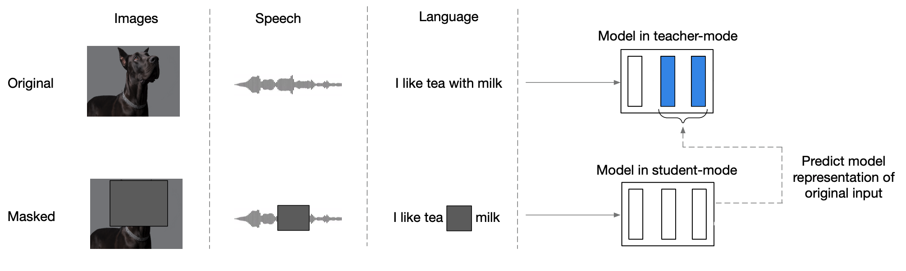

AV-data2vec stands for "Audio-Visual data2vec" which extends the
[data2vec](https://anwarvic.github.io/speech-recognition/data2vec)
framework from uni-modal to multi-modal. AV-data2vec encodes masked
audio-visual data and performs a masked prediction task of contextualized
targets based on the unmasked input data similar to
[data2vec](https://anwarvic.github.io/speech-recognition/data2vec) and
[data2vec
2.0](https://anwarvic.github.io/speech-recognition/data2vec_2).
AV-data2vec was proposed by Meta in early 2022 and published in this
paper: [AV-data2vec: Self-supervised Learning of Audio-Visual Speech
Representations with Contextualized Target
Representations](https://arxiv.org/pdf/2302.06419.pdf).

## data2vec Recap

Since the core structure of av-data2vec is
[data2vec](https://anwarvic.github.io/speech-recognition/data2vec), then
let's recap how
[data2vec](https://anwarvic.github.io/speech-recognition/data2vec)
worked and what the main components of its architecture and how its
training procedure looked like.
[data2vec](https://anwarvic.github.io/speech-recognition/data2vec) is a
framework that uses self-supervised learning on "speech, text, and
image" modalities to create a single multi-modal that works for all
three. So, instead of using
[word2vec](https://anwarvic.github.io/word-embedding/word2vec),
[wav2vec](https://anwarvic.github.io/speech-recognition/wav2vec), or
image2vec, we can use
[data2vec](https://anwarvic.github.io/speech-recognition/data2vec)
instead.

The main architecture for data2vec is the
[Transformer](https://anwarvic.github.io/machine-translation/Transformer)
architecture; and it is trained in two modes as shown in the following
figure:

1.  <u><strong>Teacher Mode:</strong></u>\
    [data2vec](https://anwarvic.github.io/speech-recognition/data2vec)
    model uses the modality-specific features encoders to produce
    feature encoders for the input data (without masking) which can be
    used by the
    [data2vec](https://anwarvic.github.io/speech-recognition/data2vec)
    model to produce latent representations.

2.  <u><strong>Student Mode:</strong></u>\
    The same [data2vec](https://anwarvic.github.io/speech-recognition/data2vec)
    model uses masked encodings, produced using different masking
    strategy depending on the modality, and tries to restore the same
    latent representations formed in the top-K layers of the teacher
    mode.

    

## data2vec vs AV-data2vec

AV-data2vec extends unimodal
[data2vec](https://anwarvic.github.io/speech-recognition/data2vec) to
multiple modalities and focuses on speech and video inputs to create
joint audio-visual representations. In order to achieve that,
AV-data2vec uses an audio-visual fusion module that combines audio
encodings and video encodings on the two
[data2vec](https://anwarvic.github.io/speech-recognition/data2vec)
training modes (student & teacher) as shown in the following figure:

    

More concretely, the difference between
[data2vec](https://anwarvic.github.io/speech-recognition/data2vec) and
AV-data2vec can be summarized as the following:

-   <u><strong>Audio Encoder:</strong></u>\
    Different than
    [data2vec](https://anwarvic.github.io/speech-recognition/data2vec)
    which uses $7$ layers of temporal 1D convolutions as the audio
    encoder similar to Wav2Vec
    [2.0](https://anwarvic.github.io/speech-recognition/wav2vec_2),
    AV-data2vec uses a feed-forward network (FFN) as the audio encoder
    similar to
    [AV-HuBERT](https://anwarvic.github.io/speech-recognition/AV-HuBERT_for_AVSR).
    More concretely, given audio signal of $80$-log filterbanks
    $X_{A} = \left\lbrack x_{1},\ ...x_{T} \right\rbrack \in \mathbb{R}^{80 \times T}$,
    AV-data2vec uses feed-forward network $FFN$ to map the audio signal
    $X_{A}$ to acoustic features
    $M_{A} = \left\lbrack m_{1},\ ...m_{T} \right\rbrack \in \mathbb{R}^{D \times T}$
    of the same length $T$:

$$M_{A} = FFN\left( X_{A} \right)$$

-   <u><strong>Video Encoder:</strong></u>\
    Different than
    [data2vec](https://anwarvic.github.io/speech-recognition/data2vec)
    which uses [ViT](https://arxiv.org/pdf/2010.11929.pdf) strategy of
    taking $224 \times 224$ images as input and treats them as a
    sequence of fourteen $16 \times 16$ patches then each patch is
    linearly transformed and a sequence of $196$ representations,
    AV-data2vec uses a variant of ResNet-18 similar to
    [AV-HuBERT](https://anwarvic.github.io/speech-recognition/AV-HuBERT_for_AVSR).
    More concretely, given video signal
    $X_{V} = \left\lbrack x_{1},\ ...x_{T} \right\rbrack \in \mathbb{R}^{H \times W \times C \times T}$,
    AV-data2vec uses $ResNet$ network to map the video signal $X_{V}$ to
    visual features
    $M_{V} = \left\lbrack m_{1},\ ...m_{T} \right\rbrack \in \mathbb{R}^{D \times T}$
    of the same length $T$:

$$M_{V} = ResNet\left( X_{V} \right)$$

-   <u><strong>Audio-Visual Fusion:</strong></u>\
    Similar to
    [AV-HuBERT](https://anwarvic.github.io/speech-recognition/AV-HuBERT_for_AVSR),
    AV-data2vec concatenates audio encodings with visual encodings
    producing one encodings according to the following equation where
    $p_{A}$, $p_{V}$, and $p_{AV}$, denoting the probability that audio,
    video, audio-visual modalities is selected as input modality
    respectively for either the student or the teacher:

$$M = \left\{ \begin{matrix}
\begin{matrix}
concat\left( M_{A},\ M_{V} \right) & with\ p_{AV} \\
\end{matrix} \\
\begin{matrix}
concat\left( M_{A},\ 0 \right) & with\ p_{A} \\
\end{matrix} \\
\begin{matrix}
concat\left( 0,\ M_{V} \right) & with\ p_{V} \\
\end{matrix} \\
\end{matrix} \right. $$

> **Note:**\
In the paper, either audio or video is selected conditioned on
audio-visual not being selected. In other words,
$p_{A} = p_{\overline{AV}} \ast p_{\left. \ A \right|\overline{AV}}$ and
$p_{V} = p_{\overline{AV}} \ast p_{\left. \ V \right|\overline{AV}}$
where $p_{\overline{AV}} = 1 - p_{AV}$.

-   <u><strong>Masking Strategy:</strong></u>\
    Different than the masking strategy in
    [data2vec](https://anwarvic.github.io/speech-recognition/data2vec)
    that uses patch masking on the image side and Wav2Vec
    [2.0](https://anwarvic.github.io/speech-recognition/wav2vec_2)
    masking strategy on the audio side, AV-data2vec uses span masking on
    the fused audio-visual encodings. They randomly select $r\%$
    time-steps as starting indices to mask of length $l$. In the paper,
    they set $r = 50\%$ and $l = 10$.

-   <u><strong>Loss Function:</strong></u>\
    AV-data2vec changes the learning objective of
    [data2vec](https://anwarvic.github.io/speech-recognition/data2vec) a
    bit by considering computing the loss for both masked and unmaksed
    time-steps according to the following formula where $z_{t}$ is the
    student representation, $y_{t}$ is the teacher representation, $t$
    is the time-step, $I$ is the set of masked indices, $\alpha$ and
    $\beta$ are two weighting factors. In the paper, they set
    $\alpha = 1$ and $\beta = 0$ if the input modality is audio-only or
    audio-visual, and if the input modality is video-only, they set
    $\alpha = 1$ and $\beta = 1$:

$$\mathcal{L} = \alpha\sum_{t \in I}^{}\left\| z_{t} - y_{t} \right\|_{2}^{2} + \beta\sum_{t \notin I}^{}\left\| z_{t} - y_{t} \right\|_{2}^{2}$$

## Experiments & Results

For audio-visual pre-training, they used LRS3 (Lip-Reading Sentences 3)
dataset containing $433$ hours and the English part of VoxCeleb2 dataset
containing $1,326$ hours and they followed the same pre-processing used
with
[AV-HuBERT](https://anwarvic.github.io/speech-recognition/AV-HuBERT_for_AVSR).
Following
[data2vec](https://anwarvic.github.io/speech-recognition/data2vec), they
used two sizes for AV-data2vec: "base" and "large".

After pretraining AV-data2vec, they use it as the encoder of an
attention-based sequence-to-sequence (S2S) architecture and fine-tune it
on labeled data to minimize the cross-entropy (CE) criterion. They
considered two experimental setups in terms of amount of labeled data:
low-labeled and high-labeled. In these two setups, they compared
AV-data2vec to other audio-visual models such as
[AV-HuBERT](https://anwarvic.github.io/speech-recognition/AV-HuBERT_for_AVSR),
[RAVen](https://anwarvic.github.io/speech-recognition/RAVen), and
[VATLM](https://anwarvic.github.io/speech-recognition/VATLM) on three
different tasks: VSR, ASR and AVSR tasks where the input modalities are
video-only, audio-only and audio-visual respectively.

> **Note:**\
Results reported below are the best results of
$beam\ size = \lbrack 5,\ 10,\ 25,\ 50,\ 100\rbrack$ and no Language
Model was used during decoding.

### Low-labeled Data

In the low-labeled setup, the model was pre-trained on a combination of
LRS3 data ($433h$) and VoxCeleb2-En data ($1,326h$), and fine-tuned on
LRS3 "trainval set" ($30h$). Results are reported in the following
table:

    

From the previous table, we can see that:

-   For base models, AV-data2vec consistently outperforms other models
    except when pre-training on only LRS3 data. In that case,
    [VATLM](https://anwarvic.github.io/speech-recognition/VATLM)
    performs better on AVSR. The reason behind that could be because
    [VATLM](https://anwarvic.github.io/speech-recognition/VATLM) uses
    additional audio and text data at pre-training. Also, it seems that
    AV-data2vec benefits the most from increasing the pre-training data
    by adding VoxCeleb2-En.

-   For large models, AV-data2vec achieves the best results on all
    conditions except for the once case where
    [RAVen](https://anwarvic.github.io/speech-recognition/RAVen) get
    slightly better score. This could be due to
    [RAVen](https://anwarvic.github.io/speech-recognition/RAVen) having
    about double AV-data2vec size.

### high-labeld Data

In the high-labeled setup, the model was pre-trained on a combination of
LRS3 data ($433h$) and VoxCeleb2-En data ($1,326h$), and fine-tuned on
all LRS3 data ($433h$). Results are reported in the following table:

    

From the previous table, we can see that:

-   For base models, AV-data2vec achieves state-of-the-art results.

-   For large models,
    [u-HuBERT](https://anwarvic.github.io/speech-recognition/u-HuBERT)
    achieves the best performance on VSR and AVSR tasks, while
    [AV-HuBERT](https://anwarvic.github.io/speech-recognition/AV-HuBERT_for_AVSR)
    achieves the best performance in ASR.

## Ablation Studies

In the paper, authors decided to ablate some of the hyper-parameter
choices. For faster experimentation, they used the Base model and
pretrained it on the $433h$ of unlabeled data for $600k$ updates with
the learning rate of $5e^{- 4}$ and batch size of $640s$. The following
is a summarization of the different experimentation:

-   <u><strong>Audio-Visual Vs Audio-only:</strong></u>\
    They compared audio-visual pre-training and fine-tuning (AV-data2vec)
    to audio-only (A-data2vec) for$\ 600k$ updates. Results, illustrated
    below, shows that the audio-visual version outperforms audio-only
    results in almost all settings.

    

-   <u><strong>Top-K Target Averaging:</strong></u>\
    They measured the impact of creating contextualized target
    representations based on multiple blocks ranging from the top block
    to the $12$ blocks. As shown in the following figure, more blocks
    lead to better performance:

    

-   <u><strong>EMA Scheduler:</strong></u>\
    They investigated the effect of the EMA (Exponentially Moving
    Average) parameters: $\tau$, $\tau_{0}$ and $\tau_{e}$. Best values
    are reported in the first row of the following table:

    

-   <u><strong>Modality Scheduler:</strong></u>\
    They explored different probabilities for audio-only $p_{A}$,
    video-only $p_{V}$, and audio-visual $p_{AV}$ probabilities for both
    teacher mode and student mode and the results are reported in the
    following tables:

    

-   <u><strong>Tuning Batch Size & Learning Rate:</strong></u>\
    They explored different values for learning rate and batch size and
    reported the results in the following table. It seems that large
    models benefit more from smaller learning rates and larger batch
    size.

    

