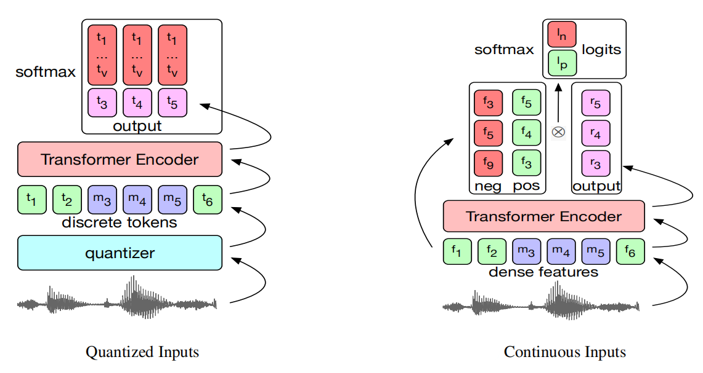
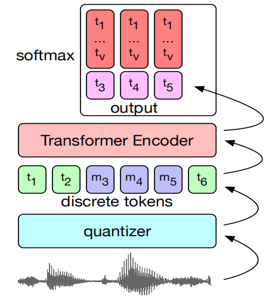
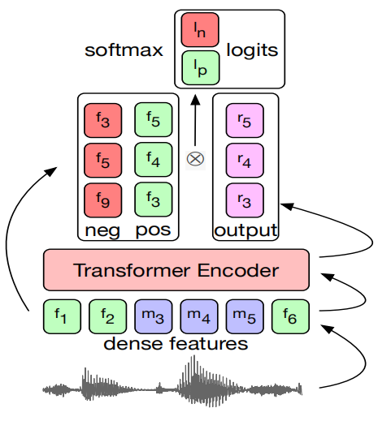
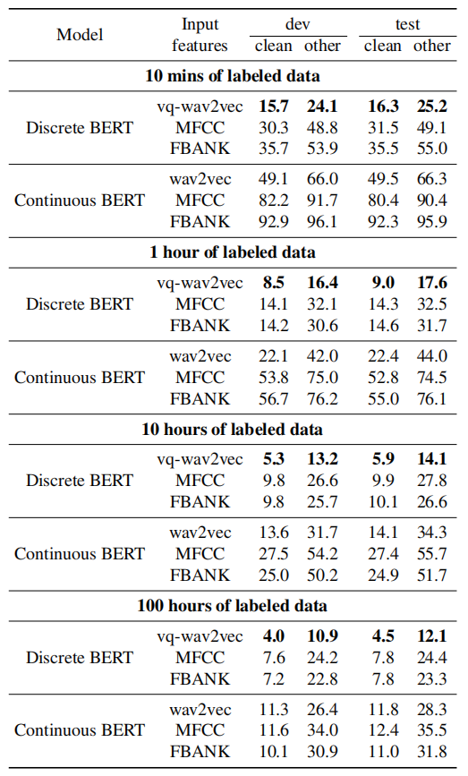
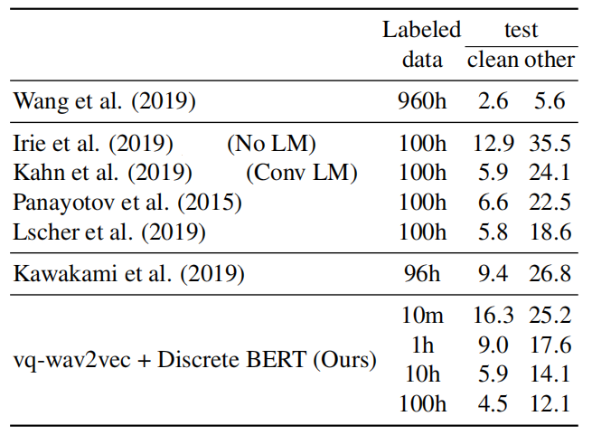
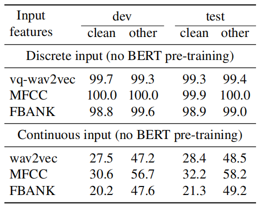
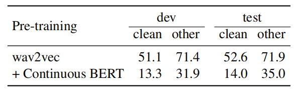

[BERT](https://anwarvic.github.io/language-modeling/BERT) was created as
a language model that deals with textual data, However, have you ever
wondered if we used BERT on an acoustic data, what will be its
performance? Apparently, some researchers at Facebook AI Research in
2019 tried to answer that question and published a paper called
"[Effectiveness of Self-Supervised Pre-Training for Speech
Recognition](https://arxiv.org/pdf/1911.03912.pdf)" where they tried to
fine-tune a pre-trained
[BERT](https://anwarvic.github.io/language-modeling/BERT) model for
speech recognition task using
[CTC](https://anwarvic.github.io/speech-recognition/CTC) loss function.
To enable [BERT](https://anwarvic.github.io/language-modeling/BERT) to
deal with input audio data, they tried using two different approaches as
shown in the following figure:

-   **Discrete BERT:** when they used quantized audio representation.

-   **Continuous BERT:** when they used continuous audio
    representations.

    

> **Note to Reader:**\
You need to brush-up your information about these topics:
[BERT](https://anwarvic.github.io/language-modeling/BERT),
[wav2vec](https://anwarvic.github.io/speech-recognition/wav2vec),
and
[vq-wav2vec](https://anwarvic.github.io/speech-recognition/vq-wav2vec).

Discrete BERT
-------------

Discrete BERT, as shown in the following figure, consists of three different
main components:

-   **Audio representation:** They tried two different audio
    representations:

    -   Mel-frequency Cepstral Coefficients (MFCC).

    -   Log-mel Filterbanks (FBANK).

    -   Discrete
        [vq-wav2vec](https://anwarvic.github.io/speech-recognition/vq-wav2vec)
        features.

-   **Quantizer:** They used the gumbel-softmax [variant proposed in the
    vq-wav2vec](https://anwarvic.github.io/speech-recognition/vq-wav2vec)
    model. They quantized the Librispeech dataset into 13.5k unique
    codes, to be comparable to
    [vq-wav2vec](https://anwarvic.github.io/speech-recognition/vq-wav2vec).

-   **Transformer Encoder:** These quanitized audio features are passed
    to a [BERT](https://anwarvic.github.io/language-modeling/BERT) model
    that was pre-trained with only the masked language modeling task on
    each set of inputs. Masking was done by choosing tokens for masking
    with probability of $5\%$, expanding each chosen token to a span of
    a length sampled from a normal distribution
    $\mathcal{N}\left( 10,\ 10 \right)$ knowing that spans may overlap.
    Following "[Transformers with Convolutional Context for
    ASR](https://arxiv.org/pdf/1904.11660.pdf)" paper, they replaced the
    fixed positional embeddings in the BERT model with a single group
    convolutional layer. The convolutional layer has a kernel size of
    $128$ and group size of $16$ to reduce the number of added
    parameters.

    

Continuous BERT
---------------

Similar to Discrete BERT, Continuous BERT consists of just two main components:

-   **Audio Representation:** They tried three different audio
    continuous representations:

    -   Mel-frequency Cepstral Coefficients (MFCC).

    -   Log-mel Filterbanks (FBANK).

    -   Continuous
        [wav2vec](https://anwarvic.github.io/speech-recognition/wav2vec)
        features.

-   **Transformer Encoder:** A
    [BERT](https://anwarvic.github.io/language-modeling/BERT)'s masked
    language modeling task cannot be performed with continuous inputs,
    as there are no targets to predict in place of the masked tokens. To
    overcome that, they pre-trained
    [BERT](https://anwarvic.github.io/language-modeling/BERT) to
    classify the masked positive example among a set of negatives. The
    model is optimized with the InfoNCE loss where given one positive
    sample $z_{i}$ and $N$ negative samples $\widetilde{z}$:

$$\mathcal{L}_{k} = \sum_{i = 1}^{T}\left( \frac{\exp\left( z_{i} \right)}{\sum_{j = 1}^{N}{\exp\left( {\widetilde{z}}_{j} \right)}} \right)$$

Where each sample $z_{i}$ is computed as a dot product of the output of
the model at timestep $i$ and the true unmasked value of positive
example at timestep $i$ or a randomly sampled negative example.

    

To stabilize training, they added the squared sum of logits produced by
the dot-product to the loss, and then apply a soft clamp
${\widetilde{s}}_{i} = \lambda tanh\left( \frac{s_{i}}{\lambda} \right)$
for each logit $s_{i}$ to prevent the model's tendency to continually
increase the magnitude of logits during training.

Fine-tuning
-----------

The Discrete/Continuous BERT were pre-trained on the unlabeled 960h
Librispeech data, and then fine-tuned on LibriLight training sets of 100
hours, 10 hours, 1 hour, and 10 mins to perform the speech recognition
task using CTC loss; by adding a randomly initialized linear projection
on top of the features computed by the transformer models into $V$
classes representing the vocabulary. The vocabulary is 29 tokens for
character targets plus a word boundary token.

For data augmentation, they applied
[SpecAugment](https://anwarvic.github.io/speech-recognition/SpecAugment)
during training which delayed overfitting and significantly improved the
final accuracy numbers, especially on the smallest subsets. For
regularization, they used a dropout at every layer of the transformer of
$0.1$ for 10 minute and 1 hour setup, but it was disabled for the 10
hour set and 100 hours. The Libri-light training sets were sampled
equally from the two clean and noisy portions, a balance of male and
female speakers.

Experiments & Results
---------------------

The model they used is a standard BERT model with 12 transformer layers,
model dimension $768$, inner dimension (FFN) $3072$ and $12$ attention
heads. The learning rate is warmed up over the first $10,000$ updates to
a peak value of $1 \times 10^{- 5}$, and then linearly decayed over a
total of $250k$ updates.

In the first experiment, they compared Discrete BERT and Continuous BERT
in different simulated labeled data scenarios ranging from 100 hours to 10
minutes. From this table, we can see the following:

-   Discrete BERT outperforms Continuous BERT in all settings.

-   The best input features are obtained through self-supervised
    learning through
    [vq-wav2vec](https://anwarvic.github.io/speech-recognition/vq-wav2vec)
    for Discrete BERT, or
    [wav2vec](https://anwarvic.github.io/speech-recognition/wav2vec) for
    Continuous BERT.

-   When reducing the amount of labeled training data from 100h to 10h
    results in an increase of only 2 WER on test-other and 1.4 WER on
    test-clean for Discrete BERT with vq-wav2vec inputs. This shows that
    pre-training is effective and particularly so when little labeled
    data is available.

    

In the second experiment, they compared Discrete BERT to other
models. Fine-tuning Discrete BERT on only 10 hour of labeled data
can nearly match the best known result on 100 hours of labeled
Librispeech data on test-clean, while achieving a 25% relative WER
reduction on test-other. Moreover, when using the same
train-clean-100 subset for fine-tuning, Discrete BERT with
vq-wav2vec inputs improves by 6.5 WER (35% relative WER reduction)
on test-other and 1.3 WER (22% relative WER reduction) on test-clean
over.

    

To better understand the impact of BERT pre-training, they decided
to remove the BERT pre-training step and only perform unit discovery
through vq-wav2vec, for discrete inputs, and fine-tuning, for both
discrete and continuous inputs on the 10 hour labeled setup. The
following table shows that training with discrete inputs fails. This
is likely because the representations of the input discrete units
are random and training on the labeled data is not sufficient.
Continuous inputs do not suffer from this issue.

    

Also, they shed some light on how a two-step pre-training approach
compares to a single-step approach. Specifically, they compared
Continuous BERT with wav2vec input features to just wav2vec features
fine-tuned with a CTC loss on labeled data. The following table
shows that Continuous BERT + wav2vec provides substantial gains:

    

