Auto-AVSR stands for "Automatic Audio-Visual Speech Recognition" which
is an off-the-shelf hybrid audio-visual model based on a ResNet-18 for
visual encoding and Conformer for audio encoding. Auto-AVSR was
originally proposed in 2021 by researchers form the Imperial College
London and published in this paper: "[End-to-end Audio-visual Speech
Recognition with Conformers](https://arxiv.org/pdf/2102.06657.pdf)".

## Architecture

The proposed architecture for Auto-AVSR can be seen in the following
figure. As you can see, the architecture consists of four main
components: <u><strong>VSR Encoder</strong></u>, <u><strong>ASR
Encoder</strong></u>, <u><strong>MLP Fusion Layer</strong></u>, and
<u><strong>Transformer Decoder</strong></u>. In the next part, we are going to
talk about each of these components in more details.

    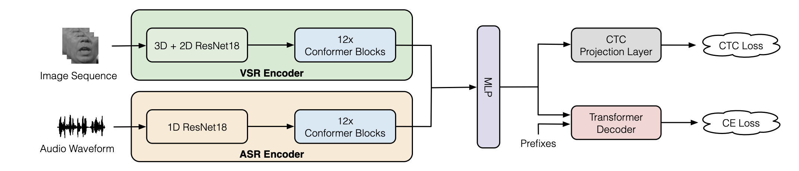

### VSR Encoder

VSR stands for "Visual Speech Recognition". As the name suggests, this
module's main job is to encode the image sequence for speech recognition
task. This module consists of a modified ResNet-18, where the first
layer is a spatio-temporal convolutional layer with a 3D kernel size of
$5 \times 7 \times 7$ and a stride of $1 \times 2 \times 2$. The
back-end is a 12-layer
[Conformer](https://anwarvic.github.io/speech-recognition/Conformer) for
temporal modeling. It is comprised of an embedding module, followed by a
set of conformer blocks. In the embedding module, a linear layer
projects the features from ResNet18 to a $d_{k}$-dimensional space.

    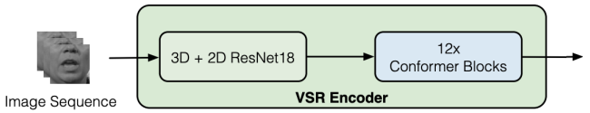

### ASR Encoder

Similarly, the ASR encoder consists of a 1D ResNet-18 followed by a
12-layer
[Conformer](https://anwarvic.github.io/speech-recognition/Conformer).
The ResNet-18 is based on 1D convolutional layers, where the filter size
at the first convolutional layer is set to $80$ ($5ms$). To down-sample
the time-scale, the stride is set to $2$ at every block. The only
exception is the first block, where the stride is set to $4$. At the end
of the front-end module, acoustic features are down-sampled to $25$
frames per second so the match the frame rate of the visual features.

    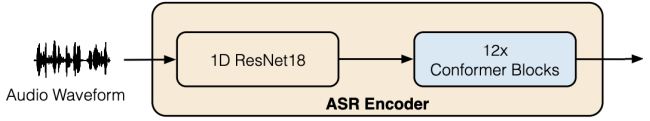

> **Note:**\
The following table shows a comparison between the ResNet architecture
of the acoustic and visual Front-end. The acoustic model and visual
backbones have $3.85\ M$ and $11.18\ M$ parameters, respectively:
>
> 

>     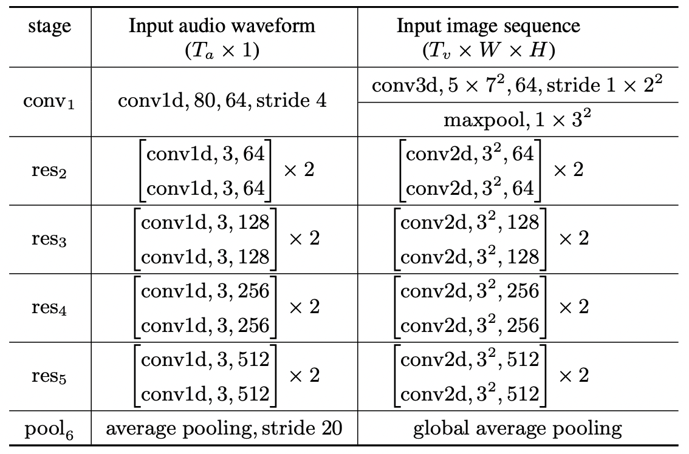
> 

### MLP Fusion

The acoustic and visual features from the back-end modules are then
concatenated and projected to $d_{k}$-dimensional space by an
Multi-Layer Perceptron (MLP). The MLP is composed of a linear layer with
an output size of $4 \times d_{k}$ followed by a batch normalization
layer, $ReLU$, and a final linear layer with an output dimension
$d_{k}$.

    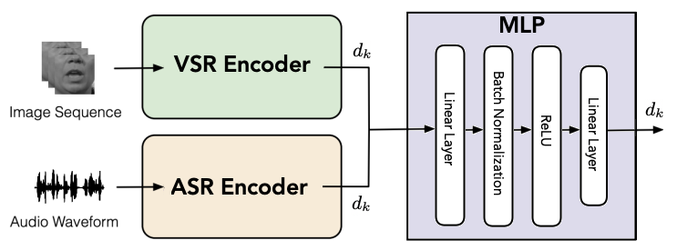

### Transformer Decoder

Finally, to decode the audio-visual features to text, they used a
[Transformer](https://anwarvic.github.io/machine-translation/Transformer)
decoder module, which is composed of an embedding module, followed by a
set of multi-head self-attention blocks. In the embedding module, a
sequence of the prefixes from index $1$ to $L - 1$ is projected to
embedding vectors, where $L$ is the target length index. The absolute
positional encoding is also added to the embedding.

    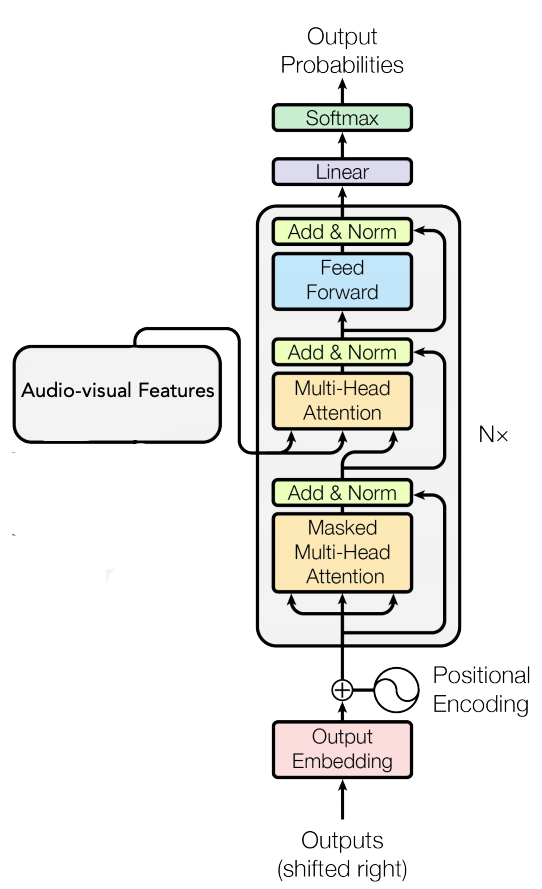

In the paper, they used a $6$-layer decoder with the same dimensions and
number of heads as the conformer of $256$ input dimensions, $2,048$
feed-forward dimensions, and the number of attention heads changed based
on the input modality: $4$ for image-only input, and $8$ for audio-only
and audio-visual modality.

## Loss Function

Let $x = \left\lbrack x_{1},\ ...x_{T} \right\rbrack$ be the input
sequence to the model, and
$y = \left\lbrack y_{1},\ ...y_{L} \right\rbrack$ be the target symbols
where $T$ and $L$ representing the input and target lengths,
respectively. Most of the recent work either use a CTC loss or an
attention-based cross entropy loss. In this paper, researchers used a
hybrid CTC/Attention loss to force monotonic alignments and at the same
time get rid of the conditional independence assumption in the CTC loss.
The objective function is computed as follows where $\alpha$ controls
the relative weight in CTC and attention mechanisms:

$$\mathcal{L} = \alpha log\ p_{CTC}\left( y \middle| x \right) + (1 - \alpha)\log\ p_{CE}\left( y \middle| x \right)$$

> **Note:**\
For some of the experiments, they incorporated a language model to the
model which added another term to the formula weighted by $\beta$. In
the paper, they set $\alpha = 0.1,\ \beta = 0.6$:
>
> $$\mathcal{L} = \alpha log\ p_{CTC}\left( y \middle| x \right) + (1 - \alpha)\log\ p_{CE}\left( y \middle| x \right) + \beta p_{LM}(y)$$
>
> This language model was a transformer-based language model trained for
$10$ epochs by combining the training transcriptions of
[LibriSpeech](https://www.openslr.org/12),
[LRS2](https://www.robots.ox.ac.uk/~vgg/data/lip_reading/lrs2.html) and
[LRS3](https://www.robots.ox.ac.uk/~vgg/data/lip_reading/lrs3.html),
with a total of $16.2$ million words.

## Experiments

In this paper, experiments were conduced on
[LRS2](https://www.robots.ox.ac.uk/~vgg/data/lip_reading/lrs2.html) and
[LRS3](https://www.robots.ox.ac.uk/~vgg/data/lip_reading/lrs3.html),
which are the two largest publicly available datasets for audio-visual
speech recognition in English; where:

-   LRS2, collected from BBC programs, contains $144,482$ video clips
    with a total of $225$ hours. Specifically, the pre-training,
    training, validation and test set contains $96,318$ ($195$ hours),
    $45,839$ ($28$ hours), $1,082$ ($0.6$ hours) and $1,243$ (0.5 hours)
    video clips, respectively.

-   LRS3 consists of $151,819$ video clips from TED & TEDx talks with a
    total of $439$ hours. It contains $118,516$ ($408$ hours), $31,982$
    ($30$ hours) and $1,321$ clips ($0.9$ hours) in the "pretrain",
    "trainval", and "test" set, respectively.

Regarding visual pre-processing, they located the face and track
$68$ facial landmarks for each frame using [dlib
toolkit](https://github.com/davisking/dlib). The size and rotation
differences in each frame are removed via an affine transformation
to the mean face of the training set. Then, they cropped the mouth
region of interests (ROIs) using a bounding box of $96 \times 96$.
Finally, each frame is converted to gray-scale and z-normalized
(subtracting the mean and dividing by the standard deviation of the
training set). Regarding audio pre-processing, they only performed
z-normalization (subtracting the mean and dividing by the standard
deviation of the audio utterance).

Regarding data-augmentation, they performed the following techniques
for the different modalities. For the visual modality, they used
random cropping with a size of $88 \times 88$ and horizontal
flipping with a probability of $0.5$ are performed for each image
sequence. For the acoustic modality, they used additive noise, time
masking, and band reject filtering are performed in the time domain.

They trained the model using Adam optimizer with
$\beta_{1} = 0.9,\ \beta_{2} = 0.98$ and $\epsilon = 10^{- 9}$ is
used for end-to-end training with a mini-batch size of $8$, the
learning rate increases linearly with the first $25k$ steps,
yielding a peak learning rate of $0.0004$ and thereafter decreases
proportionally to the inverse square root of the step number. The
whole network is trained for $50$ epochs. Note that the utterances
with more than $600$ frames in the pre-training set were excluded
during training.

## Results

The following table shows the Word Error Rate (WER) of the audio-only,
visual-only and audio-visual models on
[LRS2](https://www.robots.ox.ac.uk/~vgg/data/lip_reading/lrs2.html)
dataset where models were pre-trained on LRS2 mixed with another
datasets such as:

-   MVLRS denotes the older version LRW which is not available anymore.

-   VC2^clean^ denotes the filtered version of
    [VoxCeleb2](https://www.robots.ox.ac.uk/~vgg/data/voxceleb/vox2.html).

-   [LRW](https://www.robots.ox.ac.uk/~vgg/data/lip_reading/lrw1.html)
    is the Lip-Reading in the Wild dataset

-   LRS2&3 consists of
    [LRS2](https://www.robots.ox.ac.uk/~vgg/data/lip_reading/lrs2.html)
    and
    [LRS3](https://www.robots.ox.ac.uk/~vgg/data/lip_reading/lrs3.html).

-   LRS3^v0.4^ is the updated version of
    [LRS3](https://www.robots.ox.ac.uk/~vgg/data/lip_reading/lrs3.html)
    with speaker-independent settings.

    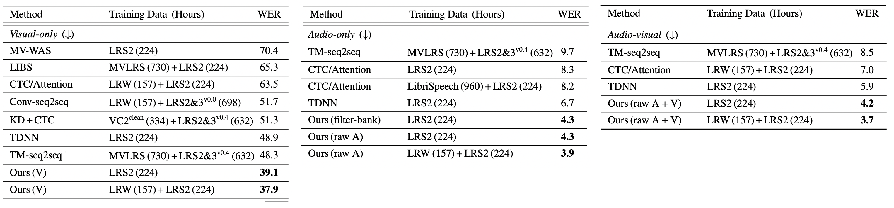

From the results reported in the previous table, we can see the following:

-   The proposed visual-only model reduces the WER from $48.3\%$ to
    $39.1\%$, while using $6 \times$ fewer training data. When using the
    pre-trained LRW model for initialization, the WER drops further to
    $37.9\%$.

-   The proposed audio-only model using audio waveforms for training
    achieves a WER of $4.3\%$, resulting in an absolute improvement of
    $2.4\%$ over the current state-of-the-art.

-   The proposed audio-visual model achieves the best performance among
    all modalities.

Similar experiments were performed on
[LRS3](https://www.robots.ox.ac.uk/~vgg/data/lip_reading/lrs3.html)v0.4
dataset and the WER results are reported in following table where
similar results can be noted as both the audio-only and audio-visual
models pushed the state-of-the-art performance to $2.3\%$ while
using $52 \times$ smaller dataset.

    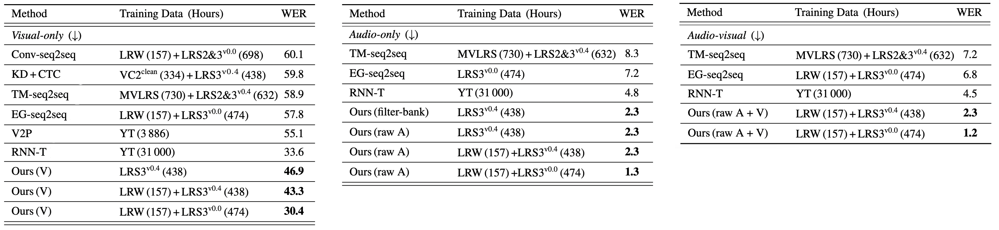

To check the models' performance in noisy environment, they
augmented audio data with babble noise from the
[NOISEX](http://svr-www.eng.cam.ac.uk/comp.speech/Section1/Data/noisex.html)
dataset with an SNR level from
$\lbrack - 5\ dB,\ 0\ dB,\ 5\ dB,\ 10\ dB,\ 15\ dB,\ 20\ dB\rbrack$.
The results are shown in the following figure:

    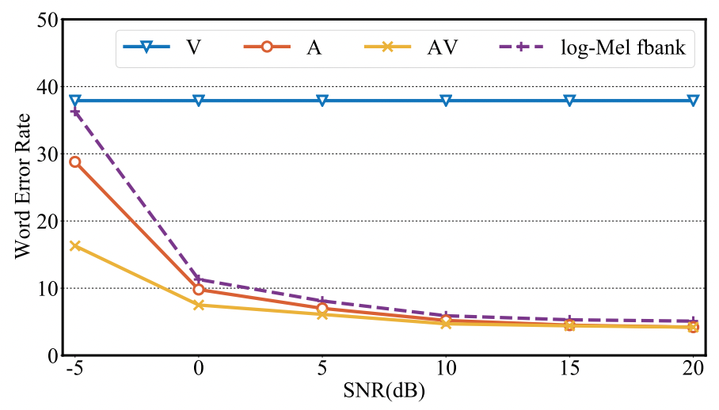

It is clear that the visual-only model (blue) is not affected by the
noise, while the audio-visual model (yellow) achieves better
performance than the audio-only model (red). Also, the gap between
raw audio-only (red) and audio-visual models (yellow) becomes larger
by the presence of high level of noise. This demonstrates that the
audio-visual model is particularly beneficial when the audio
modality is heavily corrupted by background noise.

It is interesting to observe that the performance of the raw audio
model (red) slightly outperforms the log-Mel filter-bank (purple)
based over varying levels of babble noise. This indicates deep
speech representations are more robust to noise than the log-Mel
filter-bank features.

## Leveraging Unlabeled Data

One year later (in 2022), the same researchers tried to leverage
unlabeled Audio-Visual datasets such as
[VoxCeleb2](https://www.robots.ox.ac.uk/~vgg/data/voxceleb/vox2.html)
($4,700$ hours of YouTube video segments in multiple languages) and
[AVSpeech](https://looking-to-listen.github.io/avspeech/) ($2,300$ hours
of video segments from more than $6,000$ people) to investigate the
impact of the size of training data on the performance of audio-only,
visual-only and audio-visual models. They published their experiments in
this paper: [Auto-AVSR: Audio-Visual Speech Recognition with Automatic
Labels](https://) where they made a few modifications to different
aspects of the model which can be summarized to the following:

-   They increased the conformer & transformer-decoder dimensions to the
    following: $768$ input dimensions, $3,072$ feed-forward dimensions,
    and $16$ attention heads.

-   They changed the training details to training the model for $75$
    epochs with the AdamW optimizer, a cosine learning rate scheduler,
    and a warm-up of $5$ epochs. The peak learning rate was set to
    $1e^{- 3}$. The maximal number of frames in each batch is $1,800$
    frames.

-   For data augmentation, they applied horizontal flipping, random
    cropping, and adaptive time masking to the visual inputs, while they
    only used adaptive time masking for the audio stream. For both
    streams, they chose a number of masks that is proportional to the
    utterance length and a maximum masking length of up to $0.4$
    seconds.

-   They only used the transformer-based language model in the
    visual-only experiments.

To generate transcriptions for the audio-visual datasets, they used
the following pipeline shown in the following figure; where audio
waveforms from the unlabelled audio-visual datasets are fed into a
pretrained ASR model to produce automatic transcriptions. Since they
are interested in only English, they used the
[VoxLingua107](http://bark.phon.ioc.ee/voxlingua107/) language
classifier to filter the AVSpeech dataset resulting in a total of
$1,323$ hours. Also, they used a $1,307$-hour subset of VoxCeleb2.

    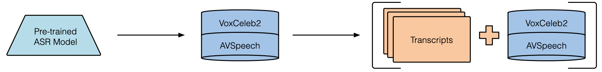

In this experiment, they used four different pre-trained ASR models
whose performance on LibriSpeech "clean-test" set are reported in
the following table. These models are:

-   [HuBERT](https://anwarvic.github.io/speech-recognition/HuBERT): a
    self-supervised model (checkpoint:
    [facebook/hubert-large-ls960-ft](https://huggingface.co/facebook/hubert-large-ls960-ft)).

-   [Wav2vec2.0:](https://anwarvic.github.io/speech-recognition/wav2vec_2)
    a self-supervised model (checkpoint:
    [facebook/wav2vec2-large-960hlv60-self](https://huggingface.co/facebook/wav2vec2-large-960h-lv60-self)).

-   [Conformer](https://anwarvic.github.io/speech-recognition/Conformer):
    a conformer-transducer model (checkpoint:
    [nvidia/stt-en-conformer-transducer-xlarge](https://huggingface.co/nvidia/stt_en_conformer_transducer_xlarge)).

-   [Whisper](https://anwarvic.github.io/speech-recognition/Whisper): a
    transformer-based model trained with a total of $680k$ (checkpoint:
    [openai/whisper-medium.en](https://huggingface.co/openai/whisper-medium.en)).

    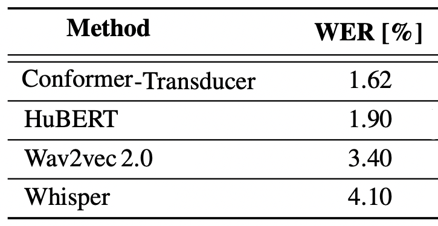

Results of the proposed audio-only and video-only Auto-AVSR model
with the automatically-generated transcriptions on the LRS3 dataset
are shown in the following table; where we can see that overall the
WER on LibriSpeech is not highly correlated with the performance of
the audio-only and video-only models.

    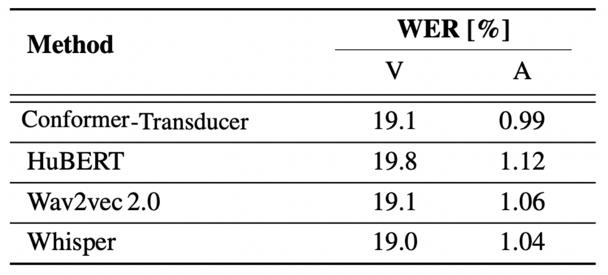

> **Note:**\
Since the best performance were obtain using transcriptions from the
[Conformer-Transducer](https://anwarvic.github.io/speech-recognition/Conformer)
model, these transcriptions are going to be used in all of the
following experiments.

The following table shows the impact of varying the numbers of hours
of unlabeled data on the performance of audio-only and video-only
models on LRS3 dataset where "P" denotes the percentage of unlabeled
data, "U" denotes the amount (in hours) of unlabeled audio data, and
"T" denotes the total duration (in hours):

    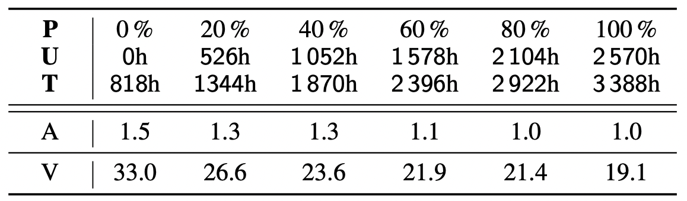

From the previous table, we can observe the following:

-   Increasing the model capacity leads to an absolute improvement of
    $1.7\%$ WER ion the video-only modality.

-   Using larger training sets substantially improves performance.

-   The performance of the audio-only model have saturated when using
    more than $1,578$ hours of unlabeled training data.

The following two tables report the performance on LRS2 dataset
(left table) and LRS3 dataset (right table) where it is clear that
adding unlabeled data improves Auto-AVSR performance in all variants
(audio-only, video-only, audio-video):

    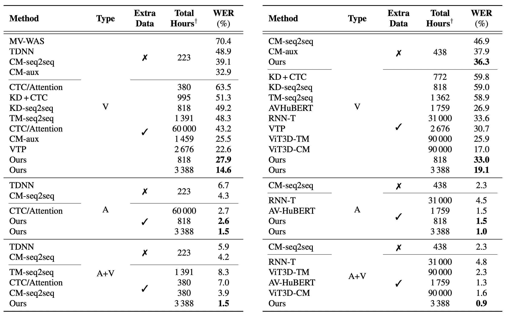

Results of audio-only and audio-visual models when tested on LRS3
"test" set with different acoustic noise levels, are shown in the
following table where three types of noise were used: babble noise
from the
[NOISEX](http://svr-www.eng.cam.ac.uk/comp.speech/Section1/Data/noisex.html)
dataset, and (pink and white) noise from the [Speech Commands
dataset](https://www.tensorflow.org/datasets/catalog/speech_commands).
Note that ‡ denotes the noise type used in both training and test
set:

    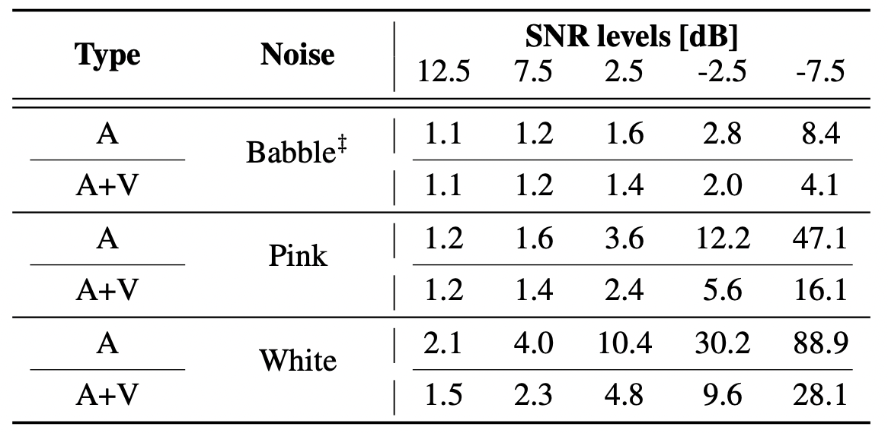

From the table, we can see that the performance of audio-only models
is closer to the audio-visual counterpart in the presence of low
levels of noise, whereas the performance gap becomes larger as the
noise levels increase.
