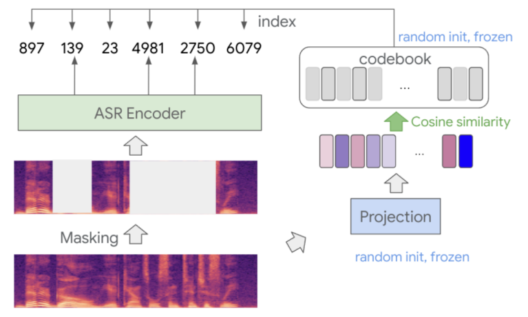
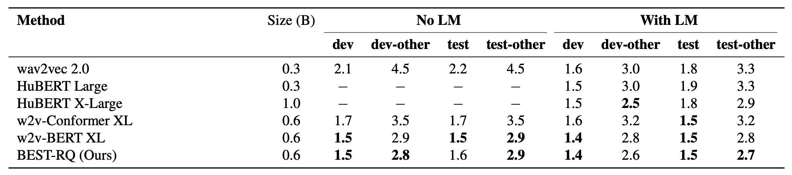
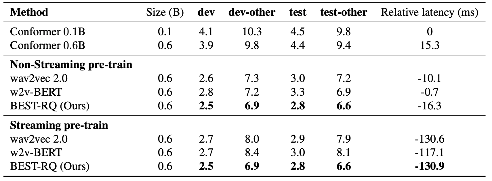
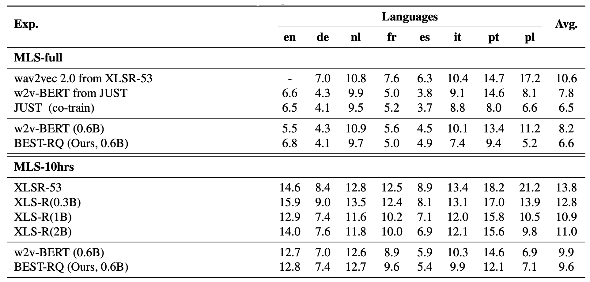
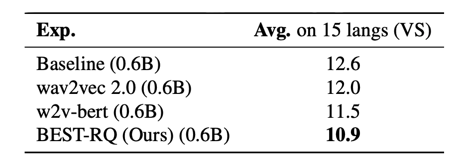
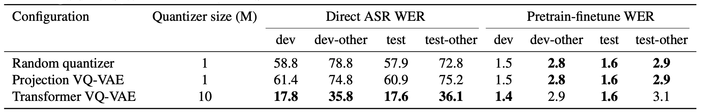
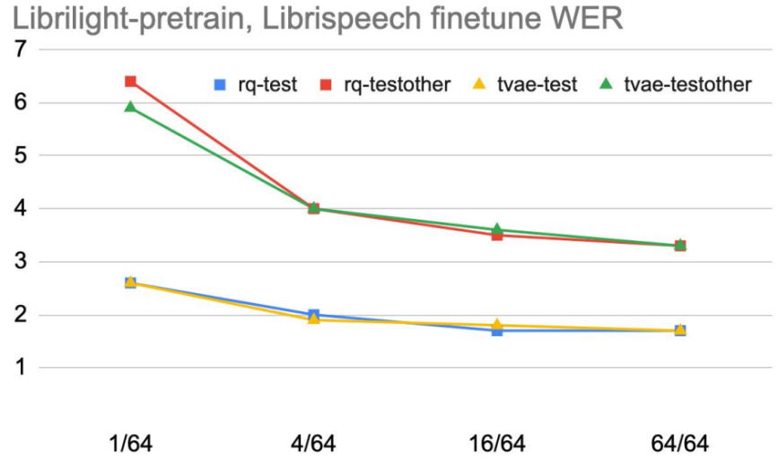

BEST-RQ stands for "**BE**RT-based **S**peech pre-**T**raining with
**R**andom-projection **Q**uantizer" which is a
[BERT](https://anwarvic.github.io/language-modeling/BERT)-like
self-supervised learning technique for speech recognition. BEST-RQ masks
input speech signals and feeds them to an encoder which learns to
predict the masked labels using the unmasked labels. Both masked and
unmaksed labels are provided by a random-projection quantizer as shown
in the following figure. BEST-RQ was proposed by Google Brain in 2022
and published in this paper: [Self-Supervised Learning with
Random-Projection Quantizer for Speech
Recognition](https://arxiv.org/pdf/2202.01855.pdf).

    

As you might have noticed, this work seems very similar to other
[BERT](https://anwarvic.github.io/language-modeling/BERT)-like
self-supervised training approaches such as:

-   [vq-wav2vec](https://anwarvic.github.io/speech-recognition/vq-wav2vec)
    which quantizes the continuous representation of
    [wav2vec](https://anwarvic.github.io/speech-recognition/wav2vec) to
    discrete tokens and performs
    [BERT](https://anwarvic.github.io/language-modeling/BERT)-like
    masking during pre-training.

-   [wav2vec
    2.0](https://anwarvic.github.io/speech-recognition/wav2vec_2) which
    quantizes the input speech using
    [vq-wav2vec](https://anwarvic.github.io/speech-recognition/vq-wav2vec)
    and then combines contrastive learning with
    [BERT](https://anwarvic.github.io/language-modeling/BERT)-like
    masking where the model has to identify the quanitzed representation
    among different distractors.

-   [HuBERT](https://anwarvic.github.io/speech-recognition/HuBERT) which
    quantizes the input speech using k-means and then performs
    [BERT](https://anwarvic.github.io/language-modeling/BERT)-like
    masking to pre-train the initial version. Then, the pre-trained
    HuBERT is used as a quantizer for following epochs.

-   [w2v-BERT](https://anwarvic.github.io/speech-recognition/w2v-BERT)
    uses quantizes the input speech using [wav2vec
    2.0](https://anwarvic.github.io/speech-recognition/wav2vec_2) and
    then use
    [BERT](https://anwarvic.github.io/language-modeling/BERT)-like
    masking during pre-training.

## Pre-training

BEST-RQ pre-training, as shown in the previous figure, can be divided
into the following steps steps:

1.  The input speech is normalized to have mean $\mu = 0$ and standard
    deviation $\sigma = 1$. This normalization step is critical for
    preventing the quantizer to collapse to a small subset of codes.

2.  BEST-RQ masks the input speech signal differently than earlier
    techniques. It applies masking at every frame with a fixed
    probability $p$, and with a fixed span length. The masked parts are
    then replaced with a noise sampled from a normal distribution
    $\mathcal{N}(0,\ 0.1)$.

3.  Then, the masked and unmasked segments are quantized using
    random-projection quantizer. More formally, given an input speech
    vector $x \in \mathbb{R}^{d}$, the random-projection quantizer maps
    $x$ to discrete labels $y$ through the following formula where
    $x \in \mathbb{R}^{h \times d}$ denotes a randomly initialized
    matrix using Xavier initialization, and
    $C = \left\\{ c_{1},\ ...c_{n} \right\\}$ is a set of randomly
    initialized $h$-dimenstional vectors from a normal distribution.
    The quantizer uses the matrix $A$ to project the input speech
    signals and the codebook $C$ and cosine similarity is used to
    find the nearest vector where the index of the vector is the label.

$$y = \underset{i}{\arg\min}\left\| \ \left\| c_{i} \right\|_{2} - \left\| A.x \right\|_{2}\  \right\|$$

4.  Finally, the quantized segments are fed to the ASR encoder. A
    softmax layer is added on top of the encoder and the encoder is
    trained to predict the labels of the masked part. In the paper, they
    used the
    [Conformer](https://anwarvic.github.io/speech-recognition/Conformer)-based
    encoder.

> **Note:**\
Both the randomly initialized matrix $A$ and codebook $C$ are fixed
during the pre-training process.

## Experiments & Results

In this section, we are going to discuss the different experiments they
have performed in the paper and observe the results across different
tasks.

### Speech Recognition

For pre-training, they used
[LibriLight](https://github.com/facebookresearch/libri-light/blob/main/data_preparation/README.md)
dataset, the mask length was $400ms$ with masking probability of
$p = 0.01$. The input speech signals are $80$-dimensional log-mel filter
bank coefficients, and each frame has the stride of $10ms$. The encoder
used consisted of two convolution layers before the 24-layer
[Conformer](https://anwarvic.github.io/speech-recognition/Conformer)
forming $0.6B$ parameters. For pre-training, they used Adam optimizer
with $0.004$ peak learning rate and $25000$ warmup steps and $2048$
batch size. Since the encoder has $4$ times temporal-dimension reduction
due to the two convolution layers, the quantization with random
projections stacks every $4$ frames for projections. The vocab size of
the codebook is $8192$ and the dimension is $h = 16$.

For fine-tuning, they used [LibriSpeech](https://www.openslr.org/12).
Regarding the model, they used
[RNN-Transducer](https://anwarvic.github.io/speech-recognition/RNN-T)
architecture with the pre-trained encoder and the decoder is a
two-layers unidirectional
[LSTM](https://anwarvic.github.io/language-modeling/RNN) network with a
hidden dimention of $1280$ and $1024$-token WordPiece vocabulary. The
fine-tuning process use a lower learning rate for the encoder than the
decoder. The encoder uses $0.0003$ peak learning rate and $5000$ warmup
steps, while the decoder uses $0.001$ peak learning rate and $1500$
warmup steps. The LM is an 8-layers
[Transformer](https://anwarvic.github.io/machine-translation/Transformer)
model with $4096$ feed-forward dimension and $1024$ model dimension,
trained on the LibriSpeech text corpus.

Results, shown in the following table, indicate that BEST-RQ achieves
the best results across different dev and test sets in comparison with
[wav2vec 2.0](https://anwarvic.github.io/speech-recognition/wav2vec_2),
[HuBERT](https://anwarvic.github.io/speech-recognition/HuBERT) and
[w2v-BERT](https://anwarvic.github.io/speech-recognition/w2v-BERT) with
or without the usage of language model.

    

### Streaming Speech Recognition

To adapt BEST-RQ for streaming speech recognition, they changed the
number of layers a little bit while maintaining the same number of
parameters ($0.6B$). They used 3 convolutional layers at the bottom
(instead of two in non-streaming setup), followed by a stack of $20$
[Conformer](https://anwarvic.github.io/speech-recognition/Conformer)
layer with $1024$ hidden dimension for the self-attention layer and
$4096$ for the feed-forward layers. The self-attention layer attends to
the current and the previous $64$ frames, and the convolution has a
kernel that covers the current and the past $3$ frames.

For pre-training, they tried two different setups:

-   **The streaming pre-training:** decreases the mask length to $300ms$
    instead of $500ms$ and increases the masking probability to
    $p = 0.02$ instead of $0.01$. The random-projection quantizer stacks
    every $2$ frames for projections instead of $4$.

-   **The non-streaming pre-training:** extends the convolution kernel
    within the Conformer layer to have access for the future $3$ frames.
    However, the self-attention is still limited to having access only
    for the previous context. The masking length is kept at $400ms$ and
    the masking probability is increased to $p = 0.02$.

For fine-tuning, they used RNN-T architecture and 1-layer decoder of
unidirectional [LSTM](https://anwarvic.github.io/language-modeling/RNN)
with $640$ hidden dimension. The training setup is the same as the
fine-tuning config for the non-streaming experiments. When initializing
from a non-streaming pre-trained model, the convolution only uses the
kernel weight that accesses the previous context to keep the model
streaming.

Results on streaming [LibriSpeech](https://www.openslr.org/12) speech
recognition is shown in the following table. These results show that
BEST-RQ outperforms
[wav2vec2.0](https://anwarvic.github.io/speech-recognition/wav2vec_2)
and [w2v-BERT](https://anwarvic.github.io/speech-recognition/w2v-BERT)
same masking and training setup as BEST-RQ on both WERs and latency.

    

The relative latency, seen in the previous table, is calculated by
averaging the timing difference of all matched words between two
models according to the following formula where $i$ denotes the
index of the matched words, $j$ is the utterance index, $s_{ij}$ and
$e_{ij}$ correspond to the starting and ending time of the word from
the baseline model, ${s'}_{ij}$ and ${e'}_{ij}$ correspond to the
starting and ending time of the word from the compared model, and
$N$ is the total number of matched word among all utterances.

$$\sum_{i,j}^{}\frac{s'_{ij} - s_{ij} + e'_{ij} - e_{ij}}{2N}$$

> **Note:**\
A negative relative latency means the compared model has lower latency
than the baseline model.

### Multilingual Speech Recognition

For pre-training, they couldn't use VoxLingua-107 dataset due to license
constraint. So, they created their own version of approximately $429k$
hours of unlabeled speech data in $51$ languages which is $6.6k$ hours
smaller than the dataset used to train
[XLS-R](https://anwarvic.github.io/speech-recognition/XLS-R) that were
trained on $128$ languages. For multilingual ASR fine-tuning, they used
[MLS](https://www.openslr.org/94/) dataset containing $50k$ hours
spanning 8 languages. For few-shot learning, they used the official $10$
hours split.

As shown in the following table, their
[w2v-BERT](https://anwarvic.github.io/speech-recognition/w2v-BERT)
baseline already outperforms previous strong model
[XLS-R](https://anwarvic.github.io/speech-recognition/XLS-R) ($2B$). The
average WER further bring down by $3\%$ relative by using BEST-RQ. This
demonstrate a simple random-projection quantizer is also effective for
multilingual pre-training. Interestingly, with more fine-tune data,
BEST-RQ perform even better than
[w2v-BERT](https://anwarvic.github.io/speech-recognition/w2v-BERT),
especially for "pt" and "pl" and on-par with
[XLS-R](https://anwarvic.github.io/speech-recognition/XLS-R).

    

### Multilingual Voice Search

For pre-training, they collected a multilingual Youtube dataset spanning
12 languages and fine-tuned it on VS-1000hrs. Results show that BEST-RQ
consistently outperform
[w2v-BERT](https://anwarvic.github.io/speech-recognition/w2v-BERT) and
[wav2vec 2.0](https://anwarvic.github.io/speech-recognition/wav2vec_2)
by $9\%$ and $5\%$ respectively. Compare to w2v-BERT, our proposed
method outperform on all the languages.

    

## Analzing the Quantizer

To analyze the effect of the quantizer, they created a smaller version
of BEST-RQ with only $25M$ total parameters. This version consists of
$16$ Conformer layer with $256$ dimension, $8$ attention heads, $128$
context length and kernel size $5$ for lightweight convolution. Then,
they tried three different quantizers:

-   Random-projection quantizer

-   VQ-VAE with projection quantizer

-   [Transformer](https://anwarvic.github.io/machine-translation/Transformer)
    VQ-VAE quantizer.

Results show that even though the
[Transformer](https://anwarvic.github.io/machine-translation/Transformer)-based
quantizer gets much better performance when used as input directly, the
random-projection quantizer is equally effective for self-supervised learning.

    

One potential explanation for the above observation, that a
sub-optimal quantization can work well for self-supervised learning,
is that the self-supervised learning algorithm can learn to mitigate
the quality gap given sufficient amounts of pre-training data.

They investigated whether a quantizer with a better quantization
quality performs better when the amount of the pre-training data is
limited. They compared un-trained random-projection quantizer (rq)
and a trained transformer-based VQ-VAE quantizer (tvae) with
different pre-training data sizes:
$\left\\{ 1/64,\ 4/64,\ 16/64,\ 64/64 \right\\}$ of LibriLight data
for $100k$ steps and a batch size of $2048$. Then, the pre-trained
models are fine-tune on LibriSpeech $960h$. The results in the
following figure show that a quantizer with better representation
quality (Transformer-based VQ-VAE) performs better when pre-training
data is limited, but the gap disappears as the pre-training data
increase.

    

