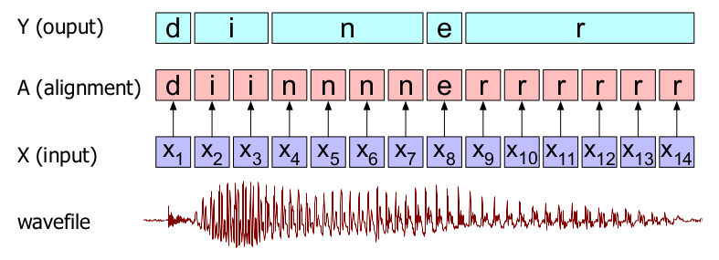
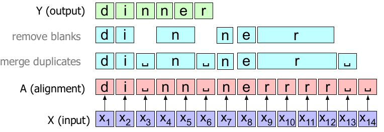
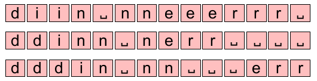
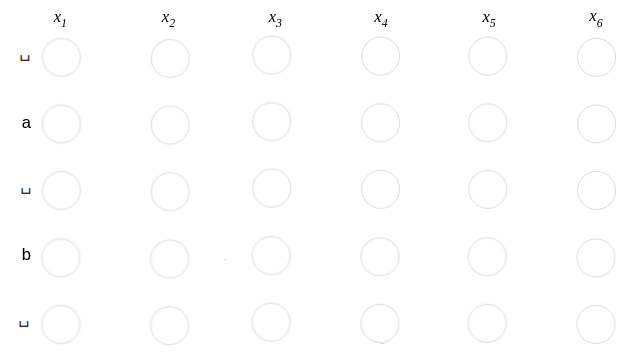
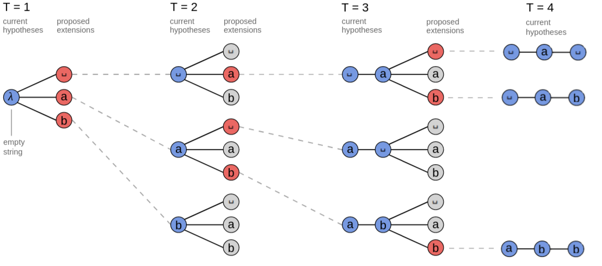
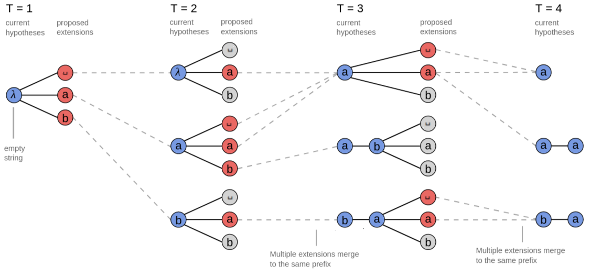

Data sets for speech recognition are usually a dataset of audio clips
and corresponding transcripts. The main issue in these datasets is that
we don't know how the characters in the transcript align to the audio.
Without this alignment, it would be very hard to train a speech
recognition model since people's rates of speech vary. CTC provides a
solution to this problem.

CTC stands for "Connectionist Temporal Classification" which is a way to
get around not knowing the alignment between the input and the output.
CTC was proposed by Alex Graves, Santiago Fernandes, Faustino Gomez, and
Jürgen Schmidhuber in 2006 and published in this paper: [Connectionist
Temporal Classification: Labelling Unsegmented Sequence Data with
Recurrent Neural
Networks](http://www.cs.toronto.edu/~graves/icml_2006.pdf).

The intuition of CTC is to convert the speech recognition problem to a
Temporal Classification problem where each frame of the input audio will
be labeled <u><strong>independently</strong></u> to a single character,
so that the output will be the same length as the input. Then, a
collapsing function that combines sequences of identical letters is
applied, resulting in a shorter sequence as shown in the following figure:

    

Blank Character
---------------
The previous figure represents the temporal classification of the audio
of someone saying the word "dinner". Of course, here we are assuming
there is a classifier that is able to choose the most probable letter
for each input spectral frame representation $x_{i}$ . The sequence of
letters corresponding to each input frame is called an "alignment",
because it tells us where in the acoustic signal each letter aligns to.
Then, a collapsing function that combines similar letters is applied to
result in the word "diner". As we can see from the past example, this
naive algorithm has two problems:

-   It doesn't handle double letters as it transcribed the speech as
    "diner", not "dinner"!

-   It doesn't tell us what symbol to align with silence in the input.
    We don't want to be transcribing silence as random letters!

The CTC algorithm solves both problems by adding to the transcription
alphabet a special symbol for a blank, which we'll represent as ␣. The
blank can be used to separate duplicate characters or to transcribe a
silence. Now, the output becomes:

    

> **Note:**
As you probably guessed, the CTC collapsing function
has a lot of different alignments that could map to the same output
string. The following are just some of the other alignments that would
produce the same output and there are many and many more.

    

Objective Function
------------------

To be a bit more formal, let's consider mapping input
sequences$X = \left\lbrack x_{1},x_{2},...,x_{T} \right\rbrack$, such as
audio, to corresponding output sequences
$Y = \left\lbrack y_{1},y_{2},...,y_{U} \right\rbrack$, such as
transcripts. We want to find an accurate mapping from X's to Y's. There
are challenges which get in the way of us using simpler supervised
learning algorithms. In particular:

-   Both X and Y can vary in length.

-   The ratio of the lengths of X and Y can vary.

-   We don't have an accurate alignment of X and Y.

The CTC algorithm overcomes these challenges. For a given X it gives us
an output distribution over all possible Y's. We can use this
distribution either to infer a likely output or to assess the
probability of a given output. So, the object function for a single (X,
Y) pair is:

$$p\left( Y \middle| X \right) = \sum_{a \in A_{X,Y}}^{}\left( \prod_{t = 1}^{T}{p_{t}\left( a_{t} \middle| X \right)} \right)$$

where:

-   $X$ is a sequence of input data (audio frames for example).

-   $Y$ is a sequence of output data (characters for example).

-   $p\left( Y \middle| X \right)$: is the CTC conditional probability
    of output $Y$ given input $X$.

-   $\sum_{a \in A_{X,Y}}^{}\ $: is to sum all possible alignments for
    the $\left( X,Y \right)$ pair alignments.

-   $p\left( a_{t} \middle| X \right)$: is the conditional probability
    of alignment $a$ at time-step $t$ given input sequence $X$.

-   $\prod_{t = 1}^{T}\ $: is the probability for a single alignment
    $a_{t}$ step-by-step over all $T$ steps.

As we can see, we can summarize the objective function as <u><strong>the sum of
all possible true alignments for the given input</strong></u>. To understand
what that means and how the objective function is calculated, let's take
a simple example where the input
$X = \left\lbrack x_{1},x_{2},x_{4},x_{4},x_{5},x_{6} \right\rbrack$ and
the true transcribed is "ab". We can calculate the objective function
using the following steps:

-   As explained earlier, CTC uses the blank character ␣. So, we need to
    expand the true output to include that character. Now, the true
    output becomes:

$$\text{␣ a ␣ b ␣}$$

-   Then, we are going to form the CTC network where the number of rows
    should be the extended output and the number of columns should be
    the length of the input like so:

    

-   Define all the possible alignments of the previous CTC network:

    

-   Now, the objective function will be the sum of the likelihood of
    each path of these. In other words, $p\left( Y \middle| X \right)$
    will be:

$$p\left( Y \middle| X \right) = p\left( \text{␣␣␣␣ab} \right) + p\left( \text{␣␣␣a␣b} \right) + p\left( \text{␣␣␣ab␣} \right) + ... + p\left( \text{ab␣␣␣␣} \right)$$

where:

$$p\left( \text{␣␣␣␣ab} \right) = p\left( \text{␣} \right) \ast p\left( \text{␣} \right) \ast p\left( \text{␣} \right) \ast p\left( \text{␣} \right) \ast p\left( \text{a} \right) \ast p\left( \text{b} \right)$$

\...

$$p\left( \text{ab␣␣␣␣} \right) = p\left( \text{a} \right) \ast p\left( \text{b} \right) \ast p\left( \text{␣} \right) \ast p\left( \text{␣} \right) \ast p\left( \text{␣} \right) \ast p\left( \text{␣} \right)$$

Then, the loss function will be just the negative log-likelihood
of the objective function. So, for a training $D$, the loss function
will be:

$$\sum_{\left( X,Y \right) \in D}^{}{- \log\left( p\left( Y \middle| X \right) \right)}$$

CTC Inference
-------------

After we've trained the model, we'd like to use it to find a likely
output for a given input. More precisely, we need to solve:

$$\hat{Y} = \text{argmax}\ p\left( Y \middle| X \right)$$

We can obtain that by considering the most likely output at each
time-step greedily. This is called "Greedy Search" and it works well for
many applications. However, this approach can sometimes miss easy to
find outputs with much higher probability.

A better approach is to use "Beam Search". A <u><strong>standard/vanilla
</strong></u> beam search computes a new set of hypotheses at each input
time-step. The new set of hypotheses is generated from the previous set by
extending each hypothesis with all possible output characters and keeping only
the top few candidates which is known as "beam size". The following example
uses a beam size of 3.

    

We can modify the vanilla beam search by the following modifications:

-   Instead of keeping a list of alignments in the beam, we merge any
    alignments that map to the same output.

-   Also, remove the blank characters \"␣\" when encountered.

Now, the paths will be:

    

> **Notes:**
>
> - The blank character "␣" is like a garbage token, it doesn't
    represent anything but noise. So, it's very different than the space
    character " ".
>
> - CTC works <u><strong>only</strong></u> when the output sequence Y is
    shorter than the input sequence X.
>
> - CTC assumes conditional independence which means that the output at
    time $t$ is independent of the output at time $t - 1$, given the
    input.
>
> - CTC does not implicitly learn a language model over the data (except
    for the case of attention-based encoder-decoder architectures). It
    is therefore essential when using CTC to interpolate a language
    model using a hyper-parameter$\lambda$ that is fine-tuned on a dev
    set:
>
> $$p\left( Y \middle| X \right) = \lambda\log\ p_{\text{CTC}}\left( Y \middle| X \right) + \left( 1 - \lambda \right)\log\ p_{\text{LM}}\left( Y \right)$$
>
> - For more details about implementing CTC, you should check this
    [gist](https://gist.github.com/awni/56369a90d03953e370f3964c826ed4b0)
    created by Awni Hannun the one who optimized CTC in this
    [paper](https://arxiv.org/pdf/1408.2873.pdf). And also this
    [one](https://github.com/corticph/prefix-beam-search/) which is talking
    about prefix Beam Search.
