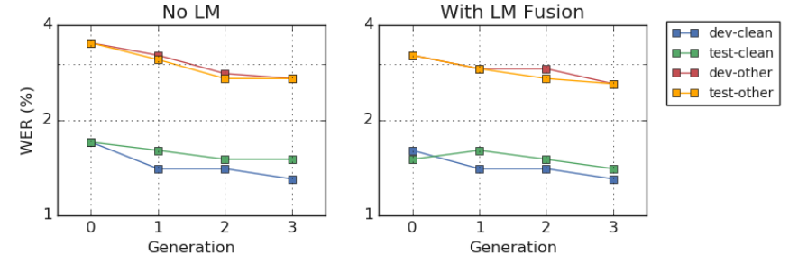

Combined SSL or Combined Semi-supervised Learning is a new approach
combining semi-supervised learning techniques such as "iterative
self-learning" with pre-trained audio encoders to create an ASR system
that achieves state-of-the-art results on LibriSpeech. This appraoch was
developed by Google Research and Google Brain in 2020 and published in
this paper: [Pushing the Limits of Semi-Supervised Learning for
Automatic Speech Recognition](https://arxiv.org/pdf/2010.10504.pdf). The
resutling ASR from this approach follows the
[Transducer](https://anwarvic.github.io/speech-recognition/RNN-T)
architecture where the encoder is a
[Conformer](https://anwarvic.github.io/speech-recognition/Conformer)
model while the deocder is an LSTM model as shown in the following
figure:

    

The [Conformer](https://anwarvic.github.io/speech-recognition/Conformer)
encoders they used were pre-trained on unlabeled data from libri-light
dataset using [wav2vec
2.0](https://anwarvic.github.io/speech-recognition/wav2vec_2)
pre-training method and then been semi-supervised trained using "noisy
student training (NST)" technique for 4 different generations combined
with
[SpecAugment](https://anwarvic.github.io/speech-recognition/SpecAugment).
Look, I know this seems like a lot to grasp, so let's disect the process
in the following steps:

1.  Start with the
    [Transducer](https://anwarvic.github.io/speech-recognition/RNN-T)
    architecture where the
    [Conformer](https://anwarvic.github.io/speech-recognition/Conformer)
    is the encoder.

2.  Pre-train the conformer using [wav2vec
    2.0](https://anwarvic.github.io/speech-recognition/wav2vec_2)
    pre-training method on unlabeled Libri-light.

3.  Further train the pre-trained conformer using "noisy student
    training (NST)" technique for 4 different generations combined with
    [SpecAugment](https://anwarvic.github.io/speech-recognition/SpecAugment).

> **Note:**\
The unlabeled Libri-light dataset serves a dual purpose in this approach.
It was used as a pre-training dataset, and also as the unlabeled dataset for
which pseudo-labels for training student models are generated.

Following these approach, they were able to achieve state-of-the-art results
with $1.4\%$ on the LibriSpeech test and $2.6\%$ on the LibriSpeech test-other
sets against the current state-of-the-art WERs of $1.7\%$ and $3.3\%$
respectively.

    

Next, we are going to summarize the different components of this approach.

Model Architecture
------------------

Recall that the
[Conformer](https://anwarvic.github.io/speech-recognition/Conformer)
major component is a stack of conformer blocks, each of which is a
series of multi-headed self attention, depth-wise convolution and
feed-forward layers as shown in the following figure:

    

In this paper, they used scaled-up versions of the
[Conformer](https://anwarvic.github.io/speech-recognition/Conformer)
denoted **Conformer XL** and **Conformer XXL**, which have 600M and 1B
parameters, respectively. The following table shows a comparison between
**Conformer L** used in the original work.

    

Also, they introduced **Conformer XXL+** which is obtained by adding an
additional conformer block and a stacking layer to the **Conformer
XXL**. The stacking layer reshapes the input to have half the time
length and twice the channel size. **Conformer XXL+** has approximately
50M more parameters compared to **Conformer XXL**.

As shown in the previous table, **Conformer L** had a single-layer LSTM
as its decoder, while **Conformer XL** and **Conformer XXL** have
two-layer LSTM decoders. All decoders have dimension $640$. As for the
decoder projection layer, they used a linear layer with Swish activation
and batch-normalization.

> **Note:**\
To speed-up training those large conformer models without affecting
perofmrance, they got rid of relative positional embedding from the
multi-head self attention layer inside the conformer block.

Pre-training
------------

In the paper, they followed the same pre-training method used with
[wav2vec 2.0](https://anwarvic.github.io/speech-recognition/wav2vec_2)
on the Conformer models using unlab-60k subset of Libri-Light dataset.
Unlike in the original work which takes raw waveforms as input, they
used log-mel spectrograms instead. Also, they replaced the quantization
layer with a linear layer. The procedure is depicted in the following
figure:

    

Noisy Student Training (NST)
----------------------------

Noisy Student Training is a simple technique that falls under
"iterative self-learning" semi-supervised learning technique. Recall
that in iterative self-training, a series of models are trained where a
given model in the series serves as a teacher to the succeeding model by
generating labels on the unlabeled dataset. In this paper, they trained
4 generations of conformer models as shown in the following figure:

    

To summarize, with the labeled LibriSpeech dataset $S$, the unlabeled
Libri-Light dataset $U$ and an $\text{LM}$ trained on the LibriSpeech LM
corpus, the NST procedure is used to train a series of models in
different generations:

-   <u><strong>Generation 0:</strong></u>

    -   Start with pre-trained **Conformer XL** model.

    -   Fine-tune the model on $S$ combined with
        [SpecAugment](https://anwarvic.github.io/speech-recognition/SpecAugment).

    -   Fuse the model with Transformer language model (LM) and generate
        labels for unlabeled data $U$.

    -   Mix the newly generated labels of $U$ and $S$ with 9:1 fixed
        ratio in the batch, to be used in the next generation.

-   <u><strong>Generation 1:</strong></u>

    -   Start with **Conformer XL** model resulted from generation 0.

    -   Fine-tune the model on $S + U$ combined with
        [SpecAugment](https://anwarvic.github.io/speech-recognition/SpecAugment).

    -   Fuse the model with Transformer language model (LM) and generate
        labels for unlabeled data $U$. Theoritically, these labels are
        better than the one we got from generation 0.

    -   Mix the newly generated labels of $U$ and $S$ with 9:1 fixed
        ratio in the batch, to be used in the next generation.

-   <u><strong>Generation 2:</strong></u>

    -   Initialize **Conformer XXL** with the **Conformer XL** model resulted
        from generation 1.

    -   Fine-tune the model on $S + U$ combined with
        [SpecAugment](https://anwarvic.github.io/speech-recognition/SpecAugment).

    -   Fuse the model with Transformer language model (LM) and generate
        labels for unlabeled data $U$. Theoretically, these labels are
        better than the one we got from generation 1.

    -   Mix the newly generated labels of $U$ and $S$ with 9:1 fixed
        ratio in the batch, to be used in the next generation.

-   <u><strong>Generation 3:</strong></u>

    -   In this step, they tried two options. The first option was using
        **Conformer XXL** from generation 2. The second option was to
        initialize **Conformer XXL+** with the Conformer XLL model resulted
        from generation 2.

    -   Fine-tune the model on $S + U$ combined with
        [SpecAugment](https://anwarvic.github.io/speech-recognition/SpecAugment).

    -   Fuse the model with Transformer language model (LM) and generate
        labels for unlabeled data $U$.

The following table summarized the performance of the resulting models from
different generations (x-axis) on dev/test sets of LibriSpeech with and without
LM fusion. The y-axis is log-scaled WER:

    

From these results, we can see that the generation-3 Conformer XXL model shows
a 7-15% relative improvement in WER across the dev and test sets compared to
the pre-trained baseline.

Experiments & Results
---------------------

In all of the experiments, they used LibriSpeech 960 hour audio data as
the supervised data and used the unlab-60k hour subset of Libri-light as
the unsupervised data. For the input features, they used 80-dimensional
log-mel filter bank coefficients of the utterances as single-channel.

For the language model, they used eight-layer 103M-parameter transformer
language model with relative positional embedding that has been trained
on the LibriSpeech language model corpus, along with the transcripts
from the 960h training set of LibriSpeech. They also used subword
tokenization of 1024-token word-piece-model (WPM).

Regarding pre-training; for the **Conformer XL**, they used Adam
optimization with a transformer learning rate schedule with peak
learning rate $2e^{- 3}$ and $25k$ warm-up steps. They also applied
gradient scaling to cap the norm of the gradient to $20$. For the
**Conformer XXL** model, they used Adafactor with parameters
$\beta = \left( 0.9,\ 0.98 \right)$, and used 2nd-moment estimator
factorization to reduce the accelerator memory footprint. The learning
rate schedule stayed the same.

Regarding fine-tuning, they used 400k steps pre-trained checkpoints. For
the **Conformer XL** encoder, they used Adam optimization with a
transformer learning rate schedule with peak learning rate $3e^{- 4}$
with $5k$ warm-up steps, while for the LSTM decoder, a peak learning
rate $1e^{- 3}$ and $1.5k$ warm-up steps. For the **Conformer XXL**
models, they used Adafactor optimizer with the same configuration as
pre-training.

The following table shows the WERs(%) from LibriSpeech experiments where
the (baseline) is **Conformer L** trained without any unlabeled data.
The (NST only) contains models that were trained using only noisy
student training without any pre-training, and the (pre-training only)
contains models there were fine-tuned using supervised data without NST:

    

As the results suggest, the generation-3 Conformer XXL model shows a
$7 - 15\%$ relative improvement in WER across the dev and test sets
compared to the pre-trained baseline.

Ablation Study
--------------

In this section, we are going to discuss a set of experiments where they
trained multiple models under different conditions and observe the
effect of these changes.

-   <u><strong>Model Size & Pre-training:</strong></u>\
    They trained different models of various sizes with and without
    pre-training. To make fair comparisons, they removed the relative
    positional embedding from the mutli-head self-attention layer of the
    **Conformer L** model. The following table shows that scaling up the
    model size from 100M to 1B parameters without pre-training does not
    improve performance. Once pre-training was used, increasing the
    model size transfers to better performance:

    

-   <u><strong>VAD & Convolution Stride:</strong></u>\
    During pre-training, they experimented using voice
    activation detection (VAD) with different convolution strides in the
    convolutional subsampling block. For quick experimentation, they
    used pre-trained **Conformer XL** models on the 100-hour clean
    subset of LibriSpeech. The following table shows that using VAD
    tends to degrade the performance, also using convolutional
    subsampling layer is required to reduce the input length:

    

-   <u><strong>Mixup Ratio during NST:</strong></u>\
    Here, they experimented with three different batch-wise mixing
    settings, where the ratio of the supervised versus teacher-labeled
    utterances were mixed with ratio 2:8, 1:9 or not mixed batch-wise,
    but randomly distributed. The following table shows that the 1:9 mix
    ratio and non-batch-wise mixing to be comparable, while the 2:8 mix
    ratio gives the worst performance.

    

