Conformer stands for "Convolution-augmented Transformer" which is an encoder
architecture that combines convolution neural networks (CNN) and
[Transformers](https://anwarvic.github.io/machine-translation/Transformer)
to perform speech recognition task. Conformer was created by Google in
2020 and published in this paper under the same name "[Conformer:
Convolution-augmented Transformer for Speech
Recognition](https://arxiv.org/pdf/2005.08100.pdf)". The unofficial code
for this paper can be found in the following GitHub repository:
[conformer](https://github.com/sooftware/conformer).

    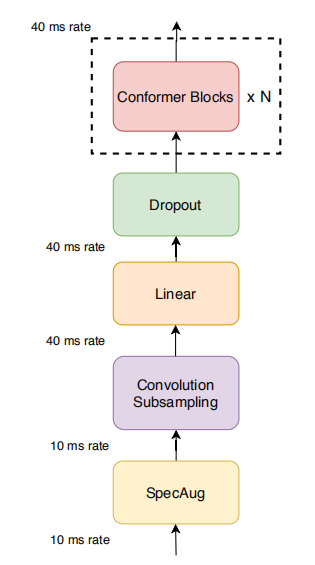

[Transformers](https://anwarvic.github.io/machine-translation/Transformer)
are good at modeling long-range global context, but they are less
capable to extract fine-grained local feature patterns. Convolution
neural networks (CNNs), on the other hand, are good at capturing local
information, but they need many more layers to capture global
information. Conformer, shown in the following figure, tries to combines
the best of both worlds.

As you can see, the Conformer model first processes the augmented
spectrogram
([SpecAugment](https://anwarvic.github.io/speech-recognition/SpecAugment))
input with a convolution sub-sampling layer of 4x sub-sampling ratio,
then with a linear layer combined with droupout. Finally, the input is
processed by $N$ number of conformer blocks.

Conformer Block
---------------

The Conformer block contains two Feed
Forward modules sandwiching the Multi-Headed Self-Attention module and
the Convolution module, as shown in the following figure. This sandwich
structure is inspired by Macaron-Net, which proposes replacing the
original feed-forward layer in the Transformer block into two half-step
feed-forward layers, one before the attention layer and one after.

    

As in Macron-Net, they employed half-step residual weights in the
feed-forward (FFN) modules. The second feed-forward module is followed
by a final layer norm layer. Mathematically, this means that for input
$x_{i}$ to a Conformer block, the output $y_{i}$ of the block is:

$$x_{i} = x_{i} + \frac{1}{2}\text{FFN}\left( x_{i} \right)$$

$$x_{i} = x_{i} + \text{MHSA}\left( x_{i} \right)$$

$$x_{i} = x_{i} + \text{Conv}\left( x_{i} \right)$$

$$y_{i} = \text{LayerNorm}\left( x_{i} + \frac{1}{2}\text{FFN}\left( x_{i} \right) \right)$$

Where $\text{FFN}$ refers to the Feed forward module, $\text{MHSA}$
refers to the Multi-Head Self-Attention module, and $\text{Conv}$ refers
to the Convolution module. All these modules will be described in the
preceding section:

-   <u><strong>Feed-forward Module:</strong></u>\
    As shown in the following figure, the standard
    [Transformer](https://anwarvic.github.io/machine-translation/Transformer)
    FFN is composed of two linear transformations with ReLU nonlinear
    activation in between. In the Conformer, they used a pre-norm on the
    input before the first linear layer and they used Swish activation
    instead of ReLU with dropout which helps regularizing the network.

    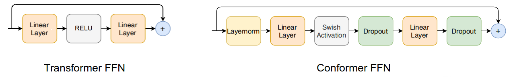

-   <u><strong>Multi-Headed Self-Attention Module:</strong></u>\
    As shown in the following figure, the multi-headed
    self-attention (MHSA) integrates integrating an important technique
    from
    [Transformer-XL](https://anwarvic.github.io/language-modeling/Transformer-XL)
    which is "the relative sinusoidal positional encoding" which allows
    the self-attention module to generalize better on different input
    length resulting in a more robust encoder to the variance of the
    utterance length. To regularize deeper models, pre-norm residual
    units with dropout were used.

    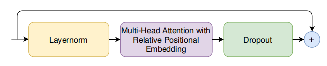

-   <u><strong>Convolution Module:</strong></u>\
    As shown in the following figure, the convolution module
    starts with a pointwise convolution with a gated linear unit (GLU)
    which is followed by a single 1-D depthwise convolution layer. To
    help with regularization, Batchnorm is deployed just after the
    convolution:

    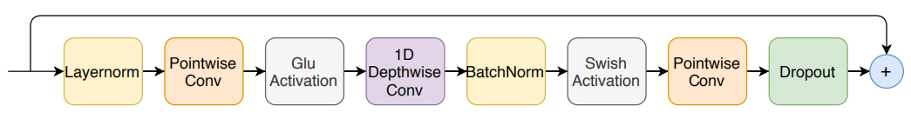

Experiments
-----------

They evaluated the Conformer on the LibriSpeech dataset, which consists
of 970 hours of labeled speech and an additional 800M word token
text-only corpus for building language model. They extracted 80-channel
filterbanks features computed from a $25ms$ window with a stride of
$10ms$. For augmentation, they used
[SpecAugment](https://anwarvic.github.io/speech-recognition/SpecAugment)
with mask parameter ($F = 27$), and ten time masks with maximum
time-mask ratio ($p_{S} = 0.05$), where the maximum-size of the time
mask is set to $p_{S}$ times the length of the utterance.

In the paper, they proposed three different sizes for the Conformer:
small (10M), medium (30M), and large (118M). For the decoder, they used
a single-LSTM-layer decoder in all our models. The following table
describes their hyper-parameters:

    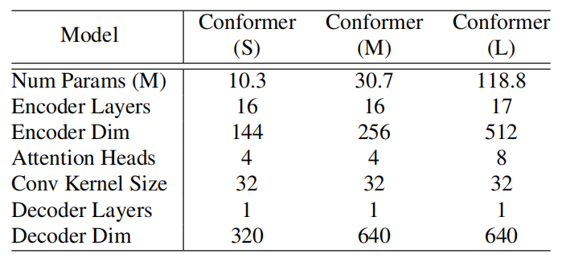

They trained all models with the Adam optimizer with
$\beta = \left( 0.9,\ 0.98 \right)$ and $\epsilon = 10^{- 9}$. They and
a transformer learning rate schedule with $10k$ warm-up steps and peak
learning rate $\frac{0.05}{\sqrt{d}}$ where $d$ is the model dimension
in conformer encoder. For regularization, they used $0.1$ dropout,
variational noise, L2 regularization with $1e^{- 6}$ weight to all the
trainable weights in the network.

For a language model, they used a 3-layer LSTM language model with width
4096 trained on the LibriSpeech text corpus with the audio transcripts
added, tokenized with the 1k WPM. This language model has word-level
perplexity $63.9$ on the dev-set transcripts.

The following table compares the (WER) result of the Conformer on
LibriSpeech test-clean/test-other with a few state-of-the-art models
such as:
[ContextNet](https://anwarvic.github.io/speech-recognition/ContextNet),
[Transformer
Transducer](https://anwarvic.github.io/speech-recognition/Transformer_Transducer),
and
[QuartzNet](https://anwarvic.github.io/speech-recognition/QuartzNet).
Without a language model, the Conformer achieves competitive results
outperforming similar sized convolution models. With the language model
added, the Conformer achieves the lowest WER.

    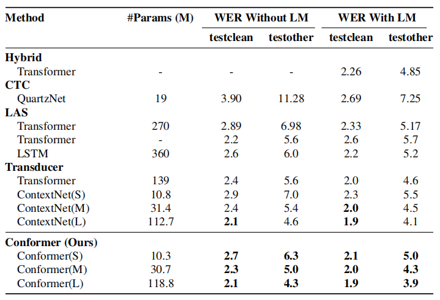

Ablation Study
--------------

To measure the efficiency of the Conformer block over the Transformer
block, they started from a Conformer block and remove its features to
move towards a vanilla Transformer while keeping the total number of
parameters unchanged. The following table shows the impact of each
change to the Conformer block without language model. Among all
differences, convolution sub-block is the most important feature.

    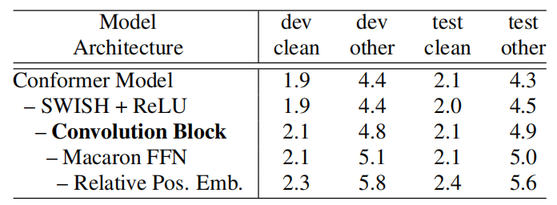

Also, they studied the effects of various different ways of combining
the multi-headed self-attention (MHSA) module with the convolution
module. First, they tried replacing the depthwise convolution in the
convolution module with a lightweight convolution. Second, they tried
placing the convolution module before the MHSA module. Third, they tried
splitting the input into parallel branches of multi-headed self
attention module and a convolution module with their output
concatenated. These results were recorded in the following table which
suggests the advantage of placing the convolution module after the
self-attention module in the Conformer block.

    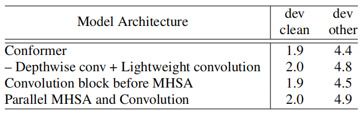

Also, they tried replacing the Feed-forward module with a single
transformer feed-forward module; or a full step residual instead of the
half used in the Conformer. The following table shows the impact:

    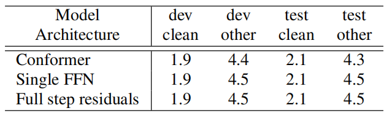

On another note, they tried to change the number of attention heads in
the MHSA module from 4 to 32 in our large model, using the same number
of heads in all layers. they found that increasing attention heads up to
16 improves the accuracy as shown in the following table:

    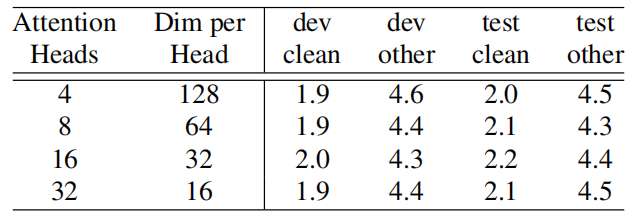

Lastly, they studied the effect of kernel sizes in the
depthwise convolution of the large model, using the same kernel size for
all layers. they found that the performance improves with larger kernel
sizes till kernel sizes 17 and 32 but worsens in the case of kernel size
65, as show in the following table:

    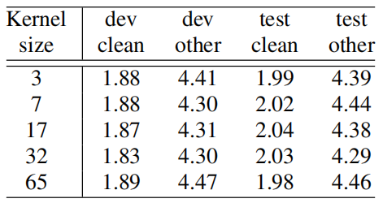

